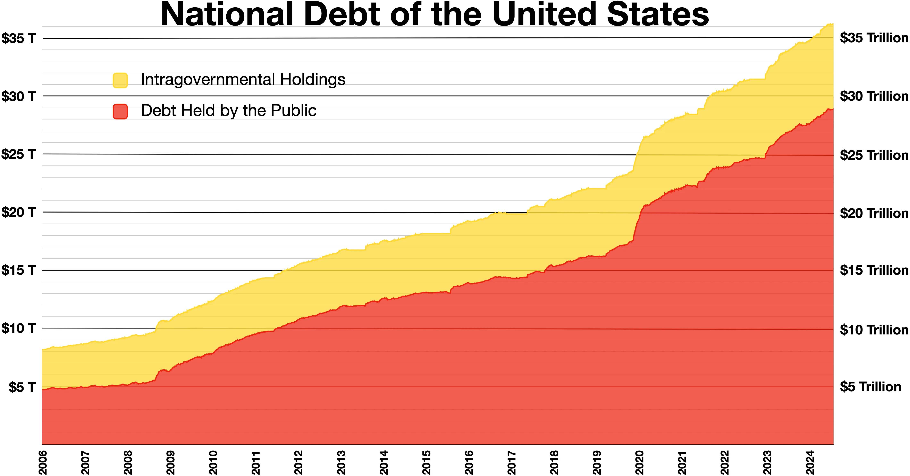

## Table of Contents

## What is the national debt of the United States?

The national debt of the United States is the total amount of money that the federal government owes. This debt comes from borrowing to cover budget deficits, which happen when the government spends more money than it collects in taxes and other revenues. As of early 2023, the national debt was over $31 trillion. This number changes every day because the government keeps borrowing more money to pay for its programs and services.

Having a large national debt can affect the economy in different ways. It might lead to higher interest rates, which makes borrowing money more expensive for everyone. It can also mean that the government has to spend more money on interest payments instead of other important things like education or healthcare. Many people worry about how this debt will be paid back in the future, but others think that as long as the economy grows, the debt can be managed.

## How is the national debt measured?

The national debt is measured by adding up all the money the U.S. government owes. This includes money borrowed from people who buy government bonds, as well as money owed to other countries and organizations. Every day, the U.S. Department of the Treasury keeps track of this total and updates it on their website. The number they report is called the "debt to the penny," which means it's very exact.

The national debt is split into two main parts: the debt held by the public and the debt held by government accounts. Debt held by the public includes money the government borrowed from individuals, businesses, and foreign governments. Debt held by government accounts is money that one part of the government owes to another part, like money in the Social Security Trust Fund. Both parts are important, but the debt held by the public is often watched more closely because it shows how much the government relies on outside borrowing.

## What are the main causes of the U.S. national debt?

The main cause of the U.S. national debt is when the government spends more money than it collects in taxes. This difference is called a budget deficit. Every year, the government needs to pay for things like the military, healthcare, and social programs. If the money coming in from taxes isn't enough, the government borrows money to cover the difference. Over many years, these deficits add up and become the national debt.

Another cause of the national debt is tax cuts. When the government lowers taxes, it collects less money. If spending stays the same or goes up, this leads to bigger deficits. For example, big tax cuts in the past, like those in the 1980s and 2000s, have added a lot to the national debt. Also, economic downturns can make the debt grow faster because the government might spend more on programs to help people while tax revenues go down.

Interest on the debt is another [factor](/wiki/factor-investing). The government has to pay interest on the money it borrows. As the debt grows, so do the interest payments. This means the government has to borrow even more money just to pay the interest, which makes the debt grow even bigger. It's like a cycle that keeps the national debt increasing over time.

## How has the U.S. national debt changed over time?

The U.S. national debt has grown a lot over time. In the early 1980s, the national debt was around $1 trillion. By the year 2000, it had grown to about $5.6 trillion. After the financial crisis in 2008, the debt jumped to over $10 trillion because the government spent a lot of money to help the economy. By 2012, the debt was over $16 trillion, and it kept going up. As of early 2023, the national debt was over $31 trillion. This shows that the debt has grown very quickly in the last few decades.

There are a few main reasons why the national debt has grown so much. One big reason is that the government often spends more money than it collects in taxes. This happens every year and adds to the debt. Another reason is tax cuts, which happened in the 1980s, 2000s, and other times. When taxes go down, the government gets less money but still needs to pay for things, so it borrows more. Also, the government has to pay interest on the debt, and as the debt gets bigger, so do the interest payments. This makes the debt grow even more over time.

## What are the significant events that have impacted the U.S. national debt?

The U.S. national debt has been affected by many big events over the years. One important event was World War II. During the war, the government spent a lot of money on the military, which made the debt grow a lot. After the war, the debt stayed high for a while, but it slowly went down as a part of the economy until the 1980s. In the 1980s, President Reagan cut taxes and increased military spending, which caused the debt to start growing again. By the end of the 1980s, the debt was much bigger than before.

Another big event was the financial crisis in 2008. The government spent a lot of money to help the economy during this time, which made the debt go up a lot. By 2012, the debt was over $16 trillion. More recently, the COVID-19 pandemic in 2020 also had a big impact. The government spent a lot of money on programs to help people and businesses, which made the debt grow even more. By early 2023, the debt was over $31 trillion. These events show how big spending during emergencies can make the national debt grow quickly.

Tax cuts have also played a big role in the growth of the national debt. For example, tax cuts in the 2000s under President George W. Bush and in 2017 under President Donald Trump led to less money coming into the government. When the government collects less in taxes but keeps spending the same or more, it has to borrow more money, which adds to the debt. These tax cuts, along with big spending during emergencies, have been some of the main reasons why the national debt has grown so much over time.

## How does the U.S. national debt compare to other countries?

The U.S. national debt is very big, but it's not the biggest when you look at other countries. In early 2023, the U.S. debt was over $31 trillion. But if you compare it to the size of the economy, the U.S. debt is about 120% of its GDP. This means the debt is bigger than the total value of everything the country makes in a year. Some countries, like Japan, have a much higher debt compared to their GDP. Japan's debt is over 250% of its GDP, which is a lot more than the U.S.

Other countries have smaller debts compared to their GDP. For example, Germany's debt is about 65% of its GDP, and Canada's is around 100%. But the U.S. has a very big economy, so even though its debt-to-GDP ratio isn't the highest, the actual amount of money it owes is still the biggest in the world. This makes the U.S. debt a big deal, even if it's not the highest when you look at it as a percentage of the economy.

## What are the economic implications of a high national debt?

A high national debt can affect the economy in different ways. One big problem is that it can lead to higher interest rates. When the government borrows a lot of money, it can make it more expensive for everyone to borrow money too. This means that people might have to pay more to get a loan for a house or a car. It can also make it harder for businesses to grow because they have to pay more to borrow money for new projects.

Another issue is that the government has to spend more money just to pay the interest on the debt. This means there's less money left for important things like schools, hospitals, and roads. If the government keeps borrowing more and more, it might make people worried about whether the country can pay back all that money. This can make the economy less stable and might even slow down growth. But some people think that as long as the economy is growing, the debt can be managed without causing big problems.

## What measures have been taken historically to manage or reduce the national debt?

Over the years, different ways have been tried to manage or reduce the U.S. national debt. One way is by cutting spending. For example, in the 1990s, the government made deals to lower spending on things like defense and other programs. This helped to reduce the budget deficit and slow down the growth of the debt. Another way is by raising taxes. In the early 1990s, President George H.W. Bush and Congress agreed to raise taxes to help bring down the deficit. This, along with spending cuts, helped to manage the debt for a while.

Another approach is using economic growth to help manage the debt. When the economy grows, the government collects more money from taxes without raising rates. In the late 1990s, the economy was doing really well, and this helped to create budget surpluses. For a few years, the government was actually paying down the debt instead of adding to it. But these surpluses didn't last long, and the debt started to grow again. Sometimes, the government also tries to manage the debt by changing how it borrows money, like by selling different kinds of bonds or by changing interest rates. These methods can help to manage the debt, but they don't always solve the problem completely.

## How does the national debt affect U.S. fiscal policy?

The national debt affects U.S. fiscal policy a lot because it limits what the government can do with taxes and spending. When the debt is high, the government has to spend more money just to pay the interest on it. This means there's less money left for other things like schools, roads, and healthcare. If the government wants to spend more on these things, it might have to borrow even more money, which makes the debt grow even bigger. To avoid this, the government might have to cut spending on programs people care about or raise taxes, which can be unpopular.

Sometimes, the government tries to manage the debt by changing fiscal policy. This can mean cutting spending or raising taxes to bring down the budget deficit. For example, in the 1990s, the government made deals to lower spending and raise taxes, which helped to reduce the deficit and slow down the growth of the debt. But these changes can be hard to make because people don't always agree on what should be cut or how taxes should be raised. So, the national debt keeps affecting what the government can do with its fiscal policy, making it a big challenge to manage.

## What role do interest rates play in the management of the national debt?

Interest rates are really important when it comes to managing the national debt. When the government borrows money, it has to pay interest on that money. If interest rates go up, it costs the government more to borrow money. This means that a bigger part of the government's money has to go towards paying interest instead of other important things like schools or roads. So, if interest rates are high, it can make the national debt grow faster because the government has to borrow more just to pay the interest.

On the other hand, if interest rates are low, it's cheaper for the government to borrow money. This can help to slow down the growth of the debt because the government doesn't have to spend as much on interest. But even with low interest rates, the debt can still grow if the government keeps borrowing more money. So, while interest rates are a big part of managing the national debt, they're just one piece of the puzzle. The government also has to think about how much it spends and how much it collects in taxes to keep the debt under control.

## What are the projections for the future of the U.S. national debt?

The future of the U.S. national debt is expected to keep growing. Experts who study the economy think that by the year 2033, the national debt could be around $50 trillion. This is because the government keeps spending more money than it gets from taxes. Big programs like Social Security and Medicare cost a lot of money, and as more people retire, these costs will go up even more. Also, if the government keeps borrowing money to pay for things, the debt will just keep getting bigger.

There are different ideas about what this means for the future. Some people worry that a big debt could cause problems for the economy. They think it might make it harder for the government to spend money on important things like schools and roads because so much money will be needed just to pay the interest on the debt. But other people think that as long as the economy keeps growing, the debt can be managed. They say that if the government can find ways to collect more money or spend less, it might be able to keep the debt from growing too fast. It's hard to know for sure what will happen, but the national debt is something that people will keep watching closely.

## How do different political ideologies approach the issue of national debt?

Different political ideologies have different ideas about how to handle the national debt. People who lean more to the left, like liberals or progressives, often think that the government should spend money on things like healthcare, education, and helping people who need it. They might be okay with a bigger national debt if it means the government can do more to help people. They might want to raise taxes on rich people or big companies to get more money to pay for these things, instead of cutting spending.

On the other hand, people who lean more to the right, like conservatives, usually want to keep the national debt from growing too much. They think the government should spend less money and not borrow so much. They might want to cut spending on programs they think are too expensive or not needed. They might also want to keep taxes low, so they focus more on cutting spending to manage the debt. Both sides have different ideas about what's best for the country, and this makes it hard to agree on how to handle the national debt.

## What is the importance of understanding the Debt-to-GDP Ratio?

The debt-to-GDP ratio serves as a pivotal indicator for evaluating a country's financial stability and economic health. This metric is calculated by dividing a nation's total debt by its gross domestic product (GDP), thus providing a comprehensive picture of the country's capacity to manage and repay its national obligations. In mathematical terms, it is expressed as:

$$
\text{Debt-to-GDP Ratio} = \left( \frac{\text{Total National Debt}}{\text{GDP}} \right) \times 100
$$

A high debt-to-GDP ratio suggests that a country may face difficulties in meeting its debt obligations, potentially leading to a higher risk of default. This scenario can erode investor confidence, resulting in increased borrowing costs and adversely affecting international credit ratings. For instance, during economic downturns or financial crises, nations often experience elevated debt-to-GDP ratios, which reflect strained fiscal conditions and limited borrowing capacity.

Moreover, analyzing the time trends of the debt-to-GDP ratio offers valuable insights into the sustainability of national debt. A rising trend could indicate fiscal challenges and necessitate policy adjustments to foster economic stability. Conversely, a declining trend may signal improved economic health, enhancing a country's ability to invest in growth-promoting initiatives without exacerbating fiscal deficits.

By examining the debt-to-GDP ratio over time, policymakers, investors, and economists alike can better understand how external factors such as international trade dynamics, domestic policy decisions, and global economic events impact a nation's fiscal landscape. This analysis provides critical input for decisions on fiscal policy, monetary policy, and investment strategies, ultimately influencing a country's long-term economic trajectory.

## References & Further Reading

[1]: Blinder, A. S. (2013). ["After the Music Stopped: The Financial Crisis, the Response, and the Work Ahead."](https://www.tandfonline.com/doi/full/10.1080/14697688.2014.949836) Penguin Books.

[2]: Reinhart, C. M., & Rogoff, K. S. (2009). ["This Time is Different: Eight Centuries of Financial Folly."](https://www.nber.org/system/files/working_papers/w13882/w13882.pdf) Princeton University Press.

[3]: Matthews, D. (2017). ["The Debt Ceiling Crisis of 2011 Explained"](https://www.vox.com/policy-and-politics/2023/2/1/23581229/debt-ceiling-crisis-2011) Vox.

[4]: Goolsbee, A. (2013). ["Fiscal Therapy: The Debt-Indicator and How We Can Fix Our Fiscal Problems"](https://onlinelibrary.wiley.com/doi/full/10.1111/ecoj.12010) Foreign Affairs.

[5]: Irwin, N. (2013). ["The Alchemists: Three Central Bankers and a World on Fire."](https://archive.org/details/alchemiststhreec0000irwi) Penguin Books.