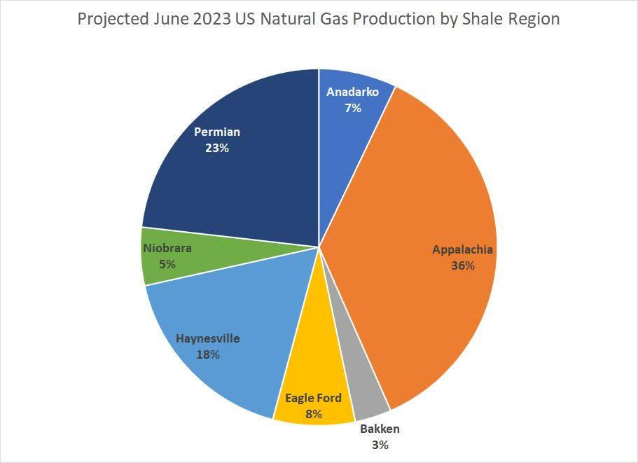

Natural gas plays a crucial role in the global energy sector as a cleaner-burning alternative to coal and oil. Its importance has increased with the growing focus on reducing greenhouse gas emissions and transitioning to more sustainable energy sources. Natural gas is used extensively for electricity generation, industrial processes, residential heating, and as a feedstock in chemical production. As countries strive to meet climate goals, the demand for natural gas, particularly liquefied natural gas (LNG), is expected to rise due to its lower carbon dioxide emissions per unit of energy produced.

Investing in natural gas can be achieved through various instruments, offering opportunities for both individuals and institutional investors to participate in this vital sector. Direct investments can be made in natural gas companies, pipelines, and other infrastructure-related businesses. Additionally, futures contracts and exchange-traded funds (ETFs) provide alternative avenues for exposure to natural gas prices without the need for physical commodity handling.



The United States Natural Gas Fund (UNG) stands out as a prominent investment vehicle designed to offer exposure to natural gas prices. Launched in 2007, UNG is an ETF that tracks natural gas futures contracts, specifically the price movements of natural gas on the New York Mercantile Exchange (NYMEX). By investing in UNG, investors can gain access to natural gas price fluctuations without engaging in the complexities of futures trading directly. This makes UNG an attractive option for those looking to diversify their portfolios or hedge against energy price volatility while benefiting from the liquidity and accessibility offered by exchange-traded funds.

## Table of Contents

## Understanding the United States Natural Gas Fund (UNG)

The United States Natural Gas Fund (UNG) serves as a pivotal financial instrument for investors aiming to gain exposure to the natural gas market. Established to offer a convenient method for investing in natural gas, UNG was launched on April 18, 2007, and is listed on the NYSE Arca. It operates as an exchange-traded fund (ETF), which primarily focuses on tracking the changes in the price of natural gas delivered at the Henry Hub, Louisiana, as measured by the daily changes in the price of the corresponding natural gas futures contracts traded on the New York Mercantile Exchange (NYMEX).

UNG facilitates investment in natural gas by providing a straightforward route that bypasses the complexities typically involved in futures trading. For many investors, directly handling futures contracts entails significant understanding and risk, including issues related to contract expiration and the need for margin accounts. UNG simplifies this process, making it accessible by pooling money from multiple investors to buy natural gas futures contracts and related financial instruments such as swaps and forwards.

The fund's design aims to offer investors the opportunity to profit from movements in natural gas prices without them having to actively participate in the futures market. By purchasing shares of UNG, investors effectively gain indirect ownership of the underlying natural gas futures, thus enabling participation in the natural gas sector with less risk and complexity compared to direct futures trading.

As part of its operational model, UNG invests in near-month futures contracts, a strategy that necessitates the periodic rolling over of contracts to maintain its holdings. This rollover process allows UNG to continuously reflect the spot price of natural gas, but it also subjects it to potential contango or backwardation, scenarios where the futures prices are either higher or lower than the spot prices. These conditions can introduce additional risk and affect the fund’s performance compared to the actual physical commodity.

Overall, UNG represents an accessible entry point for investors interested in the natural gas market while sparing them from the intricacies and risks associated with direct commodity futures trading.

## Mechanics of UNG: How it Works

The United States Natural Gas Fund (UNG) offers a platform for investors to gain exposure to natural gas prices by tracking the movements of natural gas futures contracts primarily listed on the New York Mercantile Exchange (NYMEX). The primary mechanism by which UNG achieves this is through the investment in near-month futures contracts, which are the contracts closest to expiration. As these contracts approach their expiration dates, UNG rolls them over into subsequent-month contracts to maintain its strategy of tracking natural gas prices without taking physical delivery of the gas.

### Net Asset Value (NAV) and Its Impact on the Investor

The Net Asset Value (NAV) of UNG is a critical measure that reflects the per-share value of the fund based on the current market value of its holdings. The formula to calculate NAV is as follows:

$$
\text{NAV} = \frac{\text{Total Assets} - \text{Total Liabilities}}{\text{Number of Outstanding Shares}}
$$

These holdings primarily comprise futures contracts, which means the NAV can significantly fluctuate based on futures price [volatility](/wiki/volatility-trading-strategies). Since UNG aims to mirror natural gas price movements, its NAV serves as an indicator for investors looking to assess its performance relative to the underlying commodity. NAV changes influence investment returns and can be used by investors to evaluate the potential profitability of holding shares in the fund.

### Futures, Swaps, and Forwards in UNG

While UNG predominantly invests in futures contracts, it also utilizes swaps and forward contracts to meet its investment objectives. Futures contracts provide a standardized agreement to buy or sell natural gas at a predetermined price on a specific future date. This helps manage price exposure and [liquidity](/wiki/liquidity-risk-premium) in accordance with daily price changes on NYMEX.

Swaps, particularly commodity swaps, are employed to manage the risk associated with price fluctuations and to achieve the desired return profile when futures market liquidity is insufficient or conditions are unfavorable. A commodity swap involves an agreement to exchange cash flows based on the price of natural gas, allowing UNG to hedge against unfavorable price movements more efficiently. For instance, if the natural gas price increases, UNG may receive a payoff from the swap that compensates for the increased cost in the futures positions.

Forward contracts, though less commonly used in UNG's strategy, could be another tool for further customizing exposure. Unlike futures, forwards are over-the-counter (OTC) instruments and possess more flexibility regarding terms and settlement, albeit with increased counterparty risk.

Together, these financial instruments allow UNG to operate efficiently and mirror the price changes in the natural gas market accurately. Investors in UNG benefit from a structure that simplifies participation in the natural gas market while mitigating the complexities and risks associated with direct futures trading.

## The Pros and Cons of Investing in UNG

The United States Natural Gas Fund (UNG) offers a unique opportunity for investors seeking exposure to the natural gas commodity market. Its primary advantage lies in providing an accessible investment vehicle that tracks natural gas prices without requiring direct engagement in futures trading. Investors who aim to capitalize on the fluctuations in natural gas prices can find UNG a convenient alternative to physically holding and managing futures contracts.

### Benefits of Investing in UNG

One of the prominent benefits of investing in UNG is diversification. By including UNG in a broader investment portfolio, investors can gain exposure to a distinct asset class that possesses different market drivers compared to traditional equities or bonds. This diversification can potentially enhance portfolio stability and offer a hedge against inflation, given natural gas’s role as a critical energy resource. Moreover, UNG's structure enables investors to benefit from price movements in the natural gas market via a publicly traded fund, thereby easing the complexities traditionally associated with futures trading.

### Potential Risks Associated with UNG

Despite its benefits, investing in UNG is not devoid of risks. One potential risk is the volatility of natural gas prices, which can lead to substantial fluctuations in the value of UNG shares. Historical performance data indicates that natural gas markets are subject to rapid changes due to various factors, including weather conditions, geopolitical events, and shifts in supply and demand dynamics. For instance, cold winters or political tensions affecting gas supplies can lead to sudden price spikes or drops, impacting UNG’s market value.

Further, UNG involves the inherent risk of contango, a situation where the future price of natural gas is higher than the spot price. This leads to a negative roll yield as contracts are frequently rolled over, potentially eroding UNG's value over time. This [factor](/wiki/factor-investing) can detrimentally affect investment returns, especially in prolonged contango markets.

### Management Fees and Costs

Investment in UNG is subject to management fees and costs, which can affect the net returns realized by investors. UNG incurs an expense ratio, which includes management fees and other operational costs. These fees are necessary for managing the fund and ensuring its operations align with the objective of closely tracking natural gas futures. While the specific fee structure provides necessary financial services, it simultaneously reduces the net asset value and can potentially offset some of the gains realized from favorable market movements.

Investors must consider these management costs alongside the fund’s historical performance and market volatility when evaluating UNG as an investment option. Understanding both the advantages and constraints can aid in making informed decisions aligned with individual risk tolerance and investment goals.

## Algorithmic Trading and UNG

Algorithmic trading has become an increasingly important tool for optimizing trades in financial markets, including investments in the United States Natural Gas Fund (UNG). This trading method uses pre-programmed instructions and quantitative models to execute orders at speeds and frequencies that are impossible for human traders. By employing complex algorithms, investors and traders can exploit short-term market inefficiencies, execute trades based on a range of variables, and reduce the impact of human emotions and biases.

For short-term trading efficiencies, algorithmic strategies provide significant advantages. These strategies can execute trades in milliseconds, allowing traders to capitalize on small price movements that are often missed during manual trading. Additionally, algorithms can process vast amounts of market data to identify patterns and trends that would be unfeasible for a human to analyze quickly enough to act upon. High-frequency trading strategies, for instance, execute thousands of trades per second and are particularly effective in volatile markets such as natural gas.

Algorithmic strategies can be employed to optimize UNG trades in several ways. For example, mean reversion algorithms might be used, where the idea is that the price will revert to its average over time. Here is a simple conceptual Python script that might illustrate such a strategy:

```python
import numpy as np
import yfinance as yf
from scipy.stats import linregress

# Download UNG historical data
data = yf.download('UNG', start='YYYY-MM-DD', end='YYYY-MM-DD')
prices = data['Close']

# Calculate moving averages
short_window = 20
long_window = 50

short_mavg = prices.rolling(window=short_window, min_periods=1).mean()
long_mavg = prices.rolling(window=long_window, min_periods=1).mean()

# Generate trading signals
signals = np.where(short_mavg > long_mavg, 1.0, 0.0)

# Calculate daily returns
daily_returns = prices.pct_change()

# Apply trading signals to calculate strategy returns
strategy_returns = signals[:-1] * daily_returns[1:]

# Simple linear regression to determine strategy performance
slope, intercept, r_value, p_value, std_err = linregress(range(len(strategy_returns)), strategy_returns)

print(f"Strategy CAGR: {slope * 252 * 100:.2f}%")
```

Ethical considerations and risk management are essential when employing [algorithmic trading](/wiki/algorithmic-trading), especially with commodity-based instruments like UNG. The complexity of these algorithms means there is a potential for systemic errors or unintended market impacts, as demonstrated by historical "flash crashes." Traders must implement robust risk management practices, such as setting predefined loss limits and using multiple independent systems to verify trading signals.

Algorithmic trading also poses ethical concerns regarding market fairness and transparency. Rapid execution speeds give firms using these technologies a distinct advantage over traditional traders, raising questions about market fairness. Regulators are increasingly scrutinizing these practices to ensure they do not jeopardize market integrity, leading to some exchanges imposing constraints on high-frequency trading.

In conclusion, while algorithmic trading offers enhanced capabilities for optimizing UNG trades through improved efficiencies and execution speed, careful consideration of ethical implications and risk management practices is vital. Traders must ensure that their strategies are not only profitable but also compliant with market regulations and ethical norms.

## Future Outlook for Natural Gas Investments

Natural gas remains a critical component of the global energy landscape, and its future outlook is shaped by a combination of market, geopolitical, and environmental dynamics. 

**Predicted Trends in Natural Gas Demand and Pricing**

The demand for natural gas is anticipated to grow driven by its role as a transitional fuel toward a lower carbon economy. The expansion of liquefied natural gas (LNG) infrastructure globally facilitates increased usage across countries lacking indigenous natural gas resources. According to the International Energy Agency (IEA), global natural gas demand might increase by 1.5% annually over the next decade, propelled mainly by Asian economies, particularly China and India. Pricing fluctuations of natural gas are influenced by supply chain developments, technological advancements, and regulatory policies emphasizing sustainable energy sources.

**Geopolitical and Environmental Factors**

Geopolitical factors heavily influence the natural gas market, including political stability in gas-producing countries, international trade agreements, and strategic shifts in major economies' energy policies. For instance, the United States has seen significant growth in natural gas production due to technological advancements such as hydraulic fracturing, enabling it to become a major global exporter. This change shifts the dynamics in regions like Europe, which previously relied heavily on Russian natural gas. Environmental factors such as climate change policies and carbon pricing mechanisms also play pivotal roles. Efforts to reduce greenhouse gas emissions under international accords like the Paris Agreement may curb demand growth, as countries seek to transition towards renewable energy sources. 

**Growth Opportunities and Strategies for Leveraging UNG**

Investors looking to capitalize on the potential of the natural gas sector can consider the United States Natural Gas Fund (UNG) as a strategic vehicle. UNG provides a straightforward pathway to gain exposure to natural gas markets through its investments in natural gas futures. With the rising importance of algorithmic trading, investors can optimize their trading strategies by leveraging algorithms to improve timing and efficiency, thus maximizing returns. The use of hedging strategies to manage the volatility associated with natural gas pricing is another crucial pathway. The implementation of advanced predictive analytics, driven by [machine learning](/wiki/machine-learning) models, could help in anticipating price movements based on historical data, geopolitical developments, and environmental policies.

The future outlook for natural gas investments suggests continued relevance amid the transition to cleaner energy forms, yet this will be interwoven with complexities dictated by technological, geopolitical, and environmental factors. Investors must remain informed and adaptable to navigate this evolving landscape.

## Conclusion

The United States Natural Gas Fund (UNG) emerges as a pivotal instrument in the natural gas investment landscape, providing an accessible avenue for investors seeking exposure to this significant energy commodity. Throughout the article, we examined how UNG simplifies the complexities of direct futures trading by allowing participants to engage through a liquid, exchange-traded product. This mechanism not only broadens access but also aligns with shifts towards more streamlined investment approaches.

Understanding the mechanics of UNG is crucial, as it employs futures contracts traded on the New York Mercantile Exchange (NYMEX) to provide market exposure. This involves navigating through the nuances of net asset value (NAV) and the intricacies of futures, swaps, and forwards. Investors can leverage UNG to capitalize on natural gas price movements while mitigating some of the direct risks associated with physical commodities trading.

Moreover, UNG offers distinct benefits, such as diversification, ease of trading, and the potential for strategic positions in volatile markets. However, the risks cannot be overlooked. Historical performance underscores the commodity's inherent volatility, and the costs associated with management fees must be factored into any investment decision.

The introduction of algorithmic trading has further evolved UNG trading strategies, offering enhanced efficiency for short-term investors. Yet, this approach necessitates meticulous risk management and an understanding of ethical considerations in automated trading systems.

Looking ahead, the future of natural gas investments, underscored by changing geopolitical and environmental factors, presents both opportunities and challenges. With predicted shifts in global demand and pricing structures, UNG remains a viable tool for investors ready to navigate these dynamics.

Investors are encouraged to conduct thorough research and assess their risk tolerance. While UNG presents promising opportunities, it remains essential to consider personal investment goals and the broader market context actively. This strategy will ensure informed decision-making as the energy landscape continues to evolve.

## References & Further Reading

[1]: ["Natural Gas Market Review 2018"](https://www.iea.org/reports/gas-2018) by the International Energy Agency.

[2]: ["Advances in Financial Machine Learning"](https://www.amazon.com/Advances-Financial-Machine-Learning-Marcos/dp/1119482089) by Marcos Lopez de Prado.

[3]: Mork, K. A., Olsen, O., & Mysen, H. T. (1994). ["Macroeconomic responses to oil price increases and decreases in seven OECD countries."](https://www.researchgate.net/profile/Knut-Mork/publication/255797555_Macroeconomic_Responses_to_Oil_Price_Increases_and_Decreases_in_Seven_OECD_Countries/links/5eb5877e92851cd50da3771d/Macroeconomic-Responses-to-Oil-Price-Increases-and-Decreases-in-Seven-OECD-Countries.pdf) The Energy Journal, 15(4), 19-35.

[4]: ["Machine Learning for Algorithmic Trading"](https://github.com/stefan-jansen/machine-learning-for-trading) by Stefan Jansen.

[5]: ["Commodity Swaps: An Introduction"](https://www.investopedia.com/terms/c/commodityswap.asp) by CME Group.

[6]: Peruzzi, V. (2022). ["ETF Trading and Market Efficiency"](https://westernfinance-portal.org/viewpaper?n=882952) Review of Financial Studies.

[7]: ["Quantitative Trading: How to Build Your Own Algorithmic Trading Business"](https://github.com/LucindaYa/quant-resources/blob/master/Quantitative%20Trading%20How%20to%20Build%20Your%20Own%20Algorithmic%20Trading%20Business.pdf) by Ernest P. Chan.

[8]: ["Evidence-Based Technical Analysis: Applying the Scientific Method and Statistical Inference to Trading Signals"](https://www.amazon.com/Evidence-Based-Technical-Analysis-Scientific-Statistical/dp/0470008741) by David Aronson.