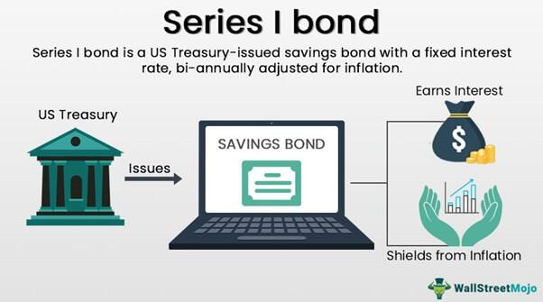

U.S. savings bonds are a secure investment option prominently backed by the full faith and credit of the federal government. These financial instruments provide a reliable means for individuals to invest while contributing to the overarching financial health of the United States. When an individual purchases a U.S. savings bond, they are effectively lending money to the government to finance various public expenditures, such as infrastructure development, education, and public welfare programs. This dual function as both a personal investment vehicle and a public financing tool underscores their unique role in the nation's economic ecosystem.

One of the key benefits of investing in U.S. savings bonds is the guarantee of returns. Unlike other investment options that are subject to market volatility and risks, U.S. savings bonds promise safety from principal loss and assured interest earnings. The guaranteed nature of these bonds ensures that investors will at least double their initial investment if held to maturity, particularly in the case of Series EE bonds, which are designed to double in value over a 20-year term. Additionally, Series I bonds offer an inflation-protected interest rate, making them appealing in fluctuating economic conditions.



The article will cover extensive aspects of U.S. savings bonds to provide a comprehensive understanding for potential investors. It will explore the various types of savings bonds available, such as Series EE and Series I bonds, and delve into the nuances of bond taxation, including federal and local tax implications. Furthermore, it will present a brief discussion on the application of algorithmic trading within bond markets, showcasing how technology can be leveraged to optimize investment strategies, even for traditionally stable instruments like bonds.

Overall, U.S. savings bonds represent a cornerstone of conservative financial planning, offering stability and assured returns, thereby making them an attractive choice for risk-averse investors seeking both security and a steady income stream.

## Table of Contents

## Types of U.S. Savings Bonds

U.S. savings bonds are a popular investment option for individuals seeking a secure and low-risk means of saving money, backed by the full faith and credit of the U.S. government. Currently, the primary types of savings bonds available for purchase are Series EE and Series I bonds. Each type offers distinct features tailored to meet different financial needs.

**Series EE Bonds**

Series EE bonds, formerly known as "patriot bonds," are designed to provide a fixed [interest rate](/wiki/interest-rate-trading-strategies) for the life of the bond. One of the key features of Series EE bonds is their guarantee to double in value over a period of 20 years, regardless of the prevailing interest rates. For instance, if you purchase a $1,000 Series EE bond, it is guaranteed to be worth at least $2,000 at the end of 20 years. The fixed interest rate is determined at the time of purchase and remains constant throughout the bond's term.

The interest for Series EE bonds accrues monthly and is compounded semiannually, which increases the effective yield over time. This feature makes them a stable and predictable investment vehicle, suitable for conservative investors.

**Series I Bonds**

Series I bonds offer a unique feature: an inflation-protected interest rate. These bonds are designed to protect investors from inflation by adjusting the interest rate twice a year based on changes in the Consumer Price Index for All Urban Consumers (CPI-U). The total interest rate for a Series I bond is composed of a fixed rate, determined at the time of purchase, and a variable inflation rate that is recalculated every six months.

This dual rate structure ensures that Series I bonds maintain their purchasing power over time, making them a valuable tool for saving in times of inflation. If you are looking for an investment that keeps pace with inflation and offers flexibility, Series I bonds can be an attractive choice.

**Older and Historical Bonds**

In addition to Series EE and Series I bonds, older types of U.S. savings bonds included Series HH bonds. These were issued at face value and paid interest semiannually, but they have not been available for purchase since August 2004. Owners of Series HH bonds continue to receive interest payments until maturity. Historically, the U.S. government has also issued various other bond series, such as Series E and Series H bonds, which were precursors to the currently available bond types.

Overall, the variety of savings bonds issued by the U.S. Treasury provides investors with a diverse set of options to meet specific financial goals, whether protection against inflation or guaranteed growth over time.

## How U.S. Savings Bonds Work

U.S. savings bonds are government-backed securities that offer a secure investment option for individuals. Purchasing these bonds is a straightforward process primarily conducted through TreasuryDirect, a platform managed by the U.S. Department of the Treasury. TreasuryDirect provides a comprehensive, secure, and convenient medium for investors to manage savings bonds electronically.

To purchase U.S. savings bonds through TreasuryDirect, individuals need to establish an online account by providing personal and financial information. Once the account is set up, users can buy savings bonds in electronic form by selecting the desired type and denomination of bonds, and then authorizing payment directly from a linked bank account. TreasuryDirect offers flexibility in purchasing as bonds can be bought at any time in multiples of $25 for Series EE and I bonds, enhancing accessibility for various budget levels.

Interest on U.S. savings bonds accrues differently depending on the bond type. For Series EE bonds issued after May 2005, interest is added monthly and compounded semiannually at a fixed rate determined at purchase. These bonds promise to at least double in value if held for 20 years. Series I bonds feature a variable inflation rate that adjusts every six months, based on changes in the Consumer Price Index for All Urban Consumers (CPI-U). The accrual of interest continues over the life of the bond, up to 30 years, or until the bond is redeemed.

Savings bonds are redeemable after a minimum holding period of one year. However, redeeming them before five years results in the forfeiture of the last three months' interest. Post the five-year mark, bonds can be cashed without any penalty, allowing investors flexibility to access funds when needed.

Both electronic and paper bonds have been available in the past, but as of 2012, paper bonds can only be purchased using tax refunds via IRS Form 8888. Electronic savings bonds offer several advantages over their paper counterparts. They are easier to buy, as they can be purchased online, and also simpler to manage and redeem. Electronic record-keeping eliminates the risk of physical loss or damage. Additionally, managing bonds electronically allows for more efficient handling of bond-related activities such as tracking interest accrual and setting up redemption transactions directly through TreasuryDirect.

Overall, the process of managing U.S. savings bonds through TreasuryDirect highlights the convenience and flexibility of electronic bonds while ensuring investors' funds are secure and accrue interest over time, backed by the reliability of the federal government.

## Taxation of U.S. Savings Bonds

U.S. savings bonds offer notable tax advantages, making them an attractive option for investors seeking tax-efficient instruments. One of the primary benefits is their exemption from state and local taxes. This exemption can lead to significant tax savings, particularly for investors residing in regions with high state income tax rates. The financial gains from these bonds are only subjected to federal taxes, which simplifies tax reporting and planning. 

When it comes to federal taxation, interest on U.S. savings bonds is deferred until the bond is redeemed or matures, whichever comes first. This means that investors do not have to include the interest income in their federal tax returns annually unless they choose to report it each year, offering flexibility in managing their taxable income. The option to defer taxation can be advantageous for investors who expect to be in a lower tax bracket in future years, allowing them to realize interest income under more favorable tax conditions.

A significant benefit of U.S. savings bonds is the potential for federal tax exclusion when bond proceeds are used for qualifying educational expenses. This advantage is part of the Education Savings Bond Program, which allows taxpayers to exclude all or part of the interest earned if the redemption proceeds are used to pay for tuition and fees at eligible educational institutions. It's noteworthy that certain conditions must be met for this exclusion. For instance, there are income limits to qualify, and the bond must be registered in the owner's name or jointly with their spouse. Additionally, the educational expenses have to be incurred in the same year the bond is redeemed.

Overall, the tax treatment of U.S. savings bonds can provide meaningful benefits, especially to individuals mindful of tax efficiency and those planning for education-related payments. These tax features not only enhance the appeal of savings bonds but also highlight their role as a strategic component in comprehensive financial planning.

## U.S. Savings Bonds vs. Corporate Bonds

When evaluating investment options such as U.S. savings bonds and corporate bonds, several factors come into play, including risk, return, and tax implications. These elements are crucial for investors to consider, given the distinct differences between these two types of bonds.

Corporate bonds typically present a higher level of risk compared to U.S. savings bonds. This is mainly because corporate bonds are issued by companies, whose financial health can vary significantly over time. Companies can face economic downturns, experience fluctuations in profitability, or even go bankrupt, which can adversely affect their bonds. Consequently, investors demand higher yields from corporate bonds to compensate for this increased risk. The potential for higher returns makes corporate bonds attractive to those willing to accept more risk in pursuit of greater gains.

In contrast, U.S. savings bonds are considered one of the most secure investment options available. These bonds are backed by the full faith and credit of the U.S. government, significantly reducing the risk of default. U.S. savings bonds offer a more stable investment with predictable, albeit lower, returns. The conservative nature of these bonds makes them suitable for risk-averse investors who prioritize preserving capital over seeking high returns.

Tax implications also differ between U.S. savings bonds and corporate bonds. U.S. savings bonds are exempt from state and local taxes, offering a tax advantage for investors seeking to minimize their tax liabilities. Additionally, the interest earned on these bonds can potentially be tax-free if used for qualified education expenses. On the other hand, corporate bond interest is generally subject to federal, state, and local taxes, which may reduce the effective yield for the investor.

In summary, the choice between U.S. savings bonds and corporate bonds hinges on an investor's risk tolerance, return expectations, and tax situation. While corporate bonds may offer higher returns, they come with increased risk, whereas U.S. savings bonds provide security and tax advantages, albeit with lower returns. These differences underscore the importance of tailoring investment strategies to align with individual financial goals and risk profiles.

## Algorithmic Trading and Bonds

Algorithmic trading refers to the use of computer algorithms to automate and optimize trading decisions in financial markets. Within bond markets, including U.S. savings bonds, [algorithmic trading](/wiki/algorithmic-trading) plays a vital role in enhancing trading efficiency and execution. The fundamental idea is to leverage computational algorithms to analyze massive datasets, identify trading opportunities, and execute orders with minimal human intervention, thereby maximizing profits and reducing trading costs.

The use of algorithms in bond trading enables the management of large volumes of trade data, facilitating the rapid decision-making process required to capitalize on market movements. Typically, these algorithms are designed to evaluate historical data, track market indicators, and apply predictive models to forecast future trends. A basic example involves using a moving average crossover strategy, depicted as:

```python
def moving_average(prices, window_size):
    return [sum(prices[i:i+window_size]) / window_size for i in range(len(prices) - window_size + 1)]

def moving_average_crossover(prices, short_window, long_window):
    short_ma = moving_average(prices, short_window)
    long_ma = moving_average(prices, long_window)
    signals = []
    for i in range(1, len(short_ma)):
        if short_ma[i] > long_ma[i]:
            signals.append("Buy")
        elif short_ma[i] < long_ma[i]:
            signals.append("Sell")
        else:
            signals.append("Hold")
    return signals
```

This type of algorithm can be adapted to track price trends of bonds and generate trading signals based on the crossover points of different moving averages.

For U.S. savings bonds, while they are mostly held until maturity and thus less liquid compared to other bonds, algorithmic trading can be employed in a broader context of government securities trading. These algorithms can optimize trading strategies by carefully timing market entry and [exit](/wiki/exit-strategy) points, considering factors such as interest rate shifts and economic indicators. However, the direct impact of algorithmic trading on U.S. savings bonds is limited due to their fixed and secure nature.

The integration of algorithmic technologies with government bonds could lead to enhanced trading strategies, offering more efficient pricing mechanisms and [liquidity](/wiki/liquidity-risk-premium) improvements. Such integration can benefit investors by providing more transparent and accurate yields and encourage the adoption of algorithmic solutions in the management of public debt and savings instruments.

In summary, while the direct application of algorithmic trading to U.S. savings bonds is constrained, the broader use of algorithms in bond markets can offer strategic advantages by improving trade execution and optimizing investment strategies across various asset classes.

## Conclusion

U.S. savings bonds stand out as a reliable investment option for those seeking security and guaranteed returns. Backed by the full faith and credit of the federal government, these bonds present a low-risk opportunity for conservative investors. Among the options, Series EE bonds offer fixed interest rates and guarantee that their value will double in 20 years, while Series I bonds feature inflation-protected interest rates, providing a hedge against inflation.

One of the attractive features of U.S. savings bonds is their tax advantages. They are exempt from state and local taxes, which can be beneficial for investors in states with high tax rates. Additionally, federal taxes can be deferred until the bonds are redeemed or reach maturity, allowing investors to manage their taxable income strategically. Furthermore, if the proceeds are used for qualified education expenses, they may be entirely exempt from federal taxation, enhancing their appeal for those planning for future educational needs.

In contrast to corporate bonds, which might offer higher returns due to their increased risk, U.S. savings bonds emphasize security and stability, making them an ideal choice for risk-averse investors seeking to preserve capital while achieving modest growth.

As the investment landscape evolves, technology plays an increasingly significant role in bond trading and investments. Algorithmic trading offers the potential to optimize bond trading strategies, enhancing efficiency and accuracy. The integration of such technologies with government bonds, including savings bonds, may open new avenues for investors, accommodating both traditional and modern approaches to bond investments.

In summary, U.S. savings bonds offer a steadfast and tax-efficient investment option, balancing security with assured returns. As technology continues to advance, these bonds remain a stable choice amidst a dynamically changing financial environment.

## References & Further Reading

[1]: U.S. Department of the Treasury. ["TreasuryDirect: Explore and Buy Savings Bonds."](https://www.treasurydirect.gov/savings-bonds/treasury-hunt/)  

[2]: U.S. Department of the Treasury. ["EE/E Bonds."](https://www.treasurydirect.gov/indiv/research/indepth/ebonds/res_e_bonds.htm)  

[3]: U.S. Department of the Treasury. ["I Bonds."](https://www.treasurydirect.gov/savings-bonds/i-bonds/i-bonds-interest-rates/?os=a&ref=app)  

[4]: Bodie, Zvi. (1995). ["On the Risk of Stocks in the Long Run."](https://www.jstor.org/stable/pdf/4479842.pdf) Journal of Financial Economics.

[5]: Lopez de Prado, Marcos. ["Advances in Financial Machine Learning."](https://www.amazon.com/Advances-Financial-Machine-Learning-Marcos/dp/1119482089) Wiley.

[6]: Fabozzi, Frank J. (2012). ["Bond Markets, Analysis, and Strategies."](https://books.google.com/books/about/Bond_Markets_Analysis_and_Strategies_ten.html?id=bQpNEAAAQBAJ) Pearson Education.

[7]: Michael Sincere. (2011). ["Understanding Options."](https://www.mheducation.com/highered/product/understanding-options-2e-sincere/9780071817844.html) McGraw-Hill Education.

[8]: Aronson, David R. ["Evidence-Based Technical Analysis: Applying the Scientific Method and Statistical Inference to Trading Signals."](https://www.amazon.com/Evidence-Based-Technical-Analysis-Scientific-Statistical/dp/0470008741) Wiley.

