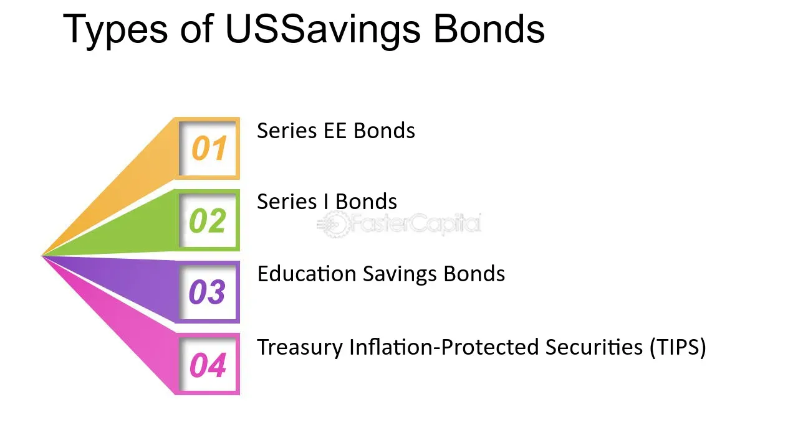

## Table of Contents

## What are United States Savings Bonds?

United States Savings Bonds are a type of investment issued by the U.S. government. They are considered very safe because they are backed by the full faith and credit of the U.S. government. People buy them to save money over time. There are different types of savings bonds, like Series EE and Series I bonds. You can buy them online through the TreasuryDirect website or sometimes get them as gifts.

When you buy a savings bond, you pay a certain amount of money, and over time, the bond earns interest. The interest rate can be fixed or change with inflation. You can't cash in the bond right away; you have to wait a certain period, usually at least one year. After that, you can redeem it, but if you cash it in before five years, you lose the last three months of interest. Savings bonds are a good way to save for the future, like for college or retirement, because they grow slowly and steadily.

## How do United States Savings Bonds function as an investment?

United States Savings Bonds work as an investment by letting you buy them for a certain amount of money, and then they earn interest over time. When you buy a bond, you're lending money to the U.S. government, and in return, they promise to pay you back with interest. The interest can be a fixed rate, like with Series EE bonds, or it can change with inflation, like with Series I bonds. You have to keep the bond for at least one year before you can cash it in. If you cash it in before five years, you'll lose the last three months of interest.

Savings bonds are a safe way to invest because the U.S. government backs them. This means there's very little chance you'll lose your money. They're good for saving for things like college or retirement because they grow slowly and steadily. You can buy them online through the TreasuryDirect website, and they're easy to manage. Over time, as the bond earns interest, it increases in value, so when you cash it in, you get back more money than you originally paid.

## What are the different types of U.S. Savings Bonds available?

There are two main types of U.S. Savings Bonds: Series EE and Series I. Series EE bonds are the most common type. When you buy a Series EE bond, it earns a fixed [interest rate](/wiki/interest-rate-trading-strategies). This means the rate stays the same for the whole time you own the bond. You can buy Series EE bonds at half their face value, so a $100 bond costs you $50. They are guaranteed to double in value if you hold them for 20 years.

Series I bonds are different because they earn interest based on a combination of a fixed rate and an inflation rate. This means the interest rate can change over time to keep up with inflation. Series I bonds are good if you want your savings to keep up with the cost of living. You buy them at face value, so a $100 bond costs you $100. Both types of bonds are safe investments because they are backed by the U.S. government.

## How can someone purchase U.S. Savings Bonds?

You can buy U.S. Savings Bonds online through the TreasuryDirect website. First, you need to set up an account on the website. It's easy to do, and you just need to give some basic information about yourself. Once your account is set up, you can buy Series EE or Series I bonds. You can use a bank account to pay for them. You can buy bonds for yourself or as gifts for others.

You can also sometimes buy Series I bonds with your tax refund. When you file your taxes, you can choose to get part or all of your refund in the form of Series I bonds. This is a good way to save money without having to spend it right away. Just make sure to follow the instructions on your tax form to do this.

## What are the interest rates and terms for U.S. Savings Bonds?

The interest rates for U.S. Savings Bonds depend on the type of bond you buy. Series EE bonds have a fixed interest rate. When you buy them, the rate stays the same until they mature. For example, if you buy a Series EE bond with a 0.10% annual interest rate, it will earn that rate every year until you cash it in or it reaches its final maturity, which is 30 years. Series EE bonds are guaranteed to double in value if you hold them for 20 years.

Series I bonds have a different kind of interest rate. They have a fixed rate part and an inflation rate part that changes every six months. The fixed rate stays the same for the life of the bond, but the inflation rate can go up or down. For example, if the fixed rate is 0.50% and the inflation rate is 1.50%, your total interest rate for that period would be 2.00%. Series I bonds earn interest for up to 30 years.

Both types of bonds have rules about when you can cash them in. You have to keep them for at least one year before you can redeem them. If you cash them in before five years, you lose the last three months of interest. After five years, you can cash them in without any penalty.

## How is the interest on U.S. Savings Bonds calculated and paid?

Interest on U.S. Savings Bonds is calculated and added to the bond every month. For Series EE bonds, the interest rate is fixed, so it stays the same every month. For example, if you have a Series EE bond with a 0.10% annual interest rate, the bond earns a little bit of interest each month based on that rate. The interest is added to the bond's value, so the bond grows over time. You don't get the interest as cash until you cash in the bond.

Series I bonds work a bit differently. They have a fixed rate and an inflation rate that changes every six months. The total interest rate is the sum of these two rates. The interest is calculated and added to the bond every month, just like with Series EE bonds. The bond's value grows as the interest is added, and you get all the interest when you cash in the bond. If you hold onto the bond, the interest keeps adding up, making the bond worth more and more over time.

## What are the tax implications of earning interest from U.S. Savings Bonds?

The interest you earn from U.S. Savings Bonds is not taxed by the state or local governments. This means you don't have to pay state or local taxes on the interest you get from your bonds. However, the interest is subject to federal income tax. You can choose to report the interest on your federal taxes every year as it's earned, or you can wait until you cash in the bond or it reaches final maturity. If you wait, you'll report all the interest you've earned at once.

There's also a special rule for using the interest from Series EE and Series I bonds to pay for education. If you use the interest to pay for qualified higher education expenses, you might not have to pay federal income tax on it. This applies to yourself, your spouse, or your dependent. There are some income limits and other rules you need to follow, so it's a good idea to check with a tax advisor to see if you qualify for this tax break.

## Can U.S. Savings Bonds be used for educational purposes, and what are the tax benefits?

Yes, you can use U.S. Savings Bonds for educational purposes. If you use the interest from Series EE or Series I bonds to pay for qualified higher education expenses, you might not have to pay federal income tax on that interest. This can be a big help when saving for college. The education expenses can be for yourself, your spouse, or your dependent. But there are some rules you need to follow, like income limits, so it's a good idea to talk to a tax advisor to see if you can use this tax benefit.

The tax benefit works like this: if you meet the rules, you don't have to pay federal income tax on the interest you use for education. This means more of your money can go towards tuition, [books](/wiki/algo-trading-books), and other school costs. Remember, even if you can't use this tax benefit, the interest from savings bonds is still not taxed by state or local governments, which is another way to save money.

## How and when can U.S. Savings Bonds be redeemed?

You can redeem U.S. Savings Bonds after you've held them for at least one year. To cash them in, you need to go to the TreasuryDirect website if you bought them online, or you can take them to a bank or a financial institution if you have the paper bonds. You'll need to fill out some forms and show ID to get your money. If you cash in the bond before it's been five years since you bought it, you'll lose the last three months of interest. But if you wait until after five years, you can redeem the bond without any penalty.

The process of redeeming a bond is pretty simple. Once you've decided to cash in your bond, you'll get the full value of the bond plus all the interest it has earned, minus any penalty if you're cashing it in early. The money will be put into your bank account if you redeemed it online, or you'll get cash or a check if you went to a bank. Remember, you can only redeem the bonds after the one-year waiting period, so plan ahead if you're saving for something specific.

## What happens to U.S. Savings Bonds if they are lost, stolen, or destroyed?

If your U.S. Savings Bonds are lost, stolen, or destroyed, you can still get your money back. You need to go to the Treasury Hunt website to see if your bonds are listed there. If they are, you can fill out a form to replace them. If they're not listed, you'll need to fill out a different form to report them as lost, stolen, or destroyed. You'll need to give some information about the bonds, like the serial numbers if you have them, and send the form to the Treasury Department.

Once the Treasury Department gets your form, they'll check to make sure the bonds are really yours. This can take some time, but if everything is okay, they'll send you new bonds or pay you the money they're worth. It's important to act quickly if your bonds are lost, stolen, or destroyed, so you can get your money back as soon as possible.

## Are there any penalties for early redemption of U.S. Savings Bonds?

Yes, there is a penalty for cashing in U.S. Savings Bonds before they've been held for five years. If you redeem your bond before five years, you will lose the last three months of interest that the bond earned. This means you won't get all the money the bond could have given you if you had waited a bit longer.

After five years, you can cash in your bond without any penalty. You'll get all the interest the bond earned from the time you bought it until you cashed it in. So, if you can wait, it's better to hold onto your bond for at least five years to get the most out of your investment.

## How do U.S. Savings Bonds fit into a broader investment strategy for both beginners and experts?

U.S. Savings Bonds can be a good part of an investment strategy for both beginners and experts because they are very safe. They are backed by the U.S. government, so there's almost no chance you'll lose your money. This makes them a great choice for beginners who might be nervous about investing. You can start with a small amount of money, and the bonds will grow slowly over time. They're also easy to buy and manage online through the TreasuryDirect website, which is perfect for people new to investing.

For experts, U.S. Savings Bonds can be a way to balance out riskier investments. If you have a lot of money in stocks or other investments that can go up and down a lot, savings bonds can help keep your overall investment safe. They might not grow as fast as other investments, but they're a steady way to save money. Experts can use them to save for specific goals, like paying for education or adding to their retirement savings, because they know exactly how much the bonds will be worth when they cash them in.

## References & Further Reading

[1]: U.S. Department of the Treasury. ["TreasuryDirect: Explore and Buy Savings Bonds."](https://www.treasurydirect.gov/savings-bonds/treasury-hunt/)  

[2]: U.S. Department of the Treasury. ["EE/E Bonds."](https://www.treasurydirect.gov/indiv/research/indepth/ebonds/res_e_bonds.htm)  

[3]: U.S. Department of the Treasury. ["I Bonds."](https://www.treasurydirect.gov/savings-bonds/i-bonds/i-bonds-interest-rates/?os=a&ref=app)  

[4]: Bodie, Zvi. (1995). ["On the Risk of Stocks in the Long Run."](https://www.jstor.org/stable/pdf/4479842.pdf) Journal of Financial Economics.

[5]: Lopez de Prado, Marcos. ["Advances in Financial Machine Learning."](https://www.amazon.com/Advances-Financial-Machine-Learning-Marcos/dp/1119482089) Wiley.

[6]: Fabozzi, Frank J. (2012). ["Bond Markets, Analysis, and Strategies."](https://books.google.com/books/about/Bond_Markets_Analysis_and_Strategies_ten.html?id=bQpNEAAAQBAJ) Pearson Education.

[7]: Michael Sincere. (2011). ["Understanding Options."](https://www.mheducation.com/highered/product/understanding-options-2e-sincere/9780071817844.html) McGraw-Hill Education.

[8]: Aronson, David R. ["Evidence-Based Technical Analysis: Applying the Scientific Method and Statistical Inference to Trading Signals."](https://www.amazon.com/Evidence-Based-Technical-Analysis-Scientific-Statistical/dp/0470008741) Wiley.

