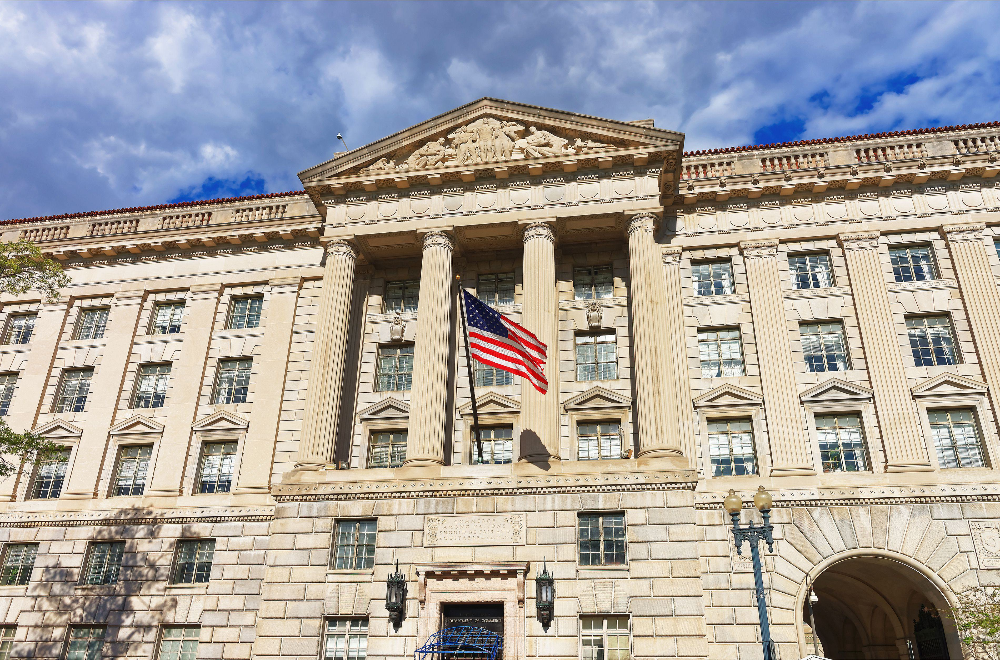

## Table of Contents

## What is the role of the United States Secretary of Commerce?

The United States Secretary of Commerce is a key member of the President's Cabinet. This person leads the Department of Commerce, which is a part of the government that focuses on promoting economic growth and job creation. The Secretary helps to make sure that businesses in the U.S. can grow and succeed. They also work to create good relationships with other countries for trade.

Another important job of the Secretary of Commerce is to gather and share information about the economy. They use data to help the President and other leaders make smart decisions. This can include information about how many people are working, how much businesses are making, and how the economy is doing overall. By doing this, the Secretary helps to keep the economy strong and stable.

## What are the primary responsibilities of the Secretary of Commerce?

The Secretary of Commerce is in charge of the Department of Commerce. This means they lead a big group of people who work to help the economy grow. They do this by helping businesses in the United States do well. The Secretary works to make sure that companies can sell their products and services, both at home and in other countries. They also try to make trade between the U.S. and other countries better and fairer.

Another big job of the Secretary of Commerce is to collect and share information about the economy. They look at data to see how many people have jobs, how much money businesses are making, and how the economy is doing overall. This information helps the President and other leaders make good choices about the country's economy. By doing this, the Secretary helps keep the economy strong and helps everyone in the U.S. have a better life.

## How does the Secretary of Commerce influence economic policy?

The Secretary of Commerce plays a big role in shaping economic policy by working closely with the President and other leaders. They help make decisions about how to help businesses grow and create jobs. The Secretary gives advice on what the government can do to make it easier for companies to succeed. This can include things like making trade deals with other countries or helping small businesses get the support they need.

Another way the Secretary influences economic policy is by collecting and analyzing data about the economy. They look at information like how many people are working, how much money businesses are making, and how the economy is doing overall. This data helps the Secretary and other leaders understand what is happening in the economy and what they can do to make it better. By sharing this information, the Secretary helps guide the government's actions to keep the economy strong and stable.

## What qualifications are necessary to become the Secretary of Commerce?

To become the Secretary of Commerce, a person usually needs a strong background in business, economics, or a related field. They should have experience in leading big organizations or companies. This experience helps them understand how to help businesses grow and create jobs. They also need to know a lot about trade and how to make good relationships with other countries. Being good at working with people and understanding numbers and data is important too.

The President of the United States picks the Secretary of Commerce, and the Senate has to agree with the choice. So, the person should also be good at working with others in government and explaining their ideas clearly. They need to be able to talk about complicated economic ideas in a way that everyone can understand. Having a good reputation and being trusted by others in the business and political world is also important for this job.

## How is the Secretary of Commerce appointed?

The President of the United States picks the Secretary of Commerce. This means the President chooses who they think will be the best person for the job. The President looks for someone who knows a lot about business and the economy. They want someone who can help businesses grow and create jobs.

After the President picks someone, the Senate needs to agree with the choice. The Senate is a group of people in the government who check if the President's choice is good. They ask the person questions and see if they are the right fit for the job. If the Senate agrees, then the person can become the Secretary of Commerce.

## What is the relationship between the Secretary of Commerce and other Cabinet members?

The Secretary of Commerce works closely with other Cabinet members to help the President make good decisions about the country. They meet together to talk about important issues and share their ideas. The Secretary of Commerce often works with the Secretary of the Treasury because both are involved in the economy. They might talk about how to help businesses grow and create jobs. The Secretary also works with the Secretary of State to make trade deals with other countries. This helps American businesses sell their products around the world.

Sometimes, the Secretary of Commerce might have different ideas than other Cabinet members. When this happens, they need to talk and find a way to work together. The President listens to everyone's ideas and makes the final decision. Even if they disagree, all Cabinet members want to help the country and its people. By working together, they can make the best choices for the economy and the nation.

## How does the Secretary of Commerce interact with international trade organizations?

The Secretary of Commerce plays a big role in working with international trade organizations. They help make sure that the United States can trade fairly with other countries. The Secretary often goes to meetings with groups like the World Trade Organization (WTO) and talks about trade rules. They try to make sure these rules are good for American businesses and workers. By working with these organizations, the Secretary helps create opportunities for U.S. companies to sell their products around the world.

The Secretary also works with other countries to make trade agreements. These agreements can help businesses in the U.S. by making it easier to sell things in other countries. The Secretary talks with leaders from other countries to find ways to work together. They might discuss how to lower taxes on goods or make it easier for companies to do business across borders. By doing this, the Secretary helps make trade better for everyone and supports the U.S. economy.

## What are some key initiatives typically led by the Secretary of Commerce?

The Secretary of Commerce often leads initiatives to help businesses grow and create jobs. One key initiative is working on trade agreements with other countries. These agreements can make it easier for American companies to sell their products around the world. The Secretary talks with leaders from other countries to find ways to lower taxes on goods and make it easier for businesses to work across borders. By doing this, the Secretary helps support the U.S. economy and create more opportunities for American workers.

Another important initiative is collecting and sharing data about the economy. The Secretary uses this information to help the President and other leaders make good decisions. They look at things like how many people are working, how much money businesses are making, and how the economy is doing overall. This data helps the Secretary understand what is happening in the economy and what can be done to make it better. By sharing this information, the Secretary helps guide the government's actions to keep the economy strong and stable.

## How does the Secretary of Commerce address issues of economic inequality?

The Secretary of Commerce works to address economic inequality by helping businesses grow in a way that benefits everyone. They focus on creating jobs and making sure that people from all backgrounds have a chance to work. The Secretary might support programs that help small businesses start and grow, especially in areas where people don't have as many opportunities. By doing this, they help spread economic growth to more people and reduce the gap between the rich and the poor.

Another way the Secretary of Commerce tackles economic inequality is by working on policies that make sure everyone can share in the country's economic success. They might push for fair wages and better working conditions. The Secretary also looks at data to see where inequality is a big problem and then works with other government leaders to find solutions. By focusing on these issues, the Secretary helps make the economy more fair and gives more people a chance to improve their lives.

## What historical impact has the Secretary of Commerce had on U.S. economic development?

The Secretary of Commerce has played a big role in helping the U.S. economy grow over the years. They have worked to make trade deals with other countries, which helps American businesses sell their products around the world. For example, the Secretary has helped make agreements that lower taxes on goods, making it easier for companies to do business across borders. This has led to more jobs and more money coming into the country. The Secretary also helps businesses by giving them information and support they need to grow. This has been important for the economy because when businesses do well, they can hire more people and pay them better.

Another way the Secretary of Commerce has impacted the U.S. economy is by collecting and sharing data about how the economy is doing. They look at things like how many people are working, how much money businesses are making, and how the economy is doing overall. This information helps the President and other leaders make good decisions about the country's economy. By understanding what is happening, they can take steps to keep the economy strong and stable. Over time, this has helped the U.S. economy grow and has made life better for many people.

## How does the Secretary of Commerce manage the Department of Commerce's various bureaus and agencies?

The Secretary of Commerce is in charge of the whole Department of Commerce. This means they lead many different groups, called bureaus and agencies, that all work together to help the economy. The Secretary makes sure these groups are working well and doing what they are supposed to do. They set goals for each group and check to see if they are meeting those goals. The Secretary also decides how to use the money the department gets, making sure it goes to the right places to help businesses and the economy.

The Secretary of Commerce talks with the leaders of each bureau and agency to make sure everyone is on the same page. They have meetings to discuss what is working and what needs to change. The Secretary helps solve problems that come up and makes sure everyone is working together. By doing this, the Secretary helps the Department of Commerce run smoothly and do its job of helping the U.S. economy grow and create jobs.

## What challenges does the Secretary of Commerce face in balancing domestic and international economic interests?

The Secretary of Commerce faces a big challenge in balancing what's good for businesses at home with what's good for trade with other countries. At home, the Secretary wants to help American businesses grow and create jobs. This means they need to support things like small businesses and make sure workers have good jobs. But, they also need to think about how to make trade deals with other countries. These deals can help American companies sell their products around the world, but sometimes they can make things harder for businesses at home. The Secretary has to find a way to make both sides happy.

Another challenge is dealing with different rules and laws in other countries. Some countries might have high taxes on goods from the U.S., which can make it hard for American businesses to sell things there. The Secretary needs to talk with these countries to try to lower these taxes or find other ways to make trade easier. But, if they focus too much on international trade, they might not have enough time to help businesses at home. It's a tricky balance, and the Secretary has to work hard to make sure both domestic and international interests are taken care of.

## References & Further Reading

[1]: Marcos Lopez de Prado. ["Advances in Financial Machine Learning."](https://www.amazon.com/Advances-Financial-Machine-Learning-Marcos/dp/1119482089) Wiley, 2018.

[2]: Ernest P. Chan. ["Quantitative Trading: How to Build Your Own Algorithmic Trading Business."](https://www.amazon.com/Quantitative-Trading-Build-Algorithmic-Business/dp/0470284889) Wiley, 2009.

[3]: David Aronson. ["Evidence-Based Technical Analysis: Applying the Scientific Method and Statistical Inference to Trading Signals."](https://www.amazon.com/Evidence-Based-Technical-Analysis-Scientific-Statistical/dp/0470008741) Wiley, 2006.

[4]: Stefan Jansen. ["Machine Learning for Algorithmic Trading: Predictive models to extract signals from market and alternative data for systematic trading strategies."](https://github.com/stefan-jansen/machine-learning-for-trading) Packt Publishing, 2018.

[5]: Bergstra, J., Bardenet, R., Bengio, Y., & Kégl, B. ["Algorithms for Hyper-Parameter Optimization."](https://dl.acm.org/doi/10.5555/2986459.2986743) Advances in Neural Information Processing Systems 24, 2011.