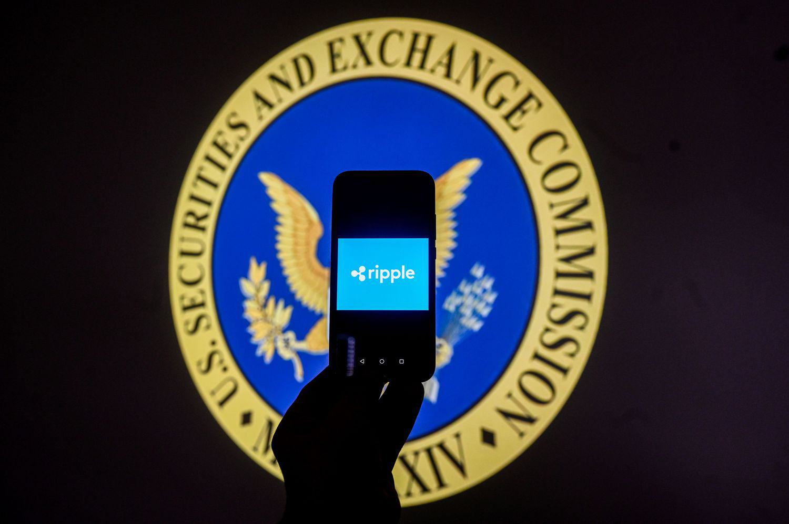

The dynamic intersection of cryptocurrency, regulatory oversight, and algorithmic trading represents an evolving frontier in the financial world. At the heart of this complex relationship is the ongoing legal battle between Ripple Labs and the U.S. Securities and Exchange Commission (SEC). Ripple, the company behind the XRP cryptocurrency, has been embroiled in a high-profile lawsuit with outcomes that could profoundly impact the wider cryptocurrency landscape. This case underscores the ongoing debate over digital asset classification and regulatory reform, offering insights into how regulatory bodies might approach cryptocurrency governance moving forward. By analyzing this conflict, we gain a better understanding of the implications for cryptocurrency regulation and algorithmic trading.

The Ripple vs. SEC case arises from charges filed by the SEC against Ripple Labs for allegedly conducting an unregistered securities offering through the sale of XRP. Ripple's defense relies heavily on past statements by SEC officials and historical treatment of XRP, arguing a clear distinction from traditional securities. Mixed court rulings have added complexity to the case, determining that while XRP is not considered a security in public exchange sales, it may be classified as such when sold to institutional investors. This litigation has thus emerged as a pivotal moment in cryptocurrency regulation, challenging conventional boundaries of securities law as applied to digital currencies.

Understanding the intricacies of digital asset classification is crucial for both regulatory bodies and market participants, as decisions made in Ripple's case could establish precedents affecting how similar cases are adjudicated in the future. The potential regulatory reforms stemming from this case might lead to more structured frameworks governing cryptocurrency operations, impacting market practices and investor approaches. By scrutinizing the interface of regulation and market innovation, Ripple's situation becomes a lens through which the evolving landscape of cryptocurrency regulation and algorithmic trading can be viewed.

## Table of Contents

## Overview of the Ripple vs. SEC Case

The Ripple vs. SEC lawsuit began in December 2020 when the U.S. Securities and Exchange Commission (SEC) filed a lawsuit against Ripple Labs Inc., its CEO Brad Garlinghouse, and co-founder Chris Larsen. The SEC alleged that Ripple had raised over $1.3 billion through an unregistered securities offering by selling XRP, a digital asset created and distributed by Ripple, which the SEC classified as a security. According to the SEC, these transactions violated the registration provisions of the Securities Act of 1933.

Ripple's defense strategy largely rested on previous statements made by SEC officials and historical treatment of XRP. Ripple contended that XRP was a digital currency similar to Bitcoin and Ethereum, which the SEC had previously indicated were not securities. Ripple also pointed to a lack of regulatory clarity, arguing that the SEC had not provided fair notice that XRP would be considered a security.

The legal case has sparked considerable interest due to the mixed court rulings it has generated. A notable development was the court's determination that XRP does not qualify as a security when sold on public exchanges to retail investors, refuting the SEC's claim of a continuous offering. However, the court also ruled that XRP could be categorized as a security when sold to institutional investors due to the expectations of profits driven by Ripple's efforts, thus aligning somewhat with the SEC's position.

This lawsuit serves as a significant landmark in the regulation of cryptocurrencies, as it challenges well-established boundaries of securities law concerning digital currencies. The case has brought attention to the pressing need for clear regulatory guidelines in the industry. Depending on its final outcomes, it could set precedents affecting not only Ripple and its market operations but also the broader [cryptocurrency](/wiki/cryptocurrency) landscape, particularly how digital assets are classified and regulated.

## Implications for Cryptocurrency Regulation

The Ripple case underscores significant regulatory ambiguities in the classification of digital assets as securities. This legal confrontation has highlighted the need for clear guidelines on what constitutes a security in the context of cryptocurrency, potentially paving the way for more definitive regulatory frameworks. If a precedent is established, similar cases could see more consistent rulings, directly impacting the digital asset industry. 

Such a regulatory precedent could lead to more stringent regulatory oversight and compliance requirements for cryptocurrencies. With clearer guidelines, market participants might be required to adhere to enhanced protocols, affecting both market operations and investor strategies. For instance, exchanges and projects may have to implement additional compliance measures to ensure they do not inadvertently fall foul of securities regulations, thus influencing their strategic operations and financial models.

Ripple's partial victory, where XRP was not classified as a security when sold on public exchanges, could serve as a foundation for future legal arguments. This outcome supports the case against considering all cryptocurrencies as securities, which could lead to a stabilization of crypto markets. A consistent regulatory environment can reduce legal uncertainties, fostering an atmosphere where digital currencies can develop with greater confidence.

Such regulatory clarity can lead to an environment more conducive to attracting institutional investors, who typically require clear regulatory guidance before venturing into new asset classes. This could result in increased capital flow into the cryptocurrency market, enhancing [liquidity](/wiki/liquidity-risk-premium) and potentially reducing [volatility](/wiki/volatility-trading-strategies).

As stakeholders evaluate the implications of Ripple's case, the legal environment for digital assets may shift towards more structured and well-understood frameworks. This development could eventually benefit the entire cryptocurrency ecosystem by providing a foundation for sustainable growth and integration into traditional financial systems.

## Algorithmic Trading in the Cryptocurrency Space

Algorithmic trading involves the use of complex algorithms and automated systems to execute trading strategies at speeds and frequencies that are impossible for human traders. In the cryptocurrency market, this practice has become indispensable for major exchanges and traders looking to leverage the 24/7 market cycle and high volatility of digital assets. Algorithmic traders in the cryptocurrency space typically employ strategies such as [market making](/wiki/market-making), [arbitrage](/wiki/arbitrage), and [momentum](/wiki/momentum) trading, often relying on vast amounts of data and sophisticated models to make split-second decisions.

Regulatory clarity stemming from cases like Ripple's has the potential to significantly shape the future development of [algorithmic trading](/wiki/algorithmic-trading) platforms. The Ripple case underscores the need for a rigorous legal framework that defines digital assets' regulatory status. With clearer legal parameters, the development of algorithmic trading platforms can be more strategically aligned with compliance requirements, ensuring that algorithms are not only technologically robust but also legally compliant.

Potential new regulations may necessitate adaptations in existing algorithmic trading models. For instance, traders may need to modify algorithms to navigate enhanced regulatory landscapes or work within asset classifications that are more strictly defined. This could involve adjustments in the way data is collected, processed, and utilized, ensuring that strategies not only achieve financial objectives but also adhere strictly to any legislative changes.

The impact of these regulatory adaptations could lead to a more transparent and stable cryptocurrency trading environment. By imposing compliance standards and fostering accountable trading practices, regulation reduces the systemic risks associated with unregulated markets. In a regulated framework, the potential for market manipulation diminishes, liquidity improves, and market participants gain more confidence, ultimately fostering a more sustainable ecosystem for digital asset trading. This evolution presents opportunities for cryptocurrency exchanges to innovate and improve their service offerings while maintaining adherence to legal standards.

The ongoing changes signify a shift towards a structured trading environment where algorithmic traders are not just reacting to market conditions but are strategically positioned to operate within a legal framework that emphasizes transparency, security, and liability. As such, the role of algorithmic trading in cryptocurrency markets continues to evolve in response to the legal and regulatory precedents being established.

## The Future of Ripple and XRP

Ripple Labs, despite its ongoing legal entanglements with the U.S. Securities and Exchange Commission (SEC), maintains a forward-looking stance by continuing to develop and broaden its blockchain solutions tailored for financial applications. Regardless of the lawsuit, XRP, Ripple's native digital asset, remains integral to the cryptocurrency market. It plays a crucial role in facilitating digital payment systems and cross-border transactions. Its characteristics, such as speed and cost-effectiveness, present a competitive edge in these areas, fostering its continued relevance in the industry.

The legal proceedings have produced mixed outcomes, potentially impacting Ripple's market strategies and partnerships. A decisive [factor](/wiki/factor-investing) in Ripple's future is the legal classification of XRP. If XRP is classified as a non-security, similar to commodities like Bitcoin and Ethereum, Ripple could benefit significantly. Such a classification could open new avenues for partnerships and broaden its market strategies by lowering legal risks associated with XRP's use in financial products and transactions.

On the other hand, should the SEC's jurisdiction over XRP be upheld, it might pose challenges for Ripple, necessitating compliance with securities regulations. This could lead to limitations in market operations and potentially deter some partners wary of stringent regulatory requirements. Nonetheless, Ripple's adaptability and technological advantages could still allow it to navigate these challenges effectively.

In a favorable regulatory environment, XRP's prospects might see substantial growth. Clear and supportive regulation could enhance XRP's adoption, especially within mainstream financial systems. This would likely facilitate Ripple's integration into various financial services, strengthening its role in improving and innovating payment systems globally. This environment might also stimulate innovation, encouraging the development of novel financial products incorporating XRP.

Ripple's resilience and commitment to innovation, coupled with strategic adaptation to regulatory developments, position it well for future opportunities. The impact of the lawsuit and subsequent regulatory decisions will likely shape XRP's trajectory, influencing its potential to further disrupt and enhance digital payments and financial systems.

## Conclusion

The Ripple vs. SEC lawsuit represents a critical juncture in the development of cryptocurrency regulation, marking a transformative period that extends beyond Ripple and the XRP cryptocurrency. The outcome of this case is anticipated to have far-reaching implications for the entire digital assets market. By challenging existing notions of how cryptocurrencies should be classified under securities laws, this legal battle has the potential to redefine regulatory parameters and protocols that govern digital currencies.

For cryptocurrency stakeholders, including investors, developers, exchanges, and regulatory bodies, there is an urgent need to remain proactive as the legal landscape continues to evolve. The case highlights the necessity for these parties to adapt to potentially new compliance requirements and enforcement measures that could arise from a ruling. A more defined regulatory framework may stimulate greater institutional participation in the crypto market, potentially influenced by the final decision in this lawsuit.

Moreover, algorithmic trading, which plays a significant role in cryptocurrency exchanges due to its ability to exploit market inefficiencies quickly and effectively, may undergo substantial adjustments. With an increase in regulatory clarity, algorithmic trading platforms could face new compliance standards, requiring them to modify existing algorithms to align with emerging regulations. Such developments promise to bring more transparency and stability to trading environments, mitigating risks associated with unregulated markets.

As the cryptocurrency sector matures, cases like Ripple's are instrumental in guiding the industry towards more structured and universally accepted digital asset frameworks. This evolution promises a future where digital currencies are better integrated into mainstream financial systems, fostering innovation and economic growth within a sound regulatory context. As such, the Ripple vs. SEC lawsuit not only determines Ripple's trajectory but also serves as a catalyst for progressive changes across the digital asset ecosystem.

## References & Further Reading

[1]: Jerry Brito, "Regulating Bitcoin: How New Frameworks Could Shape Digital Currency," Harvard Business Law Review, 2014. 

[2]: Jeff John Roberts, "Ripple and SEC’s Roller Coaster Legal Battle: What's at Stake," Fortune, 2021. [https://fortune.com/2021/05/29/ripple-sec-case-crypto-impact/](https://github.com/komomon/Komo/blob/main/core/tools/domain/OneForAll/data/subnames.txt)

[3]: Phillip Sandner, "The End of the Honeymoon: Regulatory Bodies' Growing Interest in Cryptocurrencies," Journal of Financial Regulation and Compliance, 2019.

[4]: Jacob J. Elster, Kevin Werbach, "Cryptocurrency and the Myth of the 'Unregulatable' Marketplace," Stanford Journal of Blockchain Law & Policy, 2018.

[5]: Stefan Jansen, "Machine Learning for Algorithmic Trading," 2nd Edition, Packt Publishing, 2020.

[6]: Andrew Tutt, "The Legal Challenge of Algorithmic Trading: An Analysis of Regulatory Frameworks," Yale Law Journal, 2015.

[7]: "SEC on Digital Assets: A Round-Up of Statements and Updates," U.S. Securities and Exchange Commission, 2023. [https://www.sec.gov/](https://en.wikipedia.org/wiki/U.S._Securities_and_Exchange_Commission)

[8]: Bernd Singel, "Algorithmic Finance: Analyzing Market Impact," Journal of Finance and Data Science, Vol. 6, No. 4, 2020.