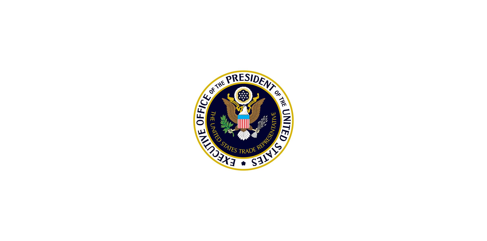

## Table of Contents

## What is the United States Trade Representative (USTR)?

The United States Trade Representative (USTR) is a part of the U.S. government that deals with trade. It is led by the U.S. Trade Representative, who is like a special advisor to the President on trade issues. The USTR works to create trade agreements with other countries. These agreements help American businesses sell their products and services around the world.

The USTR also makes sure that other countries follow the rules of these trade agreements. If a country does not follow the rules, the USTR can take action to protect American interests. This might include starting talks or even putting limits on trade with that country. The USTR's main goal is to help the U.S. economy grow by making trade fair and beneficial for everyone.

## Who is the current United States Trade Representative?

The current United States Trade Representative is Katherine Tai. She started her job in March 2021. Katherine Tai works for President Joe Biden and helps him make decisions about trade.

Before becoming the USTR, Katherine Tai worked as a lawyer and focused on trade issues. She has a lot of experience in this area. Her job now is to make sure that trade deals are good for American workers and businesses. She also works to make sure other countries follow the rules of these trade deals.

## What are the main responsibilities of the USTR?

The main job of the United States Trade Representative (USTR) is to help the President make decisions about trade. The USTR works to create trade agreements with other countries. These agreements help American businesses sell their products and services around the world. The USTR also makes sure that other countries follow the rules of these trade agreements. If a country does not follow the rules, the USTR can take action to protect American interests. This might include starting talks or even putting limits on trade with that country.

Another important responsibility of the USTR is to help the U.S. economy grow by making trade fair and beneficial for everyone. The USTR works with other government agencies and businesses to understand what they need from trade deals. They also talk with other countries to solve problems and make sure trade is fair. The USTR's work helps create jobs and makes American products more competitive in the global market.

## How is the USTR appointed and what is their term length?

The United States Trade Representative (USTR) is appointed by the President of the United States. After the President chooses someone for the job, the Senate has to approve the choice. This is called Senate confirmation. The President can pick anyone they think is good for the job, but the person usually knows a lot about trade and has worked in this area before.

The USTR does not have a set term length like some other government jobs. They serve as long as the President who appointed them wants them to. If a new President is elected, they can choose a new USTR. This means the USTR can stay in the job for a few months or for several years, depending on when the President decides to make a change.

## What is the organizational structure of the USTR?

The United States Trade Representative (USTR) is led by the USTR, who is appointed by the President and confirmed by the Senate. The USTR works closely with a Deputy USTR, who helps manage the office and its responsibilities. Together, they oversee the entire organization and make sure it follows the President's trade goals.

The USTR office is divided into different groups, each focusing on specific areas of trade. There are groups that work on trade with specific regions like Europe, Asia, and the Americas. Other groups focus on specific issues like agriculture, labor, and the environment. Each group has its own leader who reports to the USTR and Deputy USTR. This structure helps the USTR handle the many different parts of trade and make sure all areas are covered.

## How does the USTR work with other government agencies?

The United States Trade Representative (USTR) works closely with other government agencies to make sure trade policies are good for the whole country. The USTR talks with agencies like the Department of Commerce, the Department of Agriculture, and the Department of Labor. These agencies help the USTR understand what businesses and workers need from trade deals. For example, the Department of Agriculture can tell the USTR what farmers need to sell their products in other countries. This helps the USTR make trade agreements that support American jobs and businesses.

The USTR also works with agencies like the Office of the United States Trade and Development Agency (USTDA) and the Export-Import Bank of the United States (EXIM) to help American companies sell their products abroad. These agencies provide support like funding and technical help to businesses that want to trade with other countries. By working together, the USTR and these agencies can make sure that trade policies help the U.S. economy grow and that American products are competitive in the global market.

## What are some key trade agreements negotiated by the USTR?

The United States Trade Representative (USTR) has helped negotiate many important trade agreements. One big one is the United States-Mexico-Canada Agreement (USMCA). This agreement replaced the old North American Free Trade Agreement (NAFTA). The USMCA helps businesses in the U.S., Mexico, and Canada trade with each other more easily. It has rules to protect workers, the environment, and to make sure companies follow the agreement. This deal helps American businesses sell their products in Mexico and Canada and creates jobs in the U.S.

Another key agreement is the Trans-Pacific Partnership (TPP), even though the U.S. is no longer part of it. The USTR helped negotiate this deal with 11 other countries around the Pacific Ocean. The TPP was meant to make trade easier and fairer among these countries. It had rules to protect workers, the environment, and to stop unfair trade practices. Even though the U.S. left the TPP, it shows how the USTR works to make big trade deals that can help American businesses and workers.

The USTR also worked on the World Trade Organization (WTO) agreements. The WTO is a group of many countries that work together to make trade rules. The USTR helps negotiate these rules to make sure they are fair for the U.S. The WTO agreements help American businesses sell their products all over the world. They also help solve trade problems between countries. By working on WTO agreements, the USTR helps keep trade fair and helps the U.S. economy grow.

## How does the USTR handle trade disputes?

The United States Trade Representative (USTR) handles trade disputes by talking with other countries to solve problems. If a country does not follow the rules of a trade agreement, the USTR can start talks to fix the issue. They might meet with the other country's trade officials to discuss the problem and find a solution. The goal is to make sure trade stays fair and that American businesses and workers are protected.

If talking does not solve the problem, the USTR can take stronger action. They might ask the World Trade Organization (WTO) to help solve the dispute. The WTO can set up a special group to look at the problem and decide who is right. If the WTO agrees with the U.S., they can tell the other country to change its rules. If the country still does not follow the rules, the USTR can put limits on trade with that country. This means they might add extra taxes or stop some products from coming into the U.S. until the problem is fixed.

## What role does the USTR play in international trade negotiations?

The United States Trade Representative (USTR) plays a big role in international trade negotiations. They talk with other countries to make trade agreements that help American businesses sell their products around the world. The USTR works to make sure these agreements are fair and good for the U.S. economy. They meet with trade officials from other countries to discuss what each country wants and needs from the trade deal. This helps create rules that everyone can follow and that help American workers and businesses.

If there are problems during the negotiations, the USTR tries to solve them. They might need to change parts of the agreement to make everyone happy. The USTR also works with other U.S. government agencies to understand what American businesses and workers need from these trade deals. By working together, they can make sure the agreements help the U.S. economy grow and that American products are competitive in the global market.

## How does the USTR influence U.S. trade policy?

The United States Trade Representative (USTR) has a big job in shaping U.S. trade policy. They work closely with the President to decide what the U.S. should do about trade. The USTR talks with other countries to make trade agreements that help American businesses sell their products around the world. They also make sure these agreements are fair and good for the U.S. economy. If there are problems, the USTR tries to solve them by talking with other countries or by taking action to protect American interests.

The USTR also works with other parts of the U.S. government to make sure trade policies help everyone. They talk with agencies like the Department of Commerce and the Department of Agriculture to understand what businesses and workers need. This helps the USTR make trade deals that support American jobs and businesses. By working together, the USTR helps create trade rules that keep trade fair and help the U.S. economy grow.

## What are the challenges faced by the USTR in global trade?

The United States Trade Representative (USTR) faces many challenges when trying to make trade deals with other countries. One big challenge is that different countries want different things from trade agreements. Some countries want to protect their own businesses, while others want to sell their products in the U.S. This can make it hard for the USTR to find a deal that everyone is happy with. Also, countries might not follow the rules of trade agreements, which can cause problems and disputes. The USTR has to work hard to solve these issues and make sure trade stays fair.

Another challenge is that the world of trade is always changing. New technology and ways of doing business can make old trade agreements outdated. The USTR has to keep up with these changes and make sure trade policies help American businesses stay competitive. Global problems like climate change and health crises can also affect trade. The USTR has to think about these issues when making trade deals. It's a big job to balance all these challenges and make trade policies that help the U.S. economy grow.

## How does the USTR assess the impact of trade policies on the U.S. economy?

The United States Trade Representative (USTR) looks at how trade policies affect the U.S. economy by working with other government agencies. They talk to the Department of Commerce, the Department of Agriculture, and others to understand what businesses and workers need. The USTR uses this information to see if trade deals will help American companies sell their products around the world. They also check if the deals will create jobs and make the U.S. economy stronger.

The USTR also uses data and reports to see how trade policies are working. They look at numbers like how much the U.S. is exporting and importing, and how many jobs are being created or lost because of trade. If a trade policy is not helping the U.S. economy, the USTR might try to change it or make a new deal. By keeping an eye on these things, the USTR can make sure trade policies are good for the country.

## References & Further Reading

[1]: Bergstra, J., Bardenet, R., Bengio, Y., & Kégl, B. (2011). ["Algorithms for Hyper-Parameter Optimization."](https://proceedings.neurips.cc/paper/2011/file/86e8f7ab32cfd12577bc2619bc635690-Paper.pdf) Advances in Neural Information Processing Systems 24.

[2]: ["Advances in Financial Machine Learning"](https://www.amazon.com/Advances-Financial-Machine-Learning-Marcos/dp/1119482089) by Marcos Lopez de Prado

[3]: ["Evidence-Based Technical Analysis: Applying the Scientific Method and Statistical Inference to Trading Signals"](https://onlinelibrary.wiley.com/doi/book/10.1002/9781118268315) by David Aronson

[4]: ["Machine Learning for Algorithmic Trading"](https://github.com/stefan-jansen/machine-learning-for-trading) by Stefan Jansen

[5]: ["Quantitative Trading: How to Build Your Own Algorithmic Trading Business"](https://www.amazon.com/Quantitative-Trading-Build-Algorithmic-Business/dp/1119800064) by Ernest P. Chan