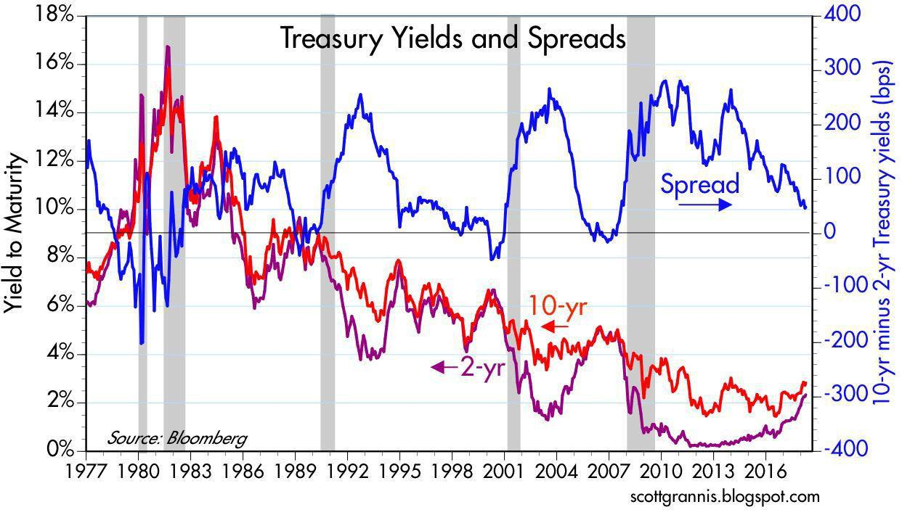

In today's financial world, money market funds and algorithmic trading have become integral components of investment portfolios. Money market funds, which predominantly invest in short-term, high-quality debt securities, offer stability and liquidity, making them an attractive option for risk-averse investors. Algorithmic trading, by contrast, utilizes sophisticated computer algorithms to execute trades with precision and speed, optimizing market opportunities and reducing the potential for human error.

This article explores the intersection between money market fund investment, treasury funds, and algorithmic trading, focusing on how these elements combine to form effective investment strategies. By examining their integration, the article aims to offer insights into how money market funds, known for their low-risk and liquidity characteristics, can benefit from the agility and efficiency that algorithmic trading provides. The convergence of these financial instruments can result in enhanced returns and portfolio optimization.



Additionally, we will address the potential risks associated with the synergy of these investment approaches. Understanding the dynamics between money market funds and algorithmic trading is crucial for investors aiming to harness their full potential while navigating the inherent challenges they present. This knowledge is vital in making informed decisions, identifying optimal investment paths, and aligning with individual risk tolerances and financial objectives.

Through a detailed discussion of the key characteristics, advantages, and risks of money market funds and algorithmic trading, this article strives to equip investors with the information necessary to optimize their portfolios in the ever-evolving financial landscape.

## Table of Contents

## Understanding Money Market Funds

Money market funds are a specific kind of mutual fund designed to offer high liquidity and a low-risk investment option to investors. These funds primarily invest in short-term, high-quality debt instruments, such as Treasury bills, certificates of deposit (CDs), and commercial paper. The main goal of money market funds is to preserve the principal while providing returns that are slightly higher than traditional savings accounts. 

These characteristics make them particularly appealing to risk-averse investors who prioritize stability and ease of access to their funds. By focusing on short-term securities of high credit quality, money market funds provide investors with a stable investment vehicle that can serve as a cash equivalent. 

The regulatory framework governing money market funds plays a crucial role in maintaining their low-risk profile and ensuring a high degree of credit quality and [liquidity](/wiki/liquidity-risk-premium). In the United States, for instance, the Securities and Exchange Commission has specific rules, such as Rule 2a-7, which require money market funds to adhere to strict guidelines regarding the maturity and credit quality of their investments. These regulations are designed to protect investors and maintain confidence in the stability of these funds by limiting the potential for significant principal loss.

In summary, money market funds are a low-risk, highly liquid investment option that provides slightly higher returns than conventional savings accounts. Their stability is underpinned by a robust regulatory framework that ensures the quality and liquidity of the investments within the fund.

## Financial Advantages of Money Market Funds

Money market funds are an appealing investment vehicle for many investors due to their inherent financial advantages, particularly in terms of liquidity and safety. These funds provide rapid access to cash with minimal risk of significant principal loss, a feature highly valued by individuals who require flexibility in managing their finances. Investors have the assurance of being able to liquidate their holdings swiftly, a critical advantage for those needing to respond to unforeseen financial needs or those seeking to reallocate their investment portfolio promptly.

Stringent regulations govern money market funds, ensuring they maintain a high credit quality and effectively mitigate default risks. Regulations such as the SEC's Rule 2a-7 mandate specific credit quality, maturity, and diversification requirements to bolster the security of these funds. This regulatory framework not only protects investors but also fortifies the overall credibility of money market funds, making them a reliable option for both individual and institutional investors.

The accessibility of money market funds is another significant advantage. With low initial investment requirements, these funds broaden the investment horizon for those with limited capital, enabling a diverse range of investors to participate in the benefits they offer. This inclusivity attracts a wide audience, from novice investors seeking a stable entry point to seasoned investors looking for a conservative addition to their portfolios.

During economic uncertainties, money market funds stand out for their stability. Unlike more volatile equity or commodity investments, these funds offer a relatively steady option, safeguarding investors against severe fluctuations. Their tendency to maintain a stable net asset value (NAV) of $1 per share ensures that investors can have confidence in the preservation of their capital, even amidst market fluctuations.

Furthermore, investors derive benefit from a secure and flexible investment choice that delivers predictable returns. The interest generated from money market funds, although modest compared to riskier investments, often surpasses that of regular savings accounts. This makes them an attractive proposition for those prioritizing security and liquidity, while still seeking to surpass the returns offered by more traditional banking products.

In summary, the combination of liquidity, stringent regulations, accessibility, stability during economic fluctuations, and predictable returns makes money market funds a preferred choice for many investors. These advantages play a pivotal role in the strategic composition of a diversified investment portfolio, helping investors balance risk while optimizing their financial outcomes.

## Risks of Investing in Money Market Funds

Money market funds, while generally regarded as low-risk investment options, are not without their potential drawbacks. One primary concern is their low yield environment; these funds typically offer modest returns that may not outpace inflation. This implies that the purchasing power of the investment could diminish over time if inflation rates exceed the return rates offered by money market funds.

Additionally, there's the risk tied to the fund's Net Asset Value (NAV). Under certain volatile market conditions, a fund's NAV might drop below the standard $1 mark, affecting investors' principal. This situation, often referred to as "breaking the buck," can occur during periods of extreme financial stress or liquidity shortages, although it remains a rare occurrence thanks to regulatory safeguards.

Expense ratios also play a critical role in the overall yield of these funds. Although generally lower than those associated with other mutual funds, they can still erode net returns, especially in a low-interest-rate environment. Investors need to assess whether the returns after accounting for the expense ratio justify staying invested in the fund.

Investors are advised to remain vigilant about current economic conditions that could influence the performance of money market funds. Evaluating factors such as [interest rate](/wiki/interest-rate-trading-strategies) trends and overall market stability can help investors gauge potential risks more accurately.

Lastly, risk mitigation strategies such as diversification and prudent fund selection are essential. By diversifying investments across different funds with varying strategies and risk profiles, investors can better manage potential risks and enhance their portfolios' resilience to market fluctuations. Careful analysis and selection of funds based on credit quality, yield, and fee structures can provide additional layers of protection against potential downsides.

## Algorithmic Trading: An Overview

Algorithmic trading uses sophisticated computer algorithms to automate and optimize trade execution. This approach allows trades to be conducted at speeds and frequencies that are impossible for human traders. The primary benefits include reducing human error, improving trade precision, and capturing fleeting market opportunities. By utilizing pre-defined criteria and mathematical models, [algorithmic trading](/wiki/algorithmic-trading) systems can execute trades by analyzing various market variables such as price, timing, and [volume](/wiki/volume-trading-strategy).

The prevalence of algorithmic trading has substantially increased in financial markets, especially in high-volume environments like stock exchanges and foreign exchange markets. It is estimated that algorithmic trading constitutes a significant portion of total trading volume globally. This surge is attributed to the continuous advancements in technology and computational power, making it more accessible for both institutional and individual investors.

Technological advancements such as [machine learning](/wiki/machine-learning), big data analytics, and high-performance computing have significantly contributed to the efficiency and accessibility of algorithmic trading. These tools allow the algorithms to continuously improve decision-making processes based on real-time data analysis and pattern recognition.

However, despite its benefits, algorithmic trading is not without challenges. One of the main concerns is its potential to increase market [volatility](/wiki/volatility-trading-strategies). Rapid and automated trading activities can create erratic market behaviors, leading to market destabilization. Furthermore, system failures or errant algorithms due to coding errors can result in unintended financial losses or systemic risks.

In conclusion, while algorithmic trading brings efficiency and improved trading strategies to the financial world, it requires robust risk management and regulatory oversight to mitigate its potential negative impacts on market stability.

## Integration of Money Market Funds with Algorithmic Trading

Integrating algorithmic trading with money market funds offers the potential to significantly enhance the efficiency of portfolio management. Algorithmic trading, which employs computer algorithms to automate trade execution, can optimize trade execution by calibrating timing, pricing, and volume constraints in nanoseconds. This precision reduces transaction costs and allows for rapid response to market changes, which is particularly advantageous in the typically liquid environment of money market fund investments.

The incorporation of algorithmic strategies in managing money market funds can facilitate the deployment of sophisticated trading strategies. Such integration might involve dynamic allocation algorithms that assess and rebalance investment positions to exploit market inefficiencies. This technological advancement in trading encompasses a breadth of models—from statistical [arbitrage](/wiki/arbitrage) to machine learning techniques—all aiming to maximize returns while managing the natural liquidity that money market funds provide.

For example, consider a simple model employing moving averages to determine trade signals. In Python, such a model might look like this:

```python
def moving_average_strategy(prices, short_window, long_window):
    short_ma = prices.rolling(window=short_window).mean()
    long_ma = prices.rolling(window=long_window).mean()

    signals = (short_ma > long_ma).astype(int)  # Buy signal when short MA is above long MA
    return signals

# Sample usage with hypothetical price data
import pandas as pd

prices = pd.Series(...)  # Hypothetical price data
signals = moving_average_strategy(prices, short_window=5, long_window=30)
```

The integration of algorithmic trading within money market funds requires meticulous oversight. High-frequency trading ([HFT](/wiki/high-frequency-trading-strategies)), while providing speed and cost efficiency, can also amplify risks. Small anomalies in algorithm design or unforeseen interactions with volatile conditions can propagate errors quickly, potentially impacting fund stability. Managing these risks necessitates systemic checks, such as real-time monitoring and algorithm verification processes, to safeguard against systemic threats posed by faulty algorithms. 

Thus, the alliance of algorithmic trading with money market funds, while promising increased efficiency and enhanced returns, should be cautiously balanced with robust risk management strategies to handle the complexities inherent in high-frequency trading environments.

## Risks of Algorithmic Trading with Money Market Funds

Algorithmic trading, while offering many advantages in terms of speed and efficiency, also presents unique risks, especially when integrated with money market funds. One of the primary concerns is market volatility. Due to the nature of algorithmic trading, characterized by rapid execution of trades, there is a potential for increased volatility within financial markets. This heightened volatility can affect the NAV (Net Asset Value) of money market funds, making it challenging to maintain the stability investors typically expect from such funds.

Errant algorithms, stemming from design flaws or coding errors, present another critical risk. These flawed algorithms can execute unintended large volumes of trades or trigger a cascade of automated responses, leading to substantial financial losses. For instance, a minor error in coding logic could convert an intended sell order at a specified price into a market order, resulting in asset liquidation at less favorable prices.

The high speed and frequency of trades endemic to algorithmic systems can also disadvantage traditional trading methods, potentially introducing disparities in market dynamics. This speed can translate into 'latency arbitrage,' where algorithmic traders take advantage of the slight delays in the execution times of other market participants, impacting the perceived fairness of the market.

Furthermore, the presence of high-frequency trading (HFT) can influence the strategies employed by fund managers of money market funds. The pressure to align with the often aggressive trading strategies of HFT participants might lead fund managers to make suboptimal decisions that could affect the fund's stability. This adaptation could shift the focus away from preserving capital and maintaining liquidity, fundamental tenets of money market funds.

To mitigate these risks, systemic checks such as circuit breakers are crucial. Circuit breakers act as a temporary halt to trading in the event of extreme price moves, providing a cooling-off period for markets. This mechanism helps stabilize markets by preventing flash crashes—sudden, deep market downturns—thereby protecting both traders and the underlying assets of money market funds. Implementing robust error-checking protocols and algorithm audits can further ensure that trading algorithms operate within anticipated parameters, reducing the likelihood of disruptive errors.

## Mitigation Strategies for Investment Risks

Regulatory measures play a vital role in maintaining transparency and ethical operations within algorithmic trading systems. These measures include strict guidelines and oversight by financial authorities, such as the Securities and Exchange Commission (SEC), to ensure that trading algorithms adhere to fair trading practices and do not manipulate market prices. Compliance with these regulations helps protect investors from unethical practices and promotes a level playing field in financial markets.

Investor education is crucial for empowering individuals to make informed decisions regarding money market funds and algorithmic trading. Understanding the complexities of these financial instruments allows investors to navigate potential risks and rewards effectively. Educational initiatives can include workshops, online courses, and informative resources that cover the basics of money market funds, the workings of algorithmic trading, and the associated risks.

Portfolio diversification is a fundamental strategy to reduce exposure to specific risks and balance potential financial performance. By spreading investments across different asset classes and financial instruments, investors can mitigate the impact of adverse market movements on their portfolios. Diversification can be achieved through a mix of money market funds, stocks, bonds, and other securities, thereby optimizing risk-adjusted returns.

Circuit breakers in trading systems are essential tools for preventing trades during extreme market conditions. These mechanisms automatically halt trading when significant price declines occur, giving the market time to stabilize and preventing panic-induced sell-offs. By implementing circuit breakers, exchanges can reduce extreme volatility and protect the financial system from systemic risk.

Collectively, these strategies help create a stable investment environment and mitigate associated risks. They provide a framework for investors to engage with financial markets confidently, knowing that their investments are protected through regulatory oversight, education, diversified strategies, and mechanisms to counteract extreme market fluctuations. These measures not only enhance market stability but also foster trust among market participants, contributing to the overall health of the financial ecosystem.

## Conclusion

Money market funds and algorithmic trading provide investors with distinct advantages and inherent risks, offering complementary benefits to a diversified investment strategy. Money market funds are renowned for their stability and liquidity while providing a secure investment avenue that can mitigate exposure to market volatility. Conversely, algorithmic trading utilizes computational power to execute trades swiftly and efficiently, often capitalizing on fleeting market opportunities. 

When combined, these elements can form a balanced investment approach that leverages the predictability and safety of money market funds with the dynamic and responsive nature of algorithmic trading. This synergy can optimize portfolio returns by preserving capital through money market investments while exploiting algorithmic trading strategies to achieve higher yields.

To effectively harness these benefits, investors must understand the inherent risks associated with each component. Money market funds, despite their stability, [carry](/wiki/carry-trading) the risk of low yields that may not outpace inflation. Algorithmic trading, while offering rapid execution, may introduce systemic risks and amplify market volatility. Mitigation strategies, such as diversification and regulatory compliance, play a crucial role in managing these risks.

Informed decision-making, grounded in a comprehensive understanding of money market funds and algorithmic trading, is essential for optimizing portfolio performance. By aligning investment choices with personal goals and risk preferences, investors can navigate the complexities of the financial environment, striking a balance between security and growth potential.

## References & Further Reading

- **SEC Rule 2a-7 - Securities and Exchange Commission**: This regulatory framework is crucial for understanding the operational guidelines and compliance requirements for money market funds. It sets standards for credit quality, maturity, and liquidity to preserve the safety and stability of these funds. The rule is available on the SEC's official website for detailed guidance.

- **Shock Markets: Trading Lessons for Volatile Times by Robert I. Webb**: This book provides valuable insights into trading strategies during periods of market volatility. It explores various techniques to navigate uncertain markets, making it a useful resource for both new and experienced investors aiming to enhance their trading acumen.

- **High-Frequency Trading: A Practical Guide to Algorithmic Strategies and Trading Systems by Irene Aldridge**: A comprehensive guide to algorithmic trading, this book covers the design and implementation of high-frequency trading systems. It discusses various strategies and offers practical advice on managing the challenges associated with high-speed trading environments.

- **Managing Systemic Risk in Algorithmic Trading with Microstructure Noise - Bank for International Settlements**: This paper addresses the challenges of systemic risk in algorithmic trading, focusing on the influence of microstructure noise. It is essential for understanding the broader implications of high-frequency trading and the measures needed to mitigate its risks.

- **Sorcery of the Finance: The Secret Power of Algorithmic Trading by QuantInsti**: This resource offers an in-depth look at the transformative potential of algorithmic trading. It discusses how these strategies have revolutionized finance and provides frameworks for implementing algorithmic solutions in trading strategies.

