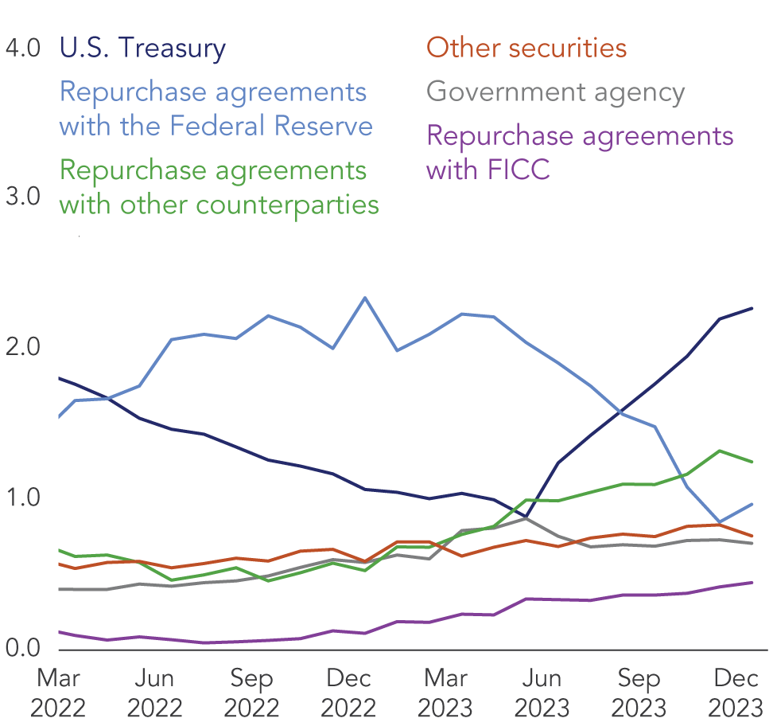

## Table of Contents

## What is a United States Treasury Money Market Fund?

A United States Treasury Money Market Fund is a type of investment where people put their money into a fund that mainly buys short-term U.S. government securities. These securities are considered very safe because they are backed by the U.S. government. The goal of the fund is to keep the money safe while also earning a small amount of interest. People often use these funds to save money they might need soon, like for an emergency or a big purchase.

These funds are popular because they are seen as low risk. They aim to keep the value of the investment stable, usually at $1 per share. This makes them a good choice for people who want to keep their money safe but still earn a little bit of interest. However, the interest rates on these funds can be lower than other types of investments, so they might not grow your money as quickly as other options.

## How does a Treasury Money Market Fund work?

A Treasury Money Market Fund works by pooling money from many investors and using that money to buy short-term U.S. government securities, like Treasury bills. These securities are very safe because they are backed by the U.S. government. The fund aims to keep the value of each share at $1, which means it tries to be a stable place to keep your money. When you put money into the fund, you are buying shares in it, and the fund uses your money to buy these safe government securities.

The fund earns interest from the securities it holds, and this interest is shared among the investors. The interest rate might be small, but it's usually more than what you would get from a regular savings account. The goal is to give you a safe place to keep your money while still earning a little bit of interest. Because the securities are short-term, the fund can quickly turn them into cash if many investors want their money back at the same time. This makes it a good choice for people who might need their money soon but still want to earn some interest.

## What are the benefits of investing in a Treasury Money Market Fund?

Investing in a Treasury Money Market Fund has several benefits. One big benefit is safety. These funds mainly buy U.S. government securities, which are considered very safe because the government backs them. This means your money is less likely to lose value. Another benefit is that the funds aim to keep the value of each share at $1. This makes it a stable place to keep your money, so you don't have to worry about big changes in the value of your investment.

Another advantage is that you can earn a little bit of interest on your money. While the interest rate might be lower than other types of investments, it's usually more than what you would get from a regular savings account. This makes it a good choice if you want to earn some interest without taking on a lot of risk. Also, these funds are very liquid, meaning you can easily get your money back if you need it. This is helpful if you need your money for an emergency or a big purchase soon.

## What are the risks associated with Treasury Money Market Funds?

Even though Treasury Money Market Funds are considered safe, they still have some risks. One risk is that the interest rates can change. If the interest rates go down, the fund might earn less money, and you might get less interest on your investment. Another risk is that even though the fund tries to keep the value of each share at $1, there's a small chance it could drop below that. This is called "breaking the buck," and it's rare, but it can happen if something goes wrong with the securities the fund holds.

Another thing to think about is inflation risk. Inflation means the cost of things goes up over time. If the interest you earn from the fund is less than the rate of inflation, your money might not be worth as much in the future. Also, while these funds are very liquid, meaning you can get your money back quickly, there could be times when a lot of people want their money back at once. This could make it harder for the fund to give everyone their money right away, though this is not common with Treasury Money Market Funds.

## How do Treasury Money Market Funds differ from other money market funds?

Treasury Money Market Funds are different from other money market funds because they only invest in U.S. government securities, like Treasury bills. This makes them very safe because the U.S. government backs these securities. Other money market funds might invest in a mix of things, like commercial paper from companies or securities from other governments. This can make them a bit riskier than Treasury Money Market Funds because those other investments might not be as safe.

Another difference is that Treasury Money Market Funds aim to keep the value of each share at $1, which makes them very stable. Other money market funds also try to keep their share value stable, but they might invest in things that can change in value more than U.S. government securities. This means that while other money market funds might offer a bit more interest, they also come with a bit more risk. So, if you want the safest option, a Treasury Money Market Fund is a good choice.

## What is the typical yield of a Treasury Money Market Fund?

The typical yield of a Treasury Money Market Fund is usually low compared to other types of investments. This is because these funds invest in very safe U.S. government securities, like Treasury bills. The safety of these securities means the interest rates are lower, but it also means your money is very secure. The exact yield can change over time, depending on what's happening with interest rates in the economy. Right now, you might see yields around 0.5% to 1.5%, but this can go up or down.

Even though the yield is low, it's often higher than what you would get from a regular savings account. This makes Treasury Money Market Funds a good choice if you want to keep your money safe while still earning a little bit of interest. The goal of these funds is not to make your money grow a lot, but to keep it stable and give you a small return. So, if you're looking for a safe place to park your money for a short time, a Treasury Money Market Fund could be a good option.

## How can one invest in a United States Treasury Money Market Fund?

To invest in a United States Treasury Money Market Fund, you first need to find a financial institution or a brokerage firm that offers these funds. Many big banks and investment companies have their own Treasury Money Market Funds. You can usually find them by looking at the company's website or by talking to a financial advisor. Once you've chosen a fund, you'll need to open an account with the institution that offers it. This might involve filling out some forms and providing personal information like your name, address, and Social Security number.

After your account is set up, you can start investing by transferring money into the fund. You can usually do this online or by calling the institution. The minimum amount you need to invest can vary, but it's often around $1,000 or less. Once your money is in the fund, it will be used to buy U.S. government securities, and you'll start earning interest. You can add more money to the fund at any time, and you can also take your money out if you need it. Just remember that the goal of these funds is to keep your money safe while earning a small amount of interest, so they're good for short-term savings or money you might need soon.

## What are the tax implications of investing in Treasury Money Market Funds?

When you invest in a Treasury Money Market Fund, you need to think about taxes. The interest you earn from these funds is usually taxed as regular income. This means you'll pay taxes on it at the same rate as your other income, like your salary. The good news is that the interest from U.S. Treasury securities, which these funds invest in, is exempt from state and local taxes. So, you won't have to pay state or local taxes on the interest you earn, just federal taxes.

It's important to keep track of the interest you earn because you'll need to report it on your tax return. The financial institution where you have your fund will send you a form called a 1099-INT at the end of the year. This form will show how much interest you earned, and you'll use it to fill out your tax return. If you're not sure about how to handle the taxes, it's a good idea to talk to a tax professional who can help you understand what you need to do.

## How do interest rate changes affect Treasury Money Market Funds?

Interest rate changes can have a big impact on Treasury Money Market Funds. When interest rates go up, the funds can buy new U.S. government securities that pay more interest. This means the fund can earn more money, and you might get a higher yield on your investment. But if interest rates go down, the fund will have to buy securities that pay less interest. This can make the yield on the fund go down, so you might earn less money on your investment.

Even though interest rate changes can affect the yield, they don't usually change the value of the fund's shares. Treasury Money Market Funds aim to keep the value of each share at $1, so they are very stable. But if interest rates stay low for a long time, the interest you earn might not keep up with inflation. This means the buying power of your money could go down over time, even though the value of your shares stays the same.

## What role do Treasury Money Market Funds play in the broader financial market?

Treasury Money Market Funds play an important role in the broader financial market by providing a safe place for people and businesses to park their money. These funds invest in U.S. government securities, which are seen as very safe because they are backed by the government. This makes them a popular choice for people who want to keep their money secure while still earning a little bit of interest. Because they are so safe and stable, these funds help keep the financial system stable too. When people and businesses feel confident that their money is safe, it helps the whole economy run smoothly.

These funds also help the government by buying its securities. When Treasury Money Market Funds buy U.S. Treasury bills and other government securities, it helps the government raise money to pay for things like roads, schools, and defense. This is important because it helps the government manage its finances and keep the economy going. So, Treasury Money Market Funds not only help investors keep their money safe, but they also play a key role in supporting the government and the overall financial system.

## How are Treasury Money Market Funds regulated?

Treasury Money Market Funds are regulated by the U.S. Securities and Exchange Commission (SEC). The SEC makes rules to keep these funds safe and fair for investors. One important rule is that these funds have to invest at least 99.5% of their money in U.S. government securities. This makes sure the funds are very safe because the U.S. government backs these securities. The SEC also checks that the funds follow these rules and can take action if they don't.

Another way these funds are regulated is through rules about how they handle their money. For example, they have to keep some of their money in cash or very safe securities that can be turned into cash quickly. This helps make sure the funds can give people their money back if a lot of them want it at the same time. The SEC also requires these funds to tell investors about any risks and to give regular reports on how the fund is doing. This helps investors make smart choices about where to put their money.

## What advanced strategies can be used to optimize returns from Treasury Money Market Funds?

One way to optimize returns from Treasury Money Market Funds is by timing your investments with interest rate changes. When you think interest rates are going to go up, you can wait to invest your money until the rates are higher. This way, you can get a better yield on your investment. You can also move your money between different Treasury Money Market Funds to find the one that is offering the best rate at the time. This might take a bit of work to keep an eye on the rates, but it can help you earn a little more interest.

Another strategy is to use Treasury Money Market Funds as part of a bigger investment plan. You can keep some of your money in these safe funds while also investing in other things that might grow more over time, like stocks or bonds. This way, you can balance the safety of the Treasury Money Market Fund with the potential for higher returns from other investments. It's like having a safety net while still trying to make your money grow. Just remember, these strategies need you to keep an eye on the market and be ready to make changes when needed.

## References & Further Reading

- **SEC Rule 2a-7 - Securities and Exchange Commission**: This regulatory framework is crucial for understanding the operational guidelines and compliance requirements for money market funds. It sets standards for credit quality, maturity, and liquidity to preserve the safety and stability of these funds. The rule is available on the SEC's official website for detailed guidance.

- **Shock Markets: Trading Lessons for Volatile Times by Robert I. Webb**: This book provides valuable insights into trading strategies during periods of market volatility. It explores various techniques to navigate uncertain markets, making it a useful resource for both new and experienced investors aiming to enhance their trading acumen.

- **High-Frequency Trading: A Practical Guide to Algorithmic Strategies and Trading Systems by Irene Aldridge**: A comprehensive guide to algorithmic trading, this book covers the design and implementation of high-frequency trading systems. It discusses various strategies and offers practical advice on managing the challenges associated with high-speed trading environments.

- **Managing Systemic Risk in Algorithmic Trading with Microstructure Noise - Bank for International Settlements**: This paper addresses the challenges of systemic risk in algorithmic trading, focusing on the influence of microstructure noise. It is essential for understanding the broader implications of high-frequency trading and the measures needed to mitigate its risks.

- **Sorcery of the Finance: The Secret Power of Algorithmic Trading by QuantInsti**: This resource offers an in-depth look at the transformative potential of algorithmic trading. It discusses how these strategies have revolutionized finance and provides frameworks for implementing algorithmic solutions in trading strategies.

