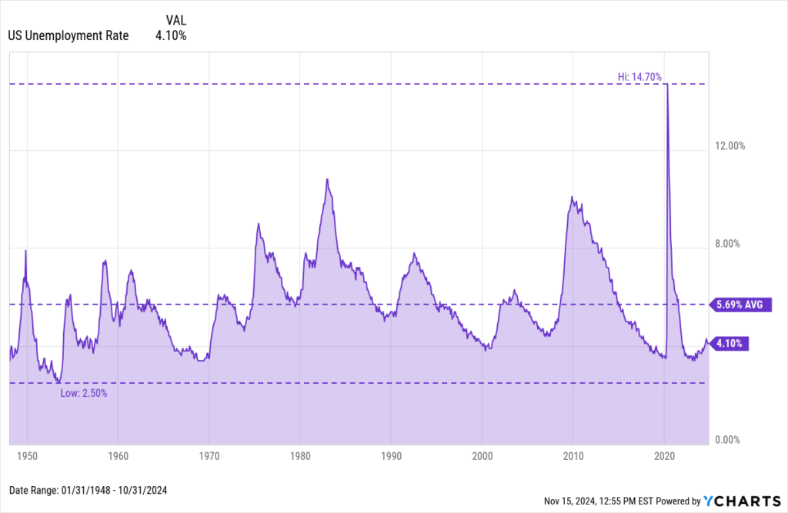

## Table of Contents

## What is the unemployment rate?

The unemployment rate is the percentage of people in the workforce who are not working but are looking for a job. It is an important number that helps us understand how well the economy is doing. When the unemployment rate is low, it usually means more people have jobs and the economy is doing well. When it is high, it means more people are out of work and the economy might be struggling.

Different countries have different unemployment rates. For example, in the United States, the unemployment rate changes from month to month. You can find the most recent rate by checking the latest reports from the government. In other countries, the rate might be higher or lower depending on their economic situation. It's good to keep an eye on these numbers to see how things are going in the job market.

## How is the unemployment rate calculated in the United States?

The unemployment rate in the United States is calculated by the Bureau of Labor Statistics (BLS). They do a big survey every month called the Current Population Survey (CPS). In this survey, they ask about 60,000 households if anyone in their home is working, looking for work, or not working at all. From these answers, they figure out how many people are in the labor force, which includes people who are working or actively looking for a job.

To find the unemployment rate, the BLS takes the number of people who are unemployed but looking for work and divides it by the total number of people in the labor force. Then, they multiply that number by 100 to get a percentage. For example, if 100 people are unemployed and looking for work out of a labor force of 1,000 people, the unemployment rate would be (100 / 1,000) * 100 = 10%. This rate is released to the public every month and helps people understand how the job market is doing.

## What are the sources of unemployment data in the U.S.?

The main source of unemployment data in the U.S. is the Bureau of Labor Statistics (BLS). They do a big survey every month called the Current Population Survey (CPS). They talk to about 60,000 households and ask them about their jobs. From this, they figure out how many people are working, looking for work, or not working at all. This helps them find out the unemployment rate, which is the percentage of people in the labor force who are not working but are looking for a job.

Another important source of unemployment data comes from state employment offices and unemployment insurance claims. When people lose their jobs, they can apply for unemployment benefits. The number of people filing these claims gives a good idea of how many people are out of work. This data is useful because it's reported weekly, so it can show changes in unemployment more quickly than the monthly CPS survey.

Both of these sources help give a full picture of unemployment in the U.S. The BLS data is more detailed and covers the whole country, while unemployment claims data can show quicker changes and is more local. Together, they help people understand how the job market is doing and how many people are out of work.

## Can you provide an overview of the U.S. unemployment rate trends over the past decade?

Over the past decade, the U.S. unemployment rate has seen some big ups and downs. At the start of the decade, in 2013, the unemployment rate was around 7.4%. It went down slowly over the next few years, hitting a low of 3.5% in February 2020. This low rate showed that the job market was doing really well, and lots of people had jobs. But then, in March 2020, the COVID-19 pandemic hit, and the unemployment rate shot up to 14.7% in April 2020. This was the highest it had been in a long time because many businesses had to close, and lots of people lost their jobs.

After the big spike in 2020, the unemployment rate started to go down again as businesses started to open back up and people went back to work. By the end of 2021, the rate was down to around 3.9%, and it kept getting better, reaching 3.4% in early 2023. This showed that the job market was recovering well from the pandemic. Over the last couple of years, the unemployment rate has stayed pretty low, usually between 3.4% and 4%. This means that most people who want jobs are able to find them, and the economy is doing well.

## What were the highest and lowest unemployment rates in the U.S. in the last 20 years?

In the last 20 years, the highest unemployment rate in the U.S. was 14.7% in April 2020. This happened because of the COVID-19 pandemic. Many businesses had to close, and a lot of people lost their jobs. It was a tough time for the economy, and many people were out of work and looking for jobs.

The lowest unemployment rate in the last 20 years was 3.4%, which happened in January 2023 and again in April 2023. This low rate showed that the job market was doing really well after the pandemic. It meant that most people who wanted jobs were able to find them, and the economy was strong.

These numbers help us see how the job market has changed over the years. The big jump during the pandemic and the recovery afterward show how events can affect unemployment rates. Keeping an eye on these rates helps us understand the health of the economy.

## How have major economic events affected unemployment rates in the U.S. over the years?

Major economic events have a big impact on unemployment rates in the U.S. For example, the Great Recession that started in 2007 caused the unemployment rate to go up a lot. It went from around 5% in 2007 to a high of 10% in October 2009. Many people lost their jobs because businesses were struggling and had to let people go. The housing market crashed, and banks were in trouble, which made it hard for the economy to recover quickly. It took several years for the unemployment rate to go back down to more normal levels.

Another big event was the COVID-19 pandemic in 2020. When the pandemic hit, businesses had to close to stop the spread of the virus, and the unemployment rate shot up to 14.7% in April 2020. This was the highest rate in a long time, and it showed how quickly things can change. The government and the Federal Reserve took action to help the economy recover, and by the end of 2021, the unemployment rate was down to around 3.9%. The quick recovery showed how important it is for the government to step in during tough times.

## What are the differences in unemployment rates among various demographic groups in the U.S.?

Unemployment rates in the U.S. can be different for different groups of people. For example, young people often have higher unemployment rates than older people. This is because young people might not have as much work experience and might still be in school or looking for their first job. Also, Black and Hispanic people usually have higher unemployment rates than White people. This can be because of things like less access to good education or facing discrimination when looking for jobs.

Men and women can also have different unemployment rates. Sometimes, men have higher unemployment rates, especially in jobs like construction or manufacturing that can go up and down with the economy. Other times, women might have higher unemployment rates, especially if they work in industries that are hit hard by economic changes. Education also makes a big difference. People with college degrees usually have lower unemployment rates than people without degrees because they have more skills and can get better jobs.

These differences show that unemployment is not the same for everyone. It depends on things like age, race, gender, and education. Understanding these differences can help the government and businesses make better plans to help more people find jobs and improve the economy.

## How do unemployment rates vary by state within the U.S.?

Unemployment rates can be very different from one state to another in the U.S. Some states have lower unemployment rates because they have strong economies and lots of jobs. For example, states like North Dakota and Utah often have low unemployment rates because they have industries like oil and gas or technology that are doing well. On the other hand, states like California and Nevada might have higher unemployment rates because their economies can be more up and down, especially in industries like tourism and entertainment.

These differences can also come from other things like how many people live in the state and what kinds of jobs are available. For example, big cities might have more job opportunities, but they can also have more competition for those jobs. Smaller states or rural areas might not have as many jobs, so people might have to move to find work. This can make the unemployment rate higher in those areas. Overall, the unemployment rate in each state shows a lot about the local economy and what kinds of jobs are available there.

## What seasonal patterns can be observed in U.S. unemployment rates?

Seasonal patterns in U.S. unemployment rates happen because of changes in the job market throughout the year. For example, in the summer, more people are looking for work because school is out and young people are trying to find summer jobs. Also, some industries like tourism and construction have more work in the summer, so they hire more people. This can make the unemployment rate go down a bit during the summer months.

On the other hand, in the winter, the unemployment rate can go up a little bit. This is because some businesses, like those in tourism or construction, might slow down because of the cold weather. Also, after the holiday season, some companies might not need as many workers, so they might let some people go. These seasonal changes show how the job market can be different at different times of the year.

## How do U.S. unemployment rates compare to those of other developed countries?

The U.S. unemployment rate often goes up and down, but it's usually in the middle when compared to other developed countries. For example, in recent years, countries like Germany and Japan have had lower unemployment rates than the U.S. This is because these countries have strong economies and good job markets. On the other hand, countries like Spain and France sometimes have higher unemployment rates than the U.S., especially among young people. This can be because of their economies being more up and down or having different rules about hiring and firing workers.

Even though the U.S. unemployment rate can be higher than some other developed countries, it's important to remember that each country is different. The U.S. has a big and varied economy with lots of different kinds of jobs. This means the unemployment rate can change a lot depending on what's happening in different parts of the country or in different industries. Also, the way unemployment is measured can be a bit different from one country to another, so it's good to look at the bigger picture when comparing unemployment rates around the world.

## What forecasting models are used to predict future unemployment rates in the U.S.?

To predict future unemployment rates in the U.S., economists use different kinds of forecasting models. One common model is called the ARIMA model, which stands for AutoRegressive Integrated Moving Average. This model looks at past unemployment rates to find patterns and then uses those patterns to guess what might happen next. Another model is the Vector Autoregression (VAR) model, which looks at how unemployment rates connect with other parts of the economy, like how much people are spending or how much businesses are making. By understanding these connections, the VAR model can make better guesses about future unemployment rates.

Besides these models, economists also use something called the Phillips Curve, which looks at how unemployment rates and inflation are related. If inflation is going up, it might mean that more people will have jobs, so unemployment will go down. But if inflation is going down, it might mean that fewer people will have jobs, and unemployment will go up. These models help economists and policymakers plan for the future and make decisions that can help keep the job market strong.

## How do changes in labor market policies influence unemployment trends in the U.S.?

Changes in labor market policies can have a big impact on unemployment trends in the U.S. For example, when the government makes it easier for businesses to hire and fire workers, it can lead to more jobs being created. This is because businesses might feel more confident about growing if they know they can adjust their workforce quickly. On the other hand, if the government makes rules that make it harder to let workers go, businesses might be more careful about hiring new people. This could mean fewer jobs and a higher unemployment rate.

Another way labor market policies can affect unemployment is through things like minimum wage laws and unemployment benefits. If the minimum wage goes up, it can help workers earn more money, but it might also make businesses think twice about hiring new people if they have to pay them more. Unemployment benefits can also play a role. If benefits are really good, some people might take longer to find a new job, which can keep the unemployment rate higher for a while. But if benefits are too low, people might have to take any job they can find, even if it's not a good fit, which can affect the overall health of the job market.

## What is the significance of understanding the unemployment rate?

The unemployment rate serves as a crucial economic metric, offering a snapshot of an economy's overall health. It quantifies the proportion of the labor force that is jobless yet available and actively seeking employment. This rate provides vital information for policymakers, economists, and investors, allowing them to gauge economic performance, adjust policies, and make informed decisions. 

The relevance of the unemployment rate stems from its ability to signal economic stability or distress. High unemployment may indicate economic downturns or structural issues within the labor market, whereas low unemployment is typically associated with economic vigor and growth. However, interpreting the unemployment rate requires a nuanced understanding, as it doesn't account for underemployment or individuals who have ceased looking for work (discouraged workers).

The U.S. Bureau of Labor Statistics (BLS) is responsible for calculating and reporting the unemployment rate each month. This calculation is derived from data obtained through the Current Population Survey (CPS), a monthly survey of approximately 60,000 households across the country. The process involves two primary components: the labor force and the unemployed population.

The labor force encompasses those aged 16 and older who are either employed or unemployed but actively seeking work. The unemployed population includes individuals without jobs who have actively looked for employment in the past four weeks. The unemployment rate ($U$) is formulated as the percentage of the unemployed population relative to the total labor force. Mathematically, it is expressed as:

$$
U = \left( \frac{\text{Number of Unemployed Individuals}}{\text{Labor Force}} \right) \times 100
$$

This formula enables the BLS to provide a standardized metric that allows for year-to-year and month-to-month comparisons, thus enabling a comprehensive analysis of economic trends. The monthly unemployment data's reliability heavily depends on the representativeness of the CPS sample and the precision of its responses. Additionally, the BLS employs seasonal adjustments to account for employment variations due to factors such as weather, holidays, and school cycles, ensuring a clearer picture of underlying employment trends. 

Understanding the unemployment rate requires an appreciation of these methodological nuances and the broader economic context. While it is a valuable indicator of labor market health, policymakers and analysts also examine other metrics, such as the labor force participation rate and the employment-to-population ratio, to gain a fuller understanding of employment conditions in the nation.

## References & Further Reading

[1]: [U.S. Bureau of Labor Statistics](https://www.bls.gov/), the primary source for data on the U.S. labor force and unemployment statistics.

[2]: Bernanke, B. S. (2015). ["The Courage to Act: A Memoir of a Crisis and its Aftermath"](https://www.jstor.org/stable/43999696), W.W. Norton & Company.

[3]: Stiglitz, J. E. (2013). ["The Price of Inequality: How Today's Divided Society Endangers Our Future"](https://academiccommons.columbia.edu/doi/10.7916/d8-96ed-6058), W.W. Norton & Company.

[4]: ["Advances in Financial Machine Learning"](https://www.wiley.com/en-us/Advances+in+Financial+Machine+Learning-p-9781119482086) by Marcos Lopez de Prado, discussing the use of machine learning in trading strategies.

[5]: ["Quantitative Trading: How to Build Your Own Algorithmic Trading Business"](https://www.amazon.com/Quantitative-Trading-Build-Algorithmic-Business/dp/1119800064) by Ernest P. Chan, a resource on algorithmic trading business approaches.

[6]: Acemoglu, D., & Restrepo, P. (2019). ["Automation and New Tasks: How Technology Displaces and Reinstates Labor"](https://www.aeaweb.org/articles?id=10.1257/jep.33.2.3), Journal of Economic Perspectives, 33(2), 3-30.

[7]: Baker, D., & Rosnick, D. (2019). ["Recession Ready: Fiscal Policies to Stabilize the American Economy"](https://www.semanticscholar.org/paper/Stimulus-and-Fiscal-Consolidation%3A-The-Evidence-and-Baker-Rosnick/23135d425c6f0fde9430b704a61c41b8e668ca4c), Center for Economic and Policy Research.

[8]: ["The Second Machine Age: Work, Progress, and Prosperity in a Time of Brilliant Technologies"](https://psycnet.apa.org/record/2014-07087-000) by Erik Brynjolfsson and Andrew McAfee.