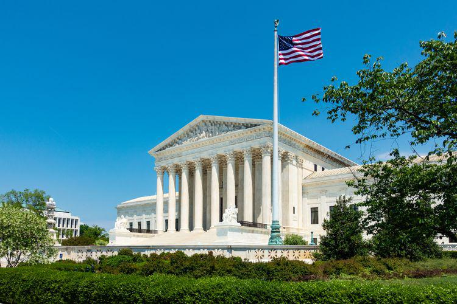

Antitrust laws play a crucial role in maintaining competitive markets in the United States by preventing monopolistic practices and fostering an environment where innovation and fair competition can thrive. These laws, established over a century ago, aim to protect consumers and ensure a dynamic marketplace across various sectors. Among the many significant legal battles that have shaped the understanding and application of antitrust regulations, the landmark case of United States v. South-Eastern Underwriters Association stands out as a pivotal moment in the regulation of the insurance industry. 

Decided in 1944 by the United States Supreme Court, this case significantly altered the landscape of antitrust regulation within the insurance sector. Prior to this ruling, the prevailing view was that insurance transactions, being intrastate in nature, weren't subject to federal antitrust laws. However, the Supreme Court's decision classified the business of insurance as interstate commerce, thereby bringing it under the purview of federal antitrust regulations through the Commerce Clause.

This article examines the intersection of antitrust laws and the South-Eastern Underwriters Association case, highlighting its implications for the insurance industry. It provides a comprehensive understanding of how this decision challenged existing norms and influenced further legislative developments, such as the McCarran-Ferguson Act of 1945, which reasserted state regulation over insurance.

In addition to examining the historical context and its impacts, we will also discuss the contemporary relevance of antitrust principles in emerging sectors, particularly focusing on algorithmic trading—a significant modern economic development. Algorithmic trading has transformed financial markets, introducing new complexities and challenges for maintaining competitive practices. This article will explore how antitrust laws adapt to these changes, ensuring the continued protection of market integrity and fairness in an increasingly digital economy.

## Table of Contents

## Understanding Antitrust Laws in the United States

Antitrust laws in the United States have a fundamental role in curtailing monopolistic practices and fostering competition. Enacted with the primary intent to safeguard the competitive landscape of the economy, these laws find their roots in the late 19th century amidst growing corporate monopolies that threatened market fairness and consumer welfare.

The Sherman Antitrust Act of 1890 is among the earliest and most pivotal pieces of legislation in this domain. It serves as the cornerstone of antitrust policy, aiming to prohibit business activities deemed to be anti-competitive. The Act outlaws monopolistic behavior and conspiracies that restrain trade or commerce across the states or with foreign nations. It articulates clear restrictions against any entity that seeks to monopolize, or attempts to conspire towards monopolization, thereby ensuring that open competition prevails.

Antitrust laws permeate myriad sectors, including the insurance and trading industries. These laws are crucial for preventing dominance by single entities and ensuring that markets operate efficiently with a healthy degree of competition. In particular, the insurance sector has often been under scrutiny for practices that could limit competitive dynamics. Similarly, the trading industry, especially with modern evolutions like [algorithmic trading](/wiki/algorithmic-trading), is monitored to prevent collusion and market manipulation.

As markets evolve and become increasingly complex, regulations continue to adapt in response. With advancements in technology, globalization, and the emergence of novel business models, new challenges and competitive threats arise. Consequently, regulatory bodies consistently review and revise antitrust guidelines to effectively address these developments. The need for robust oversight is crucial to maintain economic equilibrium and protect consumer interests.

Over the years, antitrust laws have also been a subject of legal and academic discourse, evaluating their effectiveness and adaptability in an ever-changing economic environment. The dynamic nature of industries necessitates a coherent and evolving legal framework to anticipate and curtail anti-competitive practices effectively. The interplay between regulation and market innovation underscores the continuous effort to balance fair competition with business freedom, ensuring that economies operate in a manner beneficial to all stakeholders involved.

## The South-Eastern Underwriters Association Case

In 1944, the Supreme Court issued a landmark ruling in the case of United States v. South-Eastern Underwriters Association, fundamentally altering the legal landscape of the insurance industry. Prior to this case, the insurance business had been largely regarded as intrastate commerce, thereby exempt from federal antitrust laws under the Commerce Clause. The prevailing legal view, influenced by the 1869 decision in Paul v. Virginia, held that insurance transactions were local incidents governed by state law, rather than interstate commerce subject to federal regulation.

The South-Eastern Underwriters Association (SEUA), a group of nearly 200 fire insurance companies, was accused of price-fixing and monopolistic practices. The antitrust case was initiated by the U.S. Department of Justice under the Sherman Antitrust Act, which aimed to prevent business practices that reduced competition. The crux of the government's argument was that SEUA's activities affected multiple states, challenging the notion that insurance was strictly a local affair.

In its decision, the Supreme Court overturned the long-standing Paul v. Virginia precedent. The Court ruled that insurance companies conducting significant business across state lines were engaging in interstate commerce. This classification meant that federal antitrust laws, particularly provisions under the Commerce Clause, indeed applied to the insurance industry. The majority opinion, delivered by Justice Hugo Black, emphasized that the substantial interstate nature of the insurance business warranted federal oversight to ensure fair competition and prevent monopolistic control.

The implications of this ruling were profound. It subjected the insurance industry to federal antitrust scrutiny, aligning it with other interstate businesses and reinforcing the federal government’s authority to regulate commerce across state boundaries. However, the decision also triggered significant backlash from the insurance sector and state regulators, leading to the passage of the McCarran-Ferguson Act in 1945, which largely returned the authority to regulate insurance back to the states, except where Congress explicitly provided otherwise.

Thus, the South-Eastern Underwriters Association case stands as a pivotal moment in antitrust history, reshaping legal interpretations of commerce and regulation within the insurance industry, and setting the stage for subsequent legislative responses that continue to influence regulatory practices today.

## Impact on the Insurance Industry

In 1944, the United States Supreme Court's decision in the South-Eastern Underwriters Association case extended federal oversight over the insurance industry by classifying it as interstate commerce and therefore subject to federal antitrust regulations. This landmark ruling fundamentally altered the operational landscape for insurance companies, which had traditionally been regulated at the state level. The Court's interpretation effectively brought insurance under the purview of federal competition laws, indicating a shift towards increased federal engagement in what was previously considered a state-regulated domain.

The subsequent legislative response, the McCarran-Ferguson Act of 1945, reversed much of this decision. It granted states the authority to regulate the insurance industry largely free from federal intervention, albeit with notable exceptions. The Act stated that federal antitrust laws would only apply to insurance to the extent that state law does not regulate such matters. This legislative move was driven by concerns that federal oversight could disrupt established state regulatory frameworks and diminish the autonomy states had long exercised over insurance practices.

Despite the McCarran-Ferguson Act's broad exemptions, the federal government has intermittently exerted influence over the insurance sector. Occasional federal interventions continued to shape both modern regulatory practices and antitrust perceptions within the industry. For instance, certain federal legislation has addressed specific antitrust concerns, particularly when state regulations were deemed insufficient to prevent monopolistic practices or market distortions. The Federal Insurance Office (FIO), established under the Dodd-Frank Wall Street Reform and Consumer Protection Act, exemplifies such federal involvement, providing the federal government with a more direct role in monitoring the industry for systemic risks.

Modern practices in the insurance industry reflect a complex interplay of state and federal oversight. While the McCarran-Ferguson Act empowers states as primary regulators, federal interests in market competition and consumer protection maintain a foundational presence. The ongoing balance between state autonomy and federal interests continues to influence the industry's regulatory environment, presenting challenges and adaptations in response to evolving market dynamics and legal interpretations. This delicate balance underscores the insurance sector's unique regulatory landscape, shaped by historical judicial and legislative milestones.

## Algorithmic Trading and Antitrust

Algorithmic trading has significantly transformed financial markets by replacing human decision-making with sophisticated algorithms capable of executing trades at high speed and [volume](/wiki/volume-trading-strategy). This technological evolution has introduced a new layer of complexity to market dynamics, raising important considerations within the antitrust framework.

Antitrust laws aim to prevent anti-competitive practices and ensure fair competition, a goal that becomes intricate with the advent of algorithmic trading. The primary concern is the potential for market manipulation, where algorithms could be programmed to engage in predatory pricing, collusion, or other anti-competitive behaviors. For example, algorithms might be designed to execute spoofing strategies—placing large orders with the intent to cancel them before execution to create false market signals and manipulate asset prices.

These activities challenge traditional antitrust oversight, which was not initially designed to address the digital and algorithmic complexities of modern trading practices. The ability of algorithms to make decisions in microseconds allows for market manipulation that is faster and potentially more opaque than human traders could execute, complicating detection and regulation.

Regulatory bodies, such as the U.S. Securities and Exchange Commission (SEC) and the Commodity Futures Trading Commission (CFTC), now closely scrutinize algorithmic trading behaviors under antitrust guidelines. These agencies aim to identify algorithm-driven collusion or monopolistic behaviors that could harm market integrity and competition.

Effective enforcement requires advanced monitoring tools capable of identifying problematic patterns. Technologies like [machine learning](/wiki/machine-learning) and data analytics have become essential in this context. They can process vast amounts of trading data to detect anomalies suggestive of anti-competitive practices. For instance, algorithms that consistently predominate over particular trades or those with suspiciously synchronized trading patterns might warrant regulatory investigation.

Moreover, algorithmic trading intersects with antitrust laws by potentially altering market entry barriers. While these technologies can democratize trading access by replacing costly trading floors with digital platforms, they might also consolidate market power among entities that can afford the most advanced algorithms, leading to reduced competition.

To mitigate these risks, regulators have proposed rules that require greater transparency in algorithmic operations and robust disclosure of trading strategies. These measures aim to provide a clearer view of algorithm-driven activities and ensure they align with competitive market principles.

In essence, while algorithmic trading offers efficiency and innovation to financial markets, it also necessitates a reevaluation of existing antitrust frameworks to address the unique challenges it presents. This ongoing evolution underscores the need for dynamic regulation that balances technological advances with the foundational goals of antitrust policy: maintaining market fairness and preventing manipulation.

## Recent Developments and Future Outlook

The Competitive Health Insurance Reform Act of 2020 marked a significant revisitation of antitrust regulation, focusing on the health insurance sector. This legislative move is indicative of the ongoing efforts to ensure competitive practices by removing the antitrust exemption that health insurers previously enjoyed under the McCarran-Ferguson Act. The removal reflects a broader legislative intent to enhance consumer protection and promote competition by applying federal antitrust laws to the business of health insurance. This shift is a testament to the regulatory authorities' acknowledgment of the evolving state of the insurance landscape and the necessity to adapt legal frameworks accordingly.

Technology and market innovations are pivotal forces continuously reshaping the antitrust landscape. The integration of advanced data analytics and [artificial intelligence](/wiki/ai-artificial-intelligence) (AI) in market operations provides opportunities for enhanced efficiencies and cost reductions; however, it also presents challenges in the form of potential anti-competitive behaviors. The ability of firms to leverage technology to gather and analyze consumer data can lead to market power imbalances, which regulatory bodies must carefully monitor and address. Consequently, the role of technology in market dynamics necessitates ongoing adjustments to antitrust policies to mitigate risks associated with unfair competitive practices.

The advancement of new financial technologies, often referred to as fintech, introduces complexities that regulators must prioritize to ensure markets remain fair and competitive. Technologies such as blockchain, [cryptocurrency](/wiki/cryptocurrency), and decentralized finance offer novel benefits but [carry](/wiki/carry-trading) risks of market manipulation and monopolistic conduct. These developments underscore the critical need for regulators to remain vigilant, foreseeing and addressing potential impacts on market competition. Strategies may include deploying advanced algorithmic tools for market surveillance, enhancing cross-border regulatory cooperation to manage global fintech impacts, and fostering a deeper understanding of technological implications in financial markets.

Ultimately, these recent developments and the anticipation of future shifts highlight the imperative for regulatory frameworks to be flexible and responsive. As technological advancements accelerate and market conditions evolve, the continuous refinement of antitrust laws will be essential. This adaptability ensures the dual objectives of fostering innovation and protecting competitive market functions are met, securing economic stability and consumer trust in an increasingly digital and interconnected economic environment.

## Conclusion

Antitrust laws serve as a crucial pillar of U.S. economic policy, extending their influence from traditional sectors like insurance to the more intricate dynamics of algorithmic trading. The landmark decision in the United States v. South-Eastern Underwriters Association case remains instructive, illustrating the significance of aligning regulatory frameworks with competitive principles. This case highlighted the necessity for federal oversight in what was deemed interstate commerce, setting a precedent that continues to reverberate through modern antitrust considerations.

The rapid evolution of financial markets, characterized by innovations such as algorithmic trading, necessitates adaptive regulatory strategies. These innovations, while beneficial, introduce complexities that challenge existing antitrust frameworks, emphasizing the need for legislation capable of mitigating risks like market manipulation while fostering a fair competitive landscape. Notably, the shift in technology and market practices requires continuous reassessment of legal structures to ensure they remain effective and relevant.

As markets continue their technological advancement, the frameworks governing them must also evolve, requiring a dynamic approach to both regulation and legislative development. Antitrust laws, therefore, must not only address existing market conditions but must also anticipate future challenges and opportunities presented by ongoing innovation. This underscores the importance of balancing regulation with competition to maintain healthy market environments, assuring economic stakeholders of a stable and equitable platform for growth.

## References & Further Reading

[1]: Posner, R. A. (2001). ["Antitrust Law, Second Edition"](https://press.uchicago.edu/ucp/books/book/chicago/A/bo3628468.html) by Richard A. Posner

[2]: ["The McCarran-Ferguson Act and Antitrust Immunity: A Call for Legislative Reform"](https://en.wikipedia.org/wiki/McCarran%E2%80%93Ferguson_Act) The Yale Law Journal

[3]: United States v. South-Eastern Underwriters Assn., 322 U.S. 533 (1944). Full text available at: [Cornell Law School's Legal Information Institute](https://supreme.justia.com/cases/federal/us/322/533/)

[4]: ["Antitrust Law and Economics"](https://www.e-elgar.com/shop/gbp/antitrust-law-and-economics-9781847207319.html) by Robert Bork

[5]: Erenburg, G. & Lasser, D. O. (2009). ["Electronic Trading, Algorithmic Trading and the Future of Financial Markets"](https://www.semanticscholar.org/paper/Electronic-Limit-Order-Book-and-Order-Submission-Erenburg-Lasser/9cafe2b5068514d4df7307148b4fae0d6336020d) in Advances in Financial Economics, Volume 13.

[6]: Gillespie, S. A. (2018). ["Regulatory Reactions to Algorithmic Trading and its Implications for the Global Financial Markets"](https://projects.iq.harvard.edu/files/financialregulation/files/algorithmic_trading_case_study.pdf)

[7]: Fox, J. (2020). ["The Myth of the Rational Market: A History of Risk, Reward, and Delusion on Wall Street"](https://archive.org/details/mythofrationalma0000foxj) by Justin Fox