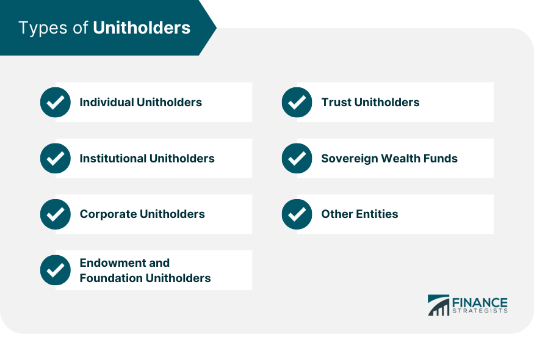

## Table of Contents

## What is a unitholder?

A unitholder is a person or entity that owns units in a unit trust or a similar investment vehicle. Unit trusts are a type of investment fund where money from many investors is pooled together and managed by a professional fund manager. The fund manager invests this money in various assets like stocks, bonds, or real estate, aiming to grow the value of the fund over time. The units represent a share of the total value of the fund, and the number of units a unitholder owns determines their portion of the fund's assets.

Unitholders receive income from the fund in the form of distributions, which are typically paid out regularly, such as quarterly or annually. These distributions come from the income generated by the fund's investments, like dividends from stocks or interest from bonds. Unitholders can also benefit from capital gains if the value of their units increases over time. They can usually buy or sell their units at any time, although the price they receive will depend on the current value of the fund's assets.

## How does one become a unitholder?

To become a unitholder, you need to buy units in a unit trust. You can do this by going through a financial institution like a bank or an investment company that offers unit trusts. They will have different funds you can choose from, each with its own investment strategy and goals. You decide how much money you want to invest, and the institution will use that money to buy units in the fund you choose. The number of units you get depends on the price of the units at the time you buy them.

Once you have bought the units, you become a unitholder in that fund. This means you own a part of the fund and are entitled to a share of any income it makes, which is usually paid out as distributions. You can also sell your units if you want to get your money back, but the amount you get will depend on the current value of the units. Being a unitholder lets you invest in a variety of assets without having to manage them yourself, as the fund manager takes care of that for you.

## What are the basic rights of a unitholder?

As a unitholder, you have the right to receive income from the fund. This income comes from the money the fund makes from its investments, like dividends from stocks or interest from bonds. The fund pays this income to you as distributions, usually on a regular schedule like every three months or once a year. The amount you get depends on how many units you own and how well the fund is doing.

You also have the right to know how the fund is doing. The fund manager has to give you regular reports that tell you about the fund's performance, what it's invested in, and any big changes. This helps you keep track of your investment. If you decide you want your money back, you can sell your units. The price you get will depend on what the units are worth at that time.

## How are unitholders taxed on their investments?

When you are a unitholder, you need to pay taxes on the money you get from the fund. This money is called distributions, and it comes from the income the fund makes, like dividends from stocks or interest from bonds. The tax you pay on these distributions depends on the type of income the fund made. For example, if the fund made money from dividends, you might pay a different tax rate than if it made money from interest. You have to report these distributions on your tax return and pay the tax that goes with them.

You might also have to pay taxes if you sell your units and make a profit. This profit is called a capital gain. If you sell your units for more than you paid for them, you have to pay tax on the difference. The tax rate for capital gains can be different from the tax rate for the distributions you get from the fund. It's a good idea to talk to a tax professional to understand exactly how much tax you need to pay and how to report it on your tax return.

## What is the difference between a unitholder and a shareholder?

A unitholder owns units in a unit trust, which is a type of investment fund where money from many people is pooled together and managed by a professional. The units represent a share of the total value of the fund, and unitholders get income from the fund in the form of distributions. These distributions come from the income the fund makes, like dividends from stocks or interest from bonds. Unitholders can buy or sell their units at any time, but the price they get depends on the current value of the fund's assets.

A shareholder, on the other hand, owns shares in a company. Shares represent a piece of ownership in the company, and shareholders can get money from the company in the form of dividends. Shareholders also have the right to vote on important company decisions, like who should be on the board of directors. Unlike unitholders, shareholders can influence how the company is run. Both unitholders and shareholders can make money from their investments, but they do it in different ways and have different rights.

## Can unitholders receive dividends, and how are these taxed?

Unitholders can receive dividends, but they are usually called distributions. These distributions come from the income the unit trust makes, like dividends from stocks or interest from bonds. The amount of distributions unitholders get depends on how many units they own and how well the fund is doing. 

When unitholders get these distributions, they have to pay taxes on them. The tax they pay depends on what kind of income the fund made. For example, if the fund made money from dividends, the tax rate might be different than if it made money from interest. Unitholders need to report these distributions on their tax return and pay the right amount of tax. It's a good idea to talk to a tax professional to make sure they do this correctly.

## What are the tax implications of selling units for a unitholder?

When a unitholder sells their units, they might have to pay tax on any profit they make. This profit is called a capital gain. If the unitholder sells their units for more money than they paid for them, they have to pay tax on the difference. The tax rate for capital gains can be different from the tax rate for the distributions they get from the fund. It's important for unitholders to keep track of how much they paid for their units and how much they sold them for, so they can figure out if they made a profit and how much tax they owe.

If a unitholder sells their units for less money than they paid for them, they might be able to claim a capital loss. This loss can sometimes be used to reduce the amount of tax they have to pay on other income or gains. However, the rules for using capital losses can be complicated, so it's a good idea for unitholders to talk to a tax professional to understand how to report these losses on their tax return and how they can help lower their tax bill.

## How do unitholders report their income and capital gains on tax returns?

Unitholders need to report the money they get from their units on their tax return. This money, called distributions, comes from the income the fund makes, like dividends from stocks or interest from bonds. They have to add up all the distributions they got during the year and report them on their tax return. The tax they pay on these distributions depends on what kind of income the fund made. For example, if the fund made money from dividends, the tax rate might be different than if it made money from interest. Unitholders should keep track of their distributions and talk to a tax professional to make sure they report them correctly and pay the right amount of tax.

If unitholders sell their units and make a profit, they also have to report this on their tax return. This profit is called a capital gain. They need to figure out how much they paid for their units and how much they sold them for, then report the difference as a capital gain. The tax rate for capital gains can be different from the tax rate for distributions. If they sell their units for less than they paid for them, they might be able to claim a capital loss. This loss can sometimes help lower the tax they have to pay on other income or gains. It's a good idea for unitholders to keep good records and talk to a tax professional to make sure they report their capital gains and losses correctly on their tax return.

## What are some common types of investment vehicles that have unitholders?

Unit trusts are a common type of investment vehicle that have unitholders. A unit trust is a fund where money from many people is put together and managed by a professional. The money is invested in things like stocks, bonds, or real estate. People who invest in the unit trust get units, which are like pieces of the fund. The more units someone owns, the bigger their share of the fund is. Unit trusts are popular because they let people invest in a lot of different things without having to manage them themselves.

Another type of investment vehicle with unitholders is a real estate investment trust (REIT). A REIT is a company that owns or finances real estate that produces income. People who invest in a REIT get units, and they get money from the income the real estate makes, like rent from tenants. REITs are a way for people to invest in real estate without having to buy property themselves. Both unit trusts and REITs give unitholders a way to earn money from their investments, but they do it in different ways.

## How do tax laws affect unitholders in different countries?

Tax laws for unitholders can be different in every country. In some places, unitholders have to pay taxes on the money they get from their units, called distributions. These distributions come from the income the fund makes, like dividends from stocks or interest from bonds. The tax rate can change depending on what kind of income the fund made. For example, in the United States, unitholders might pay different taxes on dividends than on interest. It's important for unitholders to know the tax rules in their country so they can report their income correctly and pay the right amount of tax.

If unitholders sell their units and make a profit, they might also have to pay taxes on that profit, called a capital gain. The tax rate for capital gains can be different from the tax rate for distributions. In some countries, like Canada, unitholders might get a tax break if they hold their units for a long time before selling them. If unitholders sell their units for less than they paid for them, they might be able to claim a loss, which can sometimes help lower their taxes. Because tax laws can be complicated and different in each country, it's a good idea for unitholders to talk to a tax professional to understand how to report their income and gains correctly.

## What are the advanced tax strategies unitholders can use to minimize their tax liability?

Unitholders can use a few smart tax strategies to lower the amount of tax they have to pay. One way is to hold onto their units for a long time before selling them. In some countries, like the United States and Canada, if unitholders keep their units for more than a year, they might pay a lower tax rate on any profit they make when they sell them. This is called a long-term capital gain. By waiting to sell, unitholders can save money on taxes. Another strategy is to use any losses they have to their advantage. If unitholders sell their units for less than they paid for them, they can claim a capital loss. They can use this loss to lower the taxes they have to pay on other income or gains. It's like getting a tax break for losing money.

Another advanced strategy is to invest in tax-efficient funds. Some unit trusts are set up to minimize the taxes unitholders have to pay. For example, they might invest in things that don't make a lot of taxable income, like stocks that don't pay dividends. This can help unitholders keep more of their money. Unitholders can also use tax-deferred accounts, like retirement accounts, to invest in unit trusts. Money in these accounts grows without being taxed right away, which can help unitholders save on taxes over time. It's a good idea for unitholders to talk to a tax professional to learn about these strategies and see which ones might work best for them.

## Can you provide real-world examples of unitholders and their tax situations?

Sarah lives in the United States and invests in a unit trust that focuses on stocks. She gets distributions from the fund every quarter, which come from the dividends the stocks pay. Sarah has to report these distributions on her tax return and pay taxes on them. The tax rate she pays depends on whether the dividends are qualified or not. If they are qualified dividends, she pays a lower tax rate. Last year, Sarah sold some of her units for more than she paid for them, so she had to report a capital gain on her tax return. She held the units for more than a year, so she paid a lower long-term capital gains tax rate. Sarah talks to her tax advisor every year to make sure she's reporting everything correctly and taking advantage of any tax breaks she can.

John lives in Canada and invests in a real estate investment trust (REIT). He gets distributions from the REIT, which come from the rent the properties make. John has to report these distributions on his tax return and pay taxes on them. The tax rate he pays depends on whether the distributions are considered income or capital gains. Last year, John sold some of his units at a loss, so he was able to claim a capital loss on his tax return. He used this loss to lower the taxes he had to pay on other income. John also uses a tax-deferred retirement account to invest in unit trusts, which helps him save on taxes over time. He meets with his tax advisor to make sure he's using the best strategies to minimize his tax liability.

## References & Further Reading

[1]: Bergstra, J., Bardenet, R., Bengio, Y., & Kégl, B. (2011). ["Algorithms for Hyper-Parameter Optimization."](https://dl.acm.org/doi/10.5555/2986459.2986743) Advances in Neural Information Processing Systems 24.

[2]: ["Advances in Financial Machine Learning"](https://www.amazon.com/Advances-Financial-Machine-Learning-Marcos/dp/1119482089) by Marcos Lopez de Prado

[3]: ["Evidence-Based Technical Analysis: Applying the Scientific Method and Statistical Inference to Trading Signals"](https://www.amazon.com/Evidence-Based-Technical-Analysis-Scientific-Statistical/dp/0470008741) by David Aronson

[4]: ["Machine Learning for Algorithmic Trading"](https://github.com/stefan-jansen/machine-learning-for-trading) by Stefan Jansen

[5]: ["Quantitative Trading: How to Build Your Own Algorithmic Trading Business"](https://github.com/LucindaYa/quant-resources/blob/master/Quantitative%20Trading%20How%20to%20Build%20Your%20Own%20Algorithmic%20Trading%20Business.pdf) by Ernest P. Chan