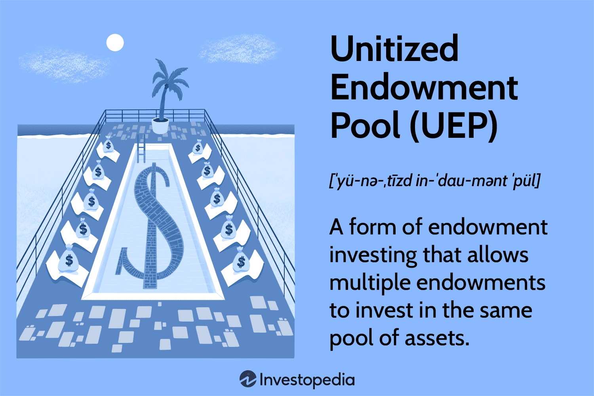

The financial management of endowment funds is crucial for maintaining the ongoing missions of non-profit organizations and educational institutions. These endowments serve as a financial backbone, providing stable funding that supports various initiatives, scholarships, research projects, and operational needs. The strategic management of these funds can greatly influence an institution's ability to achieve long-term objectives.

Unitized Endowment Pools (UEPs) are vital in maximizing the investment strategies of these endowments. UEPs allow multiple endowments to pool their resources, which can lead to more effective asset diversification, access to a broader range of investment opportunities, and reduced administrative costs. This collaborative approach enables endowments to participate in investments they may not have been able to access individually, tweaking both performance and resilience against market fluctuations.



The integration of algorithmic trading into the management of UEPs presents an exciting opportunity to enhance returns while managing inherent risks. Algorithmic trading involves the use of computer algorithms to execute trading strategies at speeds and efficiencies beyond human capabilities, optimizing the timing, price, and efficiency of trades. This can lead to improved liquidity, risk management, and performance of endowment portfolios when properly implemented.

This article explores the dimensions of UEP financial management, illuminates the importance of sound endowment investment strategies, and discusses the burgeoning impact of algorithmic trading on traditional fund management practices. These topics underline the importance of continuous innovation in financial management strategies to ensure the sustainability and growth of endowment funds.

## Table of Contents

## Understanding Unitized Endowment Pools

A Unitized Endowment Pool (UEP) is a consolidated investment vehicle designed to manage the collective assets of several individual endowments. By pooling resources, endowments can capitalize on economies of scale, allowing for more efficient management and potentially greater investment returns. The primary purpose of a UEP in investment management is to facilitate a streamlined process where multiple endowments can benefit from shared investment strategies, reduced costs, and enhanced asset diversification.

The structure of a UEP involves creating a shared investment fund where each endowment owns a specific number of units within the pool. These units represent a proportional share of the pool's total assets. Each participating endowment benefits proportionally to the number of units it holds, ensuring that returns, gains, or losses are distributed equitably according to the size of their investment in the pool.

By merging assets into a UEP, multiple endowments enjoy significant advantages. One major benefit is asset diversification. A pooled fund can invest in a broader range of assets, including equities, bonds, real estate, and alternative investments like hedge funds or private equity, far more effectively than individual endowments with smaller portfolios. This diversification reduces risk by mitigating the impact of poor performance in any single asset class. Moreover, UEPs enable access to investment opportunities and assets that might be unavailable to smaller, standalone endowments due to minimum investment thresholds.

Furthermore, UEPs offer reduced administrative costs. The shared management structure means overhead costs associated with investment management—such as hiring skilled investment professionals, conducting research, and maintaining administrative infrastructure—are spread across all participating endowments. This collective approach not only minimizes individual costs but also ensures robust professional management and due diligence practices are in place.

In summary, unitized endowment pools optimize investment management by providing structural and financial advantages, supporting the growth and sustainability of various endowments. Through shared risk, enhanced diversification, and economies of scale, UEPs enable endowments to maximize their investment potentials while managing operational costs effectively.

## Financial Management of UEPs

Unitized Endowment Pools (UEPs) form a crucial element in the financial management strategies of educational and non-profit endowments. These pools create a governance and management structure that centralizes the control of varied endowment funds, thereby facilitating a cohesive investment strategy aligned with the fund's long-term financial goals. 

Governance structures in UEPs typically involve oversight from a board or committee responsible for making high-level decisions. These entities set broad investment parameters and fiduciary responsibilities, ensuring funds are managed prudently. The specific structure and governance practices can vary depending on the institution's size and the complexity of its endowment. Effective governance ensures that the endowment's financial goals align with its missions, fostering sustainable growth and financial health.

A UEP enables endowments to pool their resources, allowing for a more significant investment scale and access to a diverse array of asset classes. This pooled approach reduces risk through diversification, as individual endowments can benefit from investments in a broader range of assets than they might be able to afford independently. By achieving economies of scale, UEPs often manage to lower administrative costs, thereby increasing the relative returns to the endowment participants.

Investment Policy Statements (IPS) are paramount in UEP financial management. An IPS outlines the investment objectives, risk tolerance, time horizon, and asset allocation strategies for the pool. It serves as a guiding document for fund managers and governing bodies, ensuring that all investment decisions align with the long-term goals of the endowment. The IPS is crucial for maintaining a disciplined approach to investing, particularly during volatile market conditions. It sets down explicit risk management protocols and procedures, which aid in monitoring performance metrics and making informed adjustments to the investment strategy as necessary.

Here is an example of what fundamental elements an IPS might include in a UEP context:
```json
{
    "Investment Objectives": "Achieve a real return of 5% over inflation.",
    "Risk Tolerance": "Moderate, with a maximum equity allocation of 60%.",
    "Time Horizon": "Long-term, with a minimum of a 10-year outlook.",
    "Asset Allocation": ["Equities 50%", "Fixed Income 30%", "Alternative Investments 20%"],
    "Rebalancing Policy": "Quarterly review and adjustment if allocations deviate by more than 5% from targets."
}
```
Investment policy statements are reviewed periodically to ensure they remain aligned with the institution's evolving objectives and external economic conditions. This continuous assessment is vital for adapting to new opportunities and challenges that arise over time.

Overall, effective financial management of UEPs through structured governance, cohesive investment strategies, and robust investment policy statements is fundamental for ensuring the sustainable growth and stability of endowment funds.

## Endowment Investment Strategies

Endowment investment strategies within Unitized Endowment Pools (UEPs) are essential for achieving sustainable growth and fulfilling the financial objectives of non-profit organizations and educational institutions. These strategies encompass a variety of approaches, including asset allocation, diversification, and management styles, which together help balance risk and return to optimize endowment fund performance.

**Asset Allocation and Diversification**

Asset allocation is the process of distributing investments among different asset classes, such as equities, fixed income, and alternative investments. This allocation is pivotal in managing risk and optimizing returns over the long term. Diversification, a subset of asset allocation, involves spreading investments across various sectors, geographies, and asset types to minimize unsystematic risk. The principle behind diversification is to reduce the portfolio's [volatility](/wiki/volatility-trading-strategies) and enhance risk-adjusted returns. In practice, diversification can help protect UEPs from market downturns and exploit opportunities in different economic environments.

Mathematically, diversification's benefits can be understood through the correlation coefficient ($\rho$). The formula to calculate the portfolio variance ($\sigma^2_p$) of two assets is:

$$
\sigma^2_p = w_1^2 \sigma_1^2 + w_2^2 \sigma_2^2 + 2w_1w_2\rho\sigma_1\sigma_2
$$

where $w_1$ and $w_2$ are the weights of the two assets, and $\sigma_1$ and $\sigma_2$ are their respective standard deviations. A low correlation between asset returns ($\rho$) implies a more diversified and potentially less risky portfolio.

**Active vs. Passive Management**

The debate between active and passive management is central to UEP strategies. Active management involves employing portfolio managers to select securities and make investment decisions with the goal of outperforming market indices. This approach can benefit from skilled managers’ insights, adaptable strategies, and timely responses to market changes. However, active management often incurs higher costs due to management fees and transactional expenses.

Conversely, passive management aims to replicate market indices or benchmarks, typically through index funds or exchange-traded funds (ETFs). This strategy focuses on minimizing costs, providing broad market exposure, and offering consistent performance relative to market benchmarks. While passive management may not offer the potential for significant excess returns, its cost-efficiency and transparency are advantageous for many UEPs.

The choice between these management styles often depends on the endowment’s objectives, risk tolerance, and views on market efficiency. UEPs may adopt a hybrid approach, incorporating both active and passive investments to achieve a balance between potential outperformance and cost-effectiveness.

**Rebalancing and Investment Manager Selection**

Rebalancing is a critical aspect of maintaining the desired asset allocation within a UEP. It involves periodically adjusting the portfolio to realign with predefined target allocations. Rebalancing ensures that the endowment does not become overexposed to certain asset classes due to market fluctuations, thus preserving the intended risk-return profile.

The impact of selecting skilled investment managers on UEP success cannot be overstated. Competent managers can navigate complex market conditions, identify opportunities, and manage risks effectively. They bring expertise in specific asset classes and investment strategies, which is invaluable for achieving optimal performance. The selection process typically involves assessing managers’ track records, investment philosophies, and alignment with UEP goals.

Overall, a coherent investment strategy combining appropriate asset allocation, diversification, management style, disciplined rebalancing, and skilled manager selection can significantly influence the long-term success of UEPs. By carefully navigating these aspects, UEPs can achieve their financial objectives while supporting the missions of their respective institutions.

## Algorithmic Trading in Endowment Investment

## Algorithmic Trading in Endowment Investment

Algorithmic trading refers to the use of computer algorithms to automate the process of buying and selling financial instruments. These algorithms are designed to execute trades based on pre-defined criteria, encompassing both data-driven strategies and quantitative analysis. The fundamental principles of [algorithmic trading](/wiki/algorithmic-trading) in financial markets include mathematical models, high-frequency trading, and statistical [arbitrage](/wiki/arbitrage).

**Potential Benefits**

Integrating algorithmic trading into the management of Unitized Endowment Pools (UEPs) offers several advantages. Firstly, algorithms can enhance trading efficiency by executing orders at the best possible prices, reducing transaction costs, and optimizing trade execution speed. Secondly, algorithmic systems can process vast amounts of market data rapidly, leading to more informed decision-making and strategic investment adjustments. Lastly, these systems can help diversify investment strategies within UEPs through complex, multi-[factor](/wiki/factor-investing) models, potentially increasing return opportunities.

Algorithm-driven strategies can also assist in maintaining [liquidity](/wiki/liquidity-risk-premium) and improving risk management in UEPs by employing automated rebalancing and hedging tactics. This advanced technological approach allows endowment managers to monitor and react to market trends dynamically, thus aligning better with the endowment's long-term financial goals.

**Risks and Challenges**

Despite the benefits, algorithmic trading poses several risks and challenges, particularly in the context of endowment funds. One significant risk is the potential for systemic errors due to flawed algorithm design or execution errors, which can lead to substantial financial losses. Furthermore, the high-speed nature of algorithmic trading can exacerbate market volatility, posing a challenge for funds aimed at achieving stability and steady growth.

Another challenge is the reliance on historical data and quantitative models, which may not account for unprecedented market conditions or black swan events, thus limiting the predictive accuracy of algorithms. Endowment funds must also ensure compliance with regulatory standards, such as those laid out by the Securities and Exchange Commission (SEC), which imposes stringent guidelines on trading practices to safeguard against market manipulation and fraud.

Moreover, implementing algorithmic trading requires a significant investment in technology infrastructure and expertise, potentially increasing operational costs for institutions that may already be resource-constrained. This necessitates a careful assessment of the cost-benefit ratio before adopting such advanced trading techniques.

In summary, while algorithmic trading can significantly enhance the investment performance of UEPs by improving efficiency, diversification, and data-driven decision making, it also introduces complexities and risks that must be meticulously managed to protect the financial sustainability of endowments.

## Challenges in UEP Management

Managing Unitized Endowment Pools (UEPs) presents several challenges, particularly in balancing the unique goals of individual endowments while ensuring intergenerational equity. These challenges require careful consideration of diverse objectives that fund beneficiaries might have, such as funding scholarships, research initiatives, or infrastructure developments. Achieving a balance that satisfies the present needs without compromising future beneficiaries is fundamental to the concept of intergenerational equity, a principle that underscores responsible financial management.

Potential conflicts of interest can arise in UEP management, given the multiple stakeholders involved. Transparent management practices are essential to mitigate these conflicts and ensure accountability. Transparency encompasses regular reporting, open communication channels, and stakeholder engagement, all of which contribute to maintaining trust among contributors and beneficiaries.

Legal and tax considerations also pose significant challenges in managing UEPs. Compliance with regulations is crucial, particularly under frameworks such as the Uniform Prudent Management of Institutional Funds Act (UPMIFA). UPMIFA provides guidelines on the investment and management of endowment funds, emphasizing prudence and ethical stewardship. It necessitates that UEPs adopt policies reflecting not only the donor's intent and the institution’s needs but also a robust risk management framework.

Tax considerations further complicate UEP management, as endowments often enjoy specific tax-exempt statuses. Ensuring adherence to relevant tax laws while optimizing the endowment's tax position requires meticulous planning and a keen understanding of ever-evolving tax regulations.

Overall, these challenges underline the need for robust governance structures, professional expertise, and strategic planning in UEP management. Addressing these complexities not only aids in optimizing endowment performance but also aligns with the broader mission and ethical responsibilities of the managing organization.

## Case Studies and Real-world Applications

To illustrate the successful management of Unitized Endowment Pools (UEPs) and the influence of algorithmic trading, several case studies provide valuable insights into practical applications and outcomes. 

One notable case is the implementation of a UEP structure by a prominent university, which leveraged pooled investments to maximize asset diversification and achieve significant cost efficiencies. This approach not only allowed the university to align its investment strategy with long-term objectives but also facilitated access to a broader range of asset classes that would have been challenging to manage independently. As a result, the endowment fund experienced enhanced growth and stability, underscoring the benefits of shared resources and strategic asset allocation.

Another significant development in UEP management is the integration of algorithmic trading. A leading non-profit organization adopted algorithmic trading techniques within its endowment investment strategy, focusing on optimizing trade execution and reducing transaction costs. By employing algorithms, the organization was able to execute trades more efficiently and minimize market impact—critical factors in preserving capital and enhancing returns. The use of algorithmic trading also allowed the organization to implement sophisticated strategies, such as [statistical arbitrage](/wiki/statistical-arbitrage) and market timing, which contributed to robust performance over time.

These case studies reveal several lessons and best practices:

1. **Strategic Asset Allocation and Diversification:** Successful UEPs emphasize the importance of strategic asset allocation and diversification. Pooling resources allows endowments to access a variety of asset classes, reducing overall risk and enhancing potential returns.

2. **Efficient Execution and Cost Management:** The effective application of algorithmic trading illustrates the significance of efficient trade execution and cost management. By reducing transaction costs and improving execution, endowments can preserve capital and enhance net returns.

3. **Continuous Monitoring and Adaptation:** Real-world applications demonstrate the necessity of continuous monitoring and adaptation of strategies. The dynamic nature of financial markets requires endowments to regularly reassess their investment approaches and adjust algorithms to remain competitive.

4. **Risk Management and Compliance:** Effective risk management and strict adherence to regulatory guidelines are crucial. Successful cases show that maintaining transparency and managing risks associated with algorithmic trading can mitigate potential negatives while leveraging positives.

In summary, these examples highlight the potential of UEPs and algorithmic trading to deliver superior outcomes for endowments. Strategic resource pooling, along with technological integration, can significantly advance investment performance, provided that the principles of effective management, risk control, and adaptability are upheld.

## Conclusion

Unitized Endowment Pools (UEPs) represent a strategic approach to financial management for endowments, offering significant benefits such as asset diversification, reduced administrative costs, and a cohesive investment strategy. Through careful governance and management, these pools align with the long-term financial goals of their participating endowments, guided by meticulously crafted investment policy statements that outline objectives and risk management strategies.

Investment strategies employed within UEPs focus on asset allocation and diversification, where a blend of active and passive management techniques are utilized to achieve optimal results. The process of rebalancing assets and the selection of skilled investment managers play crucial roles in maintaining the health and growth of the endowment funds.

Algorithmic trading has the potential to significantly enhance endowment fund management. By integrating algorithmic trading strategies, UEPs can optimize investment returns while managing risks more effectively. These automated trading systems allow for the rapid execution of trades based on pre-set conditions, potentially increasing efficiency and reducing emotional decision-making in investment practices.

However, with these advancements also come challenges and risks. Algorithmic trading demands robust risk management frameworks to mitigate potential pitfalls such as market volatility and system errors. Therefore, as endowments explore the integration of algorithmic trading, it is crucial to maintain transparency, uphold governance standards, and address any legal and regulatory concerns.

Continuous innovation remains essential in optimizing endowment performance. Adhering to best practices, such as regularly updating investment strategies and leveraging new financial technologies, can ensure that UEPs remain resilient and adaptable in dynamic market conditions. By doing so, endowments can sustain their missions over the long term, balancing immediate financial needs with intergenerational equity.

## FAQs

### FAQs

#### What is a Unitized Endowment Pool (UEP) and how is it managed?

A Unitized Endowment Pool (UEP) is a pooled investment fund where multiple endowments combine their resources for more effective financial management. Each participating endowment is assigned units in the pool proportional to its contribution, similar to owning shares in a mutual fund. This structure enables endowments to benefit from economies of scale, leading to diversified investments and reduced administrative costs. UEPs are typically managed by professional financial managers who make investment decisions in accordance with the guidelines set forth in an Investment Policy Statement (IPS). This statement outlines the objectives, risk tolerance, and strategies for managing the pooled assets.

#### How does algorithmic trading impact UEPs?

Algorithmic trading refers to the use of computer programs to make investment decisions based on predetermined criteria and market conditions. This method can enhance the management of UEPs by improving efficiency and reducing human error in trading decisions. Algorithms can process vast amounts of market data quickly, identifying trends and executing trades at optimal times. However, there are public concerns about the reliance on algorithmic trading due to its complexity and perceived risk. Critics argue that it might lead to increased volatility in markets or stray from an endowment's specific investment goals. To mitigate these risks, UEPs can ensure that the algorithms align with their broader investment objectives and regularly monitor and adjust the algorithms to reflect changing market conditions.

#### Are there concerns about conflicts of interest in UEP management?

Yes, conflicts of interest can arise in the management of UEPs, given the diverse objectives of the endowments involved. Professional managers must navigate these differences to maintain transparency and accountability. Implementing clear governance structures and regularly reporting performance and decisions help in mitigating potential conflicts. Additionally, ensuring all participating endowments have input in decision-making processes can further promote trust and equitable management.

#### What legal and tax considerations should be taken into account in UEP management?

UEPs must comply with various legal and tax regulations, most notably the Uniform Prudent Management of Institutional Funds Act (UPMIFA). This act provides guidelines for managing and investing endowment funds, including how to balance current spending with preserving future fund value. Tax considerations may also vary depending on the fund's jurisdiction and whether the fund engages in activities that might trigger unrelated business income tax (UBIT). Therefore, UEP managers should seek legal and tax advice to navigate these complexities and ensure compliance with relevant laws.

## References & Further Reading

[1]: Brown, K. C., & Tiu, C. I. (2010). ["Do Endowments Add Value?"](https://econpapers.repec.org/RePEc:eee:finmar:v:13:y:2010:i:2:p:268-294) Financial Analysts Journal, 66(6), 29-44.

[2]: Swensen, D. F. (2009). ["Pioneering Portfolio Management: An Unconventional Approach to Institutional Investment."](https://archive.org/details/pioneeringportfo00davi) Free Press.

[3]: López de Prado, M. (2018). ["Advances in Financial Machine Learning."](https://www.amazon.com/Advances-Financial-Machine-Learning-Marcos/dp/1119482089) Wiley.

[4]: Chan, E. (2009). ["Quantitative Trading: How to Build Your Own Algorithmic Trading Business."](https://github.com/ftvision/quant_trading_echan_book) Wiley.

[5]: Aronson, D. (2006). ["Evidence-Based Technical Analysis: Applying the Scientific Method and Statistical Inference to Trading Signals."](https://www.amazon.com/Evidence-Based-Technical-Analysis-Scientific-Statistical/dp/0470008741) Wiley.

[6]: Jansen, S. (2020). ["Machine Learning for Algorithmic Trading."](https://github.com/stefan-jansen/machine-learning-for-trading) Packt Publishing.

[7]: Clark, G. L., Monk, A. H., & Rook, D. (2019). ["Patient Capital: The Challenges and Promises of Long-Term Investing."](https://papers.ssrn.com/sol3/papers.cfm?abstract_id=3078016) Oxford University Press.