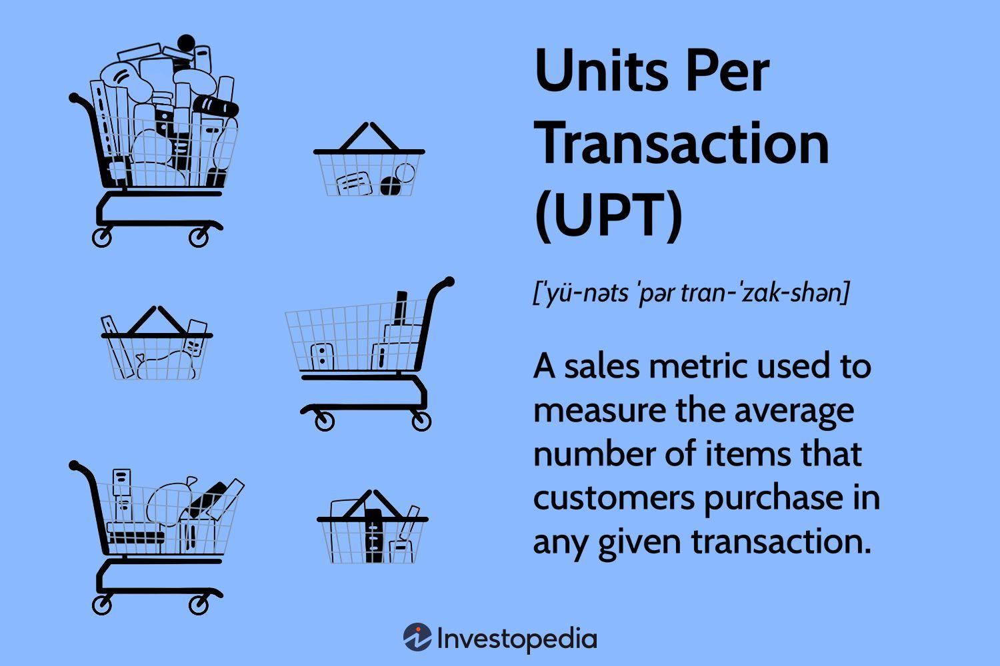

In the competitive retail industry, understanding customer behavior and optimizing sales performance are crucial for business success. One of the key metrics that retail analysts focus on is Units Per Transaction (UPT), which measures the average number of items purchased in a single transaction. This metric provides insights into customer buying patterns and helps retailers identify opportunities to enhance sales strategies through cross-selling, upselling, and other tactics.

UPT is calculated by dividing the total number of items sold by the total number of transactions. For example, if a retail store records 500 items sold across 200 transactions, the UPT would be 2.5, indicating that on average, customers buy 2.5 items per purchase. This basic yet powerful formula allows retailers to monitor and improve their sales performance, inventory management, and customer engagement.

The significance of UPT extends beyond traditional retail operations into the modern landscape where data plays a crucial role. Retailers harness data analytics to refine operations, personalize marketing efforts, and ultimately enhance customer satisfaction. Utilizing data-driven insights, including UPT, can lead to more informed decision-making and effective sales strategies.

Moreover, UPT is increasingly interconnected with algorithmic trading strategies used in retail. Algorithmic models analyze UPT data to forecast demand, adjust pricing dynamically, and tailor customer experiences. By integrating UPT into these models, retailers can maximize transaction value and gain a competitive edge in the market.

As the retail sector continues to evolve, understanding and leveraging UPT becomes even more vital. This article will explore how UPT functions in diverse retail contexts, the strategies for improving it, and how it contributes to sustained growth and profitability in a dynamic retail environment.

## Table of Contents

## Understanding Units Per Transaction (UPT)

Units Per Transaction (UPT) is a crucial sales metric that quantifies the average number of items purchased in a single transaction. It serves as a key performance indicator for retailers, offering insights into customer purchasing behavior and guiding strategic decisions. The significance of UPT lies in its ability to reveal buying patterns, enabling retailers to tailor their sales strategies to meet customer demands effectively.

By analyzing UPT, retailers can identify emerging trends that affect customer preferences, which can facilitate informed decision-making in various operational areas such as inventory management, marketing, and customer engagement. This metric allows businesses to maintain optimal stock levels by predicting future demand more accurately, ensuring that popular products are readily available to consumers.

Moreover, UPT is a direct reflection of the effectiveness of cross-selling and upselling strategies. An increase in UPT suggests that a retailer’s sales tactics are successful, resulting in more items per transaction. This, in turn, translates to higher revenue and profitability. Retailers often leverage this insight to refine their marketing campaigns, introduce bundle offers, and enhance promotional strategies that encourage customers to increase their transaction size.

In summary, understanding UPT empowers retailers to fine-tune their operations and align their strategies with customer needs, ultimately strengthening their market position and driving business growth.

## Calculating Units Per Transaction

The Units Per Transaction (UPT) metric is calculated using a simple formula: 

$$
\text{UPT} = \frac{\text{Total Units Sold}}{\text{Total Transactions}}
$$

This formula provides insight into customer purchasing behavior by determining the average number of items purchased per transaction.

For instance, if a retail store sells 500 items over the [course](/wiki/best-algorithmic-trading-courses) of 200 transactions, the UPT would be calculated as follows:

$$
\text{UPT} = \frac{500}{200} = 2.5
$$

This indicates that, on average, each customer purchases 2.5 items per transaction.

Retailers have the flexibility to calculate UPT with varying frequencies, such as daily, weekly, monthly, or seasonally, depending on their specific analytical requirements. Conducting regular UPT analyses can be highly beneficial for businesses, allowing them to adapt their sales strategies effectively and enhance the shopping experience for customers.

By consistently monitoring UPT, retailers can identify trends in customer purchasing habits and adjust their inventory, marketing tactics, and sales approaches accordingly. This adaptability not only helps in maintaining optimal stock levels and promoting cross-selling and upselling opportunities but also contributes to improved customer satisfaction and potentially higher revenue.

## Importance of UPT in Retail Strategy

Understanding customer behavior forms the cornerstone of effective retail strategy, with Units Per Transaction (UPT) serving as a crucial metric in assessing these behaviors. A higher UPT indicates that sales strategies successfully encourage customers to purchase more items per transaction, revealing effective cross-selling and upselling tactics. Cross-selling involves promoting complementary products, while upselling focuses on persuading customers to choose higher-end or premium versions of items. By analyzing UPT, retailers can identify areas where these strategies succeed and where they may need refinement.

In terms of sales performance evaluation, UPT provides insightful data, allowing retailers to tailor marketing efforts and improve customer engagement. Retailers can use UPT data to enhance product recommendations, adjust store layouts or online interfaces, and modify promotional strategies, all of which can lead to increased customer spending per visit.

Inventory management also greatly benefits from monitoring UPT. By understanding the average number of units sold per transaction, retailers can predict stock demands more accurately. This prediction helps ensure that popular items remain available and that excess inventory is minimized, optimizing warehouse space and reducing holding costs.

From a financial perspective, a rise in UPT indicates potential increases in sales [volume](/wiki/volume-trading-strategy) and profitability. Higher UPT contributes to greater revenue without necessarily increasing the number of transactions. Retailers can thus achieve better financial health by focusing on enhancing UPT, which can be more cost-effective than acquiring new customers to increase overall sales.

In practice, leveraging UPT data can aid in the development of dynamic pricing models and personalized customer experiences, driving further sales efficiency. As retailers utilize UPT to hone their strategies, they not only cater to existing customer bases more effectively but also position themselves competitively in the increasingly data-driven retail market.

## UPT and Algorithmic Trading in Retail

Algorithmic trading, traditionally a staple of the financial sector, is increasingly becoming a significant tool in retail for automating and enhancing sales strategies. This approach effectively uses data-driven insights to optimize various aspects of retail operations, including the important metric of Units Per Transaction (UPT).

One of the key advantages of employing [algorithmic trading](/wiki/algorithmic-trading) in retail is the capability for enhanced demand forecasting. By analyzing UPT data, algorithms can identify purchase patterns and predict future demand more accurately. This predictive power enables retailers to adjust their inventory and marketing strategies dynamically, ensuring that stock levels match anticipated consumer needs. For instance, if algorithmic analysis indicates that UPT is likely to increase during a particular season, a retailer can proactively increase its inventory to meet the expected demand surge.

Dynamic pricing strategies benefit significantly from algorithmic approaches. Algorithms can assess real-time UPT data alongside external factors such as competitor pricing and market trends. Through this analysis, retailers can establish pricing strategies that maximize sales and profit margins. An example of this is the implementation of time-based discounts or personalized pricing models that adjust based on individual purchase behavior or UPT values.

The integration of big data analytics further enhances the ability of algorithms to refine customer offerings and improve promotional effectiveness. By leveraging vast datasets, retailers can design personalized marketing campaigns that target specific consumer segments based on their UPT history. This personalization ensures that promotions are more relevant and likely to convert into sales, therefore improving UPT.

Algorithmic models that incorporate UPT data facilitate tailored customer experiences and maximize transaction value. These models can suggest complementary products during the checkout process or customize product bundling offers to match the buying patterns captured in UPT metrics. For instance, if a customer consistently purchases related items separately, algorithms can identify this pattern and generate a bundled offer to encourage both higher UPT and customer satisfaction.

With these applications, algorithmic trading in retail proves to be a transformative approach that not only enhances operational efficiency but also provides a competitive edge by maximizing the strategic use of UPT data.

## Improving Units Per Transaction (UPT)

To increase Units Per Transaction (UPT), retailers can implement several targeted strategies designed to enhance sales performance and customer satisfaction. A notable approach includes cross-selling, which involves recommending complementary products during the purchasing process. For example, a customer buying a laptop may be inclined to add peripherals like a mouse or a [carry](/wiki/carry-trading) case to their purchase if these are suggested by a sales associate or algorithmically via an e-commerce platform. This tactic not only raises the UPT but also improves the customer experience by meeting additional needs.

Bundling products is a strategy that involves offering a set of products at a discounted rate compared to purchasing each item separately. This method encourages customers to buy more than they initially planned, thus increasing the UPT. For instance, a cosmetics retailer could bundle a set of products like a cleanser, toner, and moisturizer at a reduced price, enticing customers to buy the set for overall better value, which boosts the average transaction size.

Offering discounts can also drive higher UPT by incentivizing customers to add more items to their purchases. Discounts can be implemented as a percentage off when a certain number of items are bought together, or through loyalty programs that reward frequent purchasers. For example, a clothing retailer might offer a buy-two-get-one-free deal, compelling shoppers to buy more to maximize the deal.

Enhancing the customer experience both in-store and online is critical for encouraging additional purchases. In physical stores, this can be achieved through well-organized, attractive displays that naturally guide customers to related products. Moreover, knowledgeable staff can offer personalized recommendations and aid customers in discovering new products. Online, retailers can optimize the customer journey through an intuitive website layout, personalized product suggestions using algorithms, and seamless checkout processes that reduce friction in completing purchases.

Optimizing product placement and layout is another effective way to increase UPT. Strategic product placement leverages consumer psychology, placing items that are often bought together in proximity or at eye-level to prompt customers to consider additional purchases. For example, placing snack items next to beverages in a supermarket can lead to higher transaction values as consumers pick up both items.

Successful marketing campaigns play a crucial role in driving UPT. By focusing on promotions that emphasize bundled offers and limited-time discounts, retailers can create a sense of urgency and increase transaction quantities. These campaigns can be disseminated through various channels, including social media, email marketing, and in-store signage, ensuring broad reach and engagement with potential buyers.

In conclusion, by implementing strategies like cross-selling, bundling, discounts, and optimizing customer experience and product placement, retailers can effectively increase their Units Per Transaction. Through these methods, retailers not only enhance their sales metrics but also build stronger relationships with their customers by offering value and convenience.

## Conclusion

Units Per Transaction (UPT) serves as a crucial metric for retailers seeking to optimize their sales strategies and improve overall business performance. By thoroughly understanding UPT, businesses can unlock valuable insights into customer purchasing behavior, which can lead to more informed decisions and strategies that enhance sales outcomes. For instance, identifying patterns in how many items customers typically purchase allows retailers to tailor their promotions and inventory management, directly impacting sales performance.

Incorporating UPT into algorithmic trading models provides a significant advantage in the competitive retail market. This integration allows for more precise demand forecasting and dynamic pricing strategies, ensuring that retailers can accurately respond to market changes and consumer preferences. The ability to automate and optimize sales tactics through algorithmic models also enhances decision-making processes, giving businesses a competitive edge.

Retailers who effectively manage and enhance UPT are positioned to achieve sustained growth and profitability, even as the retail landscape evolves. By consistently applying strategies to increase UPT, such as cross-selling and effective product bundling, businesses can boost transaction values and improve their bottom line. Overall, leveraging UPT not only aids in understanding customer needs but also propels businesses toward long-term success in a rapidly changing retail environment.

## References & Further Reading

[1]: ["Retail Analytics: Integrated Forecasting and Inventory Management for Perishable Products in Grocery Retailing"](https://link.springer.com/book/10.1007/978-3-319-13305-8) by Kitchenham, B. et al., European Journal of Transport and Infrastructure Research (2014).

[2]: ["Advances in Financial Machine Learning"](https://www.amazon.com/Advances-Financial-Machine-Learning-Marcos/dp/1119482089) by Marcos Lopez de Prado

[3]: ["Increasing Customer Satisfaction in E-Commerce: A Comparative Study of Bundled and Unbundled Pricing Strategies"](https://www.researchgate.net/publication/376857021_Enhancing_customer_satisfaction_in_e-commerce_The_role_of_service_quality_and_brand_trust) by Hamilton, R., & Thompson, D., Journal of Consumer Research (2017).

[4]: ["Machine Learning for Algorithmic Trading: Predictive Models to Extract Signals from Market and Alternative Data for Systematic Trading Strategies with Python"](https://github.com/stefan-jansen/machine-learning-for-trading) by Stefan Jansen

[5]: ["Pricing Algorithms: A Real-World Research Agenda"](https://anderson-review.ucla.edu/pricing-algorithms-are-widely-used-are-they-legal/) by Ezrachi, A. & Stucke, M.E., Journal of European Competition Law & Practice (2019).