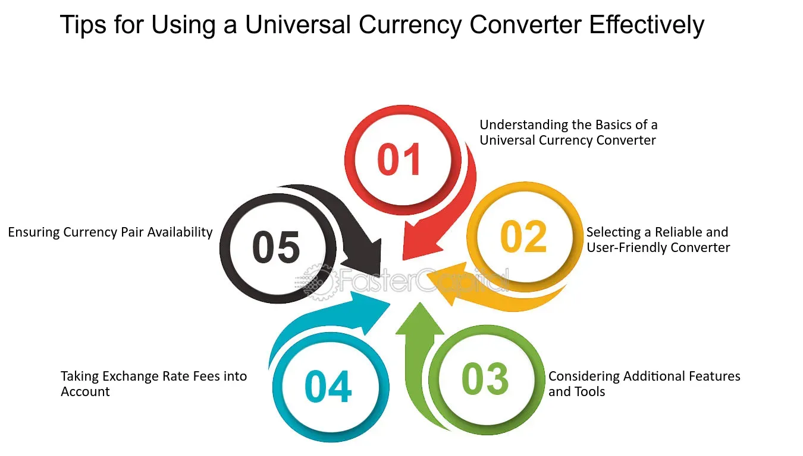

## Table of Contents

## What is a universal currency converter?

A universal currency converter is a tool that helps you change money from one country's currency to another. It's like a calculator that knows how much different money is worth compared to each other. For example, if you have US dollars and you want to know how many Euros you can get, the converter will tell you the answer.

These converters are very useful when you travel to different countries or when you do business with people from other places. They use the latest information to make sure the numbers are correct. You can find them on the internet, in apps on your phone, or even as part of some bank services.

## Why is a universal currency converter important?

A universal currency converter is important because it helps people understand how much their money is worth in different countries. When you travel or buy things from other places, you need to know how to change your money into the money used there. Without a converter, it would be hard to figure out if you are getting a good deal or not. It makes shopping, traveling, and doing business easier because you can quickly see the value of your money in any currency.

Also, a universal currency converter keeps up with the changes in money values. The worth of money can go up or down every day, and the converter uses the latest information to give you the right numbers. This is important for people who need to send money to family in other countries or for businesses that work with customers from all over the world. It helps everyone make smart choices with their money.

## How does a universal currency converter work?

A universal currency converter works by taking the amount of money you have in one country's currency and changing it into another country's currency. It does this by using the exchange rate, which is how much one currency is worth compared to another. For example, if you want to know how many Euros you can get for your US dollars, the converter will use the current exchange rate between the US dollar and the Euro to tell you the answer. It's like a special calculator that knows all the different money values around the world.

The converter gets its information from places like banks and financial markets, where the exchange rates are always changing. Every day, the value of money can go up or down a little bit, so the converter needs to stay updated to give you the right numbers. When you use a converter, you just type in how much money you have and choose which currencies you want to change it between. Then, the converter does all the math for you and shows you how much money you will get in the other currency.

## What are the key features of a universal currency converter?

A universal currency converter has some important features that make it useful. One key feature is that it can change money from one currency to another. This means if you have US dollars and want to know how many Euros you can get, the converter will tell you the answer. It's like a special calculator that knows how much different money is worth compared to each other. Another important feature is that it uses the latest exchange rates. The value of money changes every day, and the converter gets this information from banks and financial markets to make sure the numbers are correct.

Another helpful feature is that it's easy to use. You just type in how much money you have and choose which currencies you want to change it between. Then, the converter does all the math for you and shows you how much money you will get in the other currency. Many converters also let you see the history of exchange rates, so you can look back and see how the value of money has changed over time. This can be useful for planning when to change your money or understanding trends in currency values.

## What currencies can be converted using a universal currency converter?

A universal currency converter can change money from almost any country's currency into any other country's currency. This means you can use it to convert US dollars to Euros, Japanese yen to British pounds, or any other combination you need. It works with all the main currencies like the US dollar, Euro, British pound, Japanese yen, and Chinese yuan, as well as many smaller or less common currencies.

The converter gets its information from banks and financial markets around the world. This means it can handle currencies from countries like Australia, Canada, Switzerland, and many more. No matter where you are traveling or doing business, you can use a universal currency converter to figure out how much your money is worth in another country's currency.

## How accurate are universal currency converters?

Universal currency converters are very accurate because they use the latest information from banks and financial markets. They update their exchange rates every day, sometimes even more often, to make sure the numbers they give you are correct. This means if you want to know how many Euros you can get for your US dollars, the converter will use the most recent exchange rate to tell you the answer.

However, the accuracy can change a little bit because exchange rates are always moving. If you use the converter at different times of the day, you might see slightly different numbers. Also, some converters might have a small delay in updating their rates, which can affect how accurate they are. But overall, universal currency converters are reliable tools for understanding how much your money is worth in different currencies.

## What are the common sources of exchange rates for universal currency converters?

Universal currency converters get their exchange rates from big banks and financial markets. These places are always trading money from different countries, so they know exactly how much one currency is worth compared to another. When you use a converter, it's using the latest numbers from these sources to tell you how much your money is worth in another currency.

Sometimes, converters also use information from special companies that collect and share exchange rate data. These companies make sure the rates are up to date and correct. This way, no matter when you use the converter, you can trust that the numbers are close to what you would get if you went to a bank or a money exchange place.

## How do universal currency converters handle real-time data?

Universal currency converters use special ways to get the latest information on exchange rates. They connect to big banks and financial markets that trade money all the time. This means the converters can get the newest numbers and show you how much your money is worth in another currency right away.

Sometimes, there can be a tiny delay in getting the latest rates because the information has to travel from the banks to the converter. But these delays are usually very small, so the numbers you see are still very close to what you would get at a bank or money exchange place. The converters work hard to keep the information as up-to-date as possible, so you can trust them to give you accurate numbers when you need them.

## What are the security considerations when using a universal currency converter?

When you use a universal currency converter, it's important to think about security. Some converters might ask you to put in personal information or even connect to your bank account. You need to make sure the converter is from a trusted source, so your information stays safe. Look for converters that have good security measures like encryption, which helps keep your data private.

Another thing to watch out for is fake converters. There are websites or apps that look like real currency converters but are actually trying to steal your information. Always check if the converter is from a well-known company or financial institution. It's also a good idea to read reviews and see what other people say about the converter's safety before you use it.

## How can businesses integrate a universal currency converter into their operations?

Businesses can use a universal currency converter to make their work easier when they deal with money from different countries. They can add the converter to their website or use it in their computer programs. This way, when customers want to buy things, they can see the price in their own money right away. It helps businesses sell to people all over the world without having to worry about changing money themselves.

To make sure the converter works well, businesses need to pick one that updates its information often. They should also check that the converter is safe and won't put their customers' information at risk. By using a good currency converter, businesses can save time, make fewer mistakes with money, and help their customers feel more comfortable buying from them no matter where they are.

## What are the potential future developments in universal currency converter technology?

In the future, universal currency converters might get even better at using real-time data. They could update their exchange rates every second instead of every day, making them more accurate than ever. This would help businesses and travelers know the exact value of their money at any moment. Also, these converters might start using [artificial intelligence](/wiki/ai-artificial-intelligence) to predict how exchange rates will change. This could help people make smarter decisions about when to change their money.

Another big change could be how currency converters work with other technology. They might become part of smart devices like watches or even virtual reality systems. This would make it super easy for people to check exchange rates no matter where they are. Plus, these converters could start working with blockchain technology, which is used for cryptocurrencies like Bitcoin. This could make changing money between different types of currencies, even digital ones, faster and more secure.

## How do universal currency converters comply with international financial regulations?

Universal currency converters need to follow the rules set by different countries to make sure they are doing things the right way. These rules are called international financial regulations, and they help keep money exchanges fair and safe. When a currency converter is made, the people who make it have to make sure it follows these rules. This means the converter has to use the right exchange rates and keep users' information private. If it doesn't follow the rules, it could get into trouble with the law.

To make sure they are following the rules, currency converters often work with big banks and financial companies. These companies know a lot about the rules and help make sure the converter is doing everything correctly. The converter also has to update its information often to match the latest rules, which can change from time to time. By working together with these big companies and staying up to date, currency converters can help people change money safely and fairly.

## What is the understanding of Universal Currency Converters?

A universal currency converter is a digital tool designed to provide real-time exchange rates for converting one currency into another. This tool is essential for travelers, businesses, and [forex](/wiki/forex-system) traders who need accurate and timely currency conversion for financial planning and transactions. 

1. **Functionality**: Universal currency converters function by accessing current market exchange rates, allowing users to translate values between numerous global currencies instantly. The accuracy of these conversions is paramount, as even minor fluctuations in rates can impact financial outcomes significantly.

2. **Use Cases**: For travelers, currency converters offer a convenient way to determine how much foreign currency they need for their trip, based on up-to-the-minute rates. Businesses engaged in international trade rely on these converters to ensure their pricing strategies remain competitive and profitable while managing currency risk. Forex traders, who operate in one of the largest financial markets globally, use these tools to gauge the market trends and make informed trading decisions.

3. **Technology Integration**: These converters are typically integrated into online platforms and mobile applications, allowing for quick, on-the-go access to currency information. They use APIs (Application Programming Interfaces) to fetch the latest market data from financial exchanges and institutions, presenting it in a user-friendly format.

4. **Mathematical Model**: The mathematical model behind currency conversion is straightforward. If $C_1$ is the amount in the base currency and $E$ is the exchange rate for converting it to the target currency, the equivalent amount in the target currency $C_2$ is calculated as:
$$
   C_2 = C_1 \times E

$$

   For instance, if \$100 USD is to be converted to Euros, and the exchange rate is 0.85, the conversion would be:
$$
   C_2 = 100 \times 0.85 = 85 \, \text{EUR}

$$

5. **Market Price Utilization**: Currency converters continuously update using market prices, which include data from sources such as international banks, financial institutions, and foreign exchange market data providers. This real-time updating is crucial for maintaining the accuracy of conversions amid the ever-changing forex landscape.

Through the wide use and accessibility provided by universal currency converters, individuals and enterprises can more effectively navigate the complexities of currency exchange, fostering better financial decision-making and planning.

## References & Further Reading

[1]: ["Algorithmic Trading: Winning Strategies and Their Rationale"](https://books.google.com/books/about/Algorithmic_Trading.html?id=WAlFDwAAQBAJ) by Ernest P. Chan

[2]: ["Advances in Financial Machine Learning"](https://www.amazon.com/Advances-Financial-Machine-Learning-Marcos/dp/1119482089) by Marcos Lopez de Prado

[3]: ["Quantitative Trading: How to Build Your Own Algorithmic Trading Business"](https://github.com/LucindaYa/quant-resources/blob/master/Quantitative%20Trading%20How%20to%20Build%20Your%20Own%20Algorithmic%20Trading%20Business.pdf) by Ernest P. Chan

[4]: Bank for International Settlements. (2019). ["Triennial Central Bank Survey: Foreign exchange turnover in April 2019."](https://www.bis.org/statistics/rpfx19_fx.pdf)

[5]: Goldberg, L. R., & Akerlof, G. A. (1970). ["Trading and Exchanges: Market Microstructure for Practitioners"](https://personal.utdallas.edu/~nina.baranchuk/Fin7310/papers/Akerlof1970.pdf) by Larry Harris