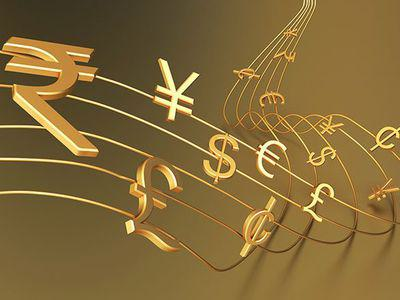

In today's globalized economy, the foreign exchange (forex) market and currency conversion systems are integral to the functioning of international trade, travel, and investment activities. As goods and services move across borders, the need for efficient currency exchange becomes paramount. This market's liquidity and continuous operation facilitate the conversion between different currencies, enabling companies to manage financial operations beyond their home territories and providing travelers the means to navigate diverse monetary systems.

With technological advances, particularly in data processing and artificial intelligence, algorithmic trading has emerged as a pivotal tool for enhancing the efficiency of currency exchanges. Algorithmic trading, or algo trading, relies on complex algorithms to automate trading decisions, optimizing the buying and selling process by analyzing vast amounts of data more quickly and accurately than human capabilities alone. This reduces transaction costs and latency and minimizes the psychological biases often present in human decision-making.



This article investigates how algorithmic trading synergizes with universal currency converters to improve the forex market's effectiveness. By integrating real-time data and executing precise calculations, algo trading transforms currency conversion into a more reliable and swift operation. As a result, it allows traders and businesses to adapt rapidly to market fluctuations, offering a distinct advantage in today's economically interconnected world.

## Table of Contents

## Understanding Universal Currency Converters

A universal currency converter is a digital tool designed to provide real-time exchange rates for converting one currency into another. This tool is essential for travelers, businesses, and forex traders who need accurate and timely currency conversion for financial planning and transactions. 

1. **Functionality**: Universal currency converters function by accessing current market exchange rates, allowing users to translate values between numerous global currencies instantly. The accuracy of these conversions is paramount, as even minor fluctuations in rates can impact financial outcomes significantly.

2. **Use Cases**: For travelers, currency converters offer a convenient way to determine how much foreign currency they need for their trip, based on up-to-the-minute rates. Businesses engaged in international trade rely on these converters to ensure their pricing strategies remain competitive and profitable while managing currency risk. Forex traders, who operate in one of the largest financial markets globally, use these tools to gauge the market trends and make informed trading decisions.

3. **Technology Integration**: These converters are typically integrated into online platforms and mobile applications, allowing for quick, on-the-go access to currency information. They use APIs (Application Programming Interfaces) to fetch the latest market data from financial exchanges and institutions, presenting it in a user-friendly format.

4. **Mathematical Model**: The mathematical model behind currency conversion is straightforward. If $C_1$ is the amount in the base currency and $E$ is the exchange rate for converting it to the target currency, the equivalent amount in the target currency $C_2$ is calculated as:
$$
   C_2 = C_1 \times E

$$

   For instance, if \$100 USD is to be converted to Euros, and the exchange rate is 0.85, the conversion would be:
$$
   C_2 = 100 \times 0.85 = 85 \, \text{EUR}

$$

5. **Market Price Utilization**: Currency converters continuously update using market prices, which include data from sources such as international banks, financial institutions, and foreign exchange market data providers. This real-time updating is crucial for maintaining the accuracy of conversions amid the ever-changing forex landscape.

Through the wide use and accessibility provided by universal currency converters, individuals and enterprises can more effectively navigate the complexities of currency exchange, fostering better financial decision-making and planning.

## The Technology Behind Currency Conversion in Algo Trading

In [algorithmic trading](/wiki/algorithmic-trading), currency conversion is a vital component that facilitates efficient execution of trades across varied currency pairs. The technology driving these conversions involves the integration of advanced APIs and automated systems, such as those found in the cTrader platform, which ensure precision and rapidity in currency transactions.

Sophisticated APIs serve as a bridge between trading platforms and the dynamic [forex](/wiki/forex-system) market, effectively automating currency conversion processes. These interfaces provide access to current market rates, allowing traders to convert currencies seamlessly without manual intervention. For instance, cTrader leverages APIs to fetch real-time exchange rates, ensuring that trades are executed at the most favorable rates available. This automation not only reduces latency but also enhances consistency in trading operations.

A core feature of these automated systems is their ability to harness both historical and real-time data, enabling accurate [backtesting](/wiki/backtesting) and optimal strategy formulation. Backtesting involves simulating trading strategies using past market data to evaluate their effectiveness. By applying historical exchange rates, traders can determine the viability of specific strategies over time. Real-time data, on the other hand, allows traders to adapt strategies based on current market conditions. This dual approach facilitates informed decision-making and minimizes the risk associated with volatile market fluctuations.

Moreover, algorithmic systems employ mathematical models and [machine learning](/wiki/machine-learning) algorithms to predict currency movements and determine the best times to execute trades. For example, algorithms might use linear regression analysis to identify trends and patterns in currency pairings:
```python
from sklearn.linear_model import LinearRegression
import numpy as np

# Example data: historical currency conversion rates
X = np.array([[1], [2], [3], [4], [5]])  # Time in days
y = np.array([1.2, 1.15, 1.17, 1.22, 1.18])  # Exchange rates

# Train a simple linear regression model
model = LinearRegression().fit(X, y)

# Predict future rates
predicted_rate = model.predict(np.array([[6]]))
print("Predicted exchange rate for day 6:", predicted_rate)
```
This integration of algorithmic precision and technological advancement allows traders to operate more efficiently, responding swiftly to market developments and optimizing their trading strategies for better financial outcomes.

## Role of Exchange Rates in Global Economy

Exchange rates play a critical role in shaping the global economy by determining the relative value of different national currencies. These rates affect international trade, investment, and economic relations between countries. Various factors influence exchange rates, each impacting financial decision-making in both personal and professional contexts.

One of the primary factors affecting exchange rates is economic indicators. Key indicators include interest rates, inflation rates, and GDP growth. Generally, a country with higher interest rates offers higher returns to investors, attracting foreign capital and causing its currency to appreciate. Conversely, high inflation often leads to depreciation, as the purchasing power of the currency decreases.

Market sentiment also plays a significant role. Investors' perceptions and risk appetite can drive currency movements. For example, during periods of economic instability, investors may seek safe-haven currencies like the US dollar or Swiss franc, influencing their demand and exchange rates. This phenomenon is often observed in times of geopolitical tension or financial turbulence.

Geopolitical events further complicate exchange rate dynamics. Political instability, conflicts, or changes in governance can lead to uncertainty, affecting currency values. For instance, Brexit resulted in significant fluctuations in the British pound because of the uncertainty surrounding the UK's economic future.

Understanding these elements enables individuals and businesses to make informed financial decisions. For companies engaged in international trade, anticipating exchange rate movements can affect pricing strategies, profit margins, and competitive positioning. Similarly, investors must consider exchange rate trends when allocating assets across different currencies to optimize returns and manage risk effectively.

The economic complexities associated with exchange rates necessitate constant analysis and interpretation. Financial professionals often employ quantitative models and data-driven approaches to forecast exchange rate trends, although these remain inherently unpredictable due to their sensitivity to rapid changes in global events and market perceptions.

## Algorithmic Trading in Foreign Exchange

Algorithmic trading, often referred to as algo trading, employs sophisticated computer algorithms to automate the process of executing trades in the foreign exchange (forex) market. This method targets optimal trade entry and [exit](/wiki/exit-strategy) points by systematically analyzing real-time market data. The primary advantage of algo trading in the forex market is its ability to reduce human error and enhance trading efficiency. Automated systems can swiftly react to changes in market prices, executing trades faster than is humanly possible.

The integration of [artificial intelligence](/wiki/ai-artificial-intelligence) (AI) and machine learning technologies into these algorithms has further refined their capabilities. AI enables the algorithms to identify patterns within historical and current market data, improving the accuracy of predictions regarding currency movements. This is achieved by training machine learning models to recognize complex data patterns, which facilitates the development of more predictive trading strategies.

Python, as a powerful programming language, is widely used to implement these algo-trading strategies. For instance, traders can utilize libraries such as pandas for data manipulation, scikit-learn for machine learning models, and NumPy for numerical computations, allowing for the execution of sophisticated trading algorithms. A basic example of an algorithm that trades based on moving averages is provided below:

```python
import pandas as pd
import numpy as np

# Example: Moving Average Crossover Strategy
def moving_average_strategy(prices, short_window=40, long_window=100):
    signals = pd.DataFrame(index=prices.index)
    signals['price'] = prices['Close']

    # Short-term simple moving average
    signals['short_mavg'] = prices['Close'].rolling(window=short_window, min_periods=1, center=False).mean()

    # Long-term simple moving average
    signals['long_mavg'] = prices['Close'].rolling(window=long_window, min_periods=1, center=False).mean()

    # Generate buy/sell signals
    signals['signal'] = 0.0
    signals['signal'][short_window:] = np.where(signals['short_mavg'][short_window:] > signals['long_mavg'][short_window:], 1.0, 0.0)   

    # Generate trading orders
    signals['positions'] = signals['signal'].diff()

    return signals

# Usage with sample price data
# prices = pd.read_csv('currency_data.csv', index_col='Date', parse_dates=True)
# signals = moving_average_strategy(prices)
```

Overall, the role of algorithmic trading in the forex market is to enhance trading decisions by increasing speed, minimizing errors, and enabling the use of comprehensive data analysis. The continuous advancement in AI and machine learning is anticipated to further elevate the effectiveness and accuracy of these trading systems.

## Benefits and Challenges of Algorithmic Trading

Algorithmic trading offers several advantages that make it a preferred choice over manual trading methods, particularly in the fast-paced foreign exchange (forex) markets. One of the primary benefits is the reduction of emotional bias in trading decisions. Human traders are susceptible to emotions such as fear and greed, which can lead to impulsive and irrational decisions. Algorithms, however, operate based on predefined criteria and are not influenced by emotional states, resulting in consistent and objective trading actions.

Increased trading speed is another significant advantage. Algorithms can process vast amounts of market data and execute trades within milliseconds, a feat that is impossible for human traders to achieve. This rapid execution is crucial in forex markets, where currency prices can fluctuate rapidly, and even milliseconds can impact profitability. 

Higher precision and accuracy are inherent in algorithmic trading systems. Algorithms follow exact parameters for trade execution, which minimizes the risk of human error. This precision allows for the exact timing of market entry and exit points, optimally aligning with trading strategies.

Despite these benefits, algorithmic trading is not without challenges. Algorithm failures or bugs in the code can lead to significant financial losses if not promptly addressed. Unlike human traders who can adapt strategies on the fly, algorithms require updates and refinement to adapt to ever-changing market conditions, necessitating continuous vigilance and development.

The need for constant system updates is coupled with the challenge of ensuring algorithm robustness against varying market dynamics. Algorithms must be able to handle different market conditions, such as high [volatility](/wiki/volatility-trading-strategies) or low [liquidity](/wiki/liquidity-risk-premium), which requires extensive backtesting and validation.

Regulatory and ethical considerations also play a critical role. As algorithmic trading grows in popularity and influence, regulatory bodies are scrutinizing trading practices more closely to ensure market fairness and transparency. Traders and firms must ensure that their algorithms comply with the latest regulatory standards and ethical norms, avoiding manipulative practices and ensuring equitable access to market opportunities.

Overall, algorithmic trading transforms how forex markets function, providing various benefits that improve trading efficiency and accuracy. However, these advantages come with the responsibility of managing technological, regulatory, and ethical challenges. Addressing these challenges effectively can lead to successful and responsible algorithmic trading practices.

## Conclusion

Understanding currency conversion and exchange rates is essential for active participation in the global economy. These components act as the foundational elements that facilitate international trade, travel, and investments, ensuring that economic transactions across borders occur smoothly and efficiently. As the world becomes more interconnected, the demand for precise and reliable currency conversion tools continues to grow.

Algorithmic trading has significantly enhanced the efficiency of currency exchange processes, presenting notable benefits. Through the utilization of advanced computer algorithms, trades can be executed at optimal times, analyzing vast amounts of market data in real-time. This approach not only reduces human error but also allows for rapid responses to market fluctuations, thus ensuring that trading decisions are timely and effective. The integration of artificial intelligence and machine learning further amplifies the capabilities of these algorithms, providing predictive insights that refine trading strategies and optimize outcomes.

Staying informed about technological advancements in currency conversion and algorithmic trading is crucial for achieving better financial results, both for individuals and businesses. As technology evolves, so does the capacity to harness data for improved decision-making and risk management in forex markets. Engaging with the latest tools and strategies can lead to more informed financial planning and enhanced opportunities for profit. Overall, by keeping abreast of these advancements, individuals and businesses can position themselves advantageously within the ever-changing landscape of global finance.

## Additional Resources

For those looking to deepen their understanding, numerous resources are available, including forex trading platforms, recommended reading, and online tools. One of the most accessible ways to get started is through popular trading platforms such as Forex.com and OANDA. These platforms offer real-time currency rates and provide demo accounts, allowing users to practice and refine their trading strategies without any financial risk. They also include educational materials ranging from basic forex concepts to advanced trading strategies, catering to both novice and experienced traders.

For more in-depth learning, [books](/wiki/algo-trading-books) such as "Algorithmic Trading: Winning Strategies and Their Rationale" offer comprehensive insights into algorithmic trading methodologies. This book elaborates on the principles of algorithmic trading, discussing how mathematical models and quantitative strategies can be applied to financial markets. It covers various strategies, performance evaluations, and the use of statistical measures to enhance trading efficiency and precision.

Additionally, numerous online tools and resources can enhance one's knowledge of forex trading. Websites like Investopedia provide free articles, tutorials, and courses on forex and algorithmic trading concepts. Moreover, joining online forums and communities such as Forex Factory or the MetaTrader community can provide valuable insights and support from other traders, helping you stay updated with current market trends and technologies.

For those interested in applying coding to algorithmic trading, understanding programming languages such as Python can be beneficial. Python libraries like Pandas, NumPy, and SciPy can be used for data analysis, while libraries such as TA-Lib and Zipline facilitate the development and backtesting of trading algorithms. Here’s a simple example of how to use Python for backtesting a moving average crossover strategy:

```python
import pandas as pd
import numpy as np
import matplotlib.pyplot as plt

# Load data
data = pd.read_csv('forex_data.csv', parse_dates=True, index_col='Date')
data['SMA50'] = data['Close'].rolling(window=50).mean()
data['SMA200'] = data['Close'].rolling(window=200).mean()

# Generate signals
data['Signal'] = 0
data['Signal'][50:] = np.where(data['SMA50'][50:] > data['SMA200'][50:], 1, 0)
data['Position'] = data['Signal'].diff()

# Plot
plt.figure(figsize=(14,7))
plt.plot(data['Close'], label='Close Price', alpha=0.5)
plt.plot(data['SMA50'], label='SMA50', alpha=0.75)
plt.plot(data['SMA200'], label='SMA200', alpha=0.75)
plt.plot(data.loc[data['Position'] == 1].index, 
         data['SMA50'][data['Position'] == 1], 
         '^', markersize=10, color='g', lw=0, label='Buy Signal')
plt.plot(data.loc[data['Position'] == -1].index, 
         data['SMA50'][data['Position'] == -1], 
         'v', markersize=10, color='r', lw=0, label='Sell Signal')
plt.title('Moving Average Crossover Strategy')
plt.legend()
plt.show()
```

By leveraging these resources, you can enhance your trading skills and knowledge, ultimately leading to more informed and strategic decisions in the forex market.

## References & Further Reading

[1]: ["Algorithmic Trading: Winning Strategies and Their Rationale"](https://books.google.com/books/about/Algorithmic_Trading.html?id=WAlFDwAAQBAJ) by Ernest P. Chan

[2]: ["Advances in Financial Machine Learning"](https://www.amazon.com/Advances-Financial-Machine-Learning-Marcos/dp/1119482089) by Marcos Lopez de Prado

[3]: ["Quantitative Trading: How to Build Your Own Algorithmic Trading Business"](https://github.com/LucindaYa/quant-resources/blob/master/Quantitative%20Trading%20How%20to%20Build%20Your%20Own%20Algorithmic%20Trading%20Business.pdf) by Ernest P. Chan

[4]: Bank for International Settlements. (2019). ["Triennial Central Bank Survey: Foreign exchange turnover in April 2019."](https://www.bis.org/statistics/rpfx19_fx.pdf)

[5]: Goldberg, L. R., & Akerlof, G. A. (1970). ["Trading and Exchanges: Market Microstructure for Practitioners"](https://personal.utdallas.edu/~nina.baranchuk/Fin7310/papers/Akerlof1970.pdf) by Larry Harris