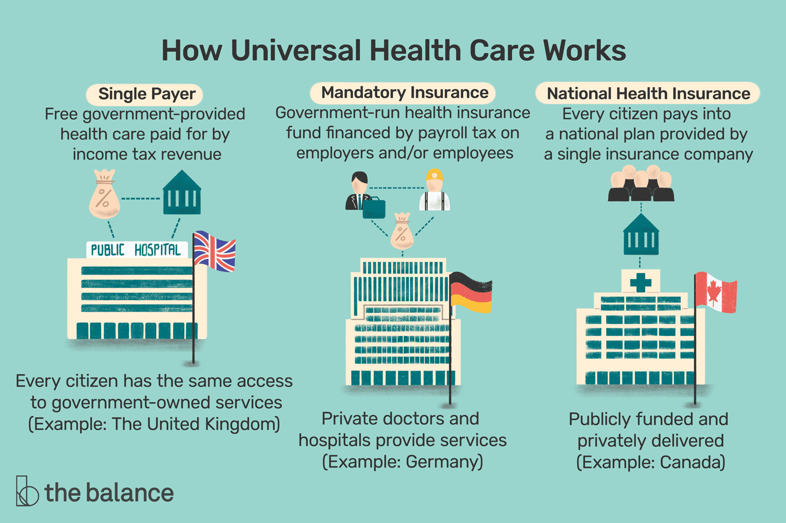

## Table of Contents

## What is Universal Health Coverage (UHC)?

Universal Health Coverage (UHC) means that everyone can get the health services they need without facing financial hardship. It includes the full range of essential health services, from health promotion to prevention, treatment, rehabilitation, and palliative care. The goal is to make sure that no one is left behind, whether they are rich or poor, young or old, living in cities or rural areas.

Countries work towards UHC by making sure that health services are available, accessible, and of good quality. This often involves strengthening health systems, training more health workers, and making sure that medicines and technologies are available. Governments, along with international organizations and other partners, play a key role in funding and implementing UHC to ensure that everyone can live healthier, more productive lives.

## Why is Universal Health Coverage important?

Universal Health Coverage is important because it helps everyone get the health care they need without worrying about money. When people can see a doctor or get medicine without going broke, they are more likely to stay healthy and live longer. This is good for families because they don't have to choose between paying for health care and other important things like food or education.

UHC also helps make society stronger. When more people are healthy, they can work and contribute to their communities. This can help the economy grow because healthy workers are more productive. Plus, when everyone has access to health care, it can prevent big health problems from spreading and becoming emergencies that are hard and expensive to fix.

In the end, Universal Health Coverage is about fairness. It makes sure that no one is left out, no matter where they live or how much money they have. This can lead to a happier, healthier world where everyone has a chance to thrive.

## What are the key components of UHC?

The key components of Universal Health Coverage include making sure that everyone can get the health services they need. This means having enough hospitals, clinics, and health workers in all areas, not just in cities. It also means that these services should cover everything from preventing sickness to treating diseases and helping people recover. Good quality care is important too, so people get the right treatment and don't get sick again.

Another important part is making sure that people don't have to pay a lot of money for health care. This can be done by having the government or insurance help cover the costs. When people don't have to worry about money, they are more likely to go to the doctor when they need to. This helps keep them healthy and stops small health problems from becoming big ones.

Overall, UHC is about making sure everyone has access to good health care without facing financial hardship. It's about fairness and making sure no one is left behind, whether they are rich or poor, young or old, living in cities or rural areas. By focusing on these key components, countries can work towards a healthier future for everyone.

## How does UHC differ from other health systems?

Universal Health Coverage is different from other health systems because it aims to make sure everyone can get the health care they need without worrying about money. In many other health systems, people might have to pay a lot for health care, and this can stop them from getting the help they need. UHC tries to fix this by making sure that the cost of health care is shared, often through taxes or insurance, so no one has to choose between their health and their money.

Another way UHC is different is that it focuses on making sure everyone gets the same level of care, no matter where they live or how much money they have. Some health systems might only provide good care in big cities or to people who can afford it. UHC works to make sure that people in rural areas and poor people also get good health care. This means building more clinics and hospitals in places where they are needed and training more health workers to serve everyone.

Overall, UHC is about fairness and making sure no one is left out. It's not just about treating sick people but also about preventing sickness and helping people stay healthy. Other health systems might focus more on treating people who are already sick and might not do as much to help people stay healthy in the first place. By focusing on these things, UHC tries to create a world where everyone can live a healthy life.

## What are the global goals and targets for UHC?

The global goal for Universal Health Coverage is to make sure everyone can get the health services they need without facing financial hardship. This goal is part of the United Nations' Sustainable Development Goals, specifically Goal 3, which aims to ensure healthy lives and promote well-being for all at all ages. By 2030, the target is to achieve UHC, which means everyone should be able to access quality health care services, including prevention, treatment, and rehabilitation, without suffering financially.

To measure progress towards this goal, countries use two main indicators. The first is the coverage of essential health services, which looks at how many people can get the health care they need. The second is the proportion of the population that faces catastrophic health spending, which means they spend a lot of their income on health care. By tracking these indicators, countries can see if they are getting closer to the goal of UHC and make changes to their health systems to help everyone get the care they need without financial hardship.

## How is UHC implemented in different countries?

Different countries implement Universal Health Coverage in their own way, depending on their resources and needs. Some countries, like the United Kingdom, have a system called the National Health Service (NHS), where the government pays for most health care through taxes. This means people can go to the doctor or hospital without paying a lot of money. In other countries, like Canada, the government also pays for health care through taxes, but the system is run by different provinces, so it can be a bit different in each part of the country.

In some places, like Germany and Japan, people have to get health insurance, but the government helps make sure that everyone can afford it. This means that even if you don't have a lot of money, you can still get insurance and go to the doctor when you need to. In low-income countries, like Rwanda, the government might work with international organizations to help pay for health care and build more clinics and hospitals, especially in rural areas where people might not have easy access to health services.

Overall, the goal of UHC is the same everywhere: to make sure everyone can get the health care they need without facing financial hardship. But the way countries get there can be different, depending on what works best for them. Some focus on building more hospitals and training more doctors, while others work on making sure everyone can afford health insurance. By trying different things, countries can find the best way to help everyone stay healthy.

## What are the challenges in achieving UHC?

One big challenge in achieving Universal Health Coverage is money. It costs a lot to build hospitals and clinics, train doctors and nurses, and buy medicine and equipment. Some countries don't have enough money to do all of this, so they have to find ways to pay for it. This can mean raising taxes, getting help from other countries or organizations, or finding new ways to spend money more wisely. But even when countries do find the money, they still have to make sure it is used in the best way to help everyone get the health care they need.

Another challenge is making sure that health services are available to everyone, no matter where they live. In many countries, people in rural areas or poor neighborhoods don't have as many hospitals and clinics nearby. This means they have to travel far to get help, which can be hard and expensive. Also, there might not be enough doctors and nurses in these areas, so people have to wait a long time to see someone. To fix this, countries need to build more health centers and train more health workers to work in places where they are needed the most.

A third challenge is making sure that health care is good quality and fair for everyone. Sometimes, even when people can get to a doctor, the care they receive might not be very good. This can happen if doctors and nurses are not well-trained or if there are not enough medicines and equipment. Also, some people might not be treated the same way because of where they come from or how much money they have. To solve these problems, countries need to make sure that all health workers are well-trained, that everyone has access to the same good quality care, and that no one is left out.

## How does UHC impact health equity and social justice?

Universal Health Coverage helps make health care fair for everyone, which is a big part of health equity and social justice. When everyone can get the health services they need without worrying about money, it means that poor people and rich people, people in cities and people in rural areas, all have the same chance to stay healthy. This fairness is important because it stops people from being left behind just because they don't have a lot of money or live in a place where health care is hard to find. By making sure everyone can get good health care, UHC helps to make society more equal and just.

UHC also helps to make sure that people are treated the same way when they go to the doctor. Sometimes, people might not get the same quality of care because of who they are or where they come from. UHC works to fix this by making sure that all health services are good quality and available to everyone. When everyone can get the same good care, it helps to build trust in the health system and makes people feel like they are part of a fair society. This is important for social justice because it means that everyone's health and well-being are valued equally.

## What role do governments and international organizations play in UHC?

Governments play a big role in making sure everyone can get the health care they need through Universal Health Coverage. They do this by using money from taxes to pay for hospitals, clinics, and medicines. Governments also make rules to make sure that health care is good quality and that everyone can afford it. They work to build more health centers in places where people don't have easy access to care, like in rural areas. By doing all of these things, governments help to make sure that no one is left out and everyone can stay healthy.

International organizations also help a lot with UHC. They give money and advice to countries that need it, especially in poorer parts of the world. These organizations, like the World Health Organization (WHO) and the United Nations, work with governments to plan how to make health care better for everyone. They help with things like training more doctors and nurses, making sure medicines are available, and sharing ideas about what works best in different countries. By working together, governments and international organizations can make big steps towards making sure everyone has access to good health care without facing financial hardship.

## How is the effectiveness of UHC measured and evaluated?

The effectiveness of Universal Health Coverage is measured by looking at how many people can get the health services they need and how many people have to spend a lot of money on health care. These two things are called the coverage of essential health services and catastrophic health spending. By keeping track of these, countries can see if more people are getting the care they need and if fewer people are facing financial hardship because of health costs. This helps them know if their efforts to reach UHC are working or if they need to make changes.

To evaluate UHC, countries also look at other things like how many doctors and nurses they have, how many hospitals and clinics are available, and if the quality of care is good. They might use surveys and data to see if people are happy with the health care they get and if it's helping them stay healthy. By looking at all of these things together, countries can get a full picture of how well their UHC system is doing and what they can do to make it better.

## What are the economic implications of implementing UHC?

Implementing Universal Health Coverage can have big effects on a country's economy. When people can get the health care they need without spending a lot of money, they are more likely to stay healthy and go to work. This means they can earn money and help the economy grow. Also, when everyone can get health care, it can stop big health problems from spreading and becoming emergencies that are hard and expensive to fix. This can save money in the long run because it's cheaper to prevent sickness than to treat it after it gets bad.

But setting up UHC can also cost a lot of money at first. Governments need to pay for building hospitals and clinics, training doctors and nurses, and buying medicines and equipment. This might mean raising taxes or finding other ways to get money. If a country doesn't have enough money, it might need help from other countries or international organizations. Even though it can be expensive to start, many people think that the benefits of UHC, like a healthier and more productive population, are worth the cost in the end.

## What future trends and innovations are expected in the field of UHC?

In the future, technology will play a big role in making Universal Health Coverage better. One trend we might see is more use of telemedicine, where people can see a doctor over the internet without having to leave their homes. This can help people in rural areas or those who can't travel easily get the care they need. Another innovation could be using electronic health records, which let doctors share information about a patient's health quickly and easily. This can make sure that everyone gets the right treatment and help doctors work together better.

Another trend we might see is more focus on preventing sickness instead of just treating it. This means countries might spend more money on things like vaccinations, healthy eating, and exercise programs. By helping people stay healthy in the first place, countries can save money and make sure fewer people get sick. Also, new ways of paying for health care, like using insurance or different kinds of taxes, might become more common. These new ways can help make sure everyone can afford health care and that the money is used in the best way possible.

Overall, the future of UHC looks promising with new technologies and ideas that can help make health care better for everyone. By using these innovations, countries can work towards a world where everyone can get the health services they need without facing financial hardship. This can lead to healthier, happier lives for people all over the world.

## References & Further Reading

[1]: Organisation for Economic Co-operation and Development (OECD). (2019). ["Health at a Glance 2019: OECD Indicators."](https://www.oecd-ilibrary.org/social-issues-migration-health/health-at-a-glance-2019_4dd50c09-en)

[2]: Reid, T.R. (2009). ["The Healing of America: A Global Quest for Better, Cheaper, and Fairer Health Care."](https://www.amazon.com/Healing-America-Global-Better-Cheaper/dp/0143118218)

[3]: Oberlander, J. (2017). "The Virtues and Vices of Single-Payer Health Care." *New England Journal of Medicine*, 376(15), 1401-1403. [DOI: 10.1056/NEJMp1700777](https://www.nejm.org/doi/full/10.1056/NEJMp1602009)

[4]: Emanuel, E.J. (2020). ["Which Country Has the World's Best Health Care?"](https://www.amazon.com/Which-Country-Worlds-Best-Health/dp/1541797736)

[5]: Centers for Medicare & Medicaid Services (2021). ["National Health Expenditure Fact Sheet."](https://www.cms.gov/data-research/statistics-trends-and-reports/national-health-expenditure-data/nhe-fact-sheet)

[6]: Kaiser Family Foundation (2022). ["Key Facts about the Uninsured Population."](https://www.kff.org/uninsured/issue-brief/key-facts-about-the-uninsured-population/)

[7]: World Health Organization (WHO). (2010). ["The world health report: health systems financing: the path to universal coverage."](https://www.who.int/publications/i/item/9789241564021)

[8]: Anderson, C.L. (2015). ["Algorithmic Trading: Winning Strategies and Their Rationale."](https://www.wiley.com/en-us/Algorithmic+Trading%3A+Winning+Strategies+and+Their+Rationale-p-9781118460146)

[9]: Song, Z., & Baicker, K. (2022). "Effect of a Workplace Wellness Program on Employee Health and Economic Outcomes: A Randomized Clinical Trial." *JAMA*, 317(21), 2174-2183. [DOI: 10.1001/jama.2017.3470](https://pubmed.ncbi.nlm.nih.gov/30990549/)