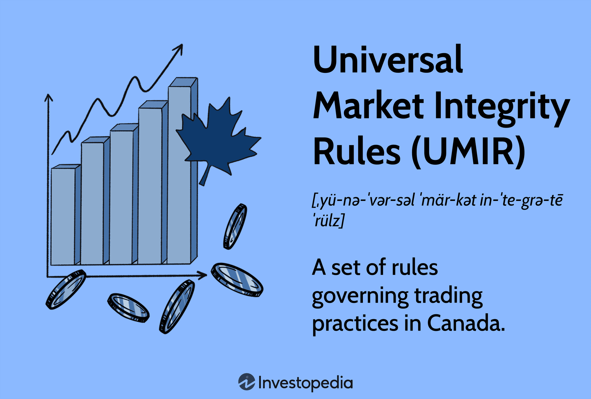

## Table of Contents

## What are Universal Market Integrity Rules (UMIR)?

Universal Market Integrity Rules (UMIR) are a set of rules in Canada that help keep the stock market fair and honest. They are made by the Canadian Investment Regulatory Organization (CIRO) to stop people from doing bad things in the market, like cheating or lying about stock prices. UMIR makes sure that everyone follows the same rules when they buy and sell stocks.

These rules cover many things, like how orders are placed and how trades are done. They also stop practices that could harm the market, such as insider trading or manipulating stock prices. By having UMIR, the stock market in Canada stays a safe place for people to invest their money, knowing that the rules are there to protect them and keep things fair.

## Who enforces the Universal Market Integrity Rules?

The Universal Market Integrity Rules (UMIR) are enforced by the Canadian Investment Regulatory Organization (CIRO). CIRO is in charge of making sure that everyone in the stock market follows these rules. They watch over the market to catch anyone who might be breaking the rules and take action to stop it.

CIRO has the power to investigate any suspicious activity and can punish those who break the UMIR. This can include fines, suspensions, or even banning people from trading. By enforcing these rules, CIRO helps keep the stock market fair and safe for everyone who wants to invest.

## Why were UMIR established?

UMIR were established to make sure the stock market in Canada is fair and honest. Before UMIR, there were no clear rules for everyone to follow, which could lead to cheating and unfair practices. By setting up UMIR, the Canadian Investment Regulatory Organization (CIRO) wanted to create a safe place for people to invest their money without worrying about being tricked.

These rules help stop bad behaviors like insider trading, where people use secret information to make money, and market manipulation, where people try to control stock prices unfairly. UMIR makes sure that everyone plays by the same rules when they buy and sell stocks. This way, the stock market stays a trustworthy place for everyone, from big investors to regular people saving for the future.

## What types of markets do UMIR apply to?

UMIR apply to the stock markets in Canada. This means they cover places where people buy and sell shares of companies. The main markets that UMIR apply to are the Toronto Stock Exchange (TSX) and the TSX Venture Exchange (TSXV). These are big places where a lot of trading happens every day.

UMIR also apply to other markets that trade securities in Canada. This includes alternative trading systems, which are like smaller markets that also let people buy and sell stocks. By covering all these different places, UMIR make sure that no matter where someone is trading, the rules are the same and everyone is playing fair.

## Can you explain some key UMIR provisions for beginners?

UMIR have some important rules that help keep the stock market fair. One key rule is about how you place orders to buy or sell stocks. You need to be honest and clear about what you want to do. For example, you can't place an order just to trick other people into thinking the stock price is going up or down when it's not. This rule stops people from playing games with the market.

Another important rule is about insider trading. This means you can't use secret information that other people don't know to make money. If you know something special about a company that could change its stock price, you have to keep it to yourself and not trade on it. This rule makes sure everyone has the same chance to make good choices about buying and selling stocks.

Lastly, UMIR also have rules to stop market manipulation. This is when someone tries to control the stock price in a way that's not fair. For example, you can't spread false rumors to make the stock price go up or down. These rules help keep the market honest so that everyone can trust it and feel safe investing their money.

## How do UMIR protect investors?

UMIR protect investors by making sure everyone follows the same rules when they buy and sell stocks. This means no one can cheat or use secret information to make money unfairly. When everyone plays by the same rules, it's easier for investors to trust the market. They know that the prices they see are real and not being manipulated by someone trying to trick them.

These rules also help keep the market safe and fair for everyone. By stopping bad behaviors like insider trading and market manipulation, UMIR make sure that the stock market is a place where people can invest their money without worrying about being cheated. This helps more people feel confident about putting their money into the market, knowing that there are rules in place to protect them.

## What are the penalties for violating UMIR?

If someone breaks the UMIR rules, they can face serious penalties. These penalties are meant to stop people from cheating or doing bad things in the stock market. The Canadian Investment Regulatory Organization (CIRO) can give out fines, which means the person has to pay money as a punishment. The fines can be big, depending on how serious the rule-breaking was.

Besides fines, CIRO can also stop someone from trading for a while. This is called a suspension. If the rule-breaking was really bad, CIRO might even ban the person from trading forever. This makes sure that people who break the rules can't keep doing it and hurting the market. By having these penalties, UMIR helps keep the stock market fair and safe for everyone.

## How do UMIR impact trading strategies?

UMIR impact trading strategies by making sure everyone follows the same rules. Traders have to be honest and clear about what they are doing when they buy or sell stocks. This means they can't use tricks or secret information to make money. For example, they can't place fake orders just to make the stock price go up or down. This rule stops traders from playing games with the market and makes them think more carefully about their strategies.

Because of UMIR, traders also have to avoid insider trading. This means they can't use special information that other people don't know to make trading decisions. If a trader knows something important about a company that could change its stock price, they have to keep it to themselves and not trade on it. This rule makes traders focus on using public information and good analysis to make their trading choices. By following these rules, traders help keep the market fair and honest for everyone.

## What are the differences between UMIR and other market regulations?

UMIR are special rules in Canada that focus on keeping the stock market fair and honest. They are made by the Canadian Investment Regulatory Organization (CIRO) and cover things like how orders are placed and how trades are done. UMIR are different from other market regulations because they are very specific to the Canadian stock market and aim to stop bad behaviors like insider trading and market manipulation. Other market regulations might be more general or apply to different types of markets, like commodity markets or foreign exchange markets.

For example, in the United States, the Securities and Exchange Commission (SEC) has its own set of rules called Regulation NMS, which focuses on how stock trades are handled and reported. While both UMIR and Regulation NMS aim to protect investors and keep the market fair, they are tailored to the specific needs and structures of their respective countries' markets. UMIR are more focused on the behavior of traders and market participants in Canada, while Regulation NMS deals more with the technical aspects of trading in the U.S. This shows how different countries can have different rules to achieve similar goals of fairness and transparency in their markets.

## How have UMIR evolved since their inception?

Since they started, UMIR have changed a lot to keep up with the stock market. When they first came out in 2001, UMIR were all about making sure the market was fair and honest. But as time went on, new ways of trading popped up, like trading online and using computers to trade really fast. So, UMIR had to change to cover these new ways of doing things. They added new rules to stop people from using these new methods to cheat or trick others in the market.

Over the years, UMIR have also gotten stricter about stopping bad behaviors like insider trading and market manipulation. They've made the rules clearer and added bigger punishments for people who break them. This helps make sure that everyone follows the rules and keeps the market a safe place for people to invest their money. By changing and growing, UMIR have stayed important in keeping the Canadian stock market fair and trustworthy.

## What are some advanced UMIR compliance strategies for firms?

Firms can use advanced UMIR compliance strategies to make sure they follow the rules and keep the market fair. One way is to use special computer programs that watch over all the trading that happens. These programs can spot any strange or suspicious activity right away. If they see something that might break the rules, they can alert the firm so they can check it out and fix any problems quickly. This helps firms stay on top of things and avoid breaking UMIR by accident.

Another strategy is to train everyone in the firm really well about UMIR. This means having regular classes and updates so that all employees know the rules inside and out. When everyone understands what they can and can't do, it's easier to follow the rules all the time. Firms can also set up a special team to focus just on UMIR compliance. This team can keep an eye on everything and make sure the firm is always doing what it's supposed to do. By using these strategies, firms can make sure they are following UMIR and helping to keep the market fair and honest.

## How do UMIR interact with international market regulations?

UMIR are rules that help keep the Canadian stock market fair and honest. But the stock market doesn't stop at Canada's borders. People from all over the world can trade in the Canadian market, and Canadian traders can trade in other countries' markets too. So, UMIR have to work together with rules from other countries to make sure everything stays fair and safe. This means that the Canadian Investment Regulatory Organization (CIRO) talks with other countries' regulators to share information and make sure everyone is following the rules.

For example, if someone in Canada is trading in the U.S. market, they have to follow both UMIR and the U.S. rules like Regulation NMS. This can be tricky because the rules might be a bit different in each country. But by working together, regulators can help make sure that traders are playing fair no matter where they are trading. This helps keep the global market honest and safe for everyone who wants to invest their money.

## References & Further Reading

[1]: Lopez de Prado, M. (2018). ["Advances in Financial Machine Learning."](https://www.amazon.com/Advances-Financial-Machine-Learning-Marcos/dp/1119482089) Wiley.

[2]: Aronson, D. R. (2006). ["Evidence-Based Technical Analysis: Applying the Scientific Method and Statistical Inference to Trading Signals."](https://www.amazon.com/Evidence-Based-Technical-Analysis-Scientific-Statistical/dp/0470008741) Wiley.

[3]: Jansen, S. (2020). ["Machine Learning for Algorithmic Trading."](https://github.com/stefan-jansen/machine-learning-for-trading) Packt Publishing.

[4]: Chan, E. P. (2008). ["Quantitative Trading: How to Build Your Own Algorithmic Trading Business."](https://github.com/egorpe/EPChan-QuantitativeTrading/blob/master/example7_6.m) Wiley.

[5]: Kirilenko, A., Kyle, A. S., Samadi, M., & Tuzun, T. (2017). ["The Flash Crash: The Impact of High-Frequency Trading on an Electronic Market."](https://www.jstor.org/stable/26652722) The Review of Financial Studies, 30(8), 2221-2255.

[6]: U.S. Securities and Exchange Commission. (2010). ["15c3-5 - Risk Management Controls for Brokers or Dealers with Market Access."](https://www.sec.gov/files/rules/final/2010/34-63241.pdf)

[7]: Markets in Financial Instruments Directive II (MiFID II). (2018). ["Directive 2014/65/EU of the European Parliament and of the Council."](https://www.esma.europa.eu/publications-and-data/interactive-single-rulebook/mifid-ii) Official Journal of the European Union.