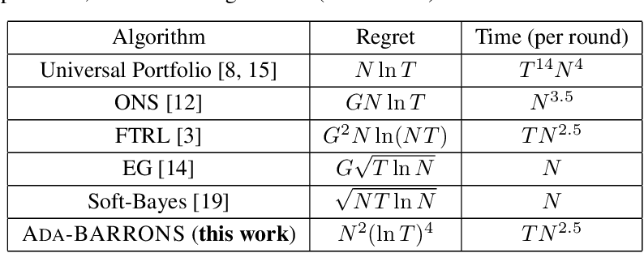

## Table of Contents

## What is a universal portfolio algorithm?

A universal portfolio algorithm is a way to invest money in stocks that doesn't rely on predicting the future. Instead, it spreads your money across different stocks in a smart way, so no matter which stocks do well, you still make money. The idea is to have a strategy that works well over time, no matter what happens in the stock market.

The algorithm works by imagining many different ways to split your money among the stocks. It then pretends to invest in all these different ways at the same time. Over time, it focuses more on the ways that are doing better and less on the ways that are doing worse. This means that as the market changes, the algorithm adjusts how it invests your money to keep up with the best performing stocks.

## Who developed the universal portfolio algorithm?

The universal portfolio algorithm was developed by a man named Thomas M. Cover. He was a professor at Stanford University and worked a lot on information theory and statistics. He came up with the idea in the late 1980s and wrote about it in a paper called "Universal Portfolios" in 1991.

Thomas Cover's idea was to create a way to invest in the stock market without having to guess which stocks would do well. His algorithm spreads your money across many different stocks and keeps adjusting how it's spread, based on how the stocks are doing. This way, it can handle all kinds of market situations without needing to predict the future.

## What is the basic principle behind the universal portfolio algorithm?

The basic principle behind the universal portfolio algorithm is to invest in many different ways at the same time without trying to predict which stocks will do well. Instead of guessing, the algorithm spreads your money across all possible ways to divide it among the stocks you're considering. Imagine you have a bunch of different baskets, and each basket represents a different way to split your money. The algorithm puts a little bit of money in each basket.

Over time, the algorithm watches how each basket is doing. If a basket is doing well, it puts more money into that basket. If a basket is doing poorly, it takes money out of it. This way, the algorithm keeps adjusting how it invests your money to focus more on the baskets that are doing better. By doing this, the universal portfolio algorithm can perform well in many different market conditions without needing to predict the future.

## How does the universal portfolio algorithm differ from traditional investment strategies?

The universal portfolio algorithm is different from traditional investment strategies because it doesn't try to guess which stocks will do well. Traditional strategies often involve [picking](/wiki/asset-class-picking) specific stocks or trying to time the market based on predictions about what will happen next. For example, someone might use research and analysis to choose stocks they think will go up in value. In contrast, the universal portfolio algorithm spreads your money across many different stocks in many different ways, without making any predictions. It's like betting on all possible outcomes at once, instead of trying to pick the winner.

Another big difference is how the universal portfolio algorithm adjusts over time. Traditional strategies might stick to the same stocks or change them based on new predictions or market trends. But the universal portfolio algorithm keeps shifting your money around based on how well different combinations of stocks are doing. It doesn't need new predictions to do this; it just focuses more on the combinations that are doing better and less on those that are doing worse. This means it can handle all kinds of market situations without needing to guess what will happen next.

## Can you explain the mathematical foundation of the universal portfolio algorithm?

The mathematical foundation of the universal portfolio algorithm is based on the idea of using a wealth distribution over all possible ways to invest in a set of stocks. Imagine you have a bunch of different ways to split your money among the stocks you're considering. Each way of splitting your money can be thought of as a "portfolio." The universal portfolio algorithm creates a big mix of all these portfolios, and it puts a little bit of your money in each one. Over time, the algorithm keeps track of how each portfolio is doing and adjusts how much money is in each one. If a portfolio is doing well, it gets more money, and if it's doing poorly, it gets less. This is done using a mathematical formula that updates the distribution of your wealth based on the performance of the stocks.

The key mathematical concept here is called "Dirichlet distribution," which is used to represent all the different ways to split your money among the stocks. The Dirichlet distribution is a way to describe how likely each portfolio is to be chosen, and it's updated over time based on how the stocks are performing. This updating process is done using something called "Bayesian updating," which is a way to change your beliefs based on new information. In this case, the "beliefs" are the different portfolios, and the "new information" is how the stocks are doing. By using these mathematical tools, the universal portfolio algorithm can adjust your investments in a way that performs well over time, without needing to predict which stocks will do well.

## What are the key components of the universal portfolio algorithm?

The universal portfolio algorithm works by spreading your money across many different ways to invest in a set of stocks. Each way of splitting your money is called a portfolio, and the algorithm puts a little bit of money in each one. It uses something called a Dirichlet distribution to decide how much money goes into each portfolio. This distribution helps the algorithm figure out all the different ways to split your money and how likely each way is to be chosen.

Over time, the algorithm keeps track of how well each portfolio is doing. If a portfolio is doing well, it gets more money, and if it's doing poorly, it gets less. This is done using Bayesian updating, which is a way to change how the algorithm thinks about the portfolios based on new information about the stocks. By constantly adjusting how your money is split among the portfolios, the universal portfolio algorithm can perform well in many different market conditions without needing to predict which stocks will do well in the future.

## How is the universal portfolio algorithm implemented in practice?

To use the universal portfolio algorithm in the real world, you start by picking a bunch of stocks you want to invest in. Then, you imagine all the different ways you could split your money among these stocks. Each way of splitting your money is called a portfolio. The algorithm puts a little bit of your money in each of these portfolios. It uses a math tool called a Dirichlet distribution to figure out how to spread your money across all these different portfolios.

Once you've set up your initial investment, the algorithm keeps watching how each portfolio is doing. If a portfolio is doing well, the algorithm puts more money into it. If a portfolio is doing poorly, it takes money out of it. This is done using something called Bayesian updating, which is just a way to change how the algorithm thinks about the portfolios based on new information about the stocks. By constantly adjusting how your money is split among the portfolios, the universal portfolio algorithm can keep up with the market and perform well over time, without needing to predict which stocks will do well in the future.

## What are the advantages of using the universal portfolio algorithm over other investment methods?

The universal portfolio algorithm has a big advantage because it doesn't need you to guess which stocks will do well. Other investment methods often make you try to predict the future, which can be really hard and risky. But the universal portfolio algorithm spreads your money across many different stocks in many different ways. This means it can handle all sorts of market changes without needing to predict anything. It's like betting on all possible outcomes at once, so you're always covered no matter what happens.

Another advantage is how the universal portfolio algorithm keeps adjusting your investments over time. Traditional methods might stick to the same stocks or change them based on new predictions or trends. But the universal portfolio algorithm keeps watching how each combination of stocks is doing and shifts your money around to focus more on the ones that are doing better. This means it can adapt to all kinds of market situations without needing new guesses about what will happen next. So, it's a smart way to invest that can perform well in the long run.

## What are the limitations and challenges of the universal portfolio algorithm?

The universal portfolio algorithm has some limitations that can make it hard to use. One big problem is that it needs a lot of computer power to work well. The algorithm has to keep track of many different ways to split your money among stocks, and it needs to update these splits all the time. This can be tough for regular computers, especially if you're dealing with a lot of stocks. Another challenge is that the algorithm might not work as well in very short time periods. It's designed to do well over the long run, so if you need quick results, it might not be the best choice.

Another limitation is that the universal portfolio algorithm assumes you can buy and sell stocks without any costs. In the real world, every time you buy or sell a stock, you usually have to pay some fees. These fees can add up and make the algorithm less effective. Also, the algorithm works best when you have a lot of different stocks to choose from. If you only have a few stocks, it might not be able to spread your money around enough to do well. So, while the universal portfolio algorithm is a smart way to invest over time, these challenges can make it tricky to use in real life.

## How does the universal portfolio algorithm perform in various market conditions?

The universal portfolio algorithm is really good at handling different market conditions because it doesn't try to guess which stocks will do well. Instead, it spreads your money across many different stocks in many different ways. This means it can do well no matter what's happening in the market. If the market goes up, the algorithm will focus more on the stocks that are doing well. If the market goes down, it will shift your money to the stocks that are holding up better. This way, it can keep up with changes in the market without needing to predict the future.

However, the universal portfolio algorithm might not be the best choice for very short time periods. It's designed to work well over the long run, so if you need quick results, it might not perform as well. Also, it assumes you can buy and sell stocks without any costs. In real life, you have to pay fees every time you trade, and these fees can add up and make the algorithm less effective. So while the universal portfolio algorithm is great for handling different market conditions over time, it has some challenges when it comes to short-term performance and real-world trading costs.

## Are there any real-world applications or case studies of the universal portfolio algorithm?

The universal portfolio algorithm has been used in some real-world studies to see how well it works. One famous study was done by Thomas M. Cover, the guy who came up with the idea. He tested the algorithm on historical stock data from the 1960s and 1970s. The study showed that the universal portfolio algorithm could do better than just picking stocks at random. It even did better than some traditional ways of investing, like just putting your money in the stocks that had done well in the past.

Another example is a study by researchers who wanted to see how the algorithm would work with more modern data. They used stock data from the 1990s and 2000s to test it. The results were pretty good. The universal portfolio algorithm did well in different kinds of markets, like when the market was going up or when it was going down. It showed that the algorithm could adapt to changes in the market and still make money over time. But, the study also pointed out that real-world trading costs, like fees for buying and selling stocks, could make the algorithm less effective.

## What are the latest research developments and future directions for the universal portfolio algorithm?

Recent research on the universal portfolio algorithm has been looking at ways to make it work better in the real world. One big focus is on how to deal with trading costs, like fees for buying and selling stocks. Researchers have been trying to adjust the algorithm to take these costs into account so it can still do well even when you have to pay to trade. Another area of research is about making the algorithm easier to use with less computer power. Since the original algorithm needs a lot of computing to track all the different ways to split your money, new methods are being developed to simplify it without losing its effectiveness.

Looking to the future, researchers are interested in using the universal portfolio algorithm with other types of investments, not just stocks. They're thinking about how it could be used with things like bonds, real estate, or even cryptocurrencies. The idea is to see if the algorithm can help you invest in a mix of different assets and still do well over time. Another exciting direction is using [artificial intelligence](/wiki/ai-artificial-intelligence) and [machine learning](/wiki/machine-learning) to make the algorithm even smarter. By learning from past data, these new versions of the algorithm could make better decisions about where to put your money, making it even more effective in different market conditions.

## What is the mechanism?

The Universal Portfolio Algorithm operates by initiating a set of hypothetical portfolios, with each portfolio representing a unique allocation of wealth across available assets. The underlying goal is to dynamically evolve the actual investment portfolio to mimic the allocation patterns of those hypothetical portfolios that have demonstrated superior performance over time.

The process begins by positing a wide array of hypothetical portfolios. Each is characterized by a distinct distribution of investments across the chosen assets. As the algorithm processes historical performance data, it tracks these distributions' effectiveness. This tracking essentially forms a weighted combination of the hypothetical portfolios, assigning greater weight to the ones that historically perform well.

The real portfolio is not static; instead, it undergoes continual adjustment. This adjustment is guided by the historical returns of each hypothetical portfolio. Specifically, the algorithm reallocates the real portfolio's assets towards the composition of these successful hypothetical portfolios, allowing the real portfolio to capitalize on effective strategies uncovered by past market behavior.

Mathematically, this can be conceptualized as follows: Assume there are $n$ assets and a set of initial portfolios, each represented by a vector $\mathbf{w}^k$ where $k$ indicates the hypothetical portfolio and $\mathbf{w}^k_i$ denotes the weight of asset $i$ in portfolio $k$. The real portfolio $\mathbf{w}_{\text{real}}$ is updated iteratively:

$$
\mathbf{w}_{\text{real}} = \sum_{k=1}^{K} p_k \mathbf{w}^k
$$

where $p_k$ is the probability weight representing the performance of portfolio $k$ based on historical data, ensuring that better-performing portfolios have a higher influence. This adaptation mechanism allows the algorithm to adjust to changing market conditions. By prioritizing these well-performing past strategies, the Universal Portfolio Algorithm maintains a focus on maximizing long-term growth through historical insight.

This approach thus effectively balances between exploitation of historical gains and exploration of diverse allocation strategies, continually refining the portfolio distribution to harness market opportunities as they arise.

## References & Further Reading

[1]: Cover, T. M. (1991). ["Universal Portfolios"](https://onlinelibrary.wiley.com/doi/abs/10.1111/j.1467-9965.1991.tb00002.x). Mathematical Finance, 1(1), 1–29.

[2]: ["Elements of Information Theory"](https://onlinelibrary.wiley.com/doi/book/10.1002/047174882X) by Thomas M. Cover and Joy A. Thomas

[3]: Helmbold, D. P., Schapire, R. E., Singer, Y., & Warmuth, M. K. (1998). ["On‐Line Portfolio Selection Using Multiplicative Updates"](http://rob.schapire.net/papers/HelmboldScSiWa98.pdf). Journal of Computational Finance

[4]: ["The Evaluation and Optimization of Trading Strategies"](https://onlinelibrary.wiley.com/doi/book/10.1002/9781119196969) by Robert Pardo

[5]: "Information Theory Approach to Investment," Brown, Gavin, and Wang, Zhenyu. Presented at the Society for Industrial and Applied Mathematics Conference.