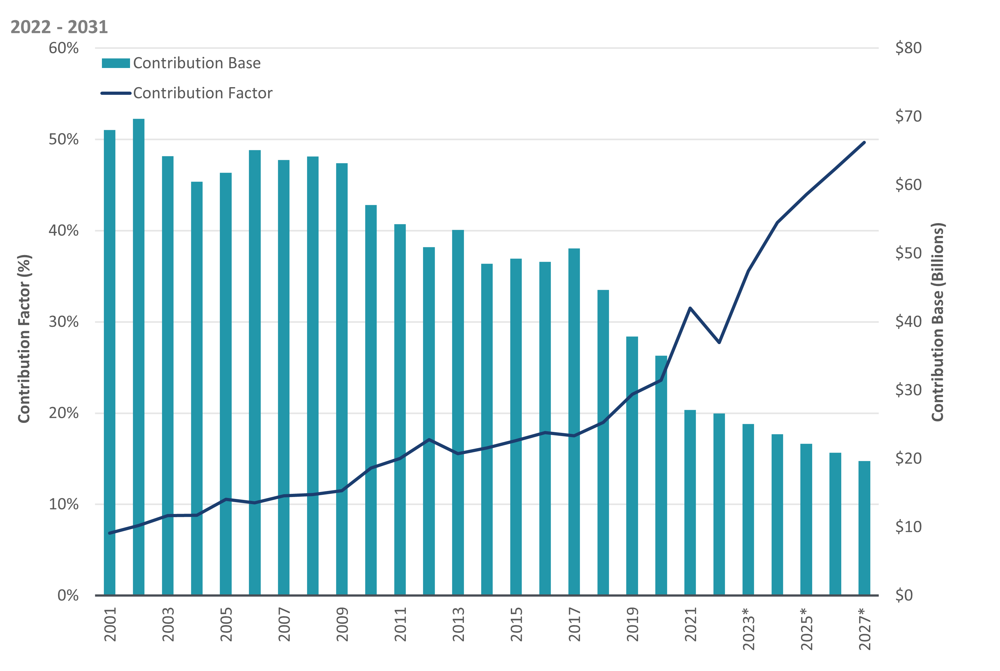

## Table of Contents

## What is the Universal Service Fund (USF)?

The Universal Service Fund (USF) is a program in the United States that helps make sure everyone can use phone and internet services, no matter where they live or how much money they have. It collects money from phone companies and uses it to support programs that help people in rural areas, schools, libraries, and low-income families get access to these services.

The USF is managed by the Federal Communications Commission (FCC). It has different parts, like the High-Cost program, which helps people in rural areas, and the Lifeline program, which helps low-income families. By doing this, the USF tries to make sure that everyone in the country can stay connected and use important communication tools.

## What are the origins and history of the Universal Service Fund?

The Universal Service Fund (USF) started in the United States in 1934. Back then, it was created to make sure that everyone could use the telephone, no matter where they lived. At first, it was all about making sure people in rural areas could get phone service. The money for the fund came from a small charge on everyone's phone bill. This idea came from the Communications Act of 1934, which said that the government should help make sure everyone could use communication services.

Over time, the USF changed to keep up with new technology. In 1996, the Telecommunications Act updated the USF to include not just phones, but also the internet. This was important because the internet was becoming a big part of everyday life. The USF started to help schools, libraries, and low-income families get internet access. Today, the USF is still run by the Federal Communications Commission (FCC), and it keeps working to make sure everyone can use phone and internet services, no matter where they live or how much money they have.

## Who administers the Universal Service Fund?

The Universal Service Fund (USF) is run by the Federal Communications Commission (FCC). The FCC is a group in the U.S. government that makes rules about phones and the internet. They make sure the USF is used the right way to help people.

The FCC collects money for the USF from phone companies. They then use this money to support different programs. These programs help people in rural areas, schools, libraries, and low-income families get phone and internet services.

## What are the main goals of the Universal Service Fund?

The main goal of the Universal Service Fund (USF) is to make sure everyone in the United States can use phone and internet services. It wants to help people no matter where they live or how much money they have. This means people in rural areas, who might not have easy access to these services, can still use them. The USF also helps schools and libraries get internet, so students and people looking for information can use it.

Another important goal is to help low-income families. The USF has a program called Lifeline that gives discounts on phone and internet services to people who need it. By doing this, the USF makes sure that everyone can stay connected and use important communication tools. This helps people stay in touch with family, find jobs, and get important information.

## How is the Universal Service Fund financed?

The Universal Service Fund (USF) is financed by collecting money from phone companies. These companies add a small charge to their customers' bills, and this money goes into the USF. The Federal Communications Commission (FCC) decides how much money needs to be collected to support the different programs of the USF.

The money collected is used to help people in rural areas, schools, libraries, and low-income families get phone and internet services. This way, the USF can make sure that everyone in the United States can use these important communication tools, no matter where they live or how much money they have.

## What types of programs does the Universal Service Fund support?

The Universal Service Fund supports different programs to help people get phone and internet services. One program is the High-Cost program, which helps people in rural areas where it's expensive to set up phone and internet services. This program makes sure people in these areas can still use these services, even if it costs more to get them there.

Another program is the Lifeline program, which helps low-income families. It gives discounts on phone and internet services so that families with less money can still stay connected. This is important for things like finding jobs, staying in touch with family, and getting important information.

The USF also supports the E-Rate program, which helps schools and libraries get internet services. This means students and people looking for information can use the internet to learn and do research. By supporting these programs, the USF makes sure everyone in the United States can use phone and internet services, no matter where they live or how much money they have.

## How does the Universal Service Fund benefit rural and low-income communities?

The Universal Service Fund helps people in rural areas by making sure they can use phone and internet services. In these areas, it can be expensive to set up these services because there are fewer people to share the costs. The High-Cost program from the USF gives money to phone and internet companies to help them provide services in these places. This means people in rural areas can stay connected with family, friends, and important services like doctors and schools, even if they live far away from big cities.

The USF also helps low-income families through the Lifeline program. This program gives discounts on phone and internet services, so families with less money can still use them. Being able to use these services is important for finding jobs, staying in touch with family, and getting important information. By helping low-income families stay connected, the USF makes sure they have the same opportunities as everyone else to use important communication tools.

## What challenges does the Universal Service Fund face in its current implementation?

The Universal Service Fund faces some challenges in its current setup. One big challenge is keeping up with new technology. The internet and phones keep changing, and the USF needs to change too. It can be hard to make sure the money is used in the best way to help people with the newest technology. Another challenge is making sure the money is spent fairly. Some people think that the USF spends too much money on some programs and not enough on others. This can make it hard to help everyone who needs it.

Another issue is that the USF gets its money from a charge on phone bills. Some people think this charge is too high, and it can be hard for phone companies to collect it. This can make it tough for the USF to get enough money to help everyone. Also, the USF has to work with different phone and internet companies, and sometimes these companies don't agree on how to use the money. This can slow down the process of getting help to people who need it.

## How has the role of the Universal Service Fund evolved with technological advancements?

The Universal Service Fund started in 1934 to help people in rural areas get phone service. Back then, phones were the main way to communicate, and the USF made sure everyone could use them. Over time, as technology changed, the USF had to change too. In 1996, the Telecommunications Act updated the USF to include the internet. This was important because the internet was becoming a big part of everyday life. The USF started helping schools, libraries, and low-income families get internet access, not just phone service.

Today, the USF keeps up with new technology by supporting different programs. The High-Cost program helps people in rural areas get both phone and internet services, even if it's expensive to set up there. The Lifeline program gives discounts on these services to low-income families, so they can stay connected. The E-Rate program helps schools and libraries get internet, which is important for learning and research. By adapting to new technology, the USF makes sure everyone can use important communication tools, no matter where they live or how much money they have.

## What are the proposed reforms to enhance the effectiveness of the Universal Service Fund?

People have come up with different ideas to make the Universal Service Fund work better. One idea is to change how the USF gets its money. Right now, it comes from a charge on phone bills, but some people think it should come from other places too, like internet bills. This could help the USF get more money to help more people. Another idea is to make the rules clearer about how the money is spent. This would help make sure the money is used in the best way to help everyone who needs it.

Another big idea is to focus more on new technology. The USF needs to keep up with things like better internet and new ways to communicate. Some people think the USF should spend more money on these new technologies to make sure everyone can use them. Also, some people want to make sure the USF helps people in a fair way. This means spending money on programs that help the most people, like helping low-income families and people in rural areas get better internet. By making these changes, the USF could work better and help more people stay connected.

## How does the Universal Service Fund contribute to digital inclusion and broadband access?

The Universal Service Fund helps with digital inclusion and broadband access by making sure everyone can use the internet, no matter where they live or how much money they have. It does this through programs like the High-Cost program, which helps people in rural areas get internet service. In these areas, it can be expensive to set up internet, so the USF gives money to companies to help them provide service there. This way, people in rural areas can use the internet to stay connected with family, find jobs, and learn new things.

The USF also helps low-income families with the Lifeline program. This program gives discounts on internet and phone services, so families with less money can still use them. Having internet access is important for these families to find jobs, stay in touch with family, and get important information. By helping these families stay connected, the USF makes sure they have the same opportunities as everyone else to use important communication tools. This helps with digital inclusion by making sure everyone can be part of the digital world.

## What are the future prospects and potential expansions of the Universal Service Fund?

The Universal Service Fund (USF) is likely to keep changing to help more people in the future. One big thing it might do is focus more on new technology, like better internet and new ways to communicate. This could mean spending more money on programs that help people get these new technologies, especially in places where it's hard to get them, like rural areas. The USF might also start getting money from different places, not just phone bills. For example, it could get money from internet bills too. This would help the USF have more money to help more people.

Another thing the USF might do in the future is make sure it helps people in a fair way. This means spending money on programs that help the most people, like helping low-income families and people in rural areas get better internet. The USF could also make its rules clearer about how the money is spent. This would help make sure the money is used in the best way to help everyone who needs it. By making these changes, the USF could work better and help more people stay connected and be part of the digital world.

## References & Further Reading

[1]: Alleman, J., & Rappoport, P. (2005). ["Universal Service: A New Definition?"](https://www.sciencedirect.com/science/article/pii/S0308596109001220) Telecommunications Policy.

[2]: ["Universal Service in a Digital Age: The Evolving Regulatory Landscape"](https://www.researchgate.net/publication/325888315_IS_UNIVERSAL_SERVICE_JUSTIFIED_BY_THE_PUBLIC_INTEREST_FROM_THE_EARLY_DAYS_TO_THE_DIGITAL_AGE) by the Federal Communications Commission (FCC).

[3]: Milgrom, P. R., & Tadelis, S. (1999). ["Prisoners of the Lighthouse: The Theory and Politics of Cost-Benefit Analysis"](https://www.semanticscholar.org/paper/How-Artificial-Intelligence-and-Machine-Learning-Milgrom-Tadelis/77235c6cc2a8299cd7c6f52f96e15e10a6d6d498) in the Journal of Economic Perspectives.

[4]: Marcus, J. S. (1997). ["The Telecommunications Act of 1996: A Case of Regulatory Paradigm Change"](https://www.congress.gov/bill/104th-congress/senate-bill/652) Journal of Policy Analysis and Management.

[5]: ["Broadband Internet Regulation and the Universal Service Fund"](https://crsreports.congress.gov/product/pdf/R/R46780) by the Brookings Institution.