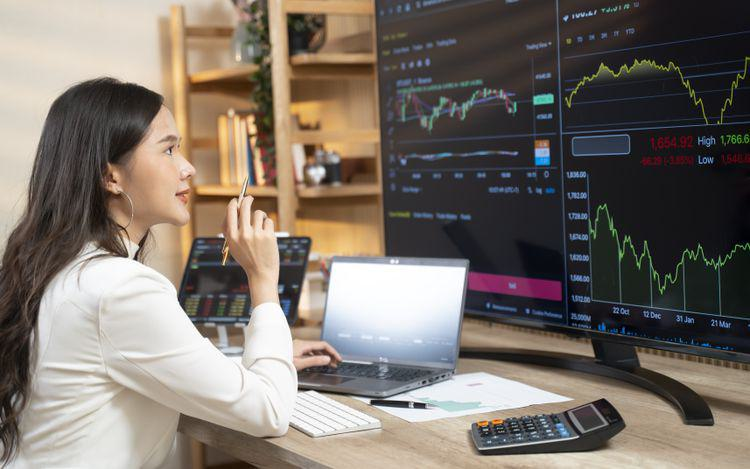

In the finance world, 'investment securities finance algo trading' represents a sophisticated synergy between technology and investing, where precision and efficiency drive market transactions. Algorithmic trading has emerged as a cornerstone strategy, particularly among institutional investors who benefit from its capacity to execute trades at speeds and frequencies that far exceed human capabilities. By utilizing complex computer algorithms, this trading approach allows for the automatic buying and selling of securities based on predefined criteria, optimizing transaction timing to capitalize on market inefficiencies.

The integration of securities, finance, and algorithmic trading marks a transformative shift in how financial markets operate. This method not only enhances transactional accuracy but also minimizes human error, reduces costs, and increases the potential for substantial profits. Algorithms can process vast amounts of financial data and execute transactions within milliseconds, which is essential in the high-stakes arena of modern trading.



Moreover, with the continuous advancements in technology, particularly in artificial intelligence (AI) and machine learning, the efficiency and predictive power of trading algorithms are poised to improve further. These technological enhancements promise to refine algorithms' ability to analyze market trends and adjust strategies in real-time, heralding a new era of investment opportunities.

As the finance industry stands on the cusp of these innovative developments, the impact of AI and machine learning on trading algorithms is expected to be profound. Such advancements could lead to more dynamic trading strategies and even more precise price predictions, allowing investors to optimize their portfolios effectively. As these technologies continue to evolve, the potential for integrating them into the algorithmic trading landscape suggests a promising future for the field.

## Table of Contents

## What Are Investment Securities?

Investment securities are financial instruments that represent an ownership position, a creditor relationship, or rights to ownership. The principal categories of investment securities include stocks, bonds, and exchange-traded funds (ETFs). These instruments are crucial components of financial markets and play an integral role in algorithmic trading systems due to their liquidity, regulatory oversight, and well-established market infrastructure.

Stocks, or equities, indicate ownership in a company and are characterized by their potential for high returns and high volatility. They are traded on stock exchanges where prices can fluctuate significantly based on company performance, market conditions, and investor sentiment. Bonds represent loans made by the investor to a borrower, typically corporate or governmental entities. These debt securities are generally considered less volatile than stocks and provide periodic interest payments, making them attractive for income-focused algorithmic trading strategies.

ETFs are investment funds traded on stock exchanges, similar to stocks, and hold a diversified portfolio of assets such as stocks, bonds, or commodities. ETFs have gained prominence due to their diversification benefits, cost-effectiveness, and tax efficiency. Algorithmic trading often involves ETFs due to their [liquidity](/wiki/liquidity-risk-premium) and the ability to track various market indices or sectors.

Different types of investment securities cater to different investment objectives and risk profiles. Stocks might be chosen for growth-oriented strategies, bonds for income-generating strategies, and ETFs for diversification and hedging purposes. Understanding the characteristics and roles of these securities is essential for constructing effective [algorithmic trading](/wiki/algorithmic-trading) strategies. 

Algorithmic trading strategies often concentrate on listed securities, which are those that are publicly traded on stock exchanges. This focus is primarily because listed securities offer high liquidity, ensuring that trades can be executed swiftly and with minimal price impact. Additionally, these securities are subject to regulatory standards, which provide transparency and reduce the risk of fraudulent activities.

In summary, investment securities form the bedrock of algorithmic trading systems, which leverage their liquidity and structured nature to develop complex trading strategies aimed at capitalizing on market inefficiencies and generating returns.

## Basics of Algorithmic Trading

Algorithmic trading uses pre-set rules and frameworks to trade financial securities automatically. At its core, this process involves utilizing computer programs to execute trades at speeds unattainable by human traders. This automation enables traders to capitalize on market conditions with agility and precision, offering several key advantages. The ability to conduct high-speed transactions reduces human error, minimizes costs, and maximizes profits due to quick reaction times and efficient execution.

Several common strategies underpin algorithmic trading. Trend following involves identifying market trends and executing trades that align with these patterns. This strategy is grounded in the assumption that asset prices moving in a specific direction tend to continue in that direction for a period. Arbitrage opportunities arise when a security's price differs across multiple markets, and algorithms can exploit these differences by buying low in one market and selling high in another. Index fund rebalancing involves algorithms that automatically adjust the composition of an index fund to maintain a particular portfolio structure. This ensures alignment with the fund's objectives, such as mirroring a specific market index.

Algorithmic trading strategies are not only efficient but also scalable. Algorithms can handle large volumes of transactions simultaneously, providing a level of scalability that is challenging for manual operations. This scalability enables traders to leverage diverse market conditions, from volatile environments to more stable trends, capitalizing on opportunities as they arise.

In practice, implementing algorithmic trading involves several technical elements. For example, traders often use Python for its extensive libraries and frameworks that support financial data analysis and trading automation. A simple Python script for a basic trading strategy might look like this:

```python
import pandas as pd

def trend_following_strategy(data):
    data['Signal'] = 0
    data['Avg_Price'] = data['Close'].rolling(window=10).mean()  # 10-day simple moving average
    data['Signal'][10:] = np.where(data['Close'][10:] > data['Avg_Price'][10:], 1, 0)  # Buy signal
    data['Position'] = data['Signal'].diff()
    return data

# Sample dataframe 'df' containing stock price data
df = pd.read_csv('stock_data.csv')
signals = trend_following_strategy(df)
```

This code uses the pandas library to compute a simple moving average of a stock's closing price, generating buy signals when the price exceeds the moving average. This exemplifies how algorithms can systematically apply rules to make trading decisions, executing trades with speed and precision that human traders cannot match. Overall, the integration of automated systems revolutionizes traditional trading, yielding significant efficiencies and advantages in the financial markets.

## Technical Requirements for Algo Trading

Technical infrastructure is crucial for the successful implementation of algorithmic trading strategies. The foundation of such systems lies in sophisticated software that facilitates the automation of trading decisions. This software is often developed using programming languages like Python or C++, which are preferred for their versatility and efficiency in handling complex algorithms and large sets of data.

A core requirement for algorithmic trading is a reliable internet connection. This ensures real-time access to market data streams, which are essential for making timely trading decisions. Market data, including current prices, trading volumes, and financial news, provides the necessary inputs for algorithms to function correctly. Access to high-quality, low-latency data is vital, as even minor delays can impact the profitability of trades.

Furthermore, traders need to possess strong programming skills to develop and maintain trading algorithms. These skills are essential for encoding trading logic and ensuring that it operates as intended. The ability to write efficient code enables traders to quickly respond to changing market conditions and tweak algorithms as needed.

Backtesting and simulation platforms play a significant role in refining and validating trading strategies before deployment. In [backtesting](/wiki/backtesting), historical market data is used to simulate trading activity, allowing traders to assess the efficacy and reliability of their algorithms in various market conditions without financial risk. This step is crucial to identify potential pitfalls and optimize algorithm performance.

The effectiveness of algorithmic trading is also heavily dependent on speed, network latency, and hardware capabilities. High-frequency trading ([HFT](/wiki/high-frequency-trading-strategies)), a subset of algorithmic trading, requires ultra-low latency communication networks and powerful hardware to execute trades in fractions of a second. Any lag in the system, whether due to internet speeds or processing power, can lead to missed opportunities and reduced profits.

In summary, the technical requirements for algorithmic trading encompass a robust integration of software development, data acquisition, and computational efficiency. Traders must ensure that their systems are equipped to handle the demands of rapid decision-making and execution in financial markets.

## Advantages and Challenges of Algo Trading

Algorithmic trading, known for its speed and efficiency, offers numerous advantages in the world of finance. By leveraging computer algorithms, traders can execute thousands of transactions in a fraction of a second, significantly outpacing human capabilities. This speed allows traders to capitalize on short-lived market opportunities that often arise in milliseconds, thereby maximizing potential profits.

Efficiency is another prominent benefit. Automated trading systems can handle vast volumes of data and execute trades without the fatigue that affects human traders. This efficiency ensures minimal intervention, allowing traders to focus on developing and refining strategies. Furthermore, algorithmic trading eliminates emotional biases, ensuring that trades are executed based on pre-defined criteria without succumbing to fear, greed, or other psychological factors. This emotionless approach is crucial in maintaining consistency and discipline in trading activities.

Reduced transaction costs stand out as a financial advantage. Algorithmic trading optimizes the timing of trades to minimize the market impact and avoid incurring high costs associated with manual trades. Additionally, by automating repetitive tasks, firms can save on operational costs that would otherwise require significant human resources.

However, algorithmic trading does come with its set of challenges. The heavy reliance on technology means that any technical failure, such as software bugs or network outages, can lead to significant financial losses. Market [volatility](/wiki/volatility-trading-strategies) also poses a risk, as algorithms may misinterpret rapid and unpredictable price movements, leading to undesirable trades.

Creating robust and adaptable algorithms is crucial. They must be sophisticated enough to handle different market conditions but simple enough to avoid unnecessary complexity that can introduce vulnerabilities. Traders need to constantly update and test their algorithms to account for changes in market dynamics.

Regulatory considerations add another layer of complexity. As markets evolve, so do the regulations governing them. It's critical for traders to ensure their algorithms comply with current laws to avoid penalties and sanctions. For instance, regulations may impose restrictions on high-frequency trading or mandate transparency in algorithmic strategies.

Despite these challenges, algorithmic trading remains a mainstay in financial markets. Continuous technological advancements, such as improvements in computational power and data analytics, are enhancing the capabilities and resilience of trading algorithms. Consequently, the field is evolving rapidly, with successful traders increasingly required to possess both financial acumen and technical expertise to navigate this dynamic landscape effectively. As algorithmic trading progresses, its role in shaping future market strategies only seems to be expanding.

## Future of Algo Trading in Investment Securities

Integrating [artificial intelligence](/wiki/ai-artificial-intelligence) (AI) and [machine learning](/wiki/machine-learning) into algorithmic trading is poised to redefine the landscape of investment securities. AI-driven algorithms can process vast amounts of data at unprecedented speeds, offering the potential for significant disruption and transformation in financial markets. These technologies enhance predictive models, enabling investors to capitalize on market trends and anomalies more effectively.

AI and machine learning facilitate more sophisticated pattern recognition, crucial for developing adaptive trading strategies. Traditional algorithmic trading relies on static, predefined rule sets. In contrast, machine learning models can update and refine their strategies based on real-time data, leading to improved predictive accuracy and adaptability. For example, Reinforcement Learning, a type of machine learning, allows trading systems to learn optimal strategies through a reward-based mechanism, continually improving decision-making processes.

```python
import numpy as np

# Example of a simple reinforcement learning environment setup
class TradingEnvironment:
    def __init__(self, initial_cash, data):
        self.cash = initial_cash
        self.data = data
        self.current_step = 0

    def step(self, action):
        price = self.data[self.current_step]
        if action == "buy" and self.cash >= price:
            self.cash -= price
            reward = -price
        elif action == "sell":
            self.cash += price
            reward = price
        else:
            reward = 0
        self.current_step += 1
        return reward

# Sample usage
data = np.array([100, 105, 102, 110, 120])
env = TradingEnvironment(initial_cash=500, data=data)
```

As AI technologies advance, they will usher in new paradigms for trading strategies, potentially leading to innovative approaches such as predictive analytics for volatility forecasting and sentiment analysis from social media feeds. These developments have substantial implications for enhancing decision-making capabilities, providing market participants with insights previously unattainable through conventional methods.

However, the integration of these technologies necessitates vigilance. Continuous monitoring of changes and trends in algorithmic models is crucial. The competitive advantage gained from AI-enhanced trading strategies relies on the ability to adapt to ever-evolving market conditions. This demands a robust understanding of both financial markets and underlying technology to navigate the increasingly complex landscape effectively. As a result, staying informed about technological advancements and regulatory frameworks will be essential for those seeking to leverage these opportunities.

Ultimately, the fusion of AI, machine learning, and investment securities promises to provide more efficient markets, reducing inefficiencies and potentially increasing overall market liquidity. As these technologies continue to advance, the future of algo trading holds immense potential for transforming how financial markets operate.

## Conclusion

Investment securities finance algorithmic trading is poised to significantly influence market dynamics. The amalgamation of technology with financial markets continues to unlock substantial potential, making it imperative for market participants to harness technological advancements. Algorithmic trading, driven by increasingly sophisticated financial algorithms, manages the delicate balance between efficiency and risk. As algorithms grow more advanced, they offer the prospect of improved precision and reduced latency, fundamentally transforming trading practices.

Despite the inherent challenges, such as market volatility and the necessity for robust, adaptable algorithms, the promise of algorithmic trading lies in its capacity for profit maximization and operational efficiency. Market participants must navigate the complexities of regulatory environments and technical infrastructures to achieve success. Here, the role of robust programming, often in Python, becomes crucial. Python's versatility and adaptability make it a preferred language for developing and refining algorithmic trading strategies, facilitating backtesting, and enhancing predictive capabilities.

Furthermore, as technology continues to evolve, the potential benefits of algorithmic trading become increasingly apparent. Investors and traders can anticipate significant advancements in predictive modeling, risk management, and overall decision-making processes. Such technological progress promises not only to enhance trading performance but also to revolutionize the very fabric of securities trading.

In conclusion, the trajectory of investment securities finance algorithmic trading is undeniably upward, with technology paving the way for a bright future. The continuous evolution of this field calls for vigilance and adaptability among market participants, ensuring they remain informed and responsive to emerging trends and technological innovations.

## References & Further Reading

[1]: Bergstra, J., Bardenet, R., Bengio, Y., & Kégl, B. (2011). ["Algorithms for Hyper-Parameter Optimization."](https://dl.acm.org/doi/10.5555/2986459.2986743) Advances in Neural Information Processing Systems 24.

[2]: ["Advances in Financial Machine Learning"](https://www.amazon.com/Advances-Financial-Machine-Learning-Marcos/dp/1119482089) by Marcos Lopez de Prado

[3]: ["Evidence-Based Technical Analysis: Applying the Scientific Method and Statistical Inference to Trading Signals"](https://www.amazon.com/Evidence-Based-Technical-Analysis-Scientific-Statistical/dp/0470008741) by David Aronson

[4]: ["Machine Learning for Algorithmic Trading"](https://github.com/stefan-jansen/machine-learning-for-trading) by Stefan Jansen

[5]: ["Quantitative Trading: How to Build Your Own Algorithmic Trading Business"](https://www.amazon.com/Quantitative-Trading-Build-Algorithmic-Business/dp/1119800064) by Ernest P. Chan