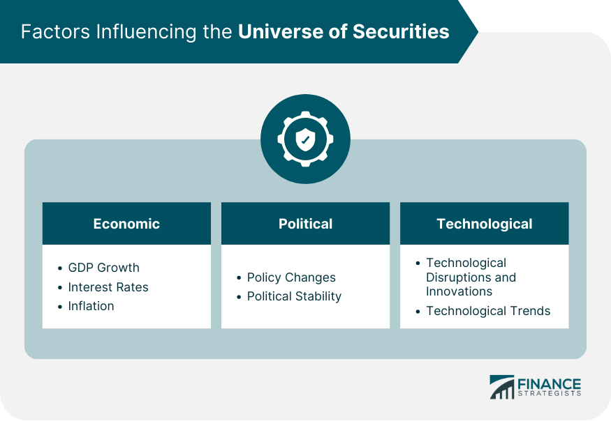

## Table of Contents

## What is a security in the financial context?

In the financial world, a security is a tradable financial asset that represents a form of ownership or a claim on something valuable. This can include stocks, bonds, and other types of investments. When you buy a security, you are essentially buying a piece of a company or a promise of future payments. For example, if you buy a stock, you own a small part of that company. If you buy a bond, you are lending money to the issuer, who promises to pay you back with interest.

Securities are important because they allow companies and governments to raise money. When a company issues stocks, it can use the money from selling those stocks to grow its business. When a government issues bonds, it can use the money to fund public projects. Investors buy these securities hoping to earn a return on their investment, either through rising stock prices, dividend payments, or interest from bonds. This system helps the economy by moving money from investors to places where it can be used productively.

## What are the different types of securities?

Securities come in different forms, but the main types are stocks, bonds, and derivatives. Stocks are pieces of ownership in a company. When you buy a stock, you own a small part of that company. The value of the stock can go up or down based on how well the company is doing. Bonds are like loans you give to a company or government. They promise to pay you back with interest over time. Bonds are usually seen as safer than stocks because they have a set schedule for payments.

Derivatives are a bit more complicated. They are financial contracts that get their value from something else, like a stock or a commodity. Common types of derivatives include options and futures. Options give you the right to buy or sell something at a set price in the future. Futures are agreements to buy or sell something at a set price on a specific date. Derivatives can be used to manage risk or to bet on future price movements.

There are also other types of securities like mutual funds and exchange-traded funds (ETFs). These are collections of different securities, like stocks and bonds, that are managed by professionals. When you buy into a mutual fund or [ETF](/wiki/etf-trading-strategies), you are buying a small piece of all the securities in that fund. This can be a good way to diversify your investments without having to pick individual stocks or bonds yourself.

## How do securities contribute to the economy?

Securities help the economy by letting companies and governments raise money. When a company wants to grow, it can sell stocks to get money from investors. This money can be used to build new factories, hire more workers, or develop new products. Governments can also sell bonds to fund public projects like roads and schools. By selling securities, companies and governments can get the money they need without having to borrow from banks or use their own money.

When people buy securities, they are also helping the economy. Investors buy stocks and bonds hoping to make money. If the company does well, the value of the stock goes up, and the investor makes a profit. If the company pays dividends, the investor gets regular payments. With bonds, investors get interest payments. This encourages people to save and invest their money, which helps the economy grow. It also means that money is being used in places where it can create jobs and make the economy stronger.

## What is the role of a stock exchange in the universe of securities?

A stock exchange is like a big marketplace where people buy and sell securities, like stocks and bonds. It's a place where companies can list their stocks for people to buy, and it helps to set the price of these securities based on what people are willing to pay. When a company wants to sell stocks to raise money, it can list its stocks on a stock exchange. Then, investors can buy and sell these stocks easily on the exchange.

Stock exchanges also help make the market fair and open. They have rules that everyone has to follow, which helps prevent cheating and keeps things honest. They also share a lot of information about the companies listed on the exchange, like how much money the company is making and other important details. This helps investors make smart choices about what to buy and sell. By doing all this, stock exchanges play a big part in making the world of securities work smoothly and helping the economy grow.

## How are securities bought and sold?

Securities like stocks and bonds are bought and sold through a system called a stock exchange. Imagine a big marketplace where people come to trade. If you want to buy a stock, you can go to the stock exchange and find someone who wants to sell that stock. You agree on a price, and the exchange helps make sure the trade happens fairly. You can do this through a broker, who is like a helper that does the buying and selling for you. You tell your broker what you want to buy or sell, and they take care of the rest.

The price of securities changes all the time based on what people are willing to pay. If more people want to buy a stock than sell it, the price goes up. If more people want to sell, the price goes down. This happens quickly on the stock exchange, with prices changing every second. You can also buy and sell securities online through apps and websites, which makes it easy to trade from anywhere. This whole system helps companies raise money and lets investors try to make a profit by buying and selling securities.

## What are the risks associated with investing in securities?

Investing in securities like stocks and bonds can be risky. One big risk is that the value of your investment can go down. If you buy a stock and the company does not do well, the price of the stock can drop, and you might lose money. This can happen because of many reasons, like the company not making enough profit or something bad happening in the world that affects the company. Another risk is that the company might go bankrupt, which means it can't pay back its debts. If you own stocks in that company, they could become worthless.

There are also risks with bonds. Even though bonds are usually seen as safer than stocks, there's still a chance the company or government that issued the bond might not be able to pay you back. This is called default risk. Interest rates can also affect the value of bonds. If interest rates go up, the value of your bond might go down because new bonds will pay more interest. Another thing to think about is inflation. If prices go up a lot, the money you get from your investments might not be worth as much as you thought.

These risks mean that investing in securities is not a sure thing. You could make money, but you could also lose it. That's why it's important to think carefully about your investments and maybe talk to a financial advisor to help you make good choices.

## What is the difference between equity and debt securities?

Equity securities are like pieces of ownership in a company. When you buy a stock, you own a small part of that company. If the company does well, the value of your stock can go up, and you might get dividends, which are like little payments from the company's profits. But if the company does badly, the value of your stock can go down, and you might lose money. Equity securities can be risky, but they also have the potential for big rewards if the company grows a lot.

Debt securities are different. They are like loans you give to a company or government. When you buy a bond, you are lending money, and the issuer promises to pay you back with interest over time. Bonds are usually seen as safer than stocks because they have a set schedule for payments. But there's still a risk that the issuer might not be able to pay you back, which is called default risk. Debt securities can give you steady income from the interest payments, but they usually don't grow as much as stocks might.

In simple terms, equity securities give you a chance to own part of a company and share in its success or failure, while debt securities give you a more predictable return through interest payments but with less potential for big gains. Both types of securities have their own risks and rewards, and choosing between them depends on what you're looking for in an investment.

## How do derivatives function within the securities market?

Derivatives are like special contracts that get their value from something else, like a stock or a commodity. They are used in the securities market to help people manage risk or to bet on future price movements. For example, if you own a stock and you're worried its price might go down, you can use a derivative called an option to protect yourself. An option gives you the right to sell the stock at a set price in the future, even if the market price drops. This way, you can limit your losses.

Derivatives can also be used to make money by guessing what will happen to prices. Futures are another type of derivative where you agree to buy or sell something at a set price on a specific date. If you think the price of oil will go up, you can buy a futures contract for oil. If the price does go up, you can sell the contract for more than you paid for it and make a profit. But if the price goes down, you could lose money. Derivatives can be complicated and risky, but they are important tools in the securities market for managing risk and trying to make money.

## What regulatory bodies oversee the securities market and what is their role?

The main regulatory body that oversees the securities market in the United States is the Securities and Exchange Commission (SEC). The SEC's job is to make sure that the market is fair and honest. They do this by making rules that companies and investors have to follow. For example, the SEC requires companies to share important information about their business so that investors can make smart choices. They also watch the market to stop people from cheating or doing anything illegal.

In other countries, there are similar organizations that do the same kind of work. For example, in the United Kingdom, there's the Financial Conduct Authority (FCA), and in Canada, there's the Canadian Securities Administrators (CSA). These groups also make rules and watch over the market to keep it safe and fair. They work to protect investors and make sure that the securities market helps the economy grow in a good way.

## How do global economic factors influence the securities market?

Global economic factors can have a big impact on the securities market. When the world economy is doing well, people feel more confident about investing, and the prices of stocks and other securities often go up. For example, if countries are growing and making more money, companies might sell more products and make bigger profits. This can make their stocks more valuable. On the other hand, if there's a global economic problem, like a recession or a big drop in trade, it can make the securities market go down. Investors might get worried and sell their stocks, which can lower the prices.

Another way global economic factors affect the securities market is through interest rates and currency values. If interest rates go up in one country, it can make borrowing money more expensive for companies, which might slow down their growth and affect their stock prices. Also, if a country's currency gets weaker compared to others, it can make its exports cheaper and more attractive, which might help companies that sell things to other countries. But it can also make imports more expensive, which might hurt companies that need to buy things from abroad. All these global factors are connected and can make the securities market move in different ways.

## What advanced trading strategies can be used in the securities market?

One advanced trading strategy in the securities market is called "[day trading](/wiki/day-trading-spy)." Day traders buy and sell stocks quickly, often within the same day, to make small profits from small changes in stock prices. They use a lot of information and tools to try to guess which way the stock prices will go. Day trading can be risky because it's hard to always guess right, but it can also be exciting and potentially profitable if you're good at it.

Another strategy is "options trading." Options are a type of derivative that give you the right to buy or sell a stock at a set price in the future. Traders use options to bet on whether a stock's price will go up or down. For example, if you think a stock's price will go up, you can buy a "call option" to buy the stock at a lower price later. If you're right, you can make money. Options trading can be complicated and risky, but it can also help you make money in different ways than just buying and holding stocks.

A third strategy is "[algorithmic trading](/wiki/algorithmic-trading)," where computers use math formulas to decide when to buy and sell securities. These algorithms can look at a lot of data very quickly and make trades based on what they find. This can be faster and sometimes more accurate than a person making the same decisions. Algorithmic trading is used by big investors and can help them make money by taking advantage of small price changes in the market.

## How does algorithmic trading impact the dynamics of the securities market?

Algorithmic trading changes how the securities market works by making things happen very fast. Computers use math formulas to look at a lot of information and decide when to buy or sell stocks. This can happen in just a few seconds, much faster than a person could do it. Because of this, the market can move quickly, with prices changing a lot in a short time. Big investors use algorithmic trading to take advantage of small price changes and make money. This can make the market more efficient because the computers can find the best prices and make trades happen smoothly.

But algorithmic trading can also make the market more risky. Sometimes, if a lot of computers start buying or selling at the same time, it can cause big swings in stock prices. This is called a "flash crash," and it can happen very quickly. Also, because computers are making so many trades, it can be hard for regular people to keep up. They might feel like the market is moving too fast for them to understand or make good choices. So, while algorithmic trading can help the market work better, it can also make it more complicated and unpredictable.

## References & Further Reading

[1]: Bergstra, J., Bardenet, R., Bengio, Y., & Kégl, B. (2011). ["Algorithms for Hyper-Parameter Optimization."](https://dl.acm.org/doi/10.5555/2986459.2986743) Advances in Neural Information Processing Systems 24.

[2]: ["Advances in Financial Machine Learning"](https://www.amazon.com/Advances-Financial-Machine-Learning-Marcos/dp/1119482089) by Marcos Lopez de Prado

[3]: ["Evidence-Based Technical Analysis: Applying the Scientific Method and Statistical Inference to Trading Signals"](https://www.amazon.com/Evidence-Based-Technical-Analysis-Scientific-Statistical/dp/0470008741) by David Aronson

[4]: ["Machine Learning for Algorithmic Trading"](https://github.com/stefan-jansen/machine-learning-for-trading) by Stefan Jansen

[5]: ["Quantitative Trading: How to Build Your Own Algorithmic Trading Business"](https://www.amazon.com/Quantitative-Trading-Build-Algorithmic-Business/dp/1119800064) by Ernest P. Chan