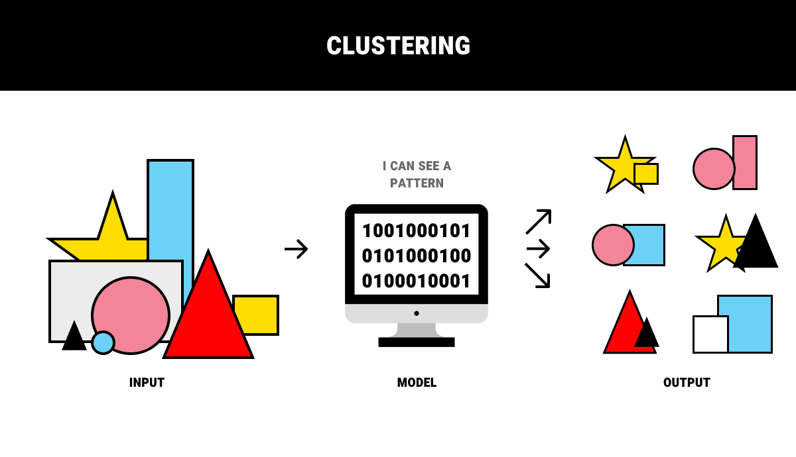

## Table of Contents

## What is an unlabeled example in machine learning?

In machine learning, an unlabeled example refers to a piece of data that does not have a corresponding label or category assigned to it. Imagine you have a collection of photos, and you want to teach a computer to recognize whether each photo contains a cat or a dog. If some photos do not have any information telling the computer whether they show a cat or a dog, those photos are considered unlabeled examples.

Unlabeled examples are common in real-world datasets, especially when data collection is automated or when labeling is expensive or time-consuming. These examples can still be useful in certain machine learning techniques, such as unsupervised learning, where the goal is to find patterns or groupings within the data without needing predefined labels. In contrast, supervised learning relies on labeled examples to train models to make accurate predictions or classifications.

## How do unlabeled examples differ from labeled examples?

Unlabeled examples are pieces of data that don't have any information telling a computer what they are or what category they belong to. For example, if you have a bunch of pictures and you want to teach a computer to recognize if they show cats or dogs, an unlabeled example would be a picture without any information saying it's a cat or a dog. These examples are common in big data collections where it's hard or costly to add labels to every piece of data.

On the other hand, labeled examples have clear information attached to them that tells the computer exactly what they are. Using the same example, a labeled picture would come with a tag saying it's a cat or a dog. These labeled examples are crucial for supervised learning, where the computer learns from these tags to make predictions or sort new data correctly. Unlabeled examples, however, can be used in unsupervised learning, where the computer looks for patterns or groups in the data without needing any labels.

## Why are unlabeled examples important in machine learning?

Unlabeled examples are important in [machine learning](/wiki/machine-learning) because they help us understand real-world data better. In the real world, not all data comes with labels. Imagine you're sorting pictures into groups without knowing what each picture is supposed to be. By using unlabeled examples, computers can find patterns or groups in the data on their own. This is called unsupervised learning, and it's useful when we want to discover new things or organize data without having all the answers beforehand.

Another reason unlabeled examples are important is that they're often easier and cheaper to collect. Labeling data can take a lot of time and money, especially if you need experts to do it. For example, if you want to teach a computer to recognize different types of birds, getting a bird expert to label each picture can be costly. By using unlabeled examples, you can still train a computer to sort and understand data, even if you don't have all the labels. This makes machine learning more accessible and practical for many different kinds of projects.

## What are some common sources of unlabeled data?

Unlabeled data often comes from places where information is collected without any specific labels. For example, social media platforms like Instagram or X (formerly Twitter) gather lots of pictures, videos, and text posts every day. None of these posts come with labels saying what they are about. Instead, they are just raw data that can be used to train computers to find patterns on their own.

Another common source of unlabeled data is from sensors and devices. Think about smartwatches or fitness trackers that record your steps, heart rate, and sleep patterns. This data is collected automatically and doesn't come with labels telling the computer what it means. Scientists and engineers use this kind of data to study how people move or sleep, without needing to know exactly what each piece of data represents beforehand.

## How can unlabeled examples be used in unsupervised learning?

Unlabeled examples are really helpful in unsupervised learning. This type of learning is when a computer tries to find patterns or groups in data all by itself, without anyone telling it what the data means. Imagine you have a bunch of different fruits, but no one told you what each fruit is called. Unsupervised learning is like trying to sort these fruits into groups based on how they look or feel, without knowing their names. Computers can do the same with data, finding ways to organize it that might help us learn new things.

For example, if you have a lot of pictures without labels, a computer can look at these pictures and start to group them based on what it sees. Maybe it notices that some pictures have a lot of green and others have a lot of blue, so it sorts them into different groups. This can help us understand the data better, even if we don't know exactly what each picture shows. By using unlabeled examples, computers can discover hidden patterns and structures in the data, making it easier for us to make sense of the world around us.

## What is semi-supervised learning and how does it utilize unlabeled examples?

Semi-supervised learning is a way of teaching computers that's kind of in the middle. It uses both labeled and unlabeled examples to learn. Imagine you're sorting a big pile of fruits, and you know what some of them are, but not all. You can use the fruits you know to help figure out the ones you don't know. In semi-supervised learning, the computer starts with the labeled examples to understand what different things look like, and then it uses that knowledge to help make sense of the unlabeled examples.

This method is really useful because it can make the most out of the data we have. Sometimes, it's hard or expensive to get labels for everything. By using semi-supervised learning, we can still teach the computer a lot, even if we only have labels for a small part of our data. The computer can learn from the labeled examples and then apply that learning to the unlabeled ones, helping it to sort and understand more data than it could with just labeled examples alone.

## What are the challenges of working with unlabeled data?

Working with unlabeled data can be tricky because it's like trying to solve a puzzle without knowing what the final picture should look like. When you have a bunch of pictures without labels, the computer has to guess what they might be or how to group them. This can lead to mistakes because the computer might not always see the same things that a person would. It's harder for the computer to learn accurately without clear guidance, and it might take a lot more time and effort to get good results.

Another challenge is that it can be hard to check if the computer is doing a good job. With labeled data, you can easily see if the computer got it right or wrong by comparing its answers to the labels. But with unlabeled data, there's no easy way to know if the computer's guesses are correct. This makes it tougher to improve the computer's learning because you can't tell it when it's making mistakes. Overall, while unlabeled data can help us learn new things, it comes with its own set of problems that need careful handling.

## How can techniques like clustering be applied to unlabeled examples?

Clustering is a way to group things that are similar to each other, and it works well with unlabeled examples. Imagine you have a bunch of different colored marbles, but you don't know their names. Clustering is like sorting these marbles into groups based on their colors without knowing what each color is called. A computer can do the same with data, finding ways to organize it into groups based on how similar the data points are to each other. This helps us understand the data better, even if we don't know exactly what each piece of data represents.

For example, if you have a lot of pictures of animals without labels, a computer can use clustering to group them. It might notice that some pictures have a lot of fur and others have scales, so it sorts them into different groups. This can help us see patterns in the data that we might not have noticed before. By using clustering with unlabeled examples, computers can discover hidden structures in the data, making it easier for us to make sense of the world around us.

## What role do unlabeled examples play in transfer learning?

Transfer learning is like teaching a computer to do something new by using what it already knows. Imagine you taught a computer to recognize cats in pictures. Now, you want it to recognize dogs too. Instead of starting from scratch, you can use what it learned about cats to help it learn about dogs faster. Unlabeled examples are important here because they help the computer practice and fine-tune what it already knows. By looking at lots of pictures of dogs without labels, the computer can use its cat-recognizing skills to start understanding what makes a dog a dog, even if it doesn't have labels to guide it.

Using unlabeled examples in transfer learning can make the process more efficient. The computer can use a large amount of unlabeled data to improve its understanding of new things, without needing every piece of data to be labeled. This is helpful because labeling data can be expensive and time-consuming. By combining a small set of labeled examples with a larger set of unlabeled ones, the computer can learn more quickly and accurately. This makes transfer learning a powerful tool for teaching computers new skills while saving time and resources.

## How can active learning strategies help in dealing with unlabeled data?

Active learning is a smart way to deal with unlabeled data. It's like a teacher helping a student learn by [picking](/wiki/asset-class-picking) the most important things to study. In active learning, the computer looks at the unlabeled data and picks out the examples it's not sure about. It then asks a human to label these tricky examples. This way, the computer learns more from fewer labels because it focuses on the data that will help it improve the most.

By using active learning, we can make the best use of our time and resources. Instead of labeling everything, which can be slow and costly, we only label the data that the computer needs the most. This helps the computer get better at understanding the data quickly. Active learning makes the learning process more efficient and helps us handle large amounts of unlabeled data more effectively.

## What are some advanced methods for leveraging unlabeled examples in deep learning?

In [deep learning](/wiki/deep-learning), one advanced method for using unlabeled examples is called self-supervised learning. Imagine you have a big pile of pictures without labels. Self-supervised learning lets the computer create its own labels from the data. For example, it might cover up part of a picture and then try to guess what's hidden. By doing this over and over, the computer learns to understand the pictures better, even without any real labels. This method is helpful because it can use a lot of data that would otherwise be hard to label, making the computer smarter and more useful.

Another method is called contrastive learning. This is like teaching the computer to tell things apart by showing it lots of examples. For instance, the computer might look at two pictures and try to decide if they're similar or different. It uses unlabeled examples to learn what makes things the same or different, without needing to know exactly what each picture shows. By focusing on these comparisons, the computer can learn a lot from unlabeled data, making it easier to understand and sort new information it sees.

## How can the performance of models trained on unlabeled data be evaluated?

Evaluating models trained on unlabeled data can be tricky because there are no labels to compare the model's predictions to. One way to do this is by using a small set of labeled data that was set aside and not used during training. This is called a validation set. You can use this set to see how well the model does on data it hasn't seen before. If the model makes good guesses on the validation set, it's a sign that it's learning well from the unlabeled data.

Another way to evaluate these models is by using internal measures like clustering quality. For example, if the model is grouping similar data points together, you can look at how tight these groups are and how well they're separated from each other. A common measure for this is the silhouette score, which tells you how similar an object is to its own cluster compared to other clusters. If the silhouette score is high, it means the model is doing a good job of finding meaningful patterns in the unlabeled data.

## References & Further Reading

[1]: Zhu, X., & Goldberg, A. B. (2009). ["Introduction to Semi-Supervised Learning."](https://link.springer.com/book/10.1007/978-3-031-01548-9) Synthesis Lectures on Artificial Intelligence and Machine Learning, 3(1), 1-130.

[2]: Chapelle, O., Schölkopf, B., & Zien, A. (2009). ["Semi-Supervised Learning."](https://direct.mit.edu/books/edited-volume/3824/Semi-Supervised-Learning) MIT Press.

[3]: Bengio, Y. (2012). ["Deep Learning of Representations for Unsupervised and Transfer Learning."](https://dl.acm.org/doi/10.5555/3045796.3045800) In Proceedings of the ICML Workshop on Unsupervised and Transfer Learning.

[4]: Goodfellow, I., Bengio, Y., & Courville, A. (2016). ["Deep Learning."](https://link.springer.com/article/10.1007/s10710-017-9314-z) MIT Press.

[5]: LeCun, Y., Bengio, Y., & Hinton, G. (2015). ["Deep Learning."](https://www.nature.com/articles/nature14539) Nature, 521(7553), 436-444.

[6]: Bishop, C. M. (2006). ["Pattern Recognition and Machine Learning."](https://link.springer.com/book/9780387310732) Springer.