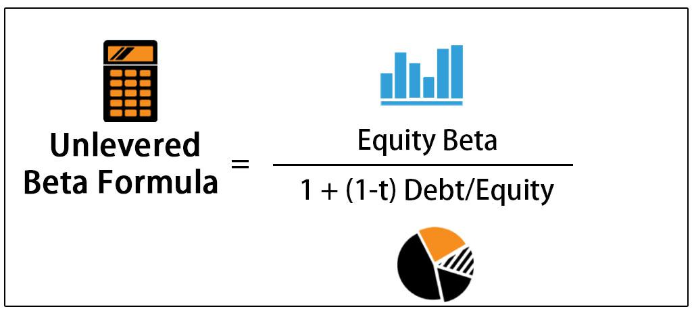

In today’s financial landscape, the calculation of beta and the isolation of unlevered beta are essential tools for investors and analysts. Beta ($\beta$) serves as a critical measure of a stock's risk relative to the market, helping investors evaluate how likely a stock's price is to change with market movements. Levered beta incorporates a company's capital structure, including its debt, while unlevered beta, also known as asset beta, excludes the effects of financial leverage, offering a clearer view of business risk. These metrics play a vital role in understanding market risk and are integral to sophisticated financial strategies such as algorithmic trading. By computing beta metrics accurately, one can optimize investment decisions, balancing risk and return to construct robust portfolios. This article aims to illuminate the distinctions between levered and unlevered beta, enhancing the reader's capability to apply these insights for effective financial analysis.

## Table of Contents



## Understanding Beta in Finance

Beta (β) is a crucial financial metric that measures the risk associated with a stock in comparison to the volatility of the overall market. It is fundamentally utilized to understand how a stock's price is likely to respond to market movements. The beta value is rooted in the Capital Asset Pricing Model (CAPM), which calculates expected stock returns based on its risk level relative to the market.

Mathematically, beta is calculated as:

$$
\beta = \frac{\text{Covariance}(R_i, R_m)}{\text{Variance}(R_m)}
$$

where $R_i$ is the return of the stock and $R_m$ is the return of the market. The covariance between the stock and the market returns represents how changes in the market return are likely to be accompanied by changes in the stock's return. Variance in market returns is a measure of the market's volatility.

Beta values are categorized as follows:
- A beta greater than 1 indicates that the stock is more volatile than the market. Such stocks are expected to experience greater fluctuations in their prices relative to market movements, potentially leading to higher returns but with increased risk.
- A beta less than 1 signifies that the stock is less volatile than the market. These stocks tend to offer more stability and smaller price changes, often appealing to risk-averse investors.
- A beta of exactly 1 suggests that the stock's price moves with the market. Such a stock's risk and return profile aligns closely with that of the overall market.

Understanding beta is essential for investors seeking to assess potential investment risk against their risk tolerance. Its application extends beyond individual stocks to mutual funds and portfolios, where the aggregate beta can inform decisions about the expected market sensitivity of investments.

## Levered vs. Unlevered Beta

Levered beta, also known as equity beta, incorporates the effects of a company's financial leverage, reflecting both business and financial risks. It is a critical measure as it considers a stock’s capital structure, where the presence of debt can amplify the stock's [volatility](/wiki/volatility-trading-strategies) in relation to the overall market. The formula to calculate levered beta ($\beta_L$) is:

$$

\beta_L = \beta_U \times \left(1 + \left(\frac{D}{E}\right) \times (1 - T)\right) 
$$

where $\beta_U$ is the unlevered beta, $\frac{D}{E}$ represents the debt-to-equity ratio, and $T$ is the corporate tax rate.

In contrast, unlevered beta, or asset beta, quantifies a company's risk without the influence of its capital structure. By isolating the company's business risk from financial leverage, unlevered beta provides a measure of a company's inherent risk regardless of its debt load. This measure is particularly useful for comparing firms across varying financial structures, as it enables the analysis of the underlying business risk without the confounding effects of capital structure differences.

The relationship between levered and unlevered beta is essential since levered beta will generally be higher than unlevered beta for firms with debt. However, by focusing on unlevered beta, analysts can better compare firms with varying levels of debt to understand the true comparative risk of the operations alone, independent of how they are financed.

This distinction is valuable for investors and analysts seeking to evaluate and compare companies on a risk-adjusted basis, providing a clearer picture by isolating the impact of capital structure. Understanding these metrics allows stakeholders to make informed decisions, particularly in equity valuation and investment strategy, where grasping the intrinsic volatility independent of financial leverage is critical.

## Calculating Unlevered Beta

Calculating unlevered beta requires the adjustment of levered beta to exclude the effects of a company's debt. This adjustment provides a clearer perspective of a company's inherent market risk, independent of its capital structure. The formula for unlevered beta ($\beta_u$) is:

$$
\beta_u = \frac{\beta_l}{1 + \left(\frac{D}{E}\right) \times (1 - T)}
$$

where $\beta_l$ is the levered beta, $D/E$ is the debt-to-equity ratio, and $T$ is the corporate tax rate. This formula ensures that the impact of financial leverage is removed, isolating the business risk associated with the company's assets.

In practice, calculating this metric manually can be cumbersome, especially with fluctuating market conditions and tax rates. However, employing programming languages like Python can significantly streamline the process, allowing for accurate and efficient computation. Below is a Python code snippet illustrating how one might calculate unlevered beta:

```python
def calculate_unlevered_beta(levered_beta, debt_equity_ratio, tax_rate):
    unlevered_beta = levered_beta / (1 + (debt_equity_ratio * (1 - tax_rate)))
    return unlevered_beta

# Example usage:
levered_beta = 1.3
debt_equity_ratio = 0.5
tax_rate = 0.25

unlevered_beta = calculate_unlevered_beta(levered_beta, debt_equity_ratio, tax_rate)
print(f"Unlevered Beta: {unlevered_beta}")
```

This code defines a function that takes the levered beta, debt-to-equity ratio, and tax rate as inputs and returns the unlevered beta. Utilizing such a programmatic approach not only enhances precision but also allows for real-time adjustments based on changing financial metrics.

## The Role of Financial Leverage

Financial leverage is a crucial concept in finance, influencing both a company's potential returns and its risk profile. By utilizing debt, a company can magnify its investment capabilities, which can lead to higher returns on equity. However, this leverage also heightens the financial risk, primarily affecting the company's beta value—an indicator of its risk relative to the broader market.

The debt-to-equity ratio is a key parameter in determining leverage. A higher debt-to-equity ratio suggests that a company is more heavily financed by debt as opposed to equity, increasing its financial risk. This elevated risk is reflected in a higher beta value, indicating that the company's stock is more volatile compared to those with lower leverage. The relationship between levered and unlevered beta can be mathematically expressed using the formula:

$$

\beta_{\text{unlevered}} = \frac{\beta_{\text{levered}}}{1 + ((1 - \text{Tax Rate}) \times \frac{\text{Debt}}{\text{Equity}})}
$$

This formula isolates the inherent business risk by removing the influence of financial leverage, allowing for a clearer evaluation of a company's operational risk. By understanding these dynamics, investors can better differentiate between the risk arising from a company's financial structure and the risk associated with its core operations. This distinction is critical for constructing portfolios that appropriately balance risk and return.

The nuanced understanding of financial leverage and its impact on beta is essential for both individual investors and institutional analysts. As companies adjust their capital structures in response to changing market conditions or strategic objectives, beta values can fluctuate, necessitating ongoing analysis. For investors, recognizing these shifts and their implications enables more informed decision-making and strategic investment management.

## Implications in Algorithmic Trading

Beta calculations play a crucial role in [algorithmic trading](/wiki/algorithmic-trading) by helping traders optimize their risk and return profiles. Beta ($\beta$) is a measure of a stock's volatility in relation to the overall market, which can be integral to creating effective trading strategies. Incorporating unlevered beta, also known as asset beta, into these strategies is particularly beneficial because it isolates a company's market risk from its financial leverage, providing a purer measure of the stock's systemic risk. This difference allows traders to focus on the underlying business risk, without the distortions caused by debt.

Unlevered beta can be calculated from levered beta using the following formula:

$$
\beta_{\text{unlevered}} = \frac{\beta_{\text{levered}}}{1 + \left(1 - \text{Tax Rate}\right) \times \frac{\text{Debt}}{\text{Equity}}}
$$

Algorithmic trading systems utilize these beta measures to dynamically adjust positions in real-time. For instance, in a volatile market, a system might reduce positions in high-beta stocks to mitigate risk, while in a stable market, it might increase exposure to these stocks to capitalize on potential returns. This dynamic adjustment of positions based on beta estimates helps manage risk effectively.

Furthermore, modern trading platforms often incorporate programming languages like Python to automate these processes, ensuring not only efficiency but also high accuracy. Here is a simple Python code snippet that demonstrates how to calculate unlevered beta:

```python
def calculate_unlevered_beta(levered_beta, tax_rate, debt, equity):
    return levered_beta / (1 + (1 - tax_rate) * (debt / equity))

levered_beta = 1.2
tax_rate = 0.3
debt = 500000
equity = 2000000

unlevered_beta = calculate_unlevered_beta(levered_beta, tax_rate, debt, equity)
print("Unlevered Beta:", unlevered_beta)
```

By incorporating such calculations into trading algorithms, traders can enhance risk management and strategy optimization. This sophisticated approach enables the development of investment strategies that are finely tuned to balance risk and return, potentially increasing the alpha generation of the trading portfolios.

## Conclusion

Beta and unlevered beta serve as essential metrics for assessing market-related risks, aiding investors and analysts in formulating effective investment strategies. By quantifying a stock's sensitivity to market movements, beta provides insight into potential volatility and risk exposure. Unlevered beta, by excluding the impact of financial leverage, further refines this analysis by isolating a company's intrinsic business risk. This separation allows investors to make more informed comparisons across companies with varying capital structures, leading to more nuanced portfolio construction.

For traders and investors, comprehending the distinctions between beta and unlevered beta is pivotal for balancing risk and return. A nuanced understanding of these metrics enables the development of diversified portfolios that align with individual risk appetites and investment objectives. Moreover, advanced algorithmic trading strategies can leverage real-time beta estimates, dynamically adjusting trading positions to optimize risk management. By incorporating unlevered beta, these strategies can more accurately isolate market risk from leverage-related risks, enhancing the precision of risk assessment.

The continued application of beta metrics, particularly in algorithmic trading, presents opportunities for refining risk management techniques and optimizing trading strategies. As financial markets evolve, the ability to accurately assess and respond to market volatility becomes increasingly valuable. Therefore, mastering beta and unlevered beta not only improves investment decision-making but also empowers traders to navigate complex market dynamics with greater confidence and effectiveness.

## References & Further Reading

Investment Valuation: Tools and Techniques for Determining the Value of Any Asset by Aswath Damodaran is a seminal text that provides comprehensive insights into the methodologies used to assess the intrinsic value of financial assets. The book extensively covers various valuation models and risk assessment techniques, including the calculation of beta and its implications. It is a key resource for understanding how investors can apply these metrics to assess market risk effectively.

Financial Modeling and Valuation: A Practical Guide to Investment Banking and Private Equity by Paul Pignataro serves as a practical guide for financial professionals. This work emphasizes the importance of accurate financial modeling and valuation techniques, offering step-by-step instructions and real-world examples. The text is particularly valuable for those interested in applying beta calculations in the context of investment banking and private equity, providing strategies to isolate and analyze different types of risk.

Algorithmic Trading: Winning Strategies and Their Rationale by Ernie Chan introduces readers to the world of algorithmic trading, emphasizing the role of quantitative strategies in managing and optimizing risk. The book discusses the utilization of beta measures, including unlevered beta, to fine-tune trading algorithms and adjust positions based on market risks. Its practical approach makes it a vital resource for anyone looking to integrate beta metrics into algorithmic trading frameworks effectively.

