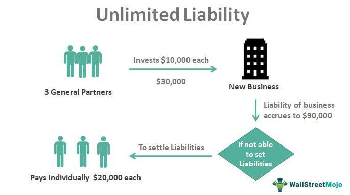

Risk management plays a pivotal role in formulating effective financial investment strategies, particularly in the intricate domain of algorithmic trading. The rapid evolution of trading technologies and increasing complexity of financial instruments necessitate a robust approach to managing risks. A significant aspect of these risks involves the concept of unlimited risk, where potential financial losses are uncapped. This scenario is most prevalent in certain trading activities, such as selling naked options or engaging in short selling, where losses could far exceed initial investments.

Understanding the significance and implications of unlimited risk is essential for traders. It equips them with the knowledge to brace for substantial financial repercussions that may arise from volatile market conditions or unfavorable market movements. In the context of algorithmic trading, where high-frequency transactions and automation are prevalent, unlimited risk can pose unique challenges. These challenges extend beyond mere financial loss potential and encompass operational, market, and liquidity risks inherent in automated trading environments.



Real-world examples can provide insights into how these risks manifest in algorithmic trading. Lessons learned from past financial events, such as sudden market crashes or systemic failures, highlight the importance of implementing effective risk management strategies. These strategies are crucial to safeguard financial positions and protect investments from adverse market developments.

Furthermore, various risk management techniques can be employed to mitigate potential financial losses in algorithmic trading. Strategies like stop-loss orders, hedging, and diversification play an integral role in cushioning against unlimited risks. By adopting comprehensive and adaptive risk management frameworks, traders can enhance their resilience against unpredictable market fluctuations, ensuring sustained success in their trading endeavors.

## Table of Contents

## Understanding Unlimited Risk

Unlimited risk in financial investments refers to situations where potential losses on a position are theoretically infinite or significantly large. This occurs primarily in financial instruments like naked options and short selling, where traders expose themselves to losses that can vastly exceed the initial capital invested.

### Naked Options
A naked option, particularly a naked call option, involves selling an option on an asset without owning the underlying asset. If the market moves against the trader's position, the losses can be substantial. For example, in a naked call option, if the price of the underlying security increases far beyond the strike price upon expiration, the seller must purchase the asset at the current market rate to deliver it at the strike price, leading to unlimited losses as there is no cap on how high a stock price can rise.

Mathematically, the potential loss $L$ for a naked call option can be expressed as:
$$
L = (P_{\text{market}} - K) \times Q
$$
where $P_{\text{market}}$ is the market price of the underlying asset, $K$ is the strike price of the option, and $Q$ is the quantity of the contracts sold. Since $P_{\text{market}}$ can rise indefinitely, $L$ can become very large.

### Short Selling
Short selling involves selling a borrowed security with the intention of buying it back later at a lower price. If, contrary to the trader's expectations, the price of the asset increases, the trader incurs a loss equal to the difference between the sale price and the higher repurchase price. These losses can be theoretically infinite because there is no upper limit to how high a stock price can climb.

The loss $L$ from a short sale is given by:
$$
L = (P_{\text{buy}} - P_{\text{sell}}) \times Q
$$
where $P_{\text{buy}}$ is the repurchase price, $P_{\text{sell}}$ is the initial sale price, and $Q$ is the quantity of shares sold short. Here, $P_{\text{buy}}$ can increase without bound, leading to potentially limitless losses.

### Importance for Traders
Understanding unlimited risk is essential for traders as failing to account for these potential exposures can result in devastating financial consequences. Traders must recognize that strategies involving naked options or short sales, while potentially lucrative, [carry](/wiki/carry-trading) significant risks. These scenarios can lead to margin calls, forced liquidations, or substantial capital losses, underlining the necessity for comprehensive risk management approaches and effective use of financial derivatives to hedge risks wherever feasible.

## Algorithmic Trading and Its Risks

Algorithmic trading leverages computer algorithms to execute trading orders with precision, speed, and reduced human error, optimizing the trading process. It has transformed financial markets by enabling high-frequency trading ([HFT](/wiki/high-frequency-trading-strategies)) and complex strategies impossible through manual trading. However, the sophistication and automation of [algorithmic trading](/wiki/algorithmic-trading) bring about unique risks that need careful examination to ensure the sustainability and success of trading strategies.

**Operational Risk**  
Operational risks in algorithmic trading arise from technical or system failures, including hardware or software malfunctions, network connectivity issues, or data feed errors. These disruptions can prevent orders from being executed, lead to unintended trades, or result in significant financial losses. Reliable infrastructure, robust system architecture, and regular system maintenance are essential to mitigate these risks.

**Market Risk**  
Market risk, inherent in all trading activities, is amplified in algorithmic trading due to the speed and [volume](/wiki/volume-trading-strategy) of trades executed. Rapid market movements can lead to significant losses if algorithms are not responsive to market conditions. Algorithms must be designed with adaptive mechanisms to sense and react to unexpected market changes promptly. Additionally, deploying risk management tools, such as stop-loss orders, can help in minimizing market risk.

**Model Risk**  
Model risk in algorithmic trading refers to the potential errors or inaccuracies in the trading algorithms themselves. These could arise from incorrect assumptions, flawed data, or improperly calibrated models. An algorithm that operates well under certain conditions may perform poorly when market conditions change. Regular [backtesting](/wiki/backtesting) and validation of algorithms against historical and real-time data are critical to ensuring their robustness and reliability.

**Liquidity Risk**  
Liquidity risk occurs when there is insufficient market depth to execute trades without significantly affecting the asset's price. This is particularly challenging in algorithmic trading, where large volumes are traded in milliseconds. Insufficient [liquidity](/wiki/liquidity-risk-premium) can lead to trades that deviate from intended prices, resulting in losses. Traders must assess liquidity levels before executing large trades and consider implementing algorithms that monitor and adjust to liquidity conditions dynamically.

Understanding and analyzing these risks is vital for managing algorithmic trading strategies effectively. By incorporating stringent risk management practices, continuous monitoring, and updates to trading algorithms, traders can mitigate potential risks and leverage the benefits of algorithmic trading to achieve optimal trading outcomes.

## Risk Management Strategies in Algorithmic Trading

Effective risk management strategies are essential for mitigating unlimited risks inherent in algorithmic trading. These strategies encompass various methods designed to protect against adverse market conditions and unpredictable fluctuations, ultimately aiming to preserve capital and enhance profitability.

One of the fundamental techniques employed is the implementation of stop-loss orders. Stop-loss orders are predetermined price limits set to automatically sell a position if the market value drops to a certain level. This method effectively limits potential losses by ensuring positions are liquidated before the decrease in value undermines the entire investment. The equation for setting a stop-loss order can be represented as:

$$
\text{Stop-Loss Price} = \text{Entry Price} \times (1 - \text{Maximum Acceptable Loss Percentage})
$$

Hedging positions with options and futures is another critical component in managing unlimited risks. Options provide traders with the right, but not the obligation, to buy or sell an asset at a specified price before a set date. Futures contracts, on the other hand, oblige the transaction of an asset at a future date and price. These financial instruments help balance exposure to risk by establishing positions that can offset potential losses. The payoff for a hedged position can be formulated as:

$$
\text{Payoff} = \text{Asset Gain/Loss} + \text{Option/Future Gain/Loss}
$$

Machine learning significantly enhances risk prediction capabilities in algorithmic trading. By analyzing vast datasets, [machine learning](/wiki/machine-learning) algorithms can identify patterns and predict potential market movements with increased accuracy. Techniques such as supervised learning models (e.g., regression, decision trees) and unsupervised learning (e.g., clustering) are often applied to forecast risk factors and inform trading decisions. A sample Python code snippet employing machine learning for risk prediction might look like this:

```python
from sklearn.model_selection import train_test_split
from sklearn.ensemble import RandomForestClassifier

# Sample dataset with features and target variable
features = [...]  # Historical data inputs
target = [...]    # Risk outcomes

# Split the dataset into training and testing sets
X_train, X_test, y_train, y_test = train_test_split(features, target, test_size=0.3, random_state=42)

# Initialize and train the model
model = RandomForestClassifier(n_estimators=100, random_state=42)
model.fit(X_train, y_train)

# Predict and assess risk on new data
predictions = model.predict(X_test)
```

Continuous backtesting and refinement of trading algorithms are imperative for dealing with diverse market conditions. Backtesting involves running trading strategies on historical data to evaluate their effectiveness and resilience to market changes. This process helps in identifying strategy weaknesses, optimizing parameters, and improving future performance. The formula for calculating the backtest result is:

$$
\text{Backtest Result} = \text{Final Portfolio Value} - \text{Initial Portfolio Value}
$$

By integrating these strategies, algorithmic traders can not only limit potential financial losses but also optimize their approaches for improved stability and returns in a dynamic market environment.

## The Role of Stress Testing

Stress testing is an indispensable practice for evaluating how algorithmic trading systems perform during extreme market conditions. By systematically applying hypothetical adverse scenarios, stress testing allows traders to identify potential weaknesses in their algorithms and prepare for unforeseen market events. This proactive approach helps in developing more resilient trading strategies that can withstand market [volatility](/wiki/volatility-trading-strategies) and disruptions.

One of the primary techniques used in stress testing is scenario analysis. This method involves constructing a variety of hypothetical scenarios, each representing different adverse market conditions, such as rapid price movements, sudden liquidity shortages, or unexpected macroeconomic events. These scenarios are then used to simulate how trading algorithms would react, providing insights into their potential strengths and weaknesses.

Monte Carlo simulations are another essential tool in stress testing. These simulations leverage statistical methods to assess the impact of risk and uncertainty in prediction and forecasting models. In the context of algorithmic trading, Monte Carlo simulations can be used to model the probability of different outcomes when the market conditions change rapidly. This approach allows traders to evaluate the range of possible losses and the likelihood of their occurrence.

In practice, a stress testing framework could be implemented using Python, given its powerful data handling and numerical computation capabilities. Below is a basic example of how one might set up a Monte Carlo simulation to assess algorithmic trading risks:

```python
import numpy as np

def monte_carlo_simulation(initial_investment, mean_return, std_dev, num_simulations, time_period):
    # Generate random returns using normal distribution
    rand_returns = np.random.normal(loc=mean_return, scale=std_dev, size=(num_simulations, time_period))

    # Calculate compounded investment growth
    investment_simulations = initial_investment * np.exp(np.cumsum(rand_returns, axis=1))

    return investment_simulations

# Parameters
initial_investment = 100000  # initial amount
mean_return = 0.001          # average daily return
std_dev = 0.02               # daily volatility (standard deviation)
num_simulations = 10000      # number of simulations
time_period = 252            # number of trading days in a year

simulations = monte_carlo_simulation(initial_investment, mean_return, std_dev, num_simulations, time_period)

# Analyze results
end_portfolio_values = simulations[:, -1]
expected_value = np.mean(end_portfolio_values)
value_at_risk = np.percentile(end_portfolio_values, 5)  # 5% Value at Risk

print(f"Expected Ending Investment: ${expected_value:.2f}")
print(f"Value at Risk (5% quantile): ${value_at_risk:.2f}")
```

In this example, a Monte Carlo simulation provides insights into the potential future distribution of an investment's value over a trading year, considering daily returns and volatility. Traders can analyze the results to assess risks such as the Value at Risk (VaR), which indicates the potential loss in value of an investment at a given confidence level.

By integrating techniques like scenario analysis and Monte Carlo simulations into their risk management frameworks, traders are better equipped to refine their algorithmic trading strategies, ensuring that they are more robust against market stressors. Regular stress testing and analysis of trading algorithms allow for the identification and mitigation of vulnerabilities, ultimately reducing the likelihood of substantial financial losses during market turbulence.

## Case Studies in Risk Management Successes

Historical examples underscore the necessity for robust risk management in trading, particularly highlighted by the 2008 Financial Crisis. This crisis, triggered by the collapse of large financial institutions due to exposure to high-risk mortgage-backed securities (MBS), revealed the vulnerabilities in risk management practices at the time. The systemic failure was exacerbated by excessive leverage, inadequate risk assessments, and a lack of transparency within the financial markets. Firms that weathered the crisis showcased the effectiveness of rigorous risk management strategies.

One such example is JPMorgan Chase, which emerged relatively unscathed due to its prudent risk management. The firm employed a data-driven strategy that involved comprehensive analysis of its exposure to subprime mortgages well before the crisis unfolded. By maintaining a diversified portfolio and limiting exposure to high-risk assets, JPMorgan Chase exemplified the importance of actively managing credit risk and ensuring asset quality.

Goldman Sachs is another notable example, employing sophisticated stress testing and scenario analysis to navigate complex market conditions during the crisis. The company utilized these tools to simulate adverse market scenarios, allowing them to adjust trading strategies accordingly. Stress testing involves subjecting portfolios to hypothetical scenarios, such as significant [interest rate](/wiki/interest-rate-trading-strategies) hikes or plummeting asset prices, to evaluate potential impacts and develop mitigation strategies. This approach helped Goldman Sachs anticipate market shifts and maintain liquidity during the tumultuous period.

Successful post-crisis risk management frameworks, particularly in algorithmic trading, are characterized by a combination of data-driven insight and rigorous testing. Algorithmic trading firms that implement such frameworks often employ machine learning models to enhance risk prediction capabilities. These models analyze historical data to identify patterns and potential anomalies, empowering traders to make informed decisions. Python is commonly utilized for developing these machine learning models due to its simplicity and vast array of libraries.

```python
import numpy as np
from sklearn.ensemble import RandomForestRegressor
from sklearn.model_selection import train_test_split

# Dummy data representing historical trading data
X = np.random.rand(1000, 10)  # 10 features
y = np.random.rand(1000)      # target variable

# Split data into train and test sets
X_train, X_test, y_train, y_test = train_test_split(X, y, test_size=0.2, random_state=42)

# Random Forest model for risk prediction
model = RandomForestRegressor(n_estimators=100, max_depth=5, random_state=42)
model.fit(X_train, y_train)
predictions = model.predict(X_test)

print("Risk predictions:", predictions)
```

Machine learning models can refine strategy development by continuously backtesting and recalibrating models against diverse market conditions. An effective backtesting process verifies the reliability of an algorithm by applying it to historical data and evaluating performance, identifying potential areas of risk exposure. By integrating machine learning and backtesting, firms can develop adaptive trading strategies that respond to evolving market dynamics.

These case studies illustrate that successful risk management in algorithmic trading hinges on a proactive approach that incorporates stress testing, diversification, and predictive analytics. As evidenced by historical successes, firms that integrate these components are better equipped to withstand financial turbulence and capitalize on market opportunities while minimizing risk exposure.

## Conclusion

Unlimited risk remains a considerable challenge within trading, necessitating the application of comprehensive risk management strategies to mitigate potential financial losses. In algorithmic trading, this challenge is pronounced due to the automated nature and the speed at which transactions occur, requiring a resilient approach to effectively navigate diverse risks.

Algorithmic trading relies on sophisticated computer algorithms that execute trades with minimal human intervention. This automation introduces unique risks, ranging from market and liquidity risks to operational and model risks. To address these, a robust strategy incorporating a variety of risk management techniques is essential. Stop-loss strategies are fundamental, providing a mechanism to automatically [exit](/wiki/exit-strategy) positions when predetermined loss limits are reached, thereby protecting the portfolio from excessive losses.

Stress testing plays a vital role in preparing algorithmic strategies for unforeseen market conditions. By employing scenarios such as extreme price movements or market crashes, stress testing evaluates the resilience of trading algorithms and identifies potential vulnerabilities. Alongside stress testing, adherence to regulatory requirements is crucial. Maintaining compliance not only mitigates legal risks but also upholds market integrity, fostering trust with investors.

Ethical considerations are equally important in the context of algorithmic trading. Ethical trading practices ensure that algorithms do not exploit market inefficiencies in ways that could lead to unfair practices or market distortions. Ethical frameworks guide the development and deployment of algorithms, emphasizing transparency, fairness, and accountability.

Ultimately, success in navigating unlimited risks in trading demands a dynamic and adaptive risk management approach. The integration of stop-loss strategies, comprehensive stress testing, strict regulatory compliance, and ethical principles establishes a robust foundation for managing the complexities of modern trading environments. This synergy empowers traders to effectively manage risks and capitalize on opportunities in an ever-evolving market landscape.

## References & Further Reading

[1]: Taleb, N. N. (2007). ["The Black Swan: The Impact of the Highly Improbable."](https://www.stat.berkeley.edu/~aldous/157/Books/Black_Swan-sub.pdf) Random House.

[2]: Hull, J. C. (2014). ["Options, Futures, and Other Derivatives."](https://www.amazon.com/Options-Futures-Other-Derivatives-9th/dp/0133456315) Pearson Education.

[3]: Jarrow, R. A., & Turnbull, S. M. (1995). ["Pricing Derivatives on Financial Securities Subject to Credit Risk."](https://onlinelibrary.wiley.com/doi/abs/10.1111/j.1540-6261.1995.tb05167.x) Journal of Finance, 50(1), 53-85.

[4]: Lopez de Prado, M. (2018). ["Advances in Financial Machine Learning."](https://www.amazon.com/Advances-Financial-Machine-Learning-Marcos/dp/1119482089) Wiley.

[5]: Chan, E. (2009). ["Quantitative Trading: How to Build Your Own Algorithmic Trading Business."](https://github.com/ftvision/quant_trading_echan_book) Wiley.

[6]: Kissell, R. (2013). ["The Science of Algorithmic Trading and Portfolio Management."](https://www.sciencedirect.com/book/9780124016897/the-science-of-algorithmic-trading-and-portfolio-management) Academic Press.