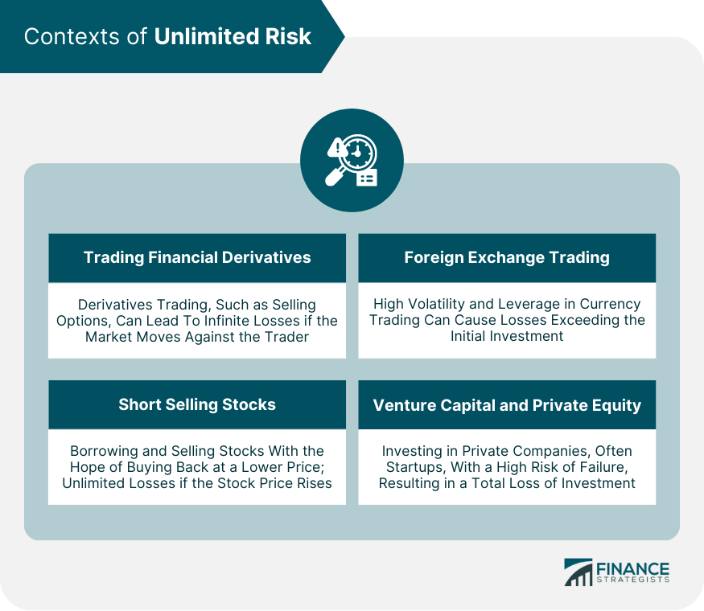

## Table of Contents

## What is unlimited risk in financial terms?

Unlimited risk in financial terms means that there is no limit to how much money you could lose when you invest or trade. This kind of risk is most common when you sell options, especially when you sell naked options. Naked options are when you sell an option without owning the underlying asset. If the market moves against you, your losses can keep growing without any cap.

For example, if you sell a naked call option on a stock and the stock price skyrockets, you have to buy the stock at the higher market price to sell it to the option buyer at the lower agreed price. The more the stock price goes up, the more money you lose. This is why it's called unlimited risk – there's no maximum amount you could lose, and it can be much more than the money you initially put in.

## How does unlimited risk differ from limited risk?

Unlimited risk and limited risk are two different types of risks you can face when you invest or trade. Unlimited risk means you could lose a lot of money, and there's no limit to how much you could lose. This often happens when you sell options, like selling a naked call option. If the price of the thing you're betting on goes way up, you have to buy it at the higher price and sell it at the lower price you promised, and your losses can keep growing without a limit.

Limited risk, on the other hand, means you can only lose a certain amount of money, no matter what happens in the market. This is common when you buy options or stocks. For example, if you buy a stock, the most you can lose is the money you paid for it. If the stock goes to zero, you lose what you spent, but you won't lose more than that. This makes limited risk safer than unlimited risk because you know the maximum amount you could lose.

## Can you explain the basic mechanism of how unlimited risk works?

Unlimited risk happens when you can lose a lot of money, and there's no limit to how much you could lose. This often happens when you sell options without owning the thing the option is about. For example, if you sell a naked call option on a stock, you're promising to sell the stock at a certain price if the person who bought the option wants it. If the stock price goes way up after you sell the option, you have to buy the stock at the higher price and sell it at the lower price you promised. The more the stock price goes up, the more money you lose, and there's no limit to how high the stock price can go.

This is why it's called unlimited risk. Your losses can keep growing without any cap, and you could end up losing much more money than you put in at the start. It's different from limited risk, where you know the most you can lose. With unlimited risk, you're taking a big chance because you don't know how much you might lose if things go badly.

## What types of financial instruments typically carry unlimited risk?

The main financial instruments that [carry](/wiki/carry-trading) unlimited risk are options, especially when you sell them without owning the underlying asset. This is called selling naked options. When you sell a naked call option, you're promising to sell a stock at a certain price if the buyer of the option wants it. If the stock price goes up a lot after you sell the option, you have to buy the stock at the higher price and sell it at the lower price you promised. The more the stock price rises, the more money you lose, and there's no limit to how high the stock price can go.

Another type of financial instrument that can carry unlimited risk is short selling. When you short sell a stock, you borrow the stock and sell it, hoping to buy it back later at a lower price to make a profit. But if the stock price goes up instead of down, you have to buy it back at the higher price to return it to the lender. The more the stock price goes up, the more money you lose, and there's no limit to how high the stock price can go. Both selling naked options and short selling can lead to unlimited losses if the market moves against you.

## What are the key factors that contribute to unlimited risk?

Unlimited risk happens when you can lose a lot of money, and there's no limit to how much you could lose. This often happens when you sell options without owning the thing the option is about, like selling a naked call option on a stock. When you sell a naked call option, you promise to sell the stock at a certain price if the person who bought the option wants it. If the stock price goes up a lot after you sell the option, you have to buy the stock at the higher price and sell it at the lower price you promised. The more the stock price goes up, the more money you lose, and there's no limit to how high the stock price can go.

Another key [factor](/wiki/factor-investing) that contributes to unlimited risk is short selling. When you short sell a stock, you borrow the stock and sell it, hoping to buy it back later at a lower price to make a profit. But if the stock price goes up instead of down, you have to buy it back at the higher price to return it to the lender. The more the stock price goes up, the more money you lose, and there's no limit to how high the stock price can go. Both selling naked options and short selling can lead to unlimited losses if the market moves against you.

## How can an investor assess the level of unlimited risk in a potential investment?

To assess the level of unlimited risk in a potential investment, an investor needs to understand what they are investing in. If the investment involves selling options, especially naked options, or short selling stocks, there's a chance of unlimited risk. This means they could lose a lot of money if the market moves against them. For example, if they sell a naked call option on a stock and the stock price goes up a lot, they'll have to buy the stock at the higher price and sell it at the lower price they promised. The more the stock price rises, the more money they lose, and there's no limit to how high the stock price can go.

To manage this risk, an investor should look at how likely it is for the market to move in a way that would cause big losses. They can do this by studying market trends, reading financial news, and using tools like charts and graphs. It's also helpful to talk to a financial advisor who can give advice on how to reduce the risk. By understanding the investment and the market, an investor can make better choices and protect themselves from unlimited risk.

## What are some common strategies to manage or mitigate unlimited risk?

One way to manage unlimited risk is to use stop-loss orders. A stop-loss order is like a safety net that automatically sells your investment if the price goes down to a certain level. This can help limit how much money you lose if the market moves against you. For example, if you're short selling a stock, you can set a stop-loss order to buy the stock back if the price goes up too much. This way, you won't lose more money than you're comfortable with.

Another strategy is to use hedging. Hedging means you make another investment that can help protect you from losses in your main investment. For example, if you sell a naked call option on a stock, you can buy another option or invest in something that will go up in value if the stock price goes up. This can help balance out your losses if the stock price rises a lot. Hedging can be a bit complicated, but it's a good way to reduce the risk of losing a lot of money.

It's also important to only invest money that you can afford to lose. Unlimited risk means you could lose more than you put in, so it's smart to be careful. Don't use money you need for important things like bills or rent. And if you're new to investing, it might be a good idea to talk to a financial advisor who can help you understand the risks and make better choices.

## Can you provide a real-world example of a scenario where an investor faced unlimited risk?

Imagine an investor named Sarah who decided to sell a naked call option on a tech company's stock. She thought the stock price would stay the same or go down, so she sold the option for a premium, promising to sell the stock at $100 if the buyer wanted it. But then, the company announced a big new product that everyone wanted, and the stock price jumped to $200. Sarah had to buy the stock at $200 to sell it to the option buyer at $100, losing $100 per share. If the stock price kept going up, her losses could keep growing without any limit.

In another example, consider John, who decided to short sell a stock he thought was overvalued. He borrowed 100 shares of the stock and sold them at $50 each, hoping to buy them back later at a lower price. But then, the company released amazing earnings, and the stock price soared to $100. John had to buy back the 100 shares at $100 each to return them to the lender, losing $50 per share. If the stock price kept rising, John's losses would have no limit, showing how short selling can lead to unlimited risk.

## How does the concept of unlimited risk apply to options trading?

Unlimited risk in options trading happens when you sell options without owning the thing the option is about, like selling a naked call option on a stock. When you sell a naked call option, you promise to sell the stock at a certain price if the person who bought the option wants it. If the stock price goes up a lot after you sell the option, you have to buy the stock at the higher price and sell it at the lower price you promised. The more the stock price goes up, the more money you lose, and there's no limit to how high the stock price can go. This is why selling naked options can be very risky, because your losses can keep growing without any cap.

Another way unlimited risk can come into play in options trading is through short selling. When you short sell a stock, you borrow the stock and sell it, hoping to buy it back later at a lower price to make a profit. But if the stock price goes up instead of down, you have to buy it back at the higher price to return it to the lender. The more the stock price goes up, the more money you lose, and there's no limit to how high the stock price can go. Both selling naked options and short selling can lead to unlimited losses if the market moves against you, making it important to understand and manage these risks carefully.

## What are the regulatory considerations for financial products with unlimited risk?

Financial regulators want to make sure that investors know about the risks of products like options and short selling, which can have unlimited risk. They make rules that say companies have to tell investors about these risks before they buy or sell these products. This is to stop people from losing a lot of money without knowing the dangers. Regulators also check that companies follow these rules and that they give clear information about how much money someone could lose.

Regulators also set rules about how much money someone needs to have before they can trade products with unlimited risk. This is called a margin requirement. It's like a safety net to make sure people have enough money to cover their losses if things go badly. By doing this, regulators try to keep the market fair and safe for everyone. They want to stop big problems that could hurt a lot of people and make the market unstable.

## How do market conditions influence the level of unlimited risk in investments?

Market conditions can make the level of unlimited risk in investments go up or down. When the market is calm and prices don't change much, the risk of losing a lot of money from selling naked options or short selling is lower. But if the market gets wild and prices start moving a lot, the risk goes up. For example, if you sell a naked call option on a stock and the stock price suddenly jumps because of good news, you might have to buy the stock at a much higher price than you expected, leading to big losses.

Also, market conditions can affect how much money you need to start trading products with unlimited risk. During times when the market is very unpredictable, regulators might ask for more money upfront, called a margin requirement, to make sure traders can handle their losses. This can make it harder for some people to trade these products, but it's meant to keep the market safe. Understanding how market conditions change can help investors decide when it's safer to take on unlimited risk and when it's better to stay away.

## What advanced techniques can be used to model and predict unlimited risk in complex financial systems?

Advanced techniques to model and predict unlimited risk in complex financial systems often use computer programs called simulations. These simulations help investors see what might happen if the market moves in different ways. For example, a technique called Monte Carlo simulation can create many different scenarios to show how much money someone might lose if they sell a naked call option or short sell a stock. By running these simulations, investors can get a better idea of the risks they're taking and how likely it is that they'll lose a lot of money.

Another advanced technique is using mathematical models, like the Black-Scholes model, to predict how options prices might change. These models use things like the current price of the stock, how much the stock price moves up and down, and how long until the option expires to guess what might happen. By understanding these models, investors can make smarter choices about when to sell options and how to manage their risks. Both simulations and mathematical models help investors see the big picture and plan for different outcomes, making it easier to handle the unlimited risk that comes with certain investments.

## What are the Risk Management Strategies in Algorithmic Trading?

Effective risk management strategies are essential for mitigating unlimited risks inherent in [algorithmic trading](/wiki/algorithmic-trading). These strategies encompass various methods designed to protect against adverse market conditions and unpredictable fluctuations, ultimately aiming to preserve capital and enhance profitability.

One of the fundamental techniques employed is the implementation of stop-loss orders. Stop-loss orders are predetermined price limits set to automatically sell a position if the market value drops to a certain level. This method effectively limits potential losses by ensuring positions are liquidated before the decrease in value undermines the entire investment. The equation for setting a stop-loss order can be represented as:

$$
\text{Stop-Loss Price} = \text{Entry Price} \times (1 - \text{Maximum Acceptable Loss Percentage})
$$

Hedging positions with options and futures is another critical component in managing unlimited risks. Options provide traders with the right, but not the obligation, to buy or sell an asset at a specified price before a set date. Futures contracts, on the other hand, oblige the transaction of an asset at a future date and price. These financial instruments help balance exposure to risk by establishing positions that can offset potential losses. The payoff for a hedged position can be formulated as:

$$
\text{Payoff} = \text{Asset Gain/Loss} + \text{Option/Future Gain/Loss}
$$

Machine learning significantly enhances risk prediction capabilities in algorithmic trading. By analyzing vast datasets, [machine learning](/wiki/machine-learning) algorithms can identify patterns and predict potential market movements with increased accuracy. Techniques such as supervised learning models (e.g., regression, decision trees) and unsupervised learning (e.g., clustering) are often applied to forecast risk factors and inform trading decisions. A sample Python code snippet employing machine learning for risk prediction might look like this:

```python
from sklearn.model_selection import train_test_split
from sklearn.ensemble import RandomForestClassifier

# Sample dataset with features and target variable
features = [...]  # Historical data inputs
target = [...]    # Risk outcomes

# Split the dataset into training and testing sets
X_train, X_test, y_train, y_test = train_test_split(features, target, test_size=0.3, random_state=42)

# Initialize and train the model
model = RandomForestClassifier(n_estimators=100, random_state=42)
model.fit(X_train, y_train)

# Predict and assess risk on new data
predictions = model.predict(X_test)
```

Continuous [backtesting](/wiki/backtesting) and refinement of trading algorithms are imperative for dealing with diverse market conditions. Backtesting involves running trading strategies on historical data to evaluate their effectiveness and resilience to market changes. This process helps in identifying strategy weaknesses, optimizing parameters, and improving future performance. The formula for calculating the backtest result is:

$$
\text{Backtest Result} = \text{Final Portfolio Value} - \text{Initial Portfolio Value}
$$

By integrating these strategies, algorithmic traders can not only limit potential financial losses but also optimize their approaches for improved stability and returns in a dynamic market environment.

## References & Further Reading

[1]: Taleb, N. N. (2007). ["The Black Swan: The Impact of the Highly Improbable."](https://www.stat.berkeley.edu/~aldous/157/Books/Black_Swan-sub.pdf) Random House.

[2]: Hull, J. C. (2014). ["Options, Futures, and Other Derivatives."](https://www.amazon.com/Options-Futures-Other-Derivatives-9th/dp/0133456315) Pearson Education.

[3]: Jarrow, R. A., & Turnbull, S. M. (1995). ["Pricing Derivatives on Financial Securities Subject to Credit Risk."](https://onlinelibrary.wiley.com/doi/abs/10.1111/j.1540-6261.1995.tb05167.x) Journal of Finance, 50(1), 53-85.

[4]: Lopez de Prado, M. (2018). ["Advances in Financial Machine Learning."](https://www.amazon.com/Advances-Financial-Machine-Learning-Marcos/dp/1119482089) Wiley.

[5]: Chan, E. (2009). ["Quantitative Trading: How to Build Your Own Algorithmic Trading Business."](https://github.com/ftvision/quant_trading_echan_book) Wiley.

[6]: Kissell, R. (2013). ["The Science of Algorithmic Trading and Portfolio Management."](https://www.sciencedirect.com/book/9780124016897/the-science-of-algorithmic-trading-and-portfolio-management) Academic Press.