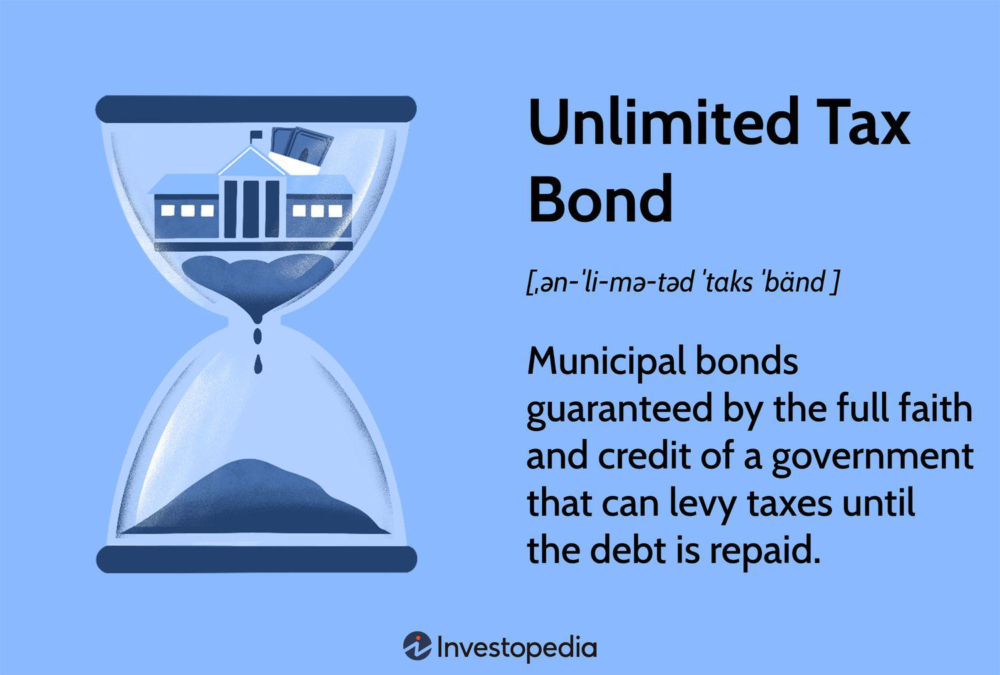

## Table of Contents

## What is an Unlimited Tax Bond?

An Unlimited Tax Bond is a type of bond that a local government can issue to raise money for big projects like building schools or roads. When they issue these bonds, they promise to pay back the money they borrow, plus interest, using property taxes. The special thing about these bonds is that the government can raise property taxes as much as needed to make sure they can pay back the bond. This makes the bond very safe for investors because they know the government will do whatever it takes to pay them back.

These bonds are often used for projects that benefit the community, like new schools or libraries. Because they are backed by the full taxing power of the government, they are seen as a secure investment. However, this also means that property owners might see their taxes go up if the government needs more money to pay back the bonds. This can be a big decision for a community, as it affects both the local projects they can fund and the taxes they will have to pay.

## How does an Unlimited Tax Bond differ from other types of bonds?

An Unlimited Tax Bond is different from other types of bonds because it is backed by the full taxing power of the local government. This means that the government can raise property taxes as high as needed to pay back the bond and the interest on it. This makes Unlimited Tax Bonds very safe for investors because they know they will get their money back no matter what. Other types of bonds, like Limited Tax Bonds, do not have this guarantee. With Limited Tax Bonds, the government can only raise taxes up to a certain limit, so there is more risk for investors if the government can't pay back the bond.

Another way Unlimited Tax Bonds differ from other bonds is in how they are used. They are often used for big community projects like building schools, libraries, or roads. Because they are backed by the full taxing power of the government, they are seen as a secure way to fund these important projects. In contrast, other bonds, like Revenue Bonds, are backed by the income from the project they fund, like tolls from a bridge or fees from a public utility. This means that the success of Revenue Bonds depends on how well the project does, making them riskier than Unlimited Tax Bonds.

Overall, the main differences between Unlimited Tax Bonds and other bonds come down to how they are backed and what they are used for. Unlimited Tax Bonds offer more security for investors and are used for essential community projects, while other bonds might be riskier and used for different purposes.

## What are the typical uses of funds raised through Unlimited Tax Bonds?

The money raised from Unlimited Tax Bonds is usually used for big community projects. These projects are things that everyone in the area can use and benefit from. For example, a lot of the time, the money is used to build new schools or to fix up old ones. This helps make sure that kids have good places to learn. The money can also be used to build new libraries, so people have a place to read and learn more.

Another common use for the funds is to build or improve roads and bridges. Good roads and bridges are important for getting around and can help the community grow. Sometimes, the money is also used for other public buildings, like community centers or fire stations. These buildings help keep the community safe and give people places to come together. Overall, the money from Unlimited Tax Bonds helps make the community a better place for everyone who lives there.

## Who can issue an Unlimited Tax Bond?

Unlimited Tax Bonds can be issued by local governments, like cities or counties. They use these bonds to get money for big projects that help the community, like building schools or fixing roads. The local government decides if they need to issue these bonds and then they ask the people who live there if it's okay.

If the people agree, the local government can sell the bonds to investors. They promise to pay back the money they borrow, plus some extra for interest, using the taxes they collect from property owners. Because they can raise these taxes as much as needed, the bonds are very safe for the investors.

## What are the tax implications for investors in Unlimited Tax Bonds?

When you invest in Unlimited Tax Bonds, you need to think about taxes. The interest you get from these bonds is usually not taxed by the state or local government where the bond comes from. This can be good because it means you keep more of the money you earn from the bond. But, the interest might still be taxed by the federal government, depending on what the bond is used for and the rules at the time.

If the bond is used for things like building schools or roads, it might be a "municipal bond," and the interest could be free from federal taxes too. This makes these bonds even more attractive because you get to keep all the interest you earn. But, if you sell the bond before it matures and make a profit, you might have to pay capital gains tax on that profit. So, it's important to think about all these tax rules when you decide to invest in Unlimited Tax Bonds.

## How is the repayment of an Unlimited Tax Bond secured?

The repayment of an Unlimited Tax Bond is secured by the local government's promise to use property taxes to pay back the money they borrowed, plus interest. This means that the government can raise property taxes as much as needed to make sure they have enough money to pay back the bond. This makes the bond very safe for investors because they know the government will do whatever it takes to pay them back.

Because the government can raise taxes without a limit, Unlimited Tax Bonds are seen as a very secure way for the government to borrow money. This is different from other bonds where the government might not be able to raise enough money to pay back the bond if things don't go as planned. With Unlimited Tax Bonds, the full taxing power of the government backs the bond, making it a reliable choice for investors.

## What are the risks associated with investing in Unlimited Tax Bonds?

Investing in Unlimited Tax Bonds is usually seen as safe, but there are still some risks to think about. One risk is that the local government might not be able to raise property taxes as much as they need to. This could happen if there are laws that limit how much taxes can go up or if people in the area can't pay higher taxes. If the government can't collect enough money, it might have trouble paying back the bond.

Another risk is that the bond might lose value if interest rates go up. When interest rates rise, new bonds pay more interest, so older bonds like the one you bought might not seem as good. You might have to sell your bond for less than you paid for it if you need to sell it before it matures. Even though Unlimited Tax Bonds are backed by the government's ability to raise taxes, these risks can still affect how much money you make from your investment.

## How do Unlimited Tax Bonds affect local tax rates?

When a local government issues an Unlimited Tax Bond, it can raise property taxes to pay back the money it borrowed. This means that if the government needs more money to pay back the bond, it can increase the taxes people pay on their homes and other properties. The amount the taxes go up depends on how much money the government needs to pay back the bond and the interest on it.

People who own property in the area might see their taxes go up because of the bond. This can be a big deal for them because it means they have to pay more money every year. But, the bond also helps pay for important things like new schools or better roads, which can make the community a nicer place to live. So, while taxes might go up, the community can also benefit from the projects the bond pays for.

## What is the process for issuing an Unlimited Tax Bond?

When a local government wants to issue an Unlimited Tax Bond, it first figures out how much money it needs for a big project, like building a new school or fixing roads. Then, the government asks the people who live in the area if they agree with the plan. This is usually done through a vote, where people can say yes or no to the bond. If most people say yes, the government can go ahead and issue the bond.

After getting the okay from the community, the government sells the bonds to investors. These investors give the government money, and in return, the government promises to pay them back over time, plus some extra money called interest. The government uses property taxes to pay back the bond. Because they can raise these taxes as much as needed, the bond is very safe for investors. This whole process helps the government get the money it needs for important projects while making sure it can pay back what it borrows.

## How do credit ratings impact the interest rates of Unlimited Tax Bonds?

Credit ratings are important when it comes to Unlimited Tax Bonds because they show how likely the local government is to pay back the money it borrows. If a government has a good credit rating, it means people think it's very likely to pay back the bond. This makes the bond safer for investors, so the government can offer a lower [interest rate](/wiki/interest-rate-trading-strategies). People will still want to buy the bond because it's safe and they know they'll get their money back.

On the other hand, if a government has a bad credit rating, it means there's more risk that it might not be able to pay back the bond. To make the bond more attractive to investors, the government has to offer a higher interest rate. This is because investors want more money to take on the extra risk. So, the credit rating can make a big difference in how much interest the government has to pay on its Unlimited Tax Bonds.

## What historical examples illustrate the use of Unlimited Tax Bonds?

One good example of Unlimited Tax Bonds being used is in Houston, Texas. In the early 2000s, the city needed money to fix up its schools. They asked people living there if it was okay to borrow money using Unlimited Tax Bonds. Most people said yes, so the city sold the bonds and used the money to make the schools better. This helped a lot of kids get a better education.

Another example is in Los Angeles, California. In 2016, the city wanted to build new libraries and community centers. They decided to use Unlimited Tax Bonds to get the money they needed. The people in Los Angeles voted to approve the bonds, and the city used the money to build new places where people could learn and spend time together. This made the community a nicer place to live.

## What are the regulatory and legal considerations for issuing Unlimited Tax Bonds?

When a local government wants to issue Unlimited Tax Bonds, they have to follow certain rules and laws. First, they need to get permission from the people who live in the area. This usually means holding a vote where people can say yes or no to the bond. If most people say yes, the government can go ahead with the bond. There are also laws about how much money they can borrow and what they can use it for. These laws make sure the government uses the money wisely and for things that help the community, like building schools or fixing roads.

Another important part is that the government has to promise to pay back the money they borrow, plus interest, using property taxes. This means they can raise these taxes as much as needed to make sure they have enough money to pay back the bond. But, there might be other rules about how much they can raise taxes or how they have to tell people about the bond. All these rules and laws are there to make sure the bond is fair for everyone and that the government can pay back what they borrow.

## What is the taxation of municipal bonds?

Municipal bonds are popular among investors due to their tax-exempt interest, but they also involve navigating additional tax considerations that can impact overall investment returns. While the interest earned from these bonds is typically exempt from federal income tax and potentially state and local income taxes, investors must analyze how other tax liabilities, such as capital gains taxes, might apply to these securities. 

One critical [factor](/wiki/factor-investing) in this tax landscape is the "De Minimis" Tax Rule. This rule is particularly relevant when municipal bonds are purchased at a discount—that is, for less than their par value. If the discount is minimal, it falls under the de minimis threshold and is treated as a tax-exempt income upon sale. Conversely, if the discount exceeds this threshold, the investor must report the gain as ordinary income, which could have a significant impact on the after-tax return. The De Minimis threshold is calculated using the formula:

$$
\text{De Minimis Threshold} = \text{Par Value} \times 0.25\%
$$

For instance, if an investor buys a municipal bond with a par value of $1,000 for $950, the $50 discount surpasses the de minimis threshold and may thus be treated as a capital gain or potentially as ordinary income, depending on the specifics of the sale.

Besides the De Minimis rule, some municipal bonds, mainly Private Activity Bonds, may be subject to the Alternative Minimum Tax (AMT). The AMT is a parallel tax system designed to ensure that taxpayers who benefit from numerous deductions and exemptions still pay a minimum amount of tax. The exposure to AMT can undermine the tax-exempt advantage of certain municipal bonds, rendering them less tax-efficient for investors who are subject to this alternative taxation.

To optimize investment returns, investors should work closely with financial advisors who can effectively maneuver through these tax implications and maximize the inherent tax advantages associated with municipal bonds. Understanding these tax intricacies, along with assessing personal tax circumstances, is crucial for municipal bond investors aiming to achieve favorable after-tax outcomes.

## How do municipal bonds, taxation, and algo trading intersect?

The intersection of [algorithmic trading](/wiki/algorithmic-trading) and municipal bonds provides a promising avenue for optimizing tax efficiency via automated processes. Algorithmic trading, which involves the use of advanced mathematical models and computer programs to make high-speed trading decisions, can play a vital role in managing municipal bond portfolios. This combination is particularly advantageous in tax-sensitive environments such as those prevalent with municipal bonds, where interest income is usually tax-exempt.

A key application of algorithmic trading is in tax-loss harvesting and identifying tax-efficient trades. Tax-loss harvesting involves selling securities at a loss to offset capital gains taxes. Algorithms can enhance this process by quickly analyzing vast datasets to identify potential opportunities for harvesting losses while simultaneously maintaining the portfolio's investment objectives. For instance, through algorithmic parameters, a program can be coded to sell a municipal bond when its value falls below a certain threshold, thus capturing a loss that can offset gains from other investments.

Algorithms can also identify tax-efficient trades by evaluating the after-tax yield of a municipal bond, which can be represented as:

$$
\text{After-tax yield} = \text{Yield} \times (1 - \text{Tax Rate})
$$

This calculation allows investors to compare municipal bonds directly with taxable bonds, aiding in selecting investments that optimize their tax position.

However, designing algorithmic models to account for complex tax regulations presents significant challenges. Municipal bonds are subject to a variety of tax rules, including those associated with the Alternative Minimum Tax (AMT) and the De Minimis Rule, which can convert discounts into capital gains or ordinary income. To navigate these intricacies, algorithms must be constantly updated with the latest tax codes and regulations. This requires a multidisciplinary effort combining insights from financial engineering, tax law, and regulatory compliance.

Incorporating these elements into algorithmic models involves more than just programming skills. It requires a deep understanding of both the bond markets and the pertinent tax legislation. For example, algorithms must recognize the difference between General Obligation and Revenue bonds in terms of their tax implications. Furthermore, the models must differentiate how state laws impact tax-exempt status, as the exemption typically applies to federal taxes but can vary by state.

Python can be an ideal language for developing such algorithms due to its robust libraries for data analysis, such as Pandas and NumPy, and its capacity for handling real-time trading through libraries like Zipline or TA-Lib. Below is a simplified example of how a Python script might identify a tax-loss harvesting opportunity:

```python
import pandas as pd

# Example dataset of municipal bond prices
data = {'Bond': ['MuniBond1', 'MuniBond2'], 'Purchase Price': [100, 105], 'Current Price': [95, 100]}
df = pd.DataFrame(data)

# Tax-loss harvesting logic
tax_loss_opportunities = df[df['Current Price'] < df['Purchase Price']]

print(tax_loss_opportunities)
```

By effectively integrating these considerations, algorithmic trading systems can efficiently monitor and react to changing market and tax conditions, ultimately facilitating enhanced portfolio performance. This dynamic and automated approach equips investors with the tools needed to maximize after-tax returns, capitalizing on the unique benefits offered by municipal bonds.

## References & Further Reading

Schwert, G. W. (2020). "Efficient Bond Markets: Payment Uncertain and Diverse Tax Treatment". This publication provides a comprehensive analysis of bond market efficiencies, taking into account the uncertainty of payment and diverse tax treatments. It explores how these factors influence bond pricing and investor strategies, offering insights into optimizing investments in bond markets.

Fabozzi, F. J., & Pollack, A. (2012). "Municipal Bond Markets and the Municipal Securities Rulemaking Board (MSRB)". This book presents an in-depth overview of municipal bond markets and the regulatory framework established by the MSRB. It is essential reading for understanding the intricacies of municipal bond issuance, trading, and regulatory compliance.

"Advances in Financial Machine Learning" by Marcos Lopez de Prado. This book offers a detailed guide on implementing machine learning techniques in financial markets, including bond trading. It covers advanced methodologies for developing predictive models, optimizing trading strategies, and managing risks, making it valuable for those interested in applying algorithmic solutions to bond markets.

Poterba, J. M., & Reuben, K. S. (1995). "The Effect of State Fiscal Conditions on the Pricing of State Bond Risk". This research examines how state fiscal conditions impact the risk pricing of state bonds. It provides empirical evidence and theoretical insights into the dynamics between fiscal policies and bond market pricing, highlighting considerations for municipal bond investors.

"Quantitative Trading: How to Build Your Own Algorithmic Trading Business" by Ernest P. Chan. This book is a practical guide to establishing an algorithmic trading business, covering all aspects from strategy design to implementation. It includes examples and case studies relevant to bond markets, illustrating how algorithmic trading can be applied effectively to optimize investment decisions and enhance portfolio performance.

