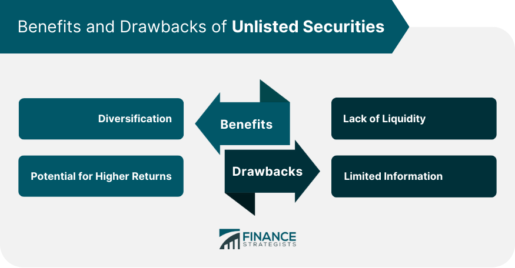

## Table of Contents

## What are unlisted securities?

Unlisted securities are investments that are not traded on a public stock exchange. This means they are not available for the general public to buy and sell easily on platforms like the New York Stock Exchange or NASDAQ. Instead, these securities are often held by private investors or companies and can be traded through private transactions. Examples include shares in private companies, certain bonds, and other financial instruments that are not listed on a public market.

Because unlisted securities are not publicly traded, they can be harder to buy and sell. This can make them less liquid, meaning it might take longer to find a buyer or seller. Additionally, there is often less information available about unlisted securities compared to listed ones, which can make them riskier. Investors in unlisted securities need to do more research and may need to hold onto their investments for a longer period of time.

## How do unlisted securities differ from listed securities?

Unlisted securities are not traded on public stock exchanges, while listed securities are. This means you can't buy or sell unlisted securities easily on big markets like the New York Stock Exchange. Instead, they are often traded privately between investors or companies. Because of this, unlisted securities can be harder to turn into cash quickly, which makes them less liquid. On the other hand, listed securities can be bought and sold quickly and easily on public exchanges, making them more liquid.

Another big difference is the amount of information available. For listed securities, companies have to share a lot of information with the public, like financial reports and news about the business. This helps investors make better decisions. Unlisted securities usually don't have to share as much information, so it can be harder to know if they are a good investment. This can make unlisted securities riskier. Because of these differences, unlisted securities might be held for a longer time and need more research before investing.

## What are the common types of unlisted securities?

Unlisted securities include shares in private companies. These are companies that are not listed on a public stock exchange. People who invest in these shares are usually the founders, employees, or private investors. These shares can be traded, but it's not as easy as buying and selling stocks on a public market. You might need to find someone who wants to buy or sell the shares directly.

Another type of unlisted security is private bonds. These are loans that companies or governments issue to raise money, but they are not traded on public markets. Investors buy these bonds and get paid back with interest over time. They are often used by smaller companies or for special projects that don't need to be public.

There are also other types of unlisted securities like private equity and hedge funds. Private equity involves investing in companies that are not publicly traded, often with the goal of improving the company and selling it later for a profit. Hedge funds are investment funds that use different strategies to earn returns for their investors, but they are not available to the general public and are usually only open to wealthy or institutional investors.

## What are the potential benefits of investing in unlisted securities?

Investing in unlisted securities can offer the chance for big returns. Since these investments are not on public markets, they can sometimes grow a lot in value before they are sold or go public. For example, if you invest early in a private company that does well, you might make a lot of money when it gets bigger or is sold. Also, unlisted securities can help you spread out your investments. Instead of just having stocks and bonds from public companies, you can invest in different things like private companies or special projects. This can help lower the risk of losing money if one type of investment does badly.

Another benefit is that unlisted securities can give you more control over your investments. When you invest in a private company, you might get a say in how it's run. This is different from public companies where individual investors usually don't have much power. Also, unlisted securities can be a way to invest in new and exciting areas that are not available on public markets. For example, you might find opportunities in new technology or special projects that are not yet big enough to be listed on a stock exchange.

## What are the main risks associated with unlisted securities?

Investing in unlisted securities can be risky because they are not traded on public stock exchanges. This means they can be hard to sell quickly if you need your money back. It might take a long time to find someone who wants to buy your shares in a private company, and you might have to sell them for less than you paid. This lack of [liquidity](/wiki/liquidity-risk-premium) can be a big problem if you need cash fast.

Another risk is that there is often less information available about unlisted securities. Public companies have to share a lot of details about their business and finances, but private companies don't have to do this. This makes it harder to know if the company is doing well or if it's a good investment. Without enough information, you might make a bad decision and lose money.

Also, unlisted securities can be more volatile. Their value can go up and down a lot because they are not as stable as public companies. If the company you invest in does not do well, you could lose a lot of your money. This risk is higher because you can't easily sell your investment to cut your losses if things go wrong.

## How can one invest in unlisted securities?

To invest in unlisted securities, you usually need to find private companies or funds that are not on public stock exchanges. You can start by networking with people who know about private investments, like venture capitalists or angel investors. They might know about good opportunities and can help you get in touch with the right people. You can also look for private equity firms or hedge funds that offer investments in unlisted securities. These firms manage money for investors and often have access to private companies and special projects that are not available to the general public.

Once you find an opportunity, you need to do a lot of research. Since unlisted securities don't have to share as much information as public companies, you need to find out as much as you can about the company or project. This might mean talking to the company's founders, looking at their business plans, and understanding their financial situation. If you decide to invest, you will usually need to sign a contract and transfer money directly to the company or through a private transaction. Remember, investing in unlisted securities can be riskier and less liquid than public investments, so it's important to be careful and think about how long you can keep your money tied up.

## What is the liquidity risk associated with unlisted securities?

Liquidity risk is a big problem with unlisted securities. It means that it can be hard to sell these investments quickly if you need your money back. Since unlisted securities are not traded on public stock exchanges, you can't just sell them like you can with stocks or bonds that are listed. Instead, you have to find someone who wants to buy your shares in a private company, and this can take a long time. If you need cash fast, this can be a big problem because you might have to sell your investment for less than you paid for it.

This risk is higher with unlisted securities because there are fewer buyers and sellers. When you invest in a public company, there are always people buying and selling shares, so it's easy to get out of your investment if you need to. But with unlisted securities, the market is much smaller, and it can be hard to find someone who wants to buy what you're selling. This means you might have to wait a long time to get your money back, or you might have to accept a lower price than you wanted.

## How does the valuation of unlisted securities work?

Valuing unlisted securities can be tricky because they are not traded on public stock exchanges. When a company's shares are listed on a public market, you can see the price people are willing to pay for them, which helps set the value. But with unlisted securities, there is no public market to look at, so you have to use other ways to figure out what they are worth. One common way is to look at the company's financials, like how much money it makes and how much it spends. You might also look at what similar companies are worth, even if they are not exactly the same.

Another way to value unlisted securities is by thinking about what the company might be worth in the future. This can be based on the company's growth plans, new products they are working on, or other things that could make the company more valuable down the road. Sometimes, investors will also look at what other investors have paid for shares in the company in the past. All these methods are just guesses, though, because without a public market, it's hard to know for sure what the securities are really worth.

## What regulatory considerations should be taken into account when investing in unlisted securities?

When you invest in unlisted securities, you need to think about the rules that apply to these investments. Unlike public companies, private companies don't have to follow as many rules about sharing information with investors. This means you might not get as much information about the company's finances or how it's doing. But there are still some rules you need to know. For example, in the United States, the Securities and Exchange Commission (SEC) has rules about who can invest in private companies and how much they can invest. These rules are meant to protect investors by making sure they understand the risks.

Also, if you're investing through a private fund like a [hedge fund](/wiki/hedge-fund-trading-strategies) or private equity fund, there are more rules to consider. These funds have to follow certain regulations about who they can take money from and how they manage that money. For example, they might only be allowed to take money from people who are considered "accredited investors," which means they have a certain amount of money or income. It's important to understand these rules so you know if you're allowed to invest and what the risks are. Talking to a financial advisor or lawyer can help you figure out what rules apply to your investment.

## How do unlisted securities impact portfolio diversification?

Unlisted securities can help you spread out your investments in a different way than just buying stocks and bonds from public companies. When you invest in unlisted securities, like shares in a private company or a private bond, you are putting your money into things that are not traded on big stock markets. This can be good because it means your money is not all in the same place. If the stock market goes down, your unlisted securities might not be affected in the same way. This can help lower the risk of losing a lot of money if one part of your investments does badly.

But, adding unlisted securities to your portfolio also comes with some risks. Because these investments are not on public markets, they can be harder to sell quickly if you need your money back. This means you might have to wait a long time to get your money out, or you might have to sell for less than you paid. Also, there is often less information about unlisted securities, so it can be harder to know if they are a good investment. This means you need to do more research and be ready to keep your money tied up for a longer time.

## What are some advanced strategies for managing a portfolio of unlisted securities?

Managing a portfolio of unlisted securities can be tricky, but there are some smart ways to do it. One good strategy is to spread your money across different types of unlisted securities. This means you might invest in a few private companies, some private bonds, and maybe even a private equity fund. By doing this, you are not putting all your eggs in one basket. If one of your investments does not do well, the others might still be okay. Another strategy is to keep some of your money in more liquid investments, like stocks or bonds that you can sell quickly. This way, if you need cash fast, you can use those investments instead of trying to sell your unlisted securities, which can take a long time.

Another important strategy is to keep a close eye on your investments and stay in touch with the companies you have invested in. Since unlisted securities don't have to share as much information as public companies, you need to do your own research and talk to the company's founders or managers to understand how things are going. This can help you make better decisions about when to hold onto your investments and when to sell. Also, think about how long you can keep your money tied up. Unlisted securities can take a long time to pay off, so make sure you are okay with waiting before you invest.

## How can one assess the performance of unlisted securities over time?

Assessing the performance of unlisted securities over time can be challenging because they are not traded on public stock exchanges. Unlike stocks or bonds that you can easily check the price of, unlisted securities don't have a clear market value that you can look at every day. To figure out how well your investment is doing, you need to look at the company's financial reports, like how much money they are making and spending. You might also talk to the company's founders or managers to get updates on how the business is doing. Sometimes, you can compare your investment to similar companies that are public to get an idea of its value, but this is just a guess.

Another way to assess the performance of unlisted securities is to think about what the company might be worth in the future. This can be based on the company's growth plans, new products they are working on, or other things that could make the company more valuable down the road. If the company is doing well and growing, your investment might be worth more over time. But if the company is struggling, your investment might lose value. It's important to keep track of these changes and be ready to wait a long time before you see any returns, because unlisted securities can take years to pay off.

## References & Further Reading

[1]: Bergstra, J., Bardenet, R., Bengio, Y., & Kégl, B. (2011). ["Algorithms for Hyper-Parameter Optimization."](https://papers.nips.cc/paper_files/paper/201