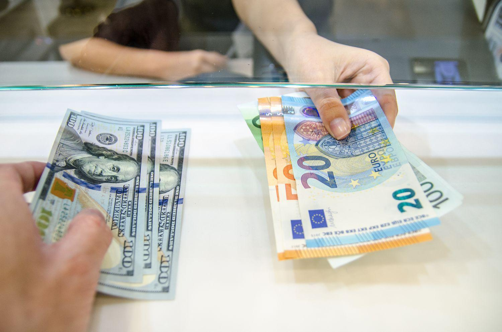

## Table of Contents

## What is the U.S. dollar?

The U.S. dollar is the official money used in the United States. It is also called the American dollar. People use dollars to buy things like food, clothes, and toys. The dollar is divided into 100 smaller units called cents. You can see dollars written as a symbol, which looks like this: $. For example, if something costs five dollars, you can write it as $5.

The U.S. dollar is very important around the world. Many countries use it for trading and keeping their money safe. It is one of the most traded currencies globally. This means that people from different countries often exchange their money for U.S. dollars. The value of the dollar can change, which affects how much things cost in other countries.

## Why is the U.S. dollar considered a world currency?

The U.S. dollar is considered a world currency because it is used by many countries for trading and keeping their money safe. It is the most traded currency in the world, which means that people from different countries often exchange their money for U.S. dollars. This happens because the U.S. economy is very big and strong, and many people trust the dollar. When countries trade with each other, they often use dollars to make it easier.

Another reason the U.S. dollar is a world currency is that it is used as a reserve currency by many countries. This means that countries keep dollars in their banks to use when they need to buy things from other countries or to help their own economy. Because so many countries use the dollar this way, it helps keep the dollar strong and important around the world.

## How did the U.S. dollar gain its unofficial status as a global currency?

The U.S. dollar became a global currency because the United States has a very big and strong economy. After World War II, many countries started using the dollar for trading because they trusted the U.S. economy. The U.S. also helped set up a system called the Bretton Woods system, where other countries agreed to keep their money's value linked to the dollar. This made the dollar even more important for international trade.

Over time, more and more countries began to use the dollar as a reserve currency. This means they kept dollars in their banks to use when they needed to buy things from other countries or to help their own economy. Because so many countries used the dollar this way, it became the most traded currency in the world. Today, even though the Bretton Woods system is gone, the dollar is still used a lot in global trade and is seen as a safe and reliable currency.

## What are the benefits of the U.S. dollar being a world currency?

The U.S. dollar being a world currency helps the United States a lot. When other countries use dollars for trading, it makes the U.S. economy stronger. This is because more people want dollars, which can make the dollar's value go up. A strong dollar means that things from the U.S. can be cheaper for other countries to buy, which can help U.S. businesses sell more stuff around the world. Also, because many countries keep dollars in their banks, the U.S. can borrow money more easily and at lower interest rates.

Another benefit is that the U.S. dollar being a world currency gives the U.S. a lot of power in the world. When countries use dollars, they have to follow some rules set by the U.S. This can help the U.S. make decisions that affect the whole world. For example, the U.S. can use its power over the dollar to make other countries do things they might not want to do. This kind of power can help the U.S. keep its place as a leader in the world.

## What are the drawbacks of the U.S. dollar's dominance in global trade?

The U.S. dollar being the main currency used in global trade can cause problems for other countries. When the value of the dollar goes up or down, it can make things more expensive or cheaper for other countries. This can hurt their economies because they might have to pay more for things they need to buy from other countries. Also, if a country keeps a lot of dollars as a reserve, and the value of the dollar goes down, the money they saved can be worth less. This can make it hard for them to plan and can cause big problems in their economy.

Another problem is that the U.S. can use its power over the dollar to control other countries. For example, the U.S. can stop other countries from using dollars if they do something the U.S. doesn't like. This can hurt those countries a lot because they might not be able to trade as easily. Also, because the U.S. has so much power over the dollar, other countries might feel like they have to do what the U.S. wants, even if they don't agree. This can cause tension and problems between countries.

## How does the U.S. dollar's status affect international trade and economies?

The U.S. dollar being the main currency for global trade can make things easier for countries. When countries use dollars to buy and sell things, it helps them trade with each other more smoothly. The U.S. dollar is trusted by many countries, so they feel safe using it. This trust can help keep the world's economy stable. When countries keep dollars in their banks as a reserve, it can also help them feel more secure. If they need to buy things from other countries, they can use their dollar reserves.

But there are also problems because the U.S. dollar is so important. When the value of the dollar goes up or down, it can make things more expensive or cheaper for other countries. This can hurt their economies because they might have to pay more for things they need. If a country keeps a lot of dollars and the dollar's value goes down, the money they saved can be worth less. This can make it hard for them to plan and can cause big problems in their economy. Also, the U.S. can use its power over the dollar to control other countries, which can cause tension and problems between countries.

## What role does the U.S. Federal Reserve play in maintaining the dollar's global position?

The U.S. Federal Reserve, or the Fed, helps keep the U.S. dollar important around the world. The Fed is like a big bank that controls how much money is in the U.S. It does this by setting interest rates, which is how much it costs to borrow money. When the Fed changes these rates, it can make the dollar stronger or weaker. If the Fed makes borrowing cheaper, more people want to use dollars, which can make the dollar's value go up. This helps keep the dollar strong and trusted by other countries.

The Fed also works to keep the U.S. economy stable. When the economy is doing well, people from other countries want to use dollars more. The Fed can print more money or take money out of the economy to help keep things balanced. This stability makes other countries feel safe using dollars for trading and keeping as reserves. By doing these things, the Fed helps make sure that the U.S. dollar stays a big part of the world's money system.

## How do other countries' currencies interact with the U.S. dollar in the global market?

Other countries' currencies interact with the U.S. dollar in the global market through trading and exchange rates. When people from different countries want to buy things from the U.S., they need to exchange their money for dollars. This exchange happens in the foreign exchange market, where the value of one currency is compared to another. If a lot of people want dollars, the value of the dollar can go up compared to other currencies. This means that other countries' money might be worth less when they trade it for dollars.

The value of other countries' currencies can also change because of what the U.S. does with its economy. For example, if the U.S. Federal Reserve changes interest rates, it can affect how much people want to use dollars. If the interest rates go up, more people might want to keep their money in dollars because they can earn more from it. This can make the dollar stronger and other currencies weaker. On the other hand, if the U.S. economy is not doing well, people might not want to use dollars as much, which can make the dollar weaker and other currencies stronger.

## What are the geopolitical implications of the U.S. dollar's unofficial status?

The U.S. dollar being a world currency gives the United States a lot of power in the world. Because many countries use dollars for trading and keeping their money safe, the U.S. can influence what other countries do. For example, the U.S. can stop other countries from using dollars if they do something the U.S. doesn't like. This can make those countries have a hard time trading and can hurt their economies. It can also make other countries feel like they have to do what the U.S. wants, even if they don't agree. This can cause tension and problems between countries.

On the other hand, the U.S. dollar's status can also help keep the world's economy stable. When countries use dollars, it makes it easier for them to trade with each other. The trust in the dollar can help prevent big problems in the world's economy. But if the value of the dollar changes a lot, it can cause problems for other countries. If the dollar gets stronger, things from the U.S. can become cheaper for other countries to buy, but their own money might be worth less. If the dollar gets weaker, the opposite can happen. This can make it hard for other countries to plan and can cause big problems in their economies.

## How have recent global economic shifts influenced the U.S. dollar's position?

Recent global economic shifts have had a big impact on the U.S. dollar's position in the world. One big change is that other countries, like China, are becoming more important in the world's economy. As these countries grow, they want to use their own money more for trading. This can make the U.S. dollar less important. Also, some countries are trying to use less dollars and more of their own money or other currencies for trading. This is called "de-dollarization." If more countries do this, it could make the dollar weaker.

Another change is that the U.S. has been using its power over the dollar to control other countries. For example, the U.S. has stopped some countries from using dollars because of political problems. This has made some countries want to use less dollars. Also, the U.S. has had some economic problems, like big debts and inflation. These problems can make other countries trust the dollar less. But even with these changes, the U.S. dollar is still very important in the world. Many countries still use it a lot for trading and keeping their money safe.

## What are the potential future scenarios for the U.S. dollar as a world currency?

In the future, the U.S. dollar might keep being the most important currency in the world. This could happen if the U.S. keeps its economy strong and stable. If the U.S. can keep its debts under control and make sure the dollar stays strong, other countries will keep using it for trading and keeping their money safe. The U.S. Federal Reserve will also need to keep doing a good job of managing the economy. If all these things happen, the U.S. dollar will stay a big part of the world's money system.

But there are also other things that could happen. Other countries, like China, might become more important in the world's economy. If these countries start using their own money more for trading, the U.S. dollar might become less important. This is called "de-dollarization." Also, if the U.S. keeps using its power over the dollar to control other countries, more countries might want to use less dollars. If the U.S. has big economic problems, like a lot of debt or inflation, other countries might trust the dollar less. These changes could make the U.S. dollar weaker in the future.

## What alternatives to the U.S. dollar are being considered or developed by other nations?

Some countries are looking at other currencies to use instead of the U.S. dollar. One big alternative is the Chinese yuan. China wants to use its own money more for trading with other countries. They are doing this by making deals with other countries to use the yuan instead of the dollar. Another option is the euro, which is used by many countries in Europe. Some countries think the euro could be a good choice because it is already used a lot in Europe and is seen as stable.

There are also new ideas like digital currencies that countries are thinking about. Some countries are making their own digital money, which they can use for trading without needing the U.S. dollar. For example, China is working on a digital yuan. There are also talks about making a new global currency that many countries could use together. This could be a way to make trading easier without relying on the U.S. dollar. These alternatives could change how the world uses money in the future.

## References & Further Reading

[1]: Bergstra, J., Bardenet, R., Bengio, Y., & Kégl, B. (2011). ["Algorithms for Hyper-Parameter Optimization."](https://dl.acm.org/doi/10.5555/2986459.2986743) Advances in Neural Information Processing Systems 24.

[2]: ["Advances in Financial Machine Learning"](https://www.amazon.com/Advances-Financial-Machine-Learning-Marcos/dp/1119482089) by Marcos Lopez de Prado

[3]: ["Evidence-Based Technical Analysis: Applying the Scientific Method and Statistical Inference to Trading Signals"](https://www.amazon.com/Evidence-Based-Technical-Analysis-Scientific-Statistical/dp/0470008741) by David Aronson

[4]: ["Machine Learning for Algorithmic Trading"](https://github.com/stefan-jansen/machine-learning-for-trading) by Stefan Jansen

[5]: ["Quantitative Trading: How to Build Your Own Algorithmic Trading Business"](https://www.amazon.com/Quantitative-Trading-Build-Algorithmic-Business/dp/1119800064) by Ernest P. Chan