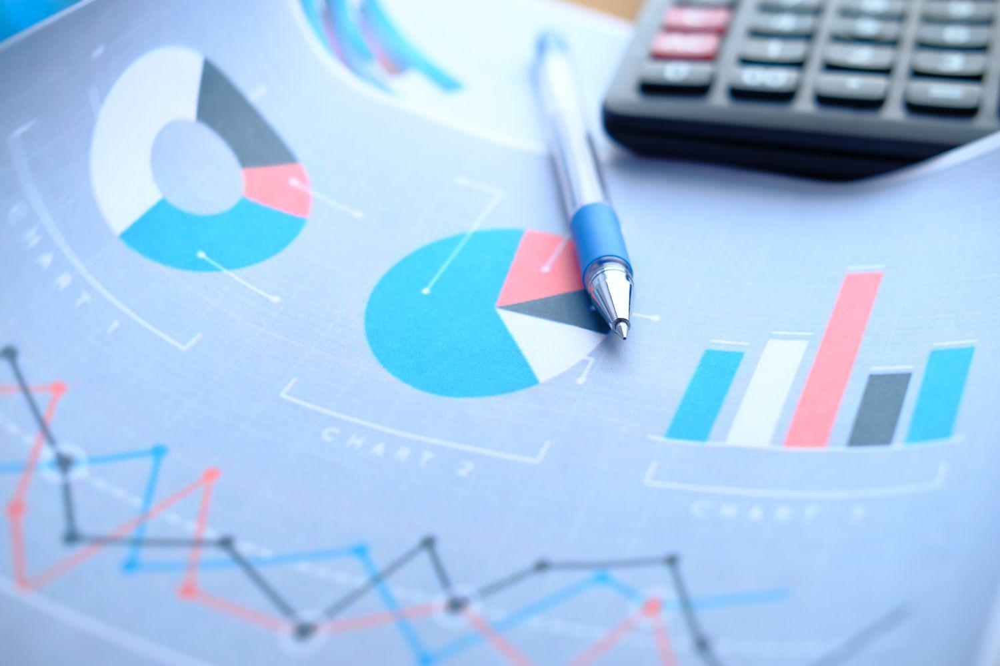

Unpaid dividends, dividend-paying stocks, and algorithmic trading are essential components of modern investment strategies, offering both opportunities and challenges for investors. Dividend-paying stocks have long been favored for their potential to provide regular income and the possibility of long-term capital appreciation. However, understanding the nuances of unpaid dividends is critical, as these influence investment decision-making and timing.

Unpaid dividends refer to those dividends declared by a company but not yet paid to shareholders. This situation can arise due to various reasons, including administrative delays or managerial strategies aimed at retaining liquidity during uncertain economic conditions. Investors who can accurately anticipate and react to these scenarios might find advantageous entry points, thereby optimizing their portfolio's income streams and returns.



With the advent of sophisticated trading technologies, algorithmic trading presents a transformative approach to managing dividend stocks. Algorithms enable investors to execute trades with precision and speed, capitalizing on minute market movements that may accompany dividend announcements and payments. This technological integration allows for the optimization of returns, as traders can develop strategies like dividend capture, which involves purchasing stocks just before the ex-dividend date to secure the dividend payout and then selling the stock thereafter.

The strategic alignment of unpaid dividends with algorithmic trading involves understanding the payment processes and optimizing timing. It requires an analytical approach that combines financial data analysis with advanced mathematical models. This article aims to shed light on how investors can maximize their return on investments through an effective blend of unpaid dividend strategies and algorithmic trading practices. By leveraging these tools, investors stand to improve portfolio performance, aligning with both dividend growth and capital gains objectives.

## Table of Contents

## Understanding Unpaid Dividends

Unpaid dividends, often a focus of investor scrutiny, are dividends that have been announced or declared by a company's board of directors but have not yet reached the shareholders. Understanding the timeline of dividend processes is crucial to comprehending when and why dividends remain unpaid.

**Timeline of Dividend Declarations**

1. **Declaration Date**: This is the date on which a company's board of directors announces the dividend payment. On this date, details such as the amount of the dividend, the ex-dividend date, record date, and payment date are disclosed.

2. **Ex-Dividend Date**: The ex-dividend date is set one business day before the record date. To qualify for the dividend, investors must own the stock before this date. If a stock is purchased on or after the ex-dividend date, the seller is entitled to the dividend rather than the buyer.

3. **Record Date**: On this date, the company reviews its records to determine the shareholders eligible for the dividend. Only those recorded as shareholders by this date will receive the upcoming dividend.

4. **Payment Date**: This is the day on which the dividend is actually distributed to shareholders, either by electronic transfer or by check.

**Reasons Behind Unpaid Dividends**

Several factors can lead to dividends being unpaid beyond their expected timeline. Administrative delays might occur due to logistical issues or errors in shareholder information. Furthermore, strategic management decisions can affect the payment of dividends, possibly due to cash flow concerns, legal disputes, or changing economic conditions. Occasionally, companies may choose to reallocate cash resources to investment opportunities or debt reduction, momentarily deferring dividend payments.

**Implications on Investment Timing and Portfolio Income**

Unpaid dividends are significant for investors as they influence investment strategies and income projections. Delays in dividend payments can alter expected cash flows, affecting the timing of reinvestments or income. Investors need to be aware of the dividend timeline to optimize their purchasing and selling decisions around these key dates to maximize returns and budget accurately.

**Scenarios of Unpaid Dividends**

Consider a case where a company's dividend remains unpaid due to an administrative oversight. This creates a delay that impacts all stakeholders waiting for distribution. Alternatively, a strategic withholding could occur in a merger scenario where the company decides to retain cash reserves, thereby delaying the payout.

Understanding unpaid dividends involves comprehending each aspect of the dividend timeline and recognizing the factors influencing distribution delays. Investors informed about these processes and scenarios can better manage their portfolios, ensuring steady income streams and timing investments effectively.

## Mechanics of Dividend Payments

Dividend payments are a critical aspect of shareholder returns and reflect a company's financial health. The process involves several key dates that investors should be aware of to effectively manage their investment strategies. Understanding these dates can maximize the benefits of dividend-focused strategies and optimize portfolio performance.

### Declaration Date
The dividend payment process begins with the Declaration Date, when a company's board of directors announces the dividend amount. This date establishes the company's commitment to distribute profits to shareholders and signals financial stability. From an investor's perspective, the Declaration Date provides insight into a company's earnings performance and financial outlook. A company's ability to consistently declare dividends over time is often interpreted as a positive sign of fiscal health.

### Ex-Dividend Date
The Ex-Dividend Date is arguably the most critical date for investors looking to capture dividends. Set by the stock exchange, it falls one business day before the Record Date. To be eligible for the declared dividend, investors must purchase the shares before this date. Stocks often experience a price adjustment on the Ex-Dividend Date, theoretically decreasing by the approximate amount of the dividend. This price behavior allows investors and algorithmic traders to deploy strategies focusing on dividend capture, understanding that buying shares before the Ex-Dividend Date grants them dividend entitlement.

### Record Date
The company uses the Record Date to determine which shareholders are eligible to receive the dividend. This date is two business days after the Ex-Dividend Date due to stock settlement procedures. Investors holding shares by the close of the Record Date receive the dividend payment. While crucial for determining eligibility, the Record Date holds less strategic importance for investors once they have secured the stock before the Ex-Dividend Date.

### Payment Date
Finally, the Payment Date is when dividend payments are made to shareholders, usually weeks after the Record Date. This transaction confirms the cash flow benefit from holding dividend-paying stocks. Investors can use this date as part of their cash flow planning and reinvestment strategies, often redirecting received dividends into additional shares or other investment opportunities.

### Impact on Stock Prices
The dividend payment process can significantly affect stock prices at various stages, primarily around the Ex-Dividend Date. Theoretically, a stock's price drops by the dividend amount on this date, reflecting the reduction in the company's assets. However, various market factors, including investor sentiment, market conditions, and demand-supply dynamics, can impact this adjustment. Additionally, frequent dividend payouts often attract certain types of investors, potentially affecting trading volumes and share price [volatility](/wiki/volatility-trading-strategies).

Understanding these timelines and their implications enables investors to plan strategic entry and [exit](/wiki/exit-strategy) points in the stock market, aligning their investments to maximize returns from dividend distributions. This knowledge, combined with [algorithmic trading](/wiki/algorithmic-trading) strategies, allows for optimized execution of trades, leveraging dividend payment schedules to enhance investment performance.

## Algorithmic Trading and Dividend Capture Strategies

Algorithmic trading leverages mathematical models and algorithms to execute trades with precision and efficiency. These automated techniques are particularly beneficial for dividend capture strategies, which involve purchasing stocks just before their ex-dividend date and liquidating them shortly after to capitalize on dividend payouts. By automating this process, investors aim to optimize returns through timely transactions and strategic entry and exit points.

Algorithms enhance dividend capture strategies through data analysis and rapid decision-making. They are adept at sifting through vast amounts of data, identifying patterns and market trends that inform optimal trading opportunities. Using historical price data, [liquidity](/wiki/liquidity-risk-premium) measures, and statistical indicators, algorithms pinpoint the best times to initiate and close positions around ex-dividend dates.

For example, here is a simple Python code snippet for implementing a basic dividend capture strategy using the Python library `pandas` to handle stock data and `datetime` for managing dates:

```python
import pandas as pd
from datetime import datetime, timedelta

# Function to execute a dividend capture strategy
def dividend_capture_strategy(prices, dividends, today):
    ex_dividend_day = today - timedelta(days=1) 
    buy_price = prices.loc[ex_dividend_day]['Close']
    dividend = dividends.loc[datetime(today.year, today.month, today.day)]
    sell_price = prices.loc[today]['Open']

    # Calculate profit from dividend capture
    profit = ((sell_price - buy_price) / buy_price) + (dividend / buy_price)
    return profit

# Example usage
prices = pd.DataFrame({
    'Close': [100, 102, 98, 105],  # Example close prices
    'Open': [101, 103, 99, 106]
}, index=pd.to_datetime(['2023-10-01', '2023-10-02', '2023-10-03', '2023-10-04']))

dividends = pd.Series({
    datetime(2023, 10, 3): 1.5  # Example dividend payment on 3rd October
})

today = datetime(2023, 10, 4)
profit = dividend_capture_strategy(prices, dividends, today)
print(f"Profit: {profit:.2%}")
```

This script simulates purchasing a stock the day before an ex-dividend date and selling on the day dividends are expected to be paid. The calculated profit incorporates both the capital gain (or loss) from the change in stock price and the received dividend.

Despite their merits, these strategies face specific challenges. Transaction costs, particularly with frequent buying and selling, can erode profits if not meticulously managed. Additionally, price volatility around critical dividend dates may impact the effectiveness of dividend capture, as unforeseen market movements can alter expected outcomes.

To mitigate these challenges, algorithms can include transaction cost analysis and incorporate volatility-adjusted position sizes to protect against market fluctuations. Advanced strategies might also involve [machine learning](/wiki/machine-learning) models to predict stock price behavior post-ex-dividend more accurately, thus refining the timing and scale of trades.

The integration of algorithmic trading in dividend capture strategies underscores the potential of technology in enhancing traditional investment tactics, enabling investors to achieve improved returns through data-driven precision and efficiency.

## Impact of Algorithmic Trading on Dividend-Focused Investments

Algorithmic trading, characterized by its precision and speed, significantly impacts dividend-focused investment strategies. By utilizing mathematical models and sophisticated algorithms, traders can capitalize on fluctuations surrounding key dividend dates. This strategic approach enhances the potential for optimizing the balance between risk and return.

One way algorithms influence stock prices during dividend-related events is through their ability to efficiently process and analyze large datasets. For example, algorithms can assess historical stock price movements and dividend payment patterns to identify the most opportune moments for entry and exit trades. This capability is particularly valuable around the ex-dividend date, where stock prices typically drop to reflect the dividend payout. Algorithmic trading systems can anticipate these price changes, allowing investors to adjust their positions accordingly.

Machine learning plays a critical role in improving the accuracy of these predictions. By employing techniques such as regression analysis and time series forecasting, machine learning models can predict future dividend yields and stock movements with greater precision. These models can consider a wide array of factors, including past dividend histories, earnings reports, and macroeconomic indicators, to generate predictions that inform trading decisions.

However, algorithmic trading is not without its challenges and risks. One primary concern is market volatility, which can disrupt algorithmic strategies and lead to significant financial losses. Algorithmic systems are designed to work within certain market conditions, and unexpected volatility can render them ineffective. Additionally, algorithmic errors, such as coding mistakes or flawed data inputs, can have detrimental effects, leading to erroneous trades and unintended financial exposure.

The use of algorithms in dividend strategies is exemplified by certain quantitative hedge funds. These funds deploy algorithmic trading systems to exploit short-term inefficiencies in the market surrounding dividend announcements and payments. By systematically trading around dividend events, these funds seek to generate excess returns while minimizing risks through diversification and hedging strategies.

For instance, consider a [hedge fund](/wiki/hedge-fund-trading-strategies) utilizing an algorithm that analyzes patterns in dividend announcements. The fund may employ a Python-based trading model that captures market data, processes it to identify undervalued opportunities before and after dividend dates, and automatically executes trades. A simple example of such an algorithm could be:

```python
import yfinance as yf  # For more datasets, visit: https://paperswithbacktest.com/datasets

def dividend_capture_strategy(ticker, ex_dividend_date):
    stock = yf.Ticker(ticker)
    historical_data = stock.history(start="2022-01-01", end=ex_dividend_date)

    # Identify purchase price just before ex-dividend date
    buy_price = historical_data.iloc[-1]['Close']

    # Calculate estimated post-dividend sell price (adjusted for expected drop)
    estimated_drop = stock.dividends.loc[ex_dividend_date] if ex_dividend_date in stock.dividends else 0
    sell_price = buy_price - estimated_drop

    return buy_price, sell_price

# Example usage
ticker = "AAPL"
ex_dividend_date = "2023-08-01"
buy_price, sell_price = dividend_capture_strategy(ticker, ex_dividend_date)
print(f"Buy at: {buy_price}, Sell at: {sell_price}")
```

This snippet outlines a basic strategy aimed at leveraging dividend capture techniques by focusing on stock movements around ex-dividend dates. 

In conclusion, algorithmic trading provides a valuable toolset for dividend-focused investors by enabling swift responses to market changes and offering an analytical edge through machine learning. Despite inherent risks and challenges, the strategic application of algorithms in this domain continues to evolve, presenting new opportunities for enhancing portfolio performance.

## Conclusion

Unpaid dividends can provide notable wealth creation opportunities when strategically managed within an investment portfolio. By leveraging algorithmic trading, investors can enhance returns through the meticulous analysis of market trends and executing trades with precision and speed. Understanding key dividend timelines, such as declaration and ex-dividend dates, allows investors to strategically plan entry and exit strategies that align with dividend distributions, optimizing portfolio performance.

The integration of algorithmic trading into dividend investing is bolstered by the potential of [artificial intelligence](/wiki/ai-artificial-intelligence) and machine learning. These technologies offer promising prospects for predicting dividend trends and stock movements, aiding investors in making more informed decisions. Machine learning algorithms, for instance, can analyze historical data and market conditions to forecast future dividend yields and optimize trading strategies. 

However, the successful integration of algorithmic trading and dividend strategies necessitates a thorough understanding of technology and market dynamics. It requires careful planning and robust risk management strategies to mitigate potential risks associated with market volatility and algorithmic errors. Continuous refinement of strategies is essential to adapt to changing market conditions and capitalize on emerging opportunities.

In conclusion, the confluence of unpaid dividends and advanced trading technologies presents a unique opportunity for investors to maximize returns. By strategically managing dividends and employing algorithmic trading, investors can navigate the complexities of the market and achieve improved investment outcomes. Looking forward, advancements in AI and machine learning are expected to further revolutionize dividend capturing and algorithmic trading strategies, offering new avenues for wealth creation.

## References & Further Reading

Books, articles, and online resources on dividend stocks and algorithmic trading are recommended for further exploration. 

Key titles that provide comprehensive insights include "Quantitative Trading: How to Build Your Own Algorithmic Trading Business" by Ernest P. Chan, which offers practical guidance on developing algorithmic trading strategies, and "Machine Learning for Algorithmic Trading" by Stefan Jansen, which investigates into using machine learning techniques for trading applications. These [books](/wiki/algo-trading-books) are essential for anyone looking to gain a deeper understanding of the quantitative aspects and technological tools that drive modern trading.

For those interested in the academic and strategic dimensions of dividend capture and investment strategies, research papers offer valuable insights. Scholarly articles typically provide detailed analyses of market behaviors and model-based strategies, making them invaluable resources for investors and researchers seeking to apply advanced statistical and algorithmic methods to dividend investing.

Online platforms like Investopedia are also excellent resources. They offer articles and tutorials on dividend stocks and algorithmic trading, accessible to both beginner and advanced readers. For example, Investopedia provides comprehensive guides on topics such as "How Dividends Affect Stock Prices" and "Designing a Dividend Capture Strategy," which are particularly useful for understanding the market mechanics at play during dividend events.

Trading-focused websites and forums allow investors to stay updated on the latest tools and trends within the industry. Websites such as QuantStart feature tutorials and discussions that cover practical aspects of implementing algorithmic trading strategies, including coding examples and usage of trading platforms. These resources are beneficial for practitioners interested in applying quantitative techniques to enhance their investment approaches within dividend-focused strategies.

Overall, these books, research papers, and online resources provide a broad spectrum of knowledge that can support investors in mastering the complexities of dividend investing and algorithmic trading. By building a strong foundation in these areas, investors are better positioned to navigate the intricacies of modern financial markets and achieve improved investment outcomes.

