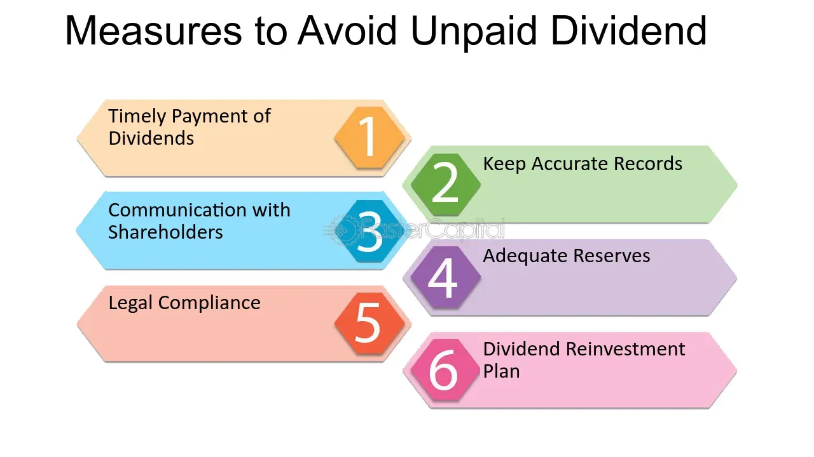

## Table of Contents

## What are unpaid dividends?

Unpaid dividends are payments that a company owes to its shareholders but has not yet paid out. When a company makes a profit, it can choose to share some of that profit with its shareholders in the form of dividends. If the company declares a dividend but does not pay it on time, those dividends become unpaid.

Sometimes, unpaid dividends can happen because the company is facing financial difficulties and cannot afford to pay them right away. Other times, it might be due to administrative issues or delays in processing. Shareholders usually have to wait until the company can pay the dividends, and in some cases, they might never receive them if the company goes bankrupt.

## How do unpaid dividends occur?

Unpaid dividends happen when a company says it will give money to its shareholders but then doesn't pay it on time. This can happen if the company is having money problems and can't afford to pay the dividends right away. Sometimes, the company might be waiting for more money to come in before it can pay everyone.

Other times, unpaid dividends can occur because of mistakes or delays in the company's paperwork. Maybe the people in charge of sending out the payments are slow, or there's a problem with the bank. Whatever the reason, shareholders have to wait until the company can finally pay the dividends. If the company goes bankrupt, the shareholders might never get their money.

## What is the difference between paid and unpaid dividends?

Paid dividends are when a company gives money to its shareholders as promised. When a company makes a profit, it can decide to share some of that money with the people who own its stock. If the company says it will pay dividends and then does it on time, those are paid dividends. Shareholders get their money and are happy.

Unpaid dividends are when a company says it will give money to its shareholders but then doesn't do it on time. This can happen if the company is having money problems and can't pay right away. It might also happen because of mistakes or delays in the company's paperwork. Shareholders have to wait until the company can pay, and sometimes they might never get their money if the company goes bankrupt.

## Who is affected by unpaid dividends?

Unpaid dividends affect the shareholders of a company. These are the people who own the company's stock and expect to get some of the company's profits. When a company says it will pay dividends but doesn't, shareholders have to wait. This can be frustrating because they were counting on that money. It can also make them worry about the company's financial health.

Sometimes, unpaid dividends can also affect the company itself. If shareholders are unhappy because they're not getting their money, they might sell their stock. This can make the stock price go down, which can make the company look bad. If the company can't pay dividends because it's having money problems, it might need to fix those problems before it can pay its shareholders.

## What are the legal implications of unpaid dividends?

When a company doesn't pay dividends on time, it can have legal problems. Shareholders might take the company to court if they think the company broke its promise to pay dividends. The laws about this can be different in different places, but usually, shareholders have some rights to get their money. If the company can't pay because it's having money problems, the court might look at why the company can't pay and decide if the shareholders should get their money later or if they won't get it at all.

If a company keeps not paying dividends and it looks like it's not going to get better, shareholders might try to force the company to do something about it. They could vote to change the people in charge or even try to break up the company. But if the company goes bankrupt, shareholders are usually the last in line to get any money. This means they might not get their unpaid dividends at all because the company has to pay other people first, like banks and workers.

## How can a company manage unpaid dividends?

When a company has unpaid dividends, it needs to talk to its shareholders and explain why it can't pay right away. The company might say it's having money problems and needs more time to get the money together. It's important for the company to be honest and keep shareholders updated on when they might get their money. If the company can, it should try to pay the dividends as soon as possible to keep shareholders happy.

Sometimes, a company might need to make big changes to be able to pay unpaid dividends. This could mean selling some things the company owns to get more money or finding new ways to make money. If the company can't pay the dividends because it's in really bad shape, it might need to talk to a court or a special person who helps companies with money problems. This can help the company figure out how to pay its shareholders or if it's not possible, explain why.

## What are the accounting treatments for unpaid dividends?

When a company declares dividends but doesn't pay them right away, it needs to keep track of this in its accounting books. The company will record the unpaid dividends as a liability on its balance sheet. This means the company owes money to its shareholders and it shows up as something the company needs to pay in the future. The account for unpaid dividends is usually called "dividends payable."

To keep things clear, the company will also make a note in its financial statements about the unpaid dividends. This note will say how much money is owed and when the company plans to pay it. This helps everyone who looks at the company's financials understand that the company has promised to pay dividends but hasn't done it yet. It's important for the company to be honest and clear about this so shareholders and others know what's going on.

## How do unpaid dividends impact a company's financial statements?

Unpaid dividends show up on a company's financial statements as a liability. This means the company owes money to its shareholders and it's listed on the balance sheet under "dividends payable." When a company declares dividends but doesn't pay them right away, it has to keep track of this money it owes. This can make the company's liabilities look bigger, which might worry people who look at the financial statements.

Having unpaid dividends can also affect how people see the company. If shareholders see that the company can't pay dividends on time, they might think the company is having money problems. This can make them less happy with the company and might even make them sell their stock. If a lot of people sell their stock, the stock price could go down, which can make the company look even worse.

## What are the tax implications of unpaid dividends for shareholders?

When a company declares dividends but doesn't pay them right away, shareholders might wonder about the tax part. Usually, shareholders have to pay taxes on dividends when they get them. But with unpaid dividends, it's different. If the company says it will pay dividends but doesn't, shareholders don't have to pay taxes on that money until they actually get it. This means they can wait to pay taxes until the company pays the dividends.

Sometimes, the tax rules can be tricky. If a company goes bankrupt and can't pay the dividends at all, shareholders might never get that money. In that case, they won't have to pay taxes on it because they never got it. But if the company does pay the dividends later, shareholders will have to pay taxes on that money in the year they get it. It's a good idea for shareholders to talk to a tax person to understand how unpaid dividends might affect their taxes.

## How do unpaid dividends affect shareholder relations?

Unpaid dividends can make shareholders feel unhappy and worried. When a company says it will pay dividends but doesn't, shareholders might think the company is having money problems. This can make them lose trust in the company. They might start to wonder if the company is doing okay and if they should keep their money in the company's stock. If shareholders are not happy, they might sell their stock, which can make the stock price go down.

To keep good relations with shareholders, a company needs to talk to them about unpaid dividends. The company should explain why it can't pay the dividends right away and when it plans to pay them. Being honest and clear can help shareholders feel better about waiting for their money. If the company keeps shareholders updated and shows it's trying to fix the problem, it can help keep trust and make shareholders more likely to stay with the company.

## What strategies can shareholders use to address unpaid dividends?

Shareholders can talk to the company about unpaid dividends. They can ask the company why it can't pay the dividends and when it plans to pay them. By talking to the company, shareholders can understand the situation better and see if the company is trying to fix the problem. If the company is honest and keeps shareholders updated, it can help shareholders feel better about waiting for their money.

If talking to the company doesn't work, shareholders might need to take stronger steps. They can vote to change the people in charge of the company or even try to break up the company if they think it's not going to get better. Another option is to take the company to court if they think the company broke its promise to pay dividends. But this can be hard and take a long time. If the company goes bankrupt, shareholders might not get their money at all because the company has to pay other people first, like banks and workers.

Sometimes, shareholders might decide to sell their stock if they don't think the company will pay the dividends soon. This can make the stock price go down, which can put more pressure on the company to fix its problems. But selling the stock means shareholders won't get the unpaid dividends if the company does pay them later. So, shareholders need to think carefully about what to do and maybe talk to a financial advisor to make the best choice.

## How do regulatory bodies oversee the issue of unpaid dividends?

Regulatory bodies keep an eye on companies to make sure they follow the rules about paying dividends. If a company says it will pay dividends but doesn't, these bodies can check why it happened. They might look at the company's money problems or any mistakes in the company's paperwork. If the company is not following the rules, the regulatory body can make the company fix the problem or even punish the company.

Sometimes, regulatory bodies can help shareholders who are not getting their dividends. They can make sure the company is being honest with shareholders and trying to pay the dividends as soon as possible. If the company is in really bad shape and can't pay, the regulatory body might help the company talk to a court or a special person who helps with money problems. This can help figure out if the shareholders will get their money or not.

## References & Further Reading

Books, articles, and online resources on dividend stocks and [algorithmic trading](/wiki/algorithmic-trading) are recommended for further exploration. 

Key titles that provide comprehensive insights include "Quantitative Trading: How to Build Your Own Algorithmic Trading Business" by Ernest P. Chan, which offers practical guidance on developing algorithmic trading strategies, and "Machine Learning for Algorithmic Trading" by Stefan Jansen, which investigates into using [machine learning](/wiki/machine-learning) techniques for trading applications. These [books](/wiki/algo-trading-books) are essential for anyone looking to gain a deeper understanding of the quantitative aspects and technological tools that drive modern trading.

For those interested in the academic and strategic dimensions of dividend capture and investment strategies, research papers offer valuable insights. Scholarly articles typically provide detailed analyses of market behaviors and model-based strategies, making them invaluable resources for investors and researchers seeking to apply advanced statistical and algorithmic methods to dividend investing.

Online platforms like Investopedia are also excellent resources. They offer articles and tutorials on dividend stocks and algorithmic trading, accessible to both beginner and advanced readers. For example, Investopedia provides comprehensive guides on topics such as "How Dividends Affect Stock Prices" and "Designing a Dividend Capture Strategy," which are particularly useful for understanding the market mechanics at play during dividend events.

Trading-focused websites and forums allow investors to stay updated on the latest tools and trends within the industry. Websites such as QuantStart feature tutorials and discussions that cover practical aspects of implementing algorithmic trading strategies, including coding examples and usage of trading platforms. These resources are beneficial for practitioners interested in applying quantitative techniques to enhance their investment approaches within dividend-focused strategies.

Overall, these books, research papers, and online resources provide a broad spectrum of knowledge that can support investors in mastering the complexities of dividend investing and algorithmic trading. By building a strong foundation in these areas, investors are better positioned to navigate the intricacies of modern financial markets and achieve improved investment outcomes.

