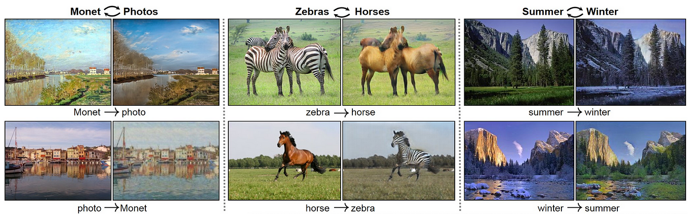

## Table of Contents

## What is Unpaired Image-to-Image Translation in machine learning?

Unpaired image-to-image translation is a type of machine learning task where the goal is to transform images from one domain to another without having direct pairs of input and output images for training. For example, you might want to change photos of horses into photos of zebras, but you don't have specific images of horses matched with specific images of zebras. Instead, you have separate collections of horse images and zebra images. This makes the task more challenging because the model needs to learn the general style and characteristics of the target domain without direct examples of how each input should be transformed.

To solve this, researchers use techniques like CycleGAN, which uses two generators and two discriminators to learn mappings between the two domains. One generator transforms images from domain A to domain B, and the other does the reverse. The discriminators check if the generated images look realistic in their respective domains. By cycling back and forth between the domains, the model can learn to translate images in a way that preserves important features of the original image while adapting it to the new domain's style. This approach has been successful in various applications, such as turning summer photos into winter scenes or converting sketches into realistic images.

## How does Unpaired Image-to-Image Translation differ from paired image translation?

Unpaired image-to-image translation and paired image-to-image translation are two approaches to the same goal: changing images from one style or domain to another. The key difference lies in the training data used. In paired image-to-image translation, you have direct pairs of images where each image in the source domain (like a sketch) is directly linked to an image in the target domain (like a photo). This means the model can learn exactly how to transform each specific input into its corresponding output, making the training process more straightforward.

On the other hand, unpaired image-to-image translation does not have these direct pairs. Instead, you have separate collections of images from each domain, but no specific links between them. This makes the task more challenging because the model must learn to translate images without seeing exact examples of how each input should look in the output domain. Techniques like CycleGAN are used to overcome this challenge by using cycle consistency to ensure that the transformation back and forth between domains preserves the essential features of the original images while adapting them to the new style.

Both methods have their uses. Paired translation is great when you have the luxury of paired data, like in medical imaging where you might have before-and-after treatment images. Unpaired translation, however, is more flexible and can be applied in situations where collecting paired data is difficult or impossible, such as turning day scenes into night scenes where you can't capture the exact same moment in both conditions.

## What are the main challenges in Unpaired Image-to-Image Translation?

The main challenge in unpaired image-to-image translation is the lack of direct supervision. In paired translation, the model can see exactly how each image should be transformed. But in unpaired translation, the model must learn to map images between domains without specific examples. This makes it harder for the model to understand what changes are needed to turn a horse into a zebra, for example. The model has to figure out the general style and features of the target domain on its own, which can lead to less accurate translations.

Another challenge is maintaining the content of the original image while changing its style. The model needs to ensure that important details, like the shape and pose of an object, are preserved even after the transformation. This is tricky because the model must balance between keeping the original content and making the image look realistic in the new domain. Techniques like cycle consistency help, but they're not perfect and can sometimes result in images that look a bit off or unnatural.

## Can you explain the basic concept of CycleGAN and its role in Unpaired Image-to-Image Translation?

CycleGAN is a special kind of [machine learning](/wiki/machine-learning) model that helps with unpaired image-to-image translation. It works by using two generators and two discriminators. One generator turns images from the first domain into the second domain, and the other generator does the opposite. The discriminators check if the changed images look real in their new domains. The cool thing about CycleGAN is that it uses something called "cycle consistency." This means it tries to make sure that if you change an image from domain A to domain B and then back to domain A, it should look pretty much the same as the original image. This helps the model learn how to make good translations without needing exact pairs of images.

CycleGAN is really important for unpaired image-to-image translation because it solves the problem of not having direct pairs of images to train on. Imagine you want to turn pictures of horses into pictures of zebras. You don't have photos where a specific horse is matched with a specific zebra. With CycleGAN, you can use separate collections of horse photos and zebra photos. The model learns the general look of zebras and how to change horse features into zebra features. This makes it possible to do cool things like turning summer scenes into winter scenes or sketches into realistic photos, even when you don't have exact before-and-after pictures.

## What is ALDA and how does it improve upon existing Unpaired Image-to-Image Translation methods?

ALDA, which stands for Adaptively-Learned Decomposition-based Augmentation, is a new method that aims to make unpaired image-to-image translation even better. The main idea behind ALDA is to break down the process of changing images into smaller, easier steps. Instead of trying to change an entire image all at once, ALDA learns to focus on different parts of the image and change them bit by bit. This helps the model understand how to make the image look more natural in the new style. By breaking down the task, ALDA can make more accurate and realistic translations compared to older methods that try to do everything in one go.

ALDA improves on existing methods by using a smart way to figure out which parts of the image need to be changed more and which parts can stay mostly the same. It does this by looking at the image and deciding how to split it into different layers or pieces. Each layer can be changed separately, which makes the whole process more flexible and accurate. This approach helps ALDA avoid some common problems in unpaired image-to-image translation, like making images that look weird or losing important details. By focusing on specific parts of the image, ALDA can create translations that look more like real photos from the new domain.

## How does pixel2style2pixel work and what makes it unique in the field of Unpaired Image-to-Image Translation?

Pixel2style2pixel is a method that helps turn regular photos into images that look like they're from a specific style, like a painting or a sketch, without needing pairs of original and styled images. It works by first turning the input photo into a style code, which is like a set of instructions that tells the model how to change the photo. Then, it uses these style codes to generate a new image that matches the target style. This process is done in a way that keeps important details from the original photo while changing its overall look to fit the new style.

What makes pixel2style2pixel unique is that it uses a special kind of model called a StyleGAN, which is really good at creating realistic images. By using StyleGAN, pixel2style2pixel can make the translated images look very natural and detailed. Another cool thing about pixel2style2pixel is that it doesn't need paired data to work, which means it can be used in many different situations where getting exact before-and-after images is hard. This makes it a powerful tool for turning regular photos into stylized images that look like they belong in a different world.

## What is COCO-FUNIT and how does it address the issue of few-shot learning in Unpaired Image-to-Image Translation?

COCO-FUNIT, which stands for Few-Shot Unsupervised Image-to-Image Translation with a Content-Conditioned Style Encoder, is a method that helps translate images from one style to another even when you don't have many examples of the new style. It's really useful when you want to change a photo into a different look, like turning a regular picture into a painting, but you only have a few examples of paintings to learn from. COCO-FUNIT uses a special way of learning that focuses on both the content of the original image and the style of the few examples it has. This helps it create new images that look like they belong to the new style while keeping important details from the original photo.

What makes COCO-FUNIT unique is how it deals with the problem of few-shot learning. In regular image translation, you need a lot of examples to teach the computer how to change images. But with COCO-FUNIT, you can do it with just a few examples because it uses a smart way to understand and apply the style from those few images. By conditioning the style encoder on the content of the input image, COCO-FUNIT can make translations that are both accurate and look natural, even when it doesn't have many examples to learn from. This makes it a powerful tool for turning regular photos into stylized images when you don't have a lot of examples to work with.

## What are the typical applications of Unpaired Image-to-Image Translation in real-world scenarios?

Unpaired image-to-image translation has many cool uses in the real world. One common use is in photo editing apps where you can turn your regular photos into different styles, like making them look like they're from an old painting or turning a summer scene into a winter one. It's also used in fashion, where designers can see how clothes might look on different people or in different settings without needing to take new photos. This saves a lot of time and money.

Another big use is in medical imaging, where doctors can use unpaired image-to-image translation to turn images from one type of scan into another. This can help them see things they might miss otherwise, like turning an MRI into a CT scan to get a different view of the same area. It's also used in art and entertainment, where artists can create new images or change existing ones to fit a certain theme or style without needing to start from scratch. This makes it easier to create new and interesting content.

## How do you evaluate the performance of models used in Unpaired Image-to-Image Translation?

Evaluating the performance of models used in unpaired image-to-image translation is tricky because we don't have direct pairs of images to compare. Instead, we use different ways to see how well the model is doing. One common way is to look at the images the model makes and see if they look real and match the new style. This is often done by asking people to rate the images or by using other computer models to check if the images look realistic. Another way is to use special numbers, like the Fréchet Inception Distance (FID), which measures how similar the generated images are to real images from the new style. A lower FID score means the model is doing a better job.

Another important thing to check is how well the model keeps the important details from the original image while changing its style. This can be measured by looking at how much the content stays the same after the translation. For example, if you're turning a horse into a zebra, you want the pose and shape of the horse to still be there in the zebra image. We can use numbers like the LPIPS (Learned Perceptual Image Patch Similarity) score to see how different the content is before and after the translation. A lower LPIPS score means the model is better at keeping the original content. By using these different ways to evaluate the model, we can get a good idea of how well it's working and where it might need to improve.

## What are the latest advancements in Unpaired Image-to-Image Translation beyond CycleGAN, ALDA, pixel2style2pixel, and COCO-FUNIT?

Recent advancements in unpaired image-to-image translation have pushed the boundaries of what's possible with these models. One notable development is the introduction of StarGAN v2, which allows for multi-domain translation using a single model. Unlike earlier methods that required separate models for each pair of domains, StarGAN v2 can translate images across multiple domains simultaneously, making it more efficient and versatile. This model uses a style code that can be adjusted to control the strength of the style transfer, allowing for more nuanced and customizable results. Another advancement is the use of contrastive learning in models like CUT (Contrastive Unpaired Translation), which improves translation quality by learning to distinguish between images from different domains more effectively. CUT focuses on preserving the content of the original image while changing its style, leading to more coherent and realistic translations.

In addition to these models, there's been progress in using generative adversarial networks (GANs) with more advanced architectures. For example, StyleGAN2-ADA has been adapted for unpaired image-to-image translation tasks, enhancing the realism and detail of generated images. This model uses adaptive discriminator augmentation to improve training stability and image quality. Another exciting development is the integration of transformer architectures, as seen in models like TransGAN, which leverage the power of attention mechanisms to better capture and translate the complex relationships between different image domains. These advancements show that the field of unpaired image-to-image translation is rapidly evolving, offering more powerful and flexible tools for transforming images in creative and practical ways.

## How can Unpaired Image-to-Image Translation be integrated with other machine learning techniques to enhance its capabilities?

Unpaired image-to-image translation can be made even better by mixing it with other machine learning techniques. One cool way is to use [reinforcement learning](/wiki/reinforcement-learning), where the model learns by trying different things and getting feedback on what works well. This can help the model figure out the best way to change images from one style to another, making the translations look more natural and realistic. Another way is to use semi-supervised learning, where you have a few paired examples to help guide the model. Even though most of the data is still unpaired, these few examples can give the model a better idea of what the right changes should look like, leading to more accurate translations.

Another exciting approach is to combine unpaired image-to-image translation with natural language processing. By using text descriptions of the styles or domains, the model can learn to translate images based on what people say they want. This makes it easier for people to control and customize the translations, turning regular photos into whatever style they describe. For example, you could tell the model to turn a photo into a "watercolor painting" or a "cyberpunk scene," and it would use the text to guide the image transformation. By integrating these different machine learning techniques, unpaired image-to-image translation can become more powerful and useful in lots of different situations.

## What are the ethical considerations and potential biases in Unpaired Image-to-Image Translation models?

Unpaired image-to-image translation models can run into ethical issues and biases, just like many other kinds of machine learning. One big problem is that these models learn from the data they are given, and if that data is not fair or balanced, the model can end up making biased translations. For example, if a model is trained on pictures mostly of one group of people, like people with a certain skin color, it might not work well for other groups. This can lead to unfair results where some people's photos get changed in a way that doesn't look right or feels offensive.

Another ethical concern is about how these models can be used. Because they can change photos in big ways, there's a risk that people might use them to make fake images that look real. This could be used to spread false information or to trick people. It's important for the people who make these models to think about how they might be used and try to stop them from being used in harmful ways. By being careful about the data they use and thinking about how their models might be used, they can help make sure unpaired image-to-image translation stays a helpful tool without causing harm.