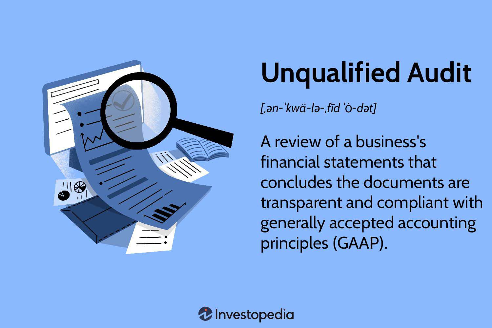

The world of auditing and finance encompasses a vast array of concepts and practices, each designed to ensure the integrity and accuracy of financial statements. Various audit types serve to meet this objective, catering to different scopes and intentions. Among these, the unqualified audit stands out as fundamental for both businesses and investors, providing a clearer picture of a company’s financial health. Understanding these key types of audits, especially the unqualified audit, is crucial for stakeholders who rely on financial reports for decision-making. Unqualified audits are characterized by their thorough evaluation and compliance with established accounting standards, such as Generally Accepted Accounting Principles (GAAP) or International Financial Reporting Standards (IFRS).

This article discusses the nature and importance of unqualified audits alongside related financial principles and practices, including accounting and algorithmic trading. By dissecting the core elements of these audits and their impact on today's financial markets, we aim to equip readers with the necessary knowledge to navigate the complexities of audit types effectively. Through this guide, we provide insight into the application of various audits in financial reporting, enhancing the understanding of their role in promoting transparency and reliability.

The significance of unqualified audits extends beyond mere financial compliance; they serve as a vessel for building trust with stakeholders, facilitating smoother access to capital markets, and fostering robust governance practices within organizations. In an era where financial audits serve as a pivotal mechanism for ensuring accurate and transparent business operations, this article will examine how these audits can be an integral component of sustainable economic growth, both for individual companies and the wider financial ecosystem.

## Table of Contents

## Understanding Audit Types

Audits play a crucial role in assessing and confirming a company's financial statements, providing stakeholders with confidence regarding the entity's fiscal health. There are four principal types of audit opinions, each reflecting varying degrees of auditor assurance about the company's financial presentation.

1. **Unqualified Audit Opinion**: This is the most favorable outcome an entity can receive from an audit, also known as a "clean opinion." It indicates that the auditors have thoroughly examined the financial statements and found them to be free from material misstatements, in accordance with applicable accounting frameworks like Generally Accepted Accounting Principles (GAAP) or International Financial Reporting Standards (IFRS).

2. **Qualified Audit Opinion**: A qualified opinion is issued when auditors encounter one or more areas where the financial records fail to conform to either GAAP or IFRS, but the discrepancies are not pervasive. These deviations are detailed in the audit report, and although they do not severely compromise the overall financial integrity, they highlight specific areas where improvements are needed.

3. **Adverse Opinion**: An adverse opinion is issued when auditors find significant misstatements or deviations in the financial statements that fundamentally misrepresent the company's financial position. This type of audit opinion is a strong indicator that the financial health of the entity has been materially misstated, potentially misleading to investors and stakeholders.

4. **Disclaimer of Opinion**: This occurs when auditors are unable to obtain sufficient appropriate audit evidence to form an opinion on the financial statements. Factors leading to a disclaimer of opinion include management restrictions on audit procedures or inadequacy of financial records. It signals the inability of auditors to express any assurance about the accuracy of the financial statements.

Each type of audit opinion carries distinct implications for a company's credibility and financial transparency. Stakeholders use these opinions to gauge the reliability of financial information, influence investment decisions, and assess overall corporate governance quality. Understanding these audit types enables businesses to seek continuous improvement in financial reporting and maintain stakeholder trust.

## Unqualified Audit Explained

An unqualified audit, commonly known as a "clean audit," provides stakeholders with assurance regarding a company's financial health, indicating that the financial statements are presented fairly and in compliance with established accounting standards. This type of audit signifies adherence to the Generally Accepted Accounting Principles (GAAP) in the United States or the International Financial Reporting Standards (IFRS) used in many other countries.

The procedure for achieving an unqualified audit involves a meticulous review of a company's internal control systems and financial statements. Auditors assess the transparency and accuracy of financial data to ensure that it reflects the true financial position and performance of the entity. They examine whether the internal controls are effective in detecting or preventing errors and fraud, which is critical for maintaining the integrity of financial reporting.

Securing a clean audit opinion significantly boosts investor confidence, as it assures investors that the financial statements are reliable. This credibility is crucial when companies seek to access capital markets, as investors are more likely to invest in companies with verified financial reliability. An unqualified audit demonstrates that the company has robust accounting practices and effective internal controls, which are fundamental elements for achieving favorable audit results.

In practice, companies committed to obtaining unqualified audit opinions often implement comprehensive accounting systems and rigorous internal audits to maintain financial statement accuracy and compliance with accounting standards. Consistent monitoring and updating of these systems are critical to adapting to new regulatory requirements and ensuring ongoing compliance. Hence, an unqualified audit is not merely a snapshot of a company's financial health but a reflection of its continuous commitment to financial transparency and sound governance practices.

## The Role of Accounting in Audits

Accounting principles form the foundation of financial audits, ensuring the credibility and reliability of financial reporting. Compliance with established accounting standards, such as Generally Accepted Accounting Principles (GAAP) or International Financial Reporting Standards (IFRS), is essential for producing financial statements that accurately reflect a company's financial position. These standards provide guidelines for recording and reporting financial transactions, ensuring that the financial statements are prepared consistently and comparably across different periods and entities.

Proper accounting practices contribute to transparency and accuracy by providing a true and fair view of the company's financial health. This transparency is vital not only for investors but also for regulatory bodies, creditors, and other stakeholders who rely on these statements for decision-making. The precision in financial reporting is achieved by thoroughly documenting all financial transactions, ensuring that they are categorized correctly and reported in the appropriate period.

Evaluating internal controls is a crucial aspect of the audit process to prevent material misstatements or fraud. Internal controls are mechanisms put in place by management to safeguard assets, ensure the integrity of financial reporting, and promote operational efficiency. During an audit, auditors assess the effectiveness of these controls to identify any weaknesses that could lead to errors or fraudulent activities. For instance, controls might include separation of duties, access controls, and periodic reconciliations.

To maintain integrity in financial reporting, it is advisable for companies to invest in continuous monitoring and improvement of their accounting systems. This involves regular audits of the financial records, reviewing the effectiveness of internal controls, and updating accounting policies to reflect new regulations or changing business environments. Companies can also adopt technological tools to enhance the accuracy and efficiency of their accounting processes.

In conclusion, accounting principles are integral to the audit process as they ensure the reliability and transparency of financial reports. By adhering to these principles and continually improving their accounting systems, companies can achieve better audit outcomes and maintain stakeholder trust.

## Algorithmic Trading and Audits

Algorithmic trading, also known as algo trading, primarily relies on the accuracy and timeliness of financial data to implement trading strategies. As these strategies automate trading decisions using computer algorithms, the integrity of the underlying financial data is paramount. Unqualified audit opinions are essential in this context, affirming the reliability and completeness of the data that drives algorithmic models. These opinions indicate that a company's financial statements are free of material misstatements and have been prepared in accordance with applicable accounting standards, such as Generally Accepted Accounting Principles (GAAP) or International Financial Reporting Standards (IFRS).

Such assurance is crucial because any inaccuracies in financial reporting could lead to flawed trading strategies and potentially significant financial losses. Audits play a vital role by verifying not only the accuracy of the financial statements used in [algorithmic trading](/wiki/algorithmic-trading) but also their compliance with relevant regulations. This verification process includes examining the company's internal control systems to ensure they are robust enough to prevent unauthorized transactions and maintain data integrity.

The increasing integration of technology in trading systems heightens the need for rigorous audits. These audits ensure data validation and effective risk management, which are critical as algorithmic trading introduces complexities in trade execution and market dynamics. As trading strategies employ advanced techniques, such as [machine learning](/wiki/machine-learning) and predictive analytics, audits become even more significant to confirm that the data input into these systems has not been compromised or inaccurately represented.

Furthermore, as algorithmic strategies become more sophisticated, the [volume](/wiki/volume-trading-strategy) and velocity of transactions increase, necessitating a strong audit framework to maintain the integrity of financial data. Effective audits can utilize technological advancements, such as AI and machine learning, to enhance their efficacy and focus on high-risk areas, thereby providing a reliable foundation for algorithmic models. This evolving landscape of trading emphasizes the crucial role that audits play in supporting the integrity and development of financial markets.

## Challenges and Future Directions

Companies are continually grappling with challenges related to compliance with evolving accounting standards. This task requires constant vigilance to ensure that financial statements accurately reflect the company's financial position and adhere to the latest regulatory requirements. The dynamic nature of these standards means that businesses must stay informed and be ready to adapt to new compliance demands promptly. Remaining compliant not only guards against regulatory penalties but also enhances the credibility and transparency of financial reports.

In response to these challenges, technological advancements have been instrumental in enhancing the efficiency and reliability of audit practices. Automation has revolutionized the field by taking over routine audit tasks that were previously time-consuming and labor-intensive. Automation tools can quickly process large volumes of data, identifying discrepancies and anomalies that warrant further investigation. This shift allows auditors to concentrate on more critical and complex issues that require human judgment and expertise.

Artificial intelligence (AI) further complements automation by providing advanced analytics capabilities. Machine learning algorithms can scrutinize financial data, identifying patterns and correlations that may not be immediately apparent to human auditors. AI can also assist in predictive analysis, helping companies anticipate potential compliance issues based on historical data trends.

Data analytics is another pivotal advancement that has empowered auditors to enhance precision in their audits. By leveraging large datasets, auditors can perform comprehensive analyses that offer insights into every aspect of a company's financial operations. This capability reduces the risk of oversight and enhances the accuracy and reliability of audit outcomes. The integration of data analytics into auditing practices ensures that audits are not only thorough but also insightful, offering value beyond mere compliance checks.

Looking forward, blockchain technology presents promising opportunities for auditing. Blockchain’s decentralized and immutable nature could transform how financial records are maintained and verified. By providing a tamper-proof ledger of all transactions, blockchain could significantly enhance transparency and trust in financial reporting. This technology holds the potential to provide real-time verification of financial data, drastically reducing the time and effort required to conduct audits.

In conclusion, while companies face significant challenges in maintaining compliance with evolving standards, technological advancements offer substantial benefits. Automation and AI streamline audit processes, enabling auditors to focus on areas that require critical analysis. Data analytics provides a comprehensive view of financial operations, improving audit precision. Looking to the future, blockchain technology may redefine transparency and trust in auditing, promising further advancements in financial integrity and accountability.

## Conclusion

Unqualified audits represent a hallmark of excellence in financial reporting. They provide assurance that an organization's financial statements adhere meticulously to established accounting standards such as Generally Accepted Accounting Principles (GAAP) or International Financial Reporting Standards (IFRS). This level of scrutiny ensures that stakeholders—ranging from investors and creditors to regulators—can trust the organization's financial health and integrity. 

Understanding audit types is instrumental in guiding companies toward enhanced financial transparency and governance. By recognizing the distinct implications of unqualified, qualified, adverse, and disclaimer opinions, management can prioritize improvements in financial reporting and internal controls, fostering an environment of trust and reliability.

As the technological landscape evolves, companies must prioritize the development of robust accounting systems and audit practices to maintain compliance and credibility. The integration of next-generation technologies like [artificial intelligence](/wiki/ai-artificial-intelligence), data analytics, and blockchain into auditing processes can significantly enhance the efficiency and accuracy of audits. These technologies allow for the real-time analysis of extensive datasets, providing auditors with deeper insights and enabling them to focus on critical, high-risk areas.

The benefits of stringent audits extend beyond internal improvements—investors, creditors, and regulators rely on accurate and reliable financial reports to make informed decisions. Rigorous audits bolster market confidence, facilitating access to capital and underpinning the functionality and stability of financial markets.

In summary, auditing and accounting stand as cornerstones of financial market integrity and progress. Unqualified audits not only foster trusted stakeholder relationships but also affirm a company's commitment to transparency and ethical financial practices, thereby ensuring a stable and trustworthy economic environment.

## References & Further Reading

[1]: ["International Financial Reporting Standards (IFRS) - Overview."](https://en.wikipedia.org/wiki/International_Financial_Reporting_Standards)

[2]: ["Generally Accepted Accounting Principles (GAAP) - Overview."](https://www.investopedia.com/terms/g/gaap.asp)

[3]: ["Financial Auditing: Oracle of Accounting."](https://www.softwareone.com/en/blog/all-articles/2020/10/22/dos-and-donts-during-an-oracle-audit) Investopedia.

[4]: ["Understanding Audit Opinions."](https://audithow.com/audit-opinions/) AuditNet.

[5]: PWC's perspectives on audit quality and standards. ["Audit and Assurance."](https://www.pwc.com/us/en/services/audit-assurance/library/audit-quality-report.html)

[6]: Lopez de Prado, M. (2018). ["Advances in Financial Machine Learning."](https://www.amazon.com/Advances-Financial-Machine-Learning-Marcos/dp/1119482089) Wiley.

[7]: Jansen, S. (2020). ["Machine Learning for Algorithmic Trading."](https://github.com/stefan-jansen/machine-learning-for-trading) 

[8]: Chan, E. P. (2008). ["Quantitative Trading: How to Build Your Own Algorithmic Trading Business."](https://github.com/ftvision/quant_trading_echan_book) Wiley.