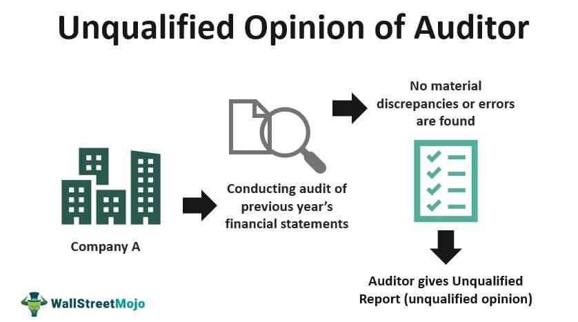

In the world of finance, the terms 'unqualified opinion' and 'auditor's report' hold significant importance. An unqualified opinion in an auditor's report implies a clean bill of health for a company’s financial statements, denoting that the financial documents are free from material misstatements and are a true representation of the company's financial position. This form of assurance is essential for investors and other stakeholders who rely on accurate financial information to make informed decisions. As businesses increasingly adopt algorithmic trading strategies, understanding these audits becomes critical for stakeholders. Algorithmic trading systems, which automate trading based on predefined criteria, require robust and dependable financial data to execute trades effectively, and the reliability of this data can often hinge on the quality of the auditor's report.

This article explores the intersection of unqualified opinion audits, auditor's reports, and their relevance in the context of algorithmic trading. By offering insights into the auditing process and the implications of various audit opinions, we aim to provide a comprehensive guide for investors and finance professionals. Understanding these concepts is crucial for navigating the complex financial markets, especially as technological advancements continue to shape the landscape of financial trading and reporting. As financial markets evolve, the synergy between precise auditing practices and algorithmic trading could enhance transparency, reduce risks, and foster trust among market participants, ultimately leading to more efficient and reliable market operations.

## Table of Contents

## Understanding Unqualified Opinion in Auditing

An unqualified opinion in auditing is a statement issued by an auditor indicating that a company’s financial statements are presented fairly and accurately, in all material respects, in accordance with the applicable accounting frameworks such as Generally Accepted Accounting Principles (GAAP) or International Financial Reporting Standards (IFRS). When auditors provide an unqualified opinion, it suggests a high level of confidence in the financial statements' integrity and compliance with recognized standards.

This type of audit opinion is the most common and is regarded as a strong indicator of a company's financial health. It is essential for corporate transparency, reassuring investors, stakeholders, and the public that the company's financial disclosures are trustworthy. The reliability and transparency offered by an unqualified opinion foster investor confidence and can facilitate access to capital markets, as stakeholders can trust the reported figures when making investment or lending decisions.

An unqualified opinion differs from other types of audit opinions such as qualified, adverse, or disclaimer opinions. Unlike a qualified opinion, which indicates that except for certain issues, the financial statements are free from material misstatements, an unqualified opinion suggests no such exceptions. An adverse opinion suggests significant material misstatements that impact the financial statements’ fairness, while a disclaimer opinion is issued when the auditor cannot form an opinion due to insufficient evidence.

The unqualified opinion acts as an endorsement of the management’s financial reporting, reflecting robust financial management and sound accounting practices. It ensures that there are no significant irregularities or issues affecting the transparency and reliability of the company's accounting practices. Consequently, it is a vital tool for stakeholders aiming to assess the financial health and performance of an enterprise.

## Components of an Auditor's Report

An auditor’s report is a structured document that communicates the results of an audit, providing assurance about the accuracy and fairness of a company's financial statements. The report comprises several key components, each serving to convey specific information about the audit process and findings.

Firstly, the **title** of the report indicates that it is an independent audit report, underscoring the auditor’s impartial perspective. The **addressee** section specifies the intended recipient of the report, often the shareholders or board of directors of the company.

The **introductory paragraph** provides a brief overview of the audited financial statements, specifying the periods covered and the financial statements included in the audit. This section sets the stage for the information that follows.

The section detailing **management’s responsibility** outlines the management’s role in preparing the financial statements and maintaining internal controls to ensure their accuracy. It emphasizes that the financial statements are the responsibility of the company’s management, not the auditor.

In contrast, the **auditor’s responsibility** section describes the auditor’s obligation to conduct the audit in accordance with applicable auditing standards. This involves assessing the financial statements to obtain reasonable assurance that they are free from material misstatement, whether due to fraud or error.

Central to the report is the **opinion paragraph**, where the auditor expresses their conclusion about the fairness of the financial statements. An unqualified opinion indicates that the financial statements present a true and fair view of the company’s financial position in accordance with the relevant accounting standards. This paragraph is pivotal as it provides stakeholders with the auditor’s assessment of the financial statements’ reliability.

Finally, the report concludes with the **signature** of the auditor, the **date** of the report, and the **auditor’s address**, signifying the completion of the audit process. The date is crucial as it reflects the point at which the auditor considered all relevant information available to form their opinion.

Understanding these components is essential for stakeholders to interpret the auditor’s report accurately. The organization and clarity of the report ensure the auditor's findings are communicated effectively, facilitating stakeholders' trust in the company’s financial disclosures. The transparency provided by a well-structured auditor’s report is critical in promoting corporate accountability and investor confidence.

## The Role of Unqualified Opinions in Algorithmic Trading

Algorithmic trading, a cornerstone of modern financial markets, depends on the precision and timeliness of financial data to execute trades autonomously. The presence of an unqualified opinion in a company's auditor's report is a critical indicator for algorithmic traders, signifying that the financial statements are free from material misrepresentations. This assurance is vital as trading algorithms rely on accurate and reliable data to formulate and implement effective trading strategies.

Unqualified opinions in audit reports act as a certification of data integrity and financial health, providing traders with the confidence that the underlying data accurately reflects a company’s financial standing. This is particularly important as the absence of such validation could lead to the use of flawed or misleading data, significantly elevating investment risk. The ability to trust the financial datasets underpinning trading decisions is crucial for minimizing exposure to erroneous analysis and subsequent trading losses.

Algorithmic traders often incorporate comprehensive financial audits into their data processes, improving the caliber of their decision-making frameworks. This integration allows algorithms to utilize verified financial information, leading to more robust investment outcomes. Furthermore, by leveraging audit reports with unqualified opinions, traders can enhance risk management protocols, ensuring that strategies are not only based on timely but also legitimate financial disclosures.

Incorporating unqualified opinions into [algorithmic trading](/wiki/algorithmic-trading) strategies can be likened to implementing a quality check within a larger systematic process, where ensuring data accuracy significantly influences the overall trade execution efficiency and investment success. As competitive pressures in the financial markets increase, the reliance on such credible financial audits continues to grow, underlining their pivotal role in algorithmic trading.

## Technological Impact on Auditing and Algorithmic Trading

Advancements in technology are significantly transforming both auditing and algorithmic trading. In the auditing sector, the integration of [artificial intelligence](/wiki/ai-artificial-intelligence) (AI) and data analytics has revolutionized how financial data is examined. These technologies allow auditors to assess large volumes of data quickly and accurately. By automating routine tasks and identifying anomalies or patterns, AI and data analytics increase the reliability of unqualified opinions, indicating that financial statements present a true and fair view.

For example, AI algorithms can process transactions to flag unusual items for closer inspection, reducing the risk of oversight. The growing use of [machine learning](/wiki/machine-learning) in audit processes enables predictive analytics, which can anticipate potential issues, enhancing the audit's predictive value. This not only bolsters the confidence stakeholders have in financial reports but also streamlines the auditing process itself.

Similarly, algorithmic trading has greatly benefited from technological advancements. High-frequency trading systems, powered by AI and sophisticated data processing algorithms, can execute trades with remarkable speed and precision. These systems analyze vast datasets, utilizing mathematical models to predict market trends and make informed decisions in real-time. Enhancements in processing power and data storage enable algorithms to react swiftly to market changes, optimizing trading efficiency and profitability.

Blockchain technology offers considerable advantages to both auditing and algorithmic trading by providing a transparent and secure method of recording transactions. For auditors, blockchain can serve as an immutable ledger that enhances the verifiability of financial records, simplifying the audit process and increasing trustworthiness. In algorithmic trading, blockchain ensures the security of financial transactions, reducing the risks associated with fraud and manipulation.

The convergence of technologies like AI, data analytics, and blockchain is poised to improve the synergy between auditing and algorithmic trading, boosting financial transparency and trading accuracy. By providing robust tools for data analysis and secure transaction frameworks, these innovations ensure that both auditors and traders can operate with greater precision and reliability, ultimately contributing to a more stable financial ecosystem.

## Conclusion

Understanding unqualified opinions and auditor's reports is crucial for stakeholders within the financial ecosystem. For algorithmic trading, the assurance provided by unqualified opinions can significantly enhance the reliability of trading decisions. These opinions ensure that the financial data, underlying automated trading strategies, accurately reflect a company's financial health, thereby reducing potential risks associated with erroneous information.

As financial industries continue to grow and evolve, incorporating technological advancements into auditing and trading practices will be vital. Technologies such as artificial intelligence, data analytics, and blockchain are already reshaping these domains by improving the speed, accuracy, and security of financial reporting and transactions. Consequently, this integration is expected to further bolster the effectiveness of financial reporting and investment strategies.

For investors and traders, staying informed about auditing practices is essential to maintaining a competitive edge. Knowledge of audits and the confidence gleaned from unqualified opinions allow for better-informed decisions and can lead to more successful investment outcomes.

The future of finance is inextricably linked to a commitment to transparency, accuracy, and technological innovation. By embracing these principles, stakeholders can ensure that financial markets operate efficiently and fairly, paving the way for sustainable economic growth.

## References & Further Reading

[1]: ["International Standards on Auditing (ISA)"](https://www.iaasb.org/publications/international-standard-auditing-isa-700-revised-forming-opinion-and-reporting-financial-statements) by the International Federation of Accountants (IFAC)

[2]: ["Auditing and Assurance Services"](https://marshalljones.com/auditing-vs-assurance-services-is-there-a-difference/) by Alvin A. Arens, Randal J. Elder, and Mark Beasley

[3]: Lopez de Prado, M. (2018). ["Advances in Financial Machine Learning"](https://www.amazon.com/Advances-Financial-Machine-Learning-Marcos/dp/1119482089). John Wiley & Sons.

[4]: Chan, E. (2008). ["Quantitative Trading: How to Build Your Own Algorithmic Trading Business"](https://github.com/ftvision/quant_trading_echan_book). Wiley Trading.

[5]: Jansen, S. (2020). ["Machine Learning for Algorithmic Trading."](https://github.com/stefan-jansen/machine-learning-for-trading) Packt Publishing.

[6]: ["The Impact of Artificial Intelligence on Auditing"](https://www.researchgate.net/publication/351946460_Impact_of_Artificial_Intelligence_on_Auditing_-An_Exploratory_Study) by Miklos A. Vasarhelyi, Alexander Kogan, and Brandon T. F. Law. The Accounting Review, 2020.

[7]: Cook, T., & Searle, L. (2021). ["Blockchain Technology: Principles and Applications"](https://www.semanticscholar.org/paper/Blockchain-Technology:-Principles-and-Applications-Pilkington/e31ca71621e1402a46ac2c1afb2eba9a7061d139). Springer.