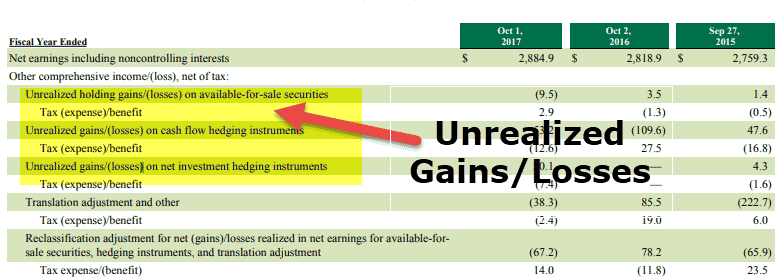

## Table of Contents

## What is an unrealized gain?

An unrealized gain is the increase in the value of an investment that you haven't sold yet. Imagine you bought a stock for $100, and now it's worth $150. You have an unrealized gain of $50 because you haven't sold the stock yet. If you sell it at $150, the gain becomes realized, and you actually get the money.

Unrealized gains are important because they show how well your investments are doing, but they don't affect your money until you sell. They can change every day as the value of your investment goes up or down. It's like having a score in a game that you can see but can't use until the game is over.

## How is an unrealized gain different from a realized gain?

An unrealized gain is like a promise of money that you might get. It's the increase in the value of something you own, like a stock or a piece of art, but you haven't sold it yet. For example, if you bought a stock for $50 and now it's worth $75, you have an unrealized gain of $25. This gain is just on paper because you haven't turned it into real money by selling the stock.

A realized gain, on the other hand, is when you actually get the money. It happens when you sell the thing you own for more than what you paid for it. Using the same example, if you sell that stock for $75, your unrealized gain of $25 becomes a realized gain. Now, you have the $25 in your pocket, and you have to report it on your taxes. The key difference is that unrealized gains are potential, while realized gains are actual money you can use.

## Can you give an example of an unrealized gain?

Imagine you bought a comic book for $10 because you thought it might become valuable one day. A few years later, you find out that the same comic book is now selling for $50. You haven't sold your comic book yet, but its value has gone up. This increase in value, from $10 to $50, is called an unrealized gain. It's like having a treasure that's worth more than when you found it, but you haven't cashed it in yet.

If you decide to keep the comic book and not sell it, the unrealized gain stays as it is. It can go up or down depending on what people are willing to pay for it in the future. But as long as you don't sell it, the gain remains unrealized. It's a bit like having a winning lottery ticket that you haven't turned in yet; you know it's worth more, but you don't have the money until you actually sell it.

## How do unrealized gains affect my taxes?

Unrealized gains don't affect your taxes right away. This is because they are just increases in the value of something you own, like a stock or a piece of art, but you haven't sold it yet. Since you haven't turned that gain into actual money, you don't have to pay taxes on it. It's like having a gift card that's worth more than when you got it, but you don't have to pay taxes on the extra value until you use it.

However, if you decide to sell the item and turn the unrealized gain into a realized gain, then you will have to pay taxes on it. The tax you pay depends on how long you held the item and the type of item it is. For example, if you sell a stock you've held for more than a year, you might pay a lower tax rate on the gain than if you sold it within a year. So, unrealized gains are safe from taxes until you decide to cash them in.

## What types of investments typically have unrealized gains?

Unrealized gains are common in investments like stocks, bonds, and mutual funds. When you buy a stock, for example, and its price goes up, you have an unrealized gain. You don't actually get the money until you sell the stock. The same goes for bonds and mutual funds. If their value increases while you own them, you have an unrealized gain until you decide to sell them.

Real estate is another type of investment that often has unrealized gains. If you buy a house and its value goes up over time, you have an unrealized gain. You don't get the money from this gain until you sell the house. Other investments like art, collectibles, and cryptocurrencies can also have unrealized gains if their value increases while you own them.

## How do you calculate an unrealized gain?

Calculating an unrealized gain is pretty straightforward. You just need to know the price you paid for something and its current value. Let's say you bought a stock for $50. If that stock is now worth $75, you subtract the original price from the current price. So, $75 minus $50 equals $25. That $25 is your unrealized gain because you haven't sold the stock yet.

Unrealized gains can change every day because the value of your investment can go up or down. If the stock price drops to $60, your unrealized gain would then be $10 ($60 minus $50). It's important to keep an eye on these changes, especially if you're thinking about selling your investment. But remember, until you actually sell, the gain stays unrealized and doesn't affect your money or taxes.

## What happens to unrealized gains when an asset is sold?

When you sell an asset, your unrealized gain turns into a realized gain. This means the increase in value that you saw on paper becomes real money in your pocket. For example, if you bought a stock for $100 and it's now worth $150, you have an unrealized gain of $50. If you sell the stock at $150, that $50 gain becomes realized because you actually get the money.

Once the gain is realized, you have to report it on your taxes. The tax you pay depends on how long you held the asset and the type of asset it is. If you held the stock for more than a year, you might pay a lower tax rate on the gain than if you sold it within a year. So, selling an asset changes your unrealized gain into a realized gain, and that's when it starts to affect your money and taxes.

## How do unrealized gains impact financial statements?

Unrealized gains can show up on a company's financial statements, especially on the balance sheet. If a company owns investments like stocks or bonds, and those investments go up in value, the company has unrealized gains. These gains are listed on the balance sheet under assets, often as "unrealized gains on investments" or something similar. This helps show how much the company's investments are worth right now, even if they haven't sold them yet.

These unrealized gains can also affect the company's income statement, but only in certain cases. If the company follows certain accounting rules, like those for "available-for-sale" securities, the unrealized gains might be reported in a part of the income statement called "other comprehensive income." This part of the income statement shows changes in the company's net worth that aren't from its main business activities. So, unrealized gains can give a fuller picture of a company's financial health, but they don't count as actual income until the investments are sold.

## What are the risks associated with holding assets with unrealized gains?

Holding onto assets with unrealized gains can be risky because the value of those assets can go down. Imagine you bought a stock for $100, and it's now worth $150. You have an unrealized gain of $50. But if the stock price drops to $90, your unrealized gain disappears, and you're actually losing money. This is called market risk, and it's something you have to think about when you're deciding whether to keep or sell your investments.

Another risk is that you might miss out on other good investment opportunities. If you keep holding onto an asset hoping its value will keep going up, you might not have money to invest in something else that could be even better. This is called opportunity cost. Also, if you need money quickly and the value of your asset drops, you might have to sell it for less than you hoped, which can be a problem. So, it's important to think about these risks when you're deciding what to do with your investments.

## How can unrealized gains be used in investment strategy?

Unrealized gains can be a big part of your investment strategy. They show you how much your investments are worth right now, even if you haven't sold them yet. This can help you decide when to sell or hold onto your investments. For example, if you see that a stock you own has gone up a lot, you might decide to sell it to lock in that gain. Or, if you think the stock will keep going up, you might choose to hold onto it and wait for an even bigger unrealized gain.

Another way to use unrealized gains in your strategy is to balance your portfolio. If one of your investments has a big unrealized gain, it might be a good time to sell some of it and use the money to buy other investments. This can help spread out your risk and make your portfolio more stable. Unrealized gains can also help you see how well your investments are doing overall, which can guide your future investment choices.

## What are the accounting standards for reporting unrealized gains?

Unrealized gains are reported differently depending on the accounting standards a company follows. In the United States, companies often use Generally Accepted Accounting Principles (GAAP). Under GAAP, unrealized gains on certain types of investments, like "available-for-sale" securities, are reported on the balance sheet under assets. They might also show up in the income statement in a section called "other comprehensive income," which shows changes in the company's net worth that aren't from its main business activities. This helps give a full picture of the company's financial health.

Another common set of accounting standards is the International Financial Reporting Standards (IFRS), used by many companies around the world. Under IFRS, unrealized gains on investments can be reported in a similar way, often on the balance sheet and sometimes in the income statement. The key thing is that both GAAP and IFRS want to make sure that unrealized gains are shown clearly so that people looking at the financial statements can understand how much the company's investments are worth right now, even if they haven't sold them yet.

## How do market conditions influence unrealized gains?

Market conditions can really change how much your investments are worth, which means they can make your unrealized gains go up or down. If the market is doing well, like when lots of people want to buy stocks, the prices of those stocks can go up. This means if you own those stocks, your unrealized gains will get bigger because the value of your investment is higher. But if the market is not doing well, like when people are scared and selling their stocks, the prices can go down. This can make your unrealized gains smaller or even turn them into losses if the price drops below what you paid for the investment.

It's important to keep an eye on market conditions because they can affect your investment strategy. If you see that the market is going up and your unrealized gains are getting bigger, you might decide to sell some of your investments to lock in those gains. Or, if you think the market will keep going up, you might choose to hold onto your investments and wait for even bigger unrealized gains. But if the market starts to go down, you might want to sell before your unrealized gains turn into losses. So, understanding market conditions can help you make smart choices about when to buy, sell, or hold onto your investments.

## References & Further Reading

[1]: ["Integration of Machine Learning in Algorithmic Trading"](https://www.researchgate.net/publication/378287610_Machine_learning_in_financial_markets_A_critical_review_of_algorithmic_trading_and_risk_management) - Annals of Operations Research

[2]: ["The Impact of High Frequency Trading on Volatility"](https://www.semanticscholar.org/paper/The-Impact-of-High-Frequency-Trading-on-Market-Virgilio/24229080a75c41df9acbdced0b70ef08b7b3d6b1) - The Review of Financial Studies

[3]: Hull, J. C. (2018). ["Options, Futures, and Other Derivatives"](https://www.semanticscholar.org/paper/Options%2C-Futures%2C-and-Other-Derivatives-Hull/89bdee500c8623864fc9eb7a471546aa713acc44) (10th Edition). Pearson.

[4]: Hardle, W., Hautsch, N., & Risti, L. (2016). ["Big Data in Securities Markets: Some Financial Regulatory Issues"](https://link.springer.com/book/10.1007/978-3-662-54486-0) - Springer-Verlag

[5]: Fabozzi, F. J., Focardi, S. M., & Kolm, P. N. (2010). ["Quantitative Equity Investing: Techniques and Strategies"](https://www.semanticscholar.org/paper/Quantitative-Equity-Investing%3A-Techniques-and-Fabozzi-Focardi/1c49a2a53919f7e65cb96f16691b8ff726fd3cd7) - John Wiley & Sons