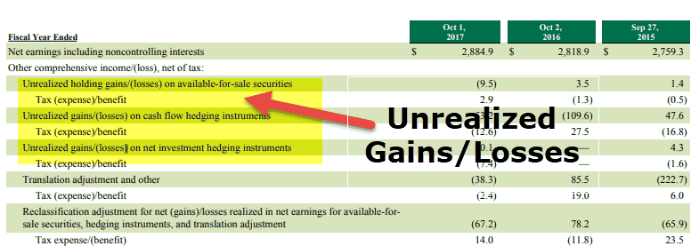

Understanding the concepts of unrealized gains and unrealized losses is crucial for investors and financial professionals. These terms often appear in discussions about financial accounting and portfolio management, where they are key elements in assessing an asset's performance without actualizing its value through sale. Unrealized gains occur when the market value of an owned asset increases, while unrealized losses take place when its market value decreases, provided the asset is still held. The distinction between realized and unrealized values is important because these 'paper' profits or losses can influence an investor's decisions on whether to hold, buy more, or sell assets.

With the rise of algorithmic trading, the management and implications of unrealized gains and losses have become more complex. Algorithmic trading systems, which operate using automated and pre-programmed criteria, can execute trades at a scale and speed beyond human capability. This not only affects the timing of realizing gains and losses but also necessitates more sophisticated strategies to optimize portfolio performance. These systems often take into account market trends, volatility, and financial data analysis, incorporating unrealized gains and losses in decision-making processes.



As financial markets become increasingly technology-driven, understanding the nuances of unrealized gains and losses is essential for navigating the evolving landscape of investment and accounting practices. Such knowledge aids in making informed decisions about sell strategies, accounting recording, and anticipating the tax implications of investment strategies. This article will examine these financial metrics, their significance in accounting, and how they are intertwined with the growing trend of algorithmic trading.

## Table of Contents

## What Are Unrealized Gains and Losses?

Unrealized gains and losses are essential metrics in evaluating the performance and potential profit or loss of investments that have not yet been sold. Unrealized gains occur when the market value of an asset rises above its original purchase price, but the investor still holds the asset. This increase in value, however, remains on paper until the asset is sold, hence the term 'paper gains'. 

Conversely, unrealized losses happen when the market value of an asset drops below its purchase price, yet the investor retains ownership of the asset. These are similarly referred to as 'paper losses', as the loss is not recognized until the asset is sold. The importance of understanding unrealized gains and losses lies in their power to impact investment strategies and decisions. For example, an investor with significant unrealized gains might consider holding the asset longer to capitalize on further appreciation, or they might decide to sell to lock in the profits before market conditions change.

In managing portfolios, recognizing these concepts helps investors gauge potential tax implications and adjust their strategies accordingly. Even though unrealized gains and losses do not directly impact cash flow, they provide insights into the possible directions an investment could take and what decisions may need to be made to align with the investor's financial goals.

## Financial Accounting Implications

In accounting, unrealized gains and losses are essential for accurately representing a company's asset value. These gains and losses reflect changes in market conditions influencing the worth of an asset, without an actual transaction occurring. Different accounting frameworks, such as Generally Accepted Accounting Principles (GAAP) and International Financial Reporting Standards (IFRS), have varying approaches to reporting these changes. 

Under GAAP, unrealized gains and losses are typically recognized in the financial statements through other comprehensive income (OCI) or directly in net income, depending on the asset type. For example, unrealized gains and losses on available-for-sale securities are recorded in OCI. Under IFRS, similar principles apply; however, specific criteria define how and when these are recognized, particularly focusing on the asset's classification. 

The recognition of unrealized gains and losses can significantly impact a company's financial statements, influencing stakeholders' perception of its financial health. A company reporting substantial unrealized gains might appear financially robust, even if these gains have not materialized into actual cash flows. Conversely, significant unrealized losses could affect the company's perceived riskiness, even if the losses are only temporary.

It is crucial for companies to clearly differentiate between realized and unrealized amounts in their financial reporting. Realized gains and losses result from actual transactions and directly affect profitability, while unrealized gains and losses represent potential future impacts on the company's financial position. Misrepresenting these figures can lead to misconceptions about a company's profitability, potentially misleading investors and other stakeholders.

Accurate reporting ensures transparency and provides a more comprehensive view of a company's financial health, helping stakeholders make informed decisions. Therefore, companies must adhere strictly to accounting standards and guidelines when handling unrealized gains and losses.

## Tax Considerations for Unrealized Gains and Losses

Unrealized gains and losses refer to changes in the value of investments that have not yet been settled through the sale of those assets. The tax considerations for these gains and losses are crucial for efficiently managing investments.

Unrealized gains are increases in the market value of an asset that an investor holds but has not yet sold. Since these gains are not yet realized, they are not subject to taxation. The taxable event occurs only when the gains become realized, which happens upon the sale of the asset. This distinction allows investors to defer taxes until a later date, providing opportunities for strategic financial planning.

Tax-loss harvesting is a strategy that investors can use to manage their tax liabilities. This involves selling securities at a loss to offset capital gains tax from other investments. By doing so, investors can reduce the overall taxable income, thereby lowering the tax burden. The following Python code snippet demonstrates a simple example of tax-loss harvesting by identifying assets to sell at a loss to offset gains:

```python
def tax_loss_harvesting(portfolio, capital_gains):
    """
    Identify assets to sell for tax-loss harvesting.

    :param portfolio: List of tuples (asset, purchase_price, current_price)
    :param capital_gains: Total capital gains to offset
    :return: List of assets to sell at a loss
    """
    assets_to_sell = []
    for asset, purchase_price, current_price in portfolio:
        if current_price < purchase_price:
            loss = purchase_price - current_price
            if capital_gains > 0:
                assets_to_sell.append(asset)
                capital_gains -= min(loss, capital_gains)

    return assets_to_sell

# Example portfolio and capital gains
portfolio = [('Stock A', 100, 80), ('Stock B', 150, 140), ('Stock C', 200, 180)]
capital_gains = 50

assets_to_sell = tax_loss_harvesting(portfolio, capital_gains)
print("Assets to sell for tax-loss harvesting:", assets_to_sell)
```

Understanding these tax nuances is critical for investors who wish to maximize after-tax returns and incorporate tax strategies into their investment decisions. By leveraging strategies like tax-loss harvesting and recognizing the timing of taxable events, investors can effectively manage their overall tax liabilities and improve the long-term performance of their portfolios.

## Algorithmic Trading and its Role

Algorithmic trading employs sophisticated computer programs to execute trades with remarkable speed and frequency, transforming the landscape of modern finance. These algorithms are designed to manage portfolios efficiently by optimizing when to realize gains and losses, a crucial aspect of financial strategizing. By executing trades at speeds unattainable by human traders, algorithmic systems can take advantage of small price discrepancies in the market, thus potentially reducing the impact of unrealized gains and losses over time.

One of the core strategies within [algorithmic trading](/wiki/algorithmic-trading) focuses on minimizing tax implications. Algorithms can be programmed to select which gains to realize strategically. For instance, they can identify and sell assets that have experienced losses to offset gains elsewhere in the portfolio–a tactic known as tax-loss harvesting. This not only reduces the investor's tax liability but also allows for the reinvestment of capital in potentially higher-return assets.

The continuous advancement in trading technology influences how traders and investors handle unrealized gains and losses. As algorithms become more sophisticated, they incorporate various decision-making processes, such as [machine learning](/wiki/machine-learning) and predictive analytics, to forecast market trends more accurately. These improvements enable algorithms to execute trades not only based on current data but also to anticipate future market movements, optimizing portfolio performance dynamically.

Moreover, algorithmic trading systems benefit from their ability to back-test trading strategies on historical data. This capacity allows traders to validate the effectiveness of different strategies in managing unrealized positions without risking real capital. By analyzing past market conditions and outcomes, algorithms can refine their strategies to better cope with present and future market dynamics.

In summary, as algorithmic trading technology continues to evolve, it plays an increasingly crucial role in the strategic management of unrealized gains and losses. By leveraging speed, precision, and predictive capabilities, algorithmic systems offer investors refined control over their investment strategies, optimizing both tax impacts and overall portfolio performance.

## Managing Investment Strategies

Investors should continually monitor their portfolios to assess unrealized gains and losses. Proper management of these elements can significantly enhance portfolio performance and minimize risk. By regularly rebalancing their portfolios, investors can ensure that their investments remain aligned with their financial goals and risk tolerance. For instance, a diversified portfolio initially designed to have a specific allocation across asset classes may shift over time due to market fluctuations and changes in asset valuations, resulting in potential exposure to unnecessary risks.

Advanced financial tools and analytical models play a critical role in evaluating market trends and determining the optimal timing for realizing gains and losses. These tools, often powered by sophisticated algorithms, can analyze extensive historical data and forecast potential market movements. Tools such as Python's `pandas` and `numpy` libraries offer investment professionals the ability to process large datasets efficiently and apply statistical methods to inform strategic decisions.

Being proactive in adjusting investment strategies allows investors to manage their tax burdens more effectively and enhance overall portfolio performance. For example, tax-loss harvesting is a strategy employed to deliberately sell losing investments to offset realized capital gains, thereby reducing taxable income. By implementing an automatic script in Python, investors can track their portfolios' performance and execute trades when certain conditions are met, maximizing the tax efficiency of their investments.

Here's a basic Python script outline for tracking asset performance and considering tax-loss harvesting:

```python
import pandas as pd

# Assume df is a DataFrame containing your portfolio's historical price data
# Columns might include: ['Date', 'Asset', 'Price', 'Shares']

def calculate_unrealized_gains(df):
    # Add columns for current market value and cost basis
    df['Market Value'] = df['Price'] * df['Shares']
    df['Cost Basis'] = df['Initial Price'] * df['Shares']
    df['Unrealized Gain/Loss'] = df['Market Value'] - df['Cost Basis']
    return df

def tax_loss_harvesting(df):
    # Identify positions with unrealized losses
    losses = df[df['Unrealized Gain/Loss'] < 0]
    # Decision making could involve further criteria
    for index, row in losses.iterrows():
        print(f"Consider selling {row['Asset']} for a tax loss of {row['Unrealized Gain/Loss']}")

# Example usage
portfolio_data = {
    'Date': ['2023-01-01', '2023-01-02'],
    'Asset': ['Stock A', 'Stock B'],
    'Price': [100, 50],
    'Shares': [10, 20],
    'Initial Price': [120, 55]
}
df = pd.DataFrame(portfolio_data)
result_df = calculate_unrealized_gains(df)
tax_loss_harvesting(result_df)
```

Implementing these strategies diligently can help investors optimize their portfolios, taking advantage of market conditions and fiscal policies. By maintaining an active interest in market analyses and leveraging technological advancements, investors can achieve a more efficient and effective management approach tailored to their specific financial objectives.

## Conclusion

Unrealized gains and losses play a significant role in investment strategy and financial accounting, serving as indicators of potential future profitability or loss. These metrics provide investors and financial professionals with insights into asset performance without triggering immediate tax liabilities or financial statement impacts. A deep understanding of unrealized gains and losses empowers investors to craft informed decisions regarding sell strategies and accounting practices. By accurately assessing these metrics, stakeholders can avoid misconceptions about a company's financial health and align their actions with market conditions.

The rise of algorithmic trading introduces an additional layer of sophistication in managing unrealized gains and losses. Given the speed and efficiency of algorithmic systems, investors can achieve precision in timing decisions for the realization of gains or losses. Algorithms can be fine-tuned to optimize trade execution by leveraging market conditions and tax regulations, ultimately enhancing portfolio performance. For instance, employing strategies that minimize tax implications while maximizing gains is a complex yet achievable goal through algorithmic interventions.

In an ever-evolving financial landscape, staying informed and adopting strategic investment adjustments are crucial. Investors who regularly monitor their portfolios and remain responsive to market changes enhance their ability to manage tax burdens and align investments with their financial objectives. Leveraging advanced analytical tools and adopting proactive investment strategies can lead to more efficient portfolio management. By understanding and managing unrealized gains and losses effectively, investors position themselves to optimize their portfolios and achieve long-term financial success.

## References & Further Reading

[1]: ["Advances in Financial Machine Learning"](https://www.amazon.com/Advances-Financial-Machine-Learning-Marcos/dp/1119482089) by Marcos Lopez de Prado

[2]: ["Evidence-Based Technical Analysis: Applying the Scientific Method and Statistical Inference to Trading Signals"](https://www.amazon.com/Evidence-Based-Technical-Analysis-Scientific-Statistical/dp/0470008741) by David Aronson

[3]: ["Machine Learning for Algorithmic Trading"](https://github.com/PacktPublishing/Machine-Learning-for-Algorithmic-Trading-Second-Edition) by Stefan Jansen

[4]: ["Quantitative Trading: How to Build Your Own Algorithmic Trading Business"](https://books.google.com/books/about/Quantitative_Trading.html?id=j70yEAAAQBAJ) by Ernest P. Chan

[5]: ["The Handbook of Financial Instruments"](https://www.wiley.com/en-us/The+Handbook+of+Financial+Instruments-p-9781119522966) by Frank J. Fabozzi