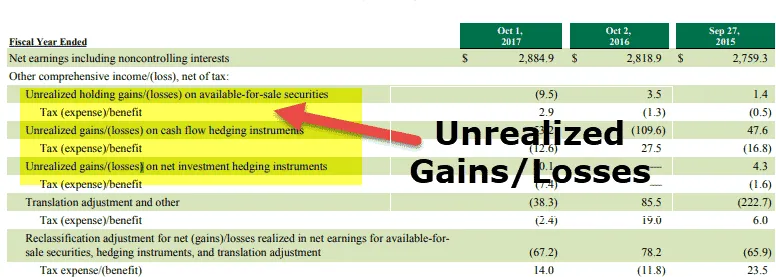

In today's dynamic financial markets, understanding investment losses, particularly unrealized losses, is crucial for both individual and institutional investors. Unrealized losses occur when the market value of an asset falls below its original purchase price, yet the asset has not been sold. They remain theoretical and are sometimes referred to as "paper losses" since they only become actual or realized losses when the asset is sold. This differentiation is vital for investment strategies and financial portfolio management, as it influences decision-making processes aimed at minimizing risk and maximizing returns.

Unrealized losses hold significant implications beyond mere theoretical standings. They affect the perceived value of financial portfolios, often prompting investors to reconsider their positions amidst fluctuating market conditions. This can be particularly pronounced in algorithmic trading, where rapid, technology-driven transactions rely on real-time data, including metrics related to unrealized losses, to enhance trading strategies and mitigate financial burdens.



Further considerations include the tax implications of unrealized losses. While these losses do not directly impact tax liabilities until they are realized, savvy investors often employ strategic tax planning to optimize financial performance. Techniques such as loss harvesting are commonly utilized to offset taxable gains, thereby managing tax obligations in a more efficient manner.

Effective management of unrealized losses involves a combination of portfolio diversification, consistent rebalancing, and the use of technological tools. These strategies help investors and traders respond to market volatility, optimize returns, and achieve financial goals. Advanced platforms and software like portfolio management systems and robo-advisors provide valuable support in monitoring and managing these potential losses, ensuring that investors remain informed and strategically prepared.

Understanding the nuances of unrealized losses and integrating effective management practices are integral to navigating the complexities of modern financial markets. Consequently, this article will explore their significance in financial decision-making and algorithmic trading, examine their impact on portfolios, review tax implications, and discuss strategies for effective management.

## Table of Contents

## What Are Unrealized Losses?

Unrealized losses, frequently known as 'paper losses,' occur when the market value of an asset declines below its purchase cost, but the asset remains unsold. These losses are considered 'unrealized' because they do not affect financial statements until the asset is actually sold, at which point they become realized losses. This transition from unrealized to realized losses is crucial as it directly influences the financial health and reporting of a portfolio.

The primary characteristic of unrealized losses is their theoretical nature; they exist 'on paper' but do not represent an actual financial outflow. This distinction is essential not only for effective portfolio management but also for proper risk assessment. While unrealized losses do not immediately impact an investor's cash flow, they can significantly affect future financial decisions, particularly when assessing the performance and valuation of a portfolio over time.

In financial reporting, the classification of losses as unrealized means they are generally marked-to-market but not recorded as expenses. Unrealized losses are commonly encountered in assets such as stocks, bonds, and other financial instruments that are subject to market [volatility](/wiki/volatility-trading-strategies). The accounting treatment of these losses varies based on governing standards like International Financial Reporting Standards (IFRS) or Generally Accepted Accounting Principles (GAAP).

For investors, distinguishing between unrealized and realized losses is integral for developing robust risk management strategies. It helps in determining when to hold onto a depreciating asset or when to liquidate it to prevent further financial deterioration. By understanding the implications of unrealized losses, investors can make informed decisions about portfolio adjustments, potentially using strategies such as tax-loss harvesting to offset gains and optimize tax liabilities.

## Economic and Psychological Implications

Unrealized losses play a crucial role in assessing portfolio performance, as their impact extends beyond mere numerical valuation. Economically, these losses can significantly alter the perceived value of a portfolio and consequently influence investment decisions. When an asset's market value falls below its purchase price, and the investor chooses not to sell, the loss remains 'unrealized.' However, if these losses become substantial, they may prompt a reevaluation of the asset's future potential and lead to strategic decisions regarding the holding duration or potential sale of the asset.

This economic impact is intertwined with psychological factors inherent in behavioral finance, particularly the concepts of loss aversion and the endowment effect. Loss aversion, a theory popularized by Daniel Kahneman and Amos Tversky, denotes the tendency to strongly prefer avoiding losses over acquiring equivalent gains. In practical terms, this means investors are likely to experience more distress over a loss than pleasure over a comparable gain, which can lead to irrational decision-making. For instance, investors might hold onto losing investments longer than economically rational, hoping for a recovery despite significant evidence to the contrary.

The endowment effect further exacerbates this behavior. It describes the phenomenon where people ascribe more value to things merely because they own them. In investment, this means investors might hold assets whose market value has plummeted, not because of economic rationale but due to a perceived inherent value associated with ownership. Such biases can distort investment strategies and hinder objective decision-making.

Recognizing and addressing these psychological biases is crucial for making rational investment decisions. By understanding the influence of loss aversion, investors can develop strategies to mitigate its impact. For example, setting pre-defined criteria for selling assets irrespective of emotional attachment can aid in curbing the adverse effects of these biases. Additionally, algorithms used in trading platforms can be programmed to account for such biases, thus ensuring decisions are based on logical criteria rather than emotional impulses.

Effective management of unrealized losses involves not just economic assessments but also a keen awareness of the psychological drivers influencing investor behavior. By combining economic analysis with an understanding of behavioral finance, investors and institutions can navigate the complex landscape of financial markets more adeptly, ultimately leading to more rational and potentially profitable outcomes.

## Unrealized Losses in Algorithmic Trading

In [algorithmic trading](/wiki/algorithmic-trading), unrealized losses represent a critical component of performance evaluation and risk management. These losses occur when the current market value of a held asset falls below its original purchase price but hasn't yet been sold. While still unrealized, these losses offer a real-time window into the effectiveness of trading strategies.

Algorithmic trading leverages advanced computational techniques to analyze and execute trades efficiently. Within this framework, unrealized losses serve as benchmarks that inform traders whether a strategy requires adjustment. For instance, large unrealized losses might indicate a need to review asset allocations or reconsider risk exposure. Conversely, small or stable unrealized losses could suggest that the current strategy remains sound.

To manage these losses, algorithmic trading systems often employ stop-loss orders. These are predefined price points at which an asset is automatically sold to prevent further losses. The formula for a simple stop-loss can be expressed as:

$$
\text{Stop-Loss Price} = \text{Purchase Price} \times (1 - \text{Stop-Loss Percentage})
$$

For example, if a stock is purchased at $100 with a stop-loss set at 5%, the stock would be sold automatically if its price dips to $95.

Hedging techniques are also integral, providing a buffer against potential downward price movements. These methods can include derivative instruments like options or futures, which allow traders to offset losses in one asset with gains in another. A Python code snippet for a basic hedging strategy might look like this:

```python
def hedge_position(holdings, hedge_ratio):
    # Calculate the number of contracts needed for a hedge
    contracts_needed = holdings * hedge_ratio
    return contracts_needed

# Example usage
holdings = 1000  # number of shares
hedge_ratio = 0.5 # proportion to hedge
contracts = hedge_position(holdings, hedge_ratio)
print(f"Contracts needed for hedge: {contracts}")
```

Machine learning analytics has further revolutionized the management of unrealized losses in algorithmic trading. These models analyze vast datasets to detect patterns and predict asset movements. For instance, predictive algorithms can be coded to assess historical data and identify signals indicating potential price recovery, thereby assisting in minimizing losses or prompting strategic exits.

By integrating these tools and strategies, algorithmic trading platforms provide traders with comprehensive solutions to manage unrealized losses effectively, ensuring that their portfolios remain optimized and risk exposure is minimized.

## Accounting and Tax Considerations

Unrealized losses, also known as 'paper losses', are reflected differently in financial statements depending on the type of asset and the governing accounting standards, such as International Financial Reporting Standards (IFRS) or Generally Accepted Accounting Principles (GAAP). Under IFRS, the treatment of unrealized losses varies based on the classification of financial instruments. For instance, financial assets classified as 'at fair value through profit or loss' (FVTPL) require unrealized losses or gains to be recognized immediately in the profit and loss statement. Conversely, instruments classified 'at fair value through other comprehensive income' (FVOCI) allow unrealized losses to be recorded in other comprehensive income until the asset is sold, ensuring that these losses do not affect the current period's net income.

Under GAAP, recognition of unrealized losses similarly hinges on asset classification. For assets recorded at fair value, such as trading securities, changes in market value are reported in net income. However, for available-for-sale securities, these fluctuations are captured in other comprehensive income. This segregation is crucial for financial statement users, offering a clearer picture of an enterprise's ongoing operations and differentiating between realized and unrealized impacts on profitability.

From a taxation perspective, unrealized losses do not directly affect an investor’s tax liability until they are realized. This provides investors with a window to strategically manage their portfolio to optimize tax outcomes. For example, the tax strategy known as loss harvesting involves selling securities at a loss to offset realized capital gains, effectively reducing the taxable income. An investor using this approach might sell an asset experiencing a decline below its purchase price—thereby realizing the loss—only to reinvest in a similar asset, maintaining portfolio balance while capitalizing on tax efficiencies.

A simple Python example to calculate potential tax savings from loss harvesting might look like this:

```python
def calculate_tax_savings(gains, losses, tax_rate):
    net_gain = gains - losses
    return losses * tax_rate if net_gain > 0 else 0

gains = 20000  # Example capital gains
losses = 5000  # Example capital losses realized
tax_rate = 0.25  # Example tax rate of 25%

savings = calculate_tax_savings(gains, losses, tax_rate)
print(f"Potential Tax Savings from Loss Harvesting: ${savings}")
```

In this example, if an investor has $20,000 in capital gains and realizes $5,000 in losses, at a tax rate of 25%, the tax savings from loss harvesting would amount to $1,250. Such strategic financial planning can enhance after-tax returns, contributing to more efficient investment management.

Understanding how unrealized losses are treated both financially and for tax purposes is critical for investors aiming to maintain robust portfolios and optimize potential tax advantages.

## Strategies for Managing Unrealized Losses

Portfolio diversification and rebalancing are essential strategies employed to manage the impact of unrealized losses. Diversification involves spreading investments across various asset classes, sectors, and geographic locations to reduce risk. By doing so, an investor minimizes the probability that a decline in one asset will significantly affect the entire portfolio. For instance, if an investor holds both stocks and bonds, a decline in stock prices might be offset by stability or gains in bond investments, thus maintaining the portfolio's overall value.

Rebalancing, on the other hand, requires periodically adjusting the portfolio to align with an investor's target asset allocation. Over time, certain assets may outperform others, leading to an imbalance in the intended allocation. For example, if stocks within a portfolio grow substantially, they may constitute a larger portion of the portfolio than initially planned. Rebalancing ensures that the portfolio remains aligned with the investor's risk tolerance and investment goals, which can involve selling overperforming assets and buying underperforming ones. This disciplined approach can help lock in gains and maintain a preferred level of risk.

Implementing stop-loss orders is another critical strategy to manage unrealized losses. A stop-loss order automatically triggers the sale of a security when its price falls to a predetermined level. This tool helps investors limit losses without having to constantly monitor the market. For instance, if an investor sets a stop-loss order 10% below the purchase price, the system will sell the asset once the price drops to that level, preventing further decline.

Technology plays a crucial role in tracking and managing unrealized losses effectively. Portfolio management software provides investors with detailed insights into their holdings' performance, enabling them to make informed decisions promptly. These tools often come with features like real-time data analytics, performance tracking, and alerts for significant market changes.

Robo-advisors also offer valuable support in managing unrealized losses. These automated platforms use algorithms to create and manage investment portfolios based on an investor's risk tolerance and financial goals. They continuously monitor market conditions and can automatically rebalance portfolios, ensuring optimal asset allocation.

By employing these strategies and leveraging technological tools, investors can effectively manage unrealized losses, making informed decisions that align with their financial objectives.

## Algorithmic Trading Platforms and Practices

Platforms such as QuantConnect and AlgoTrader are essential tools for traders aiming to develop sophisticated algorithms that can automatically monitor and respond to unrealized losses. QuantConnect, for instance, allows traders to utilize the cloud-based Lean Engine to implement [quantitative trading](/wiki/quantitative-trading) strategies across various markets, including equities, [forex](/wiki/forex-system), futures, and cryptocurrencies. With its robust [backtesting](/wiki/backtesting) capabilities, traders can evaluate the historical performance of their strategies, optimizing them to minimize potential unrealized losses.

AlgoTrader offers a comprehensive platform that supports end-to-end trading automation. It enables traders to design, simulate, optimize, and deploy trading strategies that can handle complex scenarios involving unrealized losses. This platform integrates seamlessly with various data feeds and execution venues, allowing for real-time monitoring and adjustments of positions to manage risks effectively.

High-frequency trading ([HFT](/wiki/high-frequency-trading-strategies)) firms rely heavily on algorithms to execute trades at incredible speeds. These firms employ strategies that focus on minimizing latency and maximizing execution efficiency, which are vital for managing unrealized losses in volatile markets. The speedy execution of trades reduces the risk of market movements affecting the value of their positions, thereby preventing notable unrealized losses.

Hedge funds utilize complex algorithms to manage large and diversified portfolios. By implementing advanced risk management techniques such as statistical [arbitrage](/wiki/arbitrage), pairs trading, and portfolio optimization, these algorithms can adapt to changing market conditions, ensuring that unrealized losses are offset or reduced. Hedge funds often employ [machine learning](/wiki/machine-learning) models to predict market movements, enabling them to make proactive adjustments to their portfolios.

An example of a Python script that may be utilized in such platforms to track and respond to unrealized losses could look like this:

```python
def calculate_unrealized_loss(current_price, purchase_price, quantity):
    """
    Calculate the unrealized loss for a given asset.

    :param current_price: The current market price of the asset.
    :param purchase_price: The initial purchase price of the asset.
    :param quantity: The number of units held.
    :return: The unrealized loss value.
    """
    return (purchase_price - current_price) * quantity

# Example usage
current_price = 95
purchase_price = 100
quantity = 10

unrealized_loss = calculate_unrealized_loss(current_price, purchase_price, quantity)
print(f"The unrealized loss is: ${unrealized_loss}")
```

This script calculates the unrealized loss by determining the difference between the purchase price and the current price and multiplying this with the quantity held. Such calculations are fundamental within trading platforms to promptly react to market changes and adjust strategy parameters, ensuring unrealized losses are not converted into realized losses, which might negatively impact the portfolio's performance.

## Conclusion

Unrealized losses are a fundamental component of investment strategies, especially within the context of algorithmic trading. These losses, which remain theoretical until assets are sold, provide crucial insights into the performance and risks associated with a portfolio. Through a thorough understanding and proficient management of unrealized losses, investors can make more informed trading decisions, potentially leading to optimized portfolio returns.

Advanced technologies and strategic approaches play a vital role in managing these losses effectively. Algorithmic trading platforms and high-frequency trading systems, for instance, utilize sophisticated algorithms and real-time data analysis to monitor and respond to unrealized losses. By capitalizing on these technologies, investors can implement strategies such as automated stop-loss orders or dynamic rebalancing to mitigate potential downside risks.

Moreover, leveraging strategic planning, such as portfolio diversification and tax optimization techniques, supports investors in navigating market volatility. These methods can help in minimizing the impact of unrealized losses on overall portfolio performance while aligning with long-term financial objectives.

Ultimately, by embracing technological advancements and strategic management practices, investors can enhance their resilience to market fluctuations and achieve their financial goals more effectively. The ability to manage unrealized losses not only protects current investment value but also provides opportunities for future growth within volatile markets.

## References & Further Reading

[1]: Bergstra, J., Bardenet, R., Bengio, Y., & Kégl, B. (2011). ["Algorithms for Hyper-Parameter Optimization."](https://dl.acm.org/doi/10.5555/2986459.2986743) Advances in Neural Information Processing Systems 24.

[2]: ["Advances in Financial Machine Learning"](https://www.amazon.com/Advances-Financial-Machine-Learning-Marcos/dp/1119482089) by Marcos Lopez de Prado

[3]: ["Evidence-Based Technical Analysis: Applying the Scientific Method and Statistical Inference to Trading Signals"](https://www.amazon.com/Evidence-Based-Technical-Analysis-Scientific-Statistical/dp/0470008741) by David Aronson

[4]: ["Machine Learning for Algorithmic Trading"](https://github.com/stefan-jansen/machine-learning-for-trading) by Stefan Jansen

[5]: ["Quantitative Trading: How to Build Your Own Algorithmic Trading Business"](https://github.com/LucindaYa/quant-resources/blob/master/Quantitative%20Trading%20How%20to%20Build%20Your%20Own%20Algorithmic%20Trading%20Business.pdf) by Ernest P. Chan