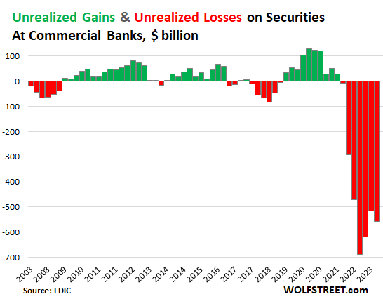

## Table of Contents

## What are unrealized losses?

Unrealized losses are losses that you have on paper but haven't actually experienced yet because you haven't sold the asset. For example, if you bought a stock for $100 and it's now worth $80, you have an unrealized loss of $20. You only realize this loss if you sell the stock at $80.

These losses can happen with any investment, like stocks, bonds, or real estate. They are important to keep track of because they show how your investments are doing, even if you haven't sold them yet. If the value of your investment goes back up before you sell, the unrealized loss can disappear.

## How do unrealized losses differ from realized losses?

Unrealized losses and realized losses are two different things when it comes to your investments. An unrealized loss is like a loss on paper. It happens when the value of something you own, like a stock, goes down but you haven't sold it yet. So, if you bought a stock for $100 and it's now worth $80, you have an unrealized loss of $20. You don't actually lose the money until you sell the stock at the lower price.

A realized loss, on the other hand, is a loss that you actually experience. It happens when you sell an investment for less than what you paid for it. Using the same example, if you sell that stock at $80, you now have a realized loss of $20. This loss is real because you've taken the action to sell, and the money is gone. Realized losses can affect your taxes, while unrealized losses are just a way to keep track of how your investments are doing without selling them.

## Can you explain the concept of unrealized losses with a simple example?

Imagine you bought a toy car for $10. After a while, you check and see that the same toy car is now only worth $7 at the store. This means you have an unrealized loss of $3. You haven't lost the $3 yet because you still have the toy car and haven't sold it. The loss is just on paper.

If you decide to keep the toy car and its value goes back up to $10 or more, your unrealized loss will go away. But if you sell the toy car for $7, then you will have a realized loss of $3 because you actually lost that money when you sold it. So, unrealized losses are like a warning sign that your investment might be worth less, but you only feel the real loss if you sell it at a lower price.

## What types of assets typically experience unrealized losses?

Unrealized losses can happen with many different kinds of things you own, like stocks, bonds, and real estate. If you buy a stock and its price goes down, you have an unrealized loss until you sell it. The same goes for bonds; if their value drops, you have an unrealized loss until you decide to sell them. Real estate can also have unrealized losses if the value of your house or property goes down, but you haven't sold it yet.

These unrealized losses are common in investments because the value of things can go up and down all the time. For example, if you invest in a mutual fund and the overall value of the fund decreases, you have an unrealized loss. Even things like commodities, like gold or oil, can have unrealized losses if their market price falls after you buy them. The key thing to remember is that you only actually lose money if you sell the asset at a lower price than what you paid for it.

## How are unrealized losses recorded in financial statements?

Unrealized losses show up on a company's financial statements, especially on the balance sheet and sometimes on the income statement. On the balance sheet, unrealized losses are often seen in the value of assets like investments in stocks or bonds. If a company owns stocks and their value goes down, the balance sheet will show these stocks at their new, lower value. This means the company's total assets will be less than before, showing an unrealized loss.

Sometimes, unrealized losses can also affect the income statement, but this depends on how the company accounts for its investments. If the company uses a method called "mark-to-market" accounting, it will show unrealized losses on the income statement as a decrease in income or an increase in expenses. This way, the financial statements give a more up-to-date picture of the company's financial health, even if the losses aren't realized yet.

## What impact do unrealized losses have on an investor's portfolio?

Unrealized losses can make an investor's portfolio look less valuable on paper. If you own stocks, bonds, or other investments and their prices go down, the total value of your portfolio will decrease. This doesn't mean you've lost money yet, because you haven't sold these investments. But it's a sign that if you were to sell them at that moment, you would get less money than you paid for them. This can be stressful, but it's important to remember that the value of investments can go up and down, and unrealized losses might go away if the prices go back up.

Unrealized losses can also affect how you feel about your investments. Seeing your portfolio's value drop can make you feel worried or unsure about your investment choices. It might make you think about selling your investments to avoid bigger losses, even though holding onto them could be better if their value goes up again. Keeping track of unrealized losses helps you understand how your investments are doing, but it's also important not to make quick decisions based on these losses alone.

## How can unrealized losses affect tax obligations?

Unrealized losses don't affect your taxes right away. This is because you haven't actually lost any money yet. You only pay taxes or get tax benefits when you sell something and make a profit or a loss. So, if you own a stock that's worth less now than when you bought it, you don't have to report that loss on your taxes until you sell the stock.

However, when you do sell and turn an unrealized loss into a realized loss, it can help lower your taxes. If you sell an investment at a loss, you can use that loss to reduce the amount of taxes you owe on other gains or even on your regular income. This is called tax loss harvesting, and it's a way to make the best of a bad situation by using your losses to save money on taxes.

## What strategies can investors use to manage unrealized losses?

Investors can manage unrealized losses by first understanding that these losses are normal and part of investing. The value of stocks, bonds, and other investments can go up and down all the time. So, it's important not to panic when you see your investments losing value. Instead, think about your long-term goals. If you believe in the investment and think it will do well over time, it might be better to hold onto it and wait for the value to go back up.

Another strategy is to diversify your portfolio. This means spreading your money across different types of investments. If one investment goes down in value, others might stay the same or even go up. This can help balance out your unrealized losses. Also, you can think about rebalancing your portfolio every now and then. This means selling some investments that have gone up a lot and buying more of those that have gone down, but only if you still believe in them for the long term. By doing this, you can keep your investments in line with your goals and manage unrealized losses better.

## How do unrealized losses influence investment decisions and portfolio rebalancing?

Unrealized losses can make investors feel worried and might make them want to sell their investments quickly to stop the losses from getting bigger. But selling right away is not always the best idea. If you believe in the investment and think it will do well over time, it might be better to hold onto it. Unrealized losses are just a sign that the value of your investment has gone down for now, but it could go back up. So, it's important to think about your long-term goals and not make quick decisions just because you see a loss on paper.

Portfolio rebalancing is another way to manage unrealized losses. This means you check your investments every now and then and make changes to keep them in line with your goals. If one of your investments has gone down a lot, you might decide to buy more of it if you still believe in it for the long term. Or, if another investment has gone up a lot, you might sell some of it to buy more of the ones that have gone down. By doing this, you can spread out your unrealized losses and keep your portfolio balanced. It's all about making sure your investments match what you want to achieve in the future.

## What are the psychological effects of unrealized losses on investors?

Unrealized losses can make investors feel really worried and stressed. When you see the value of your investments going down, even though you haven't sold them yet, it can be hard to stay calm. You might start thinking about all the money you could lose if you sold right now. This feeling can make you want to sell your investments quickly to stop the losses from getting bigger, even if it's not the best thing to do for your long-term goals.

It's important to remember that these feelings are normal. Everyone who invests money can feel this way when they see unrealized losses. The key is to try not to let these feelings make you do things you might regret later. If you believe in your investments and think they will do well over time, it's often better to wait and see if their value goes back up. Talking to a financial advisor or someone you trust can also help you feel better and make smarter decisions about your investments.

## How do accounting standards like GAAP and IFRS treat unrealized losses?

Under Generally Accepted Accounting Principles (GAAP), unrealized losses are treated differently depending on the type of investment. For trading securities, which are bought and sold frequently, unrealized losses are shown on the income statement right away. This means if the value of these investments goes down, the company has to report the loss as soon as it happens. For available-for-sale securities, which are held for a longer time, unrealized losses are not shown on the income statement. Instead, they are reported in a part of the balance sheet called "other comprehensive income." This way, the company's net income isn't affected by these losses until the securities are sold.

International Financial Reporting Standards (IFRS) also have rules for unrealized losses, but they can be a bit different from GAAP. Under IFRS, unrealized losses on financial assets that are measured at fair value through profit or loss are reported on the income statement immediately, similar to GAAP's treatment of trading securities. For financial assets measured at fair value through other comprehensive income, unrealized losses are reported in other comprehensive income, much like GAAP's treatment of available-for-sale securities. The main difference is that IFRS might allow more flexibility in how companies classify their financial assets, which can affect how unrealized losses are reported.

## What are the advanced financial models used to predict and manage unrealized losses?

Advanced financial models help investors predict and manage unrealized losses by using math and data to guess how investments might do in the future. One common model is the Monte Carlo simulation. This model runs lots of different scenarios to see how an investment might go up or down over time. It can show investors the chance of their investments losing value and help them decide if they should keep their investments or make changes. Another model is the Value at Risk (VaR) model, which tries to guess the most an investor might lose over a certain time. By using these models, investors can get a better idea of how to handle unrealized losses and make smarter choices about their money.

Another important model is the Black-Scholes model, which is often used for options and other complex investments. This model helps investors figure out the value of their options and how much they might lose if the market changes. It's a bit more complicated, but it can be really helpful for managing unrealized losses in these kinds of investments. All these models use a lot of data and math to give investors a clearer picture of what might happen with their investments. By understanding these predictions, investors can make better plans to manage their unrealized losses and keep their portfolios strong.

## What are Unrealized Losses in Algorithmic Trading?

In [algorithmic trading](/wiki/algorithmic-trading), unrealized losses represent a critical component of performance evaluation and risk management. These losses occur when the current market value of a held asset falls below its original purchase price but hasn't yet been sold. While still unrealized, these losses offer a real-time window into the effectiveness of trading strategies.

Algorithmic trading leverages advanced computational techniques to analyze and execute trades efficiently. Within this framework, unrealized losses serve as benchmarks that inform traders whether a strategy requires adjustment. For instance, large unrealized losses might indicate a need to review asset allocations or reconsider risk exposure. Conversely, small or stable unrealized losses could suggest that the current strategy remains sound.

To manage these losses, algorithmic trading systems often employ stop-loss orders. These are predefined price points at which an asset is automatically sold to prevent further losses. The formula for a simple stop-loss can be expressed as:

$$
\text{Stop-Loss Price} = \text{Purchase Price} \times (1 - \text{Stop-Loss Percentage})
$$

For example, if a stock is purchased at $100 with a stop-loss set at 5%, the stock would be sold automatically if its price dips to $95.

Hedging techniques are also integral, providing a buffer against potential downward price movements. These methods can include derivative instruments like options or futures, which allow traders to offset losses in one asset with gains in another. A Python code snippet for a basic hedging strategy might look like this:

```python
def hedge_position(holdings, hedge_ratio):
    # Calculate the number of contracts needed for a hedge
    contracts_needed = holdings * hedge_ratio
    return contracts_needed

# Example usage
holdings = 1000  # number of shares
hedge_ratio = 0.5 # proportion to hedge
contracts = hedge_position(holdings, hedge_ratio)
print(f"Contracts needed for hedge: {contracts}")
```

Machine learning analytics has further revolutionized the management of unrealized losses in algorithmic trading. These models analyze vast datasets to detect patterns and predict asset movements. For instance, predictive algorithms can be coded to assess historical data and identify signals indicating potential price recovery, thereby assisting in minimizing losses or prompting strategic exits.

By integrating these tools and strategies, algorithmic trading platforms provide traders with comprehensive solutions to manage unrealized losses effectively, ensuring that their portfolios remain optimized and risk exposure is minimized.

## References & Further Reading

[1]: Bergstra, J., Bardenet, R., Bengio, Y., & Kégl, B. (2011). ["Algorithms for Hyper-Parameter Optimization."](https://dl.acm.org/doi/10.5555/2986459.2986743) Advances in Neural Information Processing Systems 24.

[2]: ["Advances in Financial Machine Learning"](https://www.amazon.com/Advances-Financial-Machine-Learning-Marcos/dp/1119482089) by Marcos Lopez de Prado

[3]: ["Evidence-Based Technical Analysis: Applying the Scientific Method and Statistical Inference to Trading Signals"](https://www.amazon.com/Evidence-Based-Technical-Analysis-Scientific-Statistical/dp/0470008741) by David Aronson

[4]: ["Machine Learning for Algorithmic Trading"](https://github.com/stefan-jansen/machine-learning-for-trading) by Stefan Jansen

[5]: ["Quantitative Trading: How to Build Your Own Algorithmic Trading Business"](https://github.com/LucindaYa/quant-resources/blob/master/Quantitative%20Trading%20How%20to%20Build%20Your%20Own%20Algorithmic%20Trading%20Business.pdf) by Ernest P. Chan