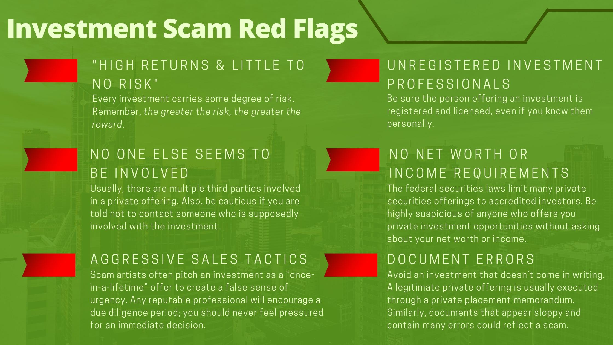

## Table of Contents

## What are unregistered securities?

Unregistered securities are investments that are not registered with the Securities and Exchange Commission (SEC). This means they don't go through the usual process of being approved and listed on public markets like stocks or bonds. Companies might choose to offer these securities to raise money without the hassle and cost of going through the SEC's registration process.

These securities are often sold in private transactions to a limited number of investors. Because they're not registered, they can be riskier. Investors might not get as much information about the company as they would with registered securities. It's important for anyone thinking about investing in unregistered securities to do a lot of research and understand the risks involved.

## How do unregistered securities differ from registered securities?

Unregistered securities and registered securities are different mainly because of how they are handled by the government and how they can be bought and sold. Registered securities are approved by the Securities and Exchange Commission (SEC). This means that companies have to share a lot of information about their business, finances, and risks. This information helps investors make better decisions. Registered securities can be traded on big stock markets like the New York Stock Exchange, making it easy for people to buy and sell them.

On the other hand, unregistered securities are not approved by the SEC. Companies that offer these securities don't have to share as much information, which can make them riskier for investors. These securities are usually sold in private deals to a smaller group of people. They can't be easily traded on public stock markets, which can make it harder to sell them if you need to.

In summary, the main differences are about regulation, information, and how easy it is to buy and sell the securities. Registered securities come with more protection and transparency, while unregistered securities can be riskier but might offer different opportunities for both companies and investors.

## What are the common types of unregistered securities?

Unregistered securities come in different forms. One common type is private placement securities. These are sold directly by a company to a small group of investors, like wealthy people or big investment funds, without going through the SEC's registration process. Another type is Regulation D offerings, which are a specific kind of private placement that follows certain rules set by the SEC to make sure they're sold only to certain investors.

Another type of unregistered security is Regulation A offerings, also known as mini-IPOs. These allow companies to raise money from the public without a full SEC registration, but they have to follow some lighter rules. Lastly, there are securities sold through crowdfunding platforms. These platforms let companies raise small amounts of money from a lot of people, often through the internet, without registering with the SEC.

Each of these types of unregistered securities has its own rules and risks. They are often used by smaller companies or startups that want to raise money without the cost and time of a full SEC registration. Investors in these securities need to be careful and do their homework because they might not get as much information as they would with registered securities.

## Why might a company choose to issue unregistered securities?

A company might choose to issue unregistered securities because it's a faster and cheaper way to raise money. When a company goes through the SEC's registration process, it has to spend a lot of time and money on paperwork and legal fees. By issuing unregistered securities, a company can skip all that and get the money it needs more quickly. This can be really helpful for small businesses or startups that need cash fast to grow or keep running.

Another reason is that unregistered securities can be sold to a specific group of investors, like wealthy individuals or big investment funds. These investors might be more willing to take risks and invest in new or smaller companies. By targeting these investors, a company can find people who believe in their business and are ready to support it. Plus, since these securities aren't traded on big stock markets, the company can keep more control over who owns its shares and how they're bought and sold.

## What are the risks associated with investing in unregistered securities?

Investing in unregistered securities can be riskier than investing in registered ones. One big risk is that you might not get as much information about the company. When a company registers its securities with the SEC, it has to share a lot of details about its business, money, and risks. With unregistered securities, you might not get all that info, which makes it harder to know if the company is a good investment. This can lead to surprises and losses if the company doesn't do well.

Another risk is that unregistered securities are usually harder to sell. They're not traded on big stock markets like the New York Stock Exchange, so finding someone to buy them can be tough. If you need to get your money back quickly, you might have to sell at a lower price or not be able to sell at all. This lack of liquidity can be a big problem if you need cash fast.

Lastly, there's a higher chance of fraud with unregistered securities. Since they're not watched as closely by the SEC, some bad actors might try to trick investors with false promises or fake information. It's important to do a lot of research and be careful when thinking about investing in unregistered securities, because the risks can be much higher than with registered ones.

## How can an investor identify unregistered securities?

An investor can identify unregistered securities by looking at where and how they are being sold. Unregistered securities are often sold in private deals, not on big stock markets like the New York Stock Exchange. If a company is offering its securities directly to a small group of investors, like wealthy people or big investment funds, without going through the SEC, those are likely unregistered securities. Also, if you see securities being sold through crowdfunding platforms or in special offerings like Regulation D or Regulation A, they might be unregistered.

Another way to spot unregistered securities is by checking the information available about the company. Registered securities come with a lot of details about the company's business, money, and risks, because the company has to share this with the SEC. If you're not getting much information, or if the company is not sharing as much as you'd expect, it could be a sign that the securities are unregistered. Always do your homework and be careful, because unregistered securities can be riskier.

## What are the legal implications of trading unregistered securities?

Trading unregistered securities can have some legal risks. In the United States, the SEC has rules about what companies need to do before they can sell securities to the public. If a company doesn't follow these rules and sells unregistered securities, it could get in trouble with the law. The SEC might fine the company or even take legal action against it. Investors who buy these securities could also face problems if they don't know the securities are unregistered.

For investors, it's important to know that trading unregistered securities can be risky. If you buy or sell these securities without knowing they're unregistered, you might not be breaking the law yourself, but you could lose money if the company gets in trouble. Also, if you're selling unregistered securities to others, you need to be careful because you could be breaking the law if you don't follow the right rules. Always check the details and maybe talk to a lawyer if you're not sure.

## What is the process for a company to register securities with the SEC?

When a company wants to register its securities with the SEC, it starts by preparing a detailed document called a registration statement. This document includes a lot of information about the company, like its business, financial situation, and any risks involved in investing in it. The company also makes a prospectus, which is a simpler version of the registration statement that investors can read to understand what they're investing in. The company sends these documents to the SEC and waits for them to be reviewed.

Once the SEC gets the registration statement, it starts a review process. The SEC checks to make sure all the information is correct and complete. They might ask the company for more details or changes if something is missing or wrong. This back-and-forth can take some time. Once the SEC is happy with everything, they'll declare the registration statement effective. After that, the company can start selling its securities to the public, and the securities will be listed on stock markets where people can buy and sell them easily.

## How does the regulation of unregistered securities vary by country?

The rules for unregistered securities can be different in each country. In the United States, the SEC has strict rules about what companies need to do before they can sell securities to the public. If a company doesn't follow these rules, it could get in trouble. But some countries might have lighter rules or different ways of watching over unregistered securities. For example, in the European Union, there are rules that let companies sell securities to certain investors without a full registration, but these rules can be different from country to country within the EU.

In other places, like some developing countries, the rules might not be as strict or well-enforced. This can make it easier for companies to sell unregistered securities, but it can also be riskier for investors because there's less protection. It's important for investors to know the rules in their own country and any country where they're thinking about investing. This way, they can understand the risks and make better choices about where to put their money.

## What are some historical examples of unregistered securities fraud?

One famous example of unregistered securities fraud is the Ponzi scheme run by Charles Ponzi in the early 1900s. Ponzi promised investors big returns by buying and selling international reply coupons. But he didn't really do that. Instead, he used money from new investors to pay off old ones. This made it look like he was making money, but it was all a lie. When people found out, Ponzi's scheme fell apart, and many investors lost their money.

Another example is the case of Bernard Madoff, who ran a huge Ponzi scheme in the late 2000s. Madoff told investors he was making money through smart investments, but he was really just using new investors' money to pay off old ones. He didn't register his securities with the SEC, which made it easier for him to keep his fraud going for a long time. When the scheme collapsed during the 2008 financial crisis, many people lost billions of dollars. Madoff went to jail, but the damage was done, showing how dangerous unregistered securities fraud can be.

## How can investors protect themselves when dealing with unregistered securities?

Investors can protect themselves when dealing with unregistered securities by doing a lot of research. They should learn as much as they can about the company, its business, and its financial situation. Since unregistered securities don't come with the same amount of information as registered ones, it's important to ask the company for details and look for other sources of information. Talking to other investors or getting advice from a financial advisor can also help. Being careful and not rushing into an investment can save a lot of trouble later on.

Another way to stay safe is to be aware of the risks. Unregistered securities can be harder to sell and might not be as safe as registered ones. Investors should only put money into unregistered securities if they're okay with the chance of losing it. It's also a good idea to check if the company and the people selling the securities have a good reputation. If something feels off or too good to be true, it's better to walk away. By being careful and doing their homework, investors can make smarter choices and protect their money.

## What role do private placements play in the market for unregistered securities?

Private placements are a big part of the market for unregistered securities. They let companies sell their securities directly to a small group of investors, like rich people or big investment funds, without going through the SEC's registration process. This can be a faster and cheaper way for companies to raise money. They don't have to spend a lot of time and money on paperwork and legal fees, which is helpful for small businesses or startups that need cash quickly.

Because private placements are not registered with the SEC, they can be riskier for investors. They might not get as much information about the company as they would with registered securities. This means they have to do a lot of research and be careful. But private placements can also offer chances to invest in new or growing companies that might not be available on public markets. So, while they come with more risk, they can also be a way for investors to find unique investment opportunities.

## References & Further Reading

[1]: Cox, C., & Gruppetta, T. M. (2006). ["Algorithmic Trading: An Overview."](https://pmc.ncbi.nlm.nih.gov/articles/PMC11255913/) U.S. Securities and Exchange Commission.

[2]: ["Private Placements: An Overview"](https://www.financestrategists.com/wealth-management/private-placement/) by Adam Hayes, Investopedia.

[3]: Lopez de Prado, M. (2018). ["Advances in Financial Machine Learning."](https://www.amazon.com/Advances-Financial-Machine-Learning-Marcos/dp/1119482089) John Wiley & Sons.

[4]: The U.S. Securities and Exchange Commission. ["Rule 144: Selling Restricted and Control Securities."](https://www.sec.gov/about/reports-publications/investorpubsrule144)

[5]: Securities Act of 1933. ["Regulation D Offerings."](https://www.ecfr.gov/current/title-17/chapter-II/part-230/subject-group-ECFR6e651a4c86c0174/) U.S. Securities and Exchange Commission.

[6]: Chan, E. P. (2009). ["Quantitative Trading: How to Build Your Own Algorithmic Trading Business."](https://github.com/ftvision/quant_trading_echan_book) John Wiley & Sons.

[7]: Aronson, D. R. (2007). ["Evidence-Based Technical Analysis: Applying the Scientific Method and Statistical Inference to Trading Signals."](https://onlinelibrary.wiley.com/doi/book/10.1002/9781118268315) John Wiley & Sons.