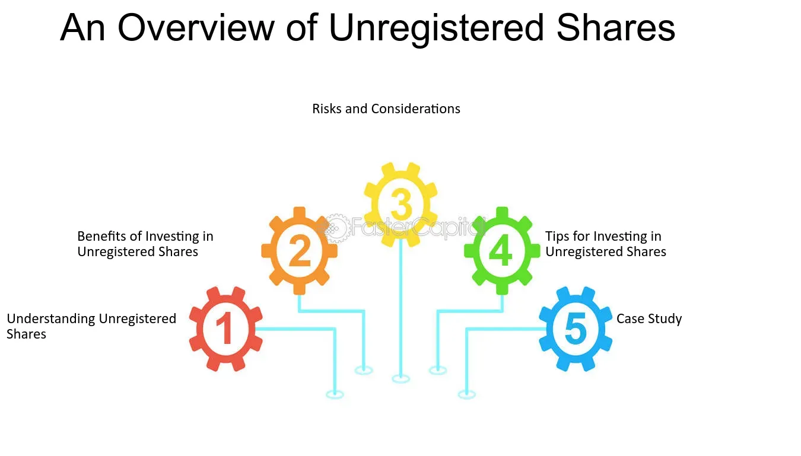

## Table of Contents

## What are unregistered shares?

Unregistered shares are stocks that a company has not yet registered with the government, like the Securities and Exchange Commission (SEC) in the United States. These shares are often given to company insiders, such as founders or early employees, before the company goes public. Because they are not registered, they cannot be sold to the public right away. This means that the people who own these shares have to wait until the company registers them or until certain conditions are met before they can sell them.

When a company decides to go public, it will usually register its shares so that they can be sold on a stock exchange. Until that happens, unregistered shares are considered restricted and can only be traded in private transactions. This can be a good thing for the company because it helps them control who owns their stock and how it is sold. For the people who own the unregistered shares, it can be a bit of a wait, but it can also be rewarding if the company does well and the value of the shares goes up.

## How do unregistered shares differ from registered shares?

Unregistered shares are stocks that a company hasn't registered with the government yet. This means they can't be sold to the public right away. They are often given to people inside the company, like the founders or early workers, before the company goes public. Because these shares aren't registered, the people who own them have to wait until the company registers them or until certain rules are followed before they can sell them.

Registered shares, on the other hand, are stocks that a company has registered with the government. This allows them to be sold to anyone on a stock exchange. When a company decides to go public, it will register its shares so that they can be traded openly. This makes it easier for the company to raise money and for people to buy and sell the shares freely.

## What are the common reasons for issuing unregistered shares?

Companies often issue unregistered shares to give them to people inside the company, like founders, early employees, or investors, before they go public. This helps the company keep control over who owns their stock and how it is sold. By giving out unregistered shares, the company can reward the people who helped it grow without having to go through the process of registering the shares with the government right away.

Another reason for issuing unregistered shares is to raise money privately. Sometimes, a company might need funds to grow but isn't ready to go public yet. By selling unregistered shares to private investors, the company can get the money it needs without having to follow all the rules and costs that come with registering the shares. This can be a quicker and less expensive way to raise money, but it means the investors have to wait until the shares are registered before they can sell them to the public.

## Who typically buys unregistered shares?

Unregistered shares are usually bought by people who are closely connected to the company. This includes the founders and early employees who get these shares as a reward for their hard work and dedication. These people believe in the company's future and are willing to wait until the shares are registered before they can sell them.

Sometimes, private investors also buy unregistered shares. These investors might be friends, family, or business partners of the company's founders. They are willing to take a risk on the company because they believe it will do well in the future. By buying unregistered shares, they can help the company grow and potentially make a lot of money if the company goes public and the value of the shares goes up.

## What are the risks associated with investing in unregistered shares?

Investing in unregistered shares can be risky because they are not registered with the government yet. This means they can't be sold to the public right away, so you have to wait until the company registers them before you can sell them. If the company takes a long time to go public or decides not to go public at all, you might have to wait a long time to get your money back. Also, because these shares are not registered, there is less information available about the company, which makes it harder to know if it's a good investment.

Another risk is that unregistered shares are often given to people inside the company or sold to private investors. This means the company might not be as open about its financial health or future plans as a public company would be. If the company runs into problems or doesn't grow as expected, the value of your shares could go down, and you might lose money. It's important to do a lot of research and understand the company well before investing in unregistered shares.

## How can unregistered shares be sold or transferred?

Unregistered shares can't be sold to the public right away because they are not registered with the government. Instead, they can only be sold or transferred in private deals. This means the people who own these shares might sell them to friends, family, or other private investors who believe in the company. These private sales have to follow certain rules to make sure everything is done legally.

Sometimes, the company might help with these private sales by matching buyers and sellers. This can make it easier for the people who own the unregistered shares to find someone to buy them. But, the owners still have to wait until the company registers the shares or until certain conditions are met before they can sell them to the public on a stock exchange. Until then, the shares are considered restricted, and the owners need to be patient.

## What are the legal requirements for issuing unregistered shares?

When a company wants to issue unregistered shares, it has to follow certain rules set by the government. In the United States, the Securities and Exchange Commission (SEC) has rules that say companies can issue unregistered shares if they meet certain conditions. For example, the company can only sell these shares to a small group of people, like friends, family, or private investors. The company also has to make sure that the people buying the shares know they are unregistered and can't be sold to the public right away.

Another important rule is that the company has to be careful about how it talks about the shares. It can't advertise them to the public or make promises about how much money people might make. The company has to give the buyers all the important information about the business, like its financial health and future plans. This helps the buyers make a smart decision about whether to invest in the unregistered shares.

## What is the process of registering unregistered shares?

When a company decides to register its unregistered shares, it starts by filing a registration statement with the government, like the Securities and Exchange Commission (SEC) in the United States. This statement has a lot of information about the company, like its financial health, business plans, and who the important people are. The SEC looks at this information to make sure it's all true and that the company is following the rules. This can take some time because the SEC wants to make sure everything is done right.

Once the SEC is happy with the registration statement, the company can start selling its shares to the public. This usually happens on a stock exchange, where anyone can buy and sell the shares. The people who already own the unregistered shares can now sell them to anyone, not just in private deals. This makes it easier for them to get their money back if they want to. Registering the shares is a big step for the company because it means they can grow and raise more money from the public.

## How does the valuation of unregistered shares work?

Valuing unregistered shares can be tricky because they are not traded on a public stock exchange. Instead, their value is often based on what people inside the company or private investors think the company is worth. This can depend on things like how well the company is doing, how much money it is making, and what its future plans are. Sometimes, the company might hire experts to help figure out what the shares are worth. These experts look at all the information they can find and come up with a number that they think is fair.

When unregistered shares are sold or transferred in private deals, the price can be different each time. This is because the buyer and seller have to agree on a price that they both think is right. If the company is doing well and people think it will keep growing, the price of the shares might go up. But if the company is having problems, the price might go down. It's important for the people buying and selling unregistered shares to do a lot of research and understand the company well so they can make a smart decision about what the shares are worth.

## What are the tax implications of holding unregistered shares?

When you own unregistered shares, you need to think about taxes. If you get these shares as a gift or as part of your job, you might have to pay taxes on them. The tax you pay depends on how much the shares are worth when you get them. If the company does well and the value of the shares goes up, you might have to pay more taxes when you sell them. It's a good idea to talk to a tax expert to understand exactly what you need to pay.

When you sell unregistered shares, you also have to think about capital gains tax. This is the tax you pay on the money you make from selling something for more than you paid for it. If you sell the shares for more than they were worth when you got them, you have to pay this tax. The amount of tax you pay depends on how long you held the shares before selling them. If you held them for a long time, the tax might be less than if you sold them quickly. Again, talking to a tax expert can help you figure out what you owe.

## How do unregistered shares impact a company's financial reporting?

Unregistered shares can make a company's financial reporting a bit more complicated. When a company gives out unregistered shares, it has to keep track of who owns them and how many there are. This information has to be included in the company's financial reports, but it's not as easy to see as the information about registered shares. The company might have to explain in its reports why it issued unregistered shares and what it plans to do with them in the future. This can make the reports longer and harder to understand for people who are looking at them.

Even though unregistered shares are not traded on a public stock exchange, they can still affect how much the company is worth. When a company is figuring out its value, it has to think about all the shares it has, including the unregistered ones. If the company is doing well and the value of the unregistered shares goes up, this can make the company look more valuable. But if the company is having problems, the value of the unregistered shares might go down, which can make the company look less valuable. This is something the company has to explain in its financial reports, so people can understand how the unregistered shares are affecting the company's overall value.

## What are the strategic considerations for a company deciding to issue unregistered shares?

When a company thinks about issuing unregistered shares, it's often because they want to reward the people who helped the company grow, like the founders and early employees. By giving out these shares, the company can keep control over who owns their stock and how it's sold. This can be a good way to keep the people who are important to the company happy and motivated. It also helps the company raise money without having to go through the process of registering the shares with the government right away, which can be expensive and take a lot of time.

Another thing the company has to think about is how issuing unregistered shares will affect their future plans. If the company wants to go public someday, they need to make sure they follow all the rules about unregistered shares. This means keeping good records of who owns the shares and being ready to register them when the time comes. The company also has to think about how the value of the unregistered shares might change over time and how that will affect their overall value. By planning carefully, the company can use unregistered shares to help them grow and reach their goals.

## References & Further Reading

[1]: ["Quantitative Trading: How to Build Your Own Algorithmic Trading Business"](https://www.amazon.com/Quantitative-Trading-Build-Algorithmic-Business/dp/1119800064) by Ernest P. Chan

[2]: ["Evidence-Based Technical Analysis: Applying the Scientific Method and Statistical Inference to Trading Signals"](https://www.amazon.com/Evidence-Based-Technical-Analysis-Scientific-Statistical/dp/0470008741) by David Aronson

[3]: ["Advances in Financial Machine Learning"](https://www.amazon.com/Advances-Financial-Machine-Learning-Marcos/dp/1119482089) by Marcos Lopez de Prado

[4]: ["Machine Learning for Algorithmic Trading"](https://github.com/stefan-jansen/machine-learning-for-trading) by Stefan Jansen

[5]: Sec. and Exch. Comm'n, 17 CFR Part 230, [Rule 144—Persons Deemed Not to Be Engaged in a Distribution and Therefore Not Underwriters](https://www.ecfr.gov/current/title-17/chapter-II/part-230/section-230.144)

[6]: U.S. Securities and Exchange Commission, "[Private Placements Under Regulation D](https://www.investor.gov/introduction-investing/general-resources/news-alerts/alerts-bulletins/investor-bulletins/private)" - Overview of rules and guidelines regarding unregistered share offerings.