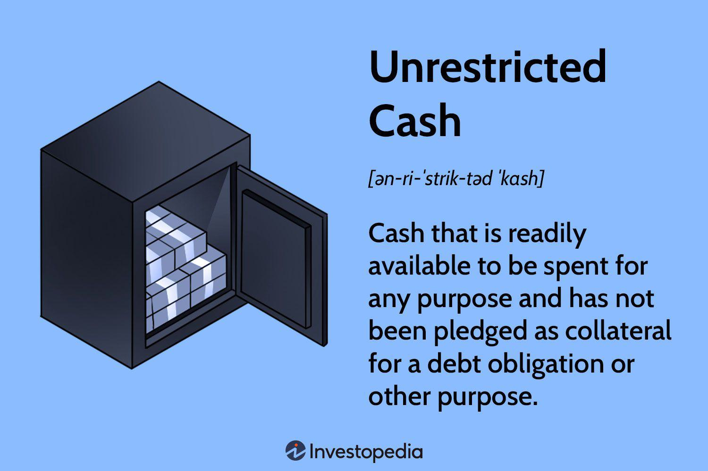

## Table of Contents

## What is unrestricted cash?

Unrestricted cash is money that a person or a business can use freely, without any rules or limits. It's like having cash in your pocket that you can spend on anything you want, whether it's buying groceries, paying bills, or going on a vacation. For businesses, unrestricted cash is important because it helps them run smoothly and take advantage of new opportunities quickly.

On the other hand, restricted cash is money that has to be used for specific purposes. For example, a company might have money set aside just for paying taxes or for a special project. This money can't be used for other things. Unrestricted cash gives more flexibility and freedom, which is why it's often seen as a sign of financial health and stability for both individuals and businesses.

## How does unrestricted cash differ from restricted cash?

Unrestricted cash is money that you can use for anything you want. It's like having money in your wallet that you can spend on whatever you need or want, whether it's buying food, paying bills, or going on a trip. For businesses, having a lot of unrestricted cash is good because it means they can pay for things quickly and take advantage of new opportunities without having to wait.

Restricted cash, on the other hand, is money that has to be used for specific things. For example, a company might have money set aside just for paying taxes or for a special project. This money can't be used for anything else. So, if a business has a lot of restricted cash, it might look like they have a lot of money, but they can't use it freely. This is why having more unrestricted cash is usually seen as a sign of financial health and flexibility.

## What are the primary sources of unrestricted cash for a business?

The main ways a business gets unrestricted cash are through its everyday operations and by selling things. When a business sells its products or services, the money it gets from customers is usually unrestricted. This means the business can use this money for anything it needs, like paying bills, buying new supplies, or saving for the future. Another way a business can get unrestricted cash is by taking out loans or getting investments, as long as there are no rules about how the money has to be spent.

Sometimes, a business might also get unrestricted cash from other sources, like selling assets it no longer needs or getting money back from taxes. For example, if a business sells an old piece of equipment, the money it gets from the sale can be used for anything. Also, if a business gets a tax refund, that money is usually unrestricted too. These different sources help a business keep enough cash on hand to run smoothly and take advantage of new opportunities.

## How is unrestricted cash reported on financial statements?

Unrestricted cash is shown on a business's financial statements, mainly on the balance sheet. The balance sheet is like a snapshot of what the business owns and owes at a certain time. Unrestricted cash is listed under the "assets" section, often right at the top because it's one of the most liquid assets, meaning it can be used quickly and easily. This part of the balance sheet might be called "cash and cash equivalents," which includes not just the cash in the bank but also things like money market funds that can be turned into cash very quickly.

On the cash flow statement, unrestricted cash is also important. This statement shows how cash moves in and out of the business over a period of time. It's divided into three parts: operating activities, investing activities, and financing activities. The changes in unrestricted cash from these activities help show how the business is doing financially. For example, if a business is making more cash from its operations than it's spending, that's a good sign and will be shown on the cash flow statement.

## What are the benefits of maintaining a high level of unrestricted cash?

Keeping a lot of unrestricted cash is good for a business because it gives them the freedom to spend money on whatever they need. This means they can quickly pay for things like buying new supplies, fixing problems, or taking advantage of new opportunities without having to wait or borrow money. Having enough cash also helps a business feel more secure because they know they can handle unexpected expenses or changes in the market without getting into trouble.

Another benefit is that it makes it easier for a business to plan for the future. With a good amount of unrestricted cash, a business can invest in new projects or expand without worrying about running out of money. This can help them grow and stay competitive. Plus, having a lot of unrestricted cash can make investors and lenders feel more confident about the business, which can make it easier to get loans or investments if they need them.

## What are the potential risks associated with holding too much unrestricted cash?

Holding too much unrestricted cash can lead to some problems for a business. One big issue is that cash sitting in a bank account usually doesn't earn much interest. This means the business is missing out on making more money by investing that cash in things like stocks, bonds, or new projects that could grow the business. If a business keeps too much money as cash, it might not be using its resources as well as it could be, and that can slow down its growth over time.

Another risk is that having too much cash can make a business a target for theft or fraud. If people inside or outside the company know there's a lot of cash available, they might try to steal it. Also, holding a lot of cash can make a business seem like it's not being smart with its money. Investors and lenders might start to worry that the business isn't using its money to grow and improve, which could make them less willing to invest in or lend to the business in the future.

## How can a company optimize its unrestricted cash management?

A company can optimize its unrestricted cash management by carefully planning how it uses its money. This means keeping enough cash on hand to cover daily expenses and unexpected costs, but not so much that the money just sits in the bank without earning anything. One way to do this is by setting up a cash reserve policy that decides how much cash the company should keep as a safety net. This helps the company use extra cash to invest in things that can help it grow, like new projects or equipment, instead of letting it sit unused.

Another important part of managing unrestricted cash well is keeping a close eye on how money comes in and goes out of the business. This means regularly checking the cash flow statement to see where the money is coming from and where it's being spent. By understanding these patterns, the company can make better decisions about when to pay bills, how to collect money from customers faster, and where to invest extra cash. This helps the company stay flexible and ready to take advantage of new opportunities while also keeping enough cash to stay safe and secure.

## What role does unrestricted cash play in liquidity management?

Unrestricted cash is really important for managing a company's liquidity. Liquidity is about how easily a company can turn its assets into cash to pay for things. Unrestricted cash is the money a company can use right away without any rules or limits. This means it's the quickest way for a company to pay its bills, buy new supplies, or handle unexpected costs. By having enough unrestricted cash, a company can keep running smoothly and be ready for any surprises that come up.

Having the right amount of unrestricted cash helps a company stay flexible and strong. If a company has too little unrestricted cash, it might struggle to pay for things on time, which can lead to problems like late fees or not being able to take advantage of new opportunities. On the other hand, if a company has too much unrestricted cash, it might be missing out on making more money by investing that cash in other ways. So, managing unrestricted cash well is all about finding the right balance to keep the company safe and able to grow.

## How does unrestricted cash impact a company's investment decisions?

Unrestricted cash gives a company the freedom to make smart investment decisions. When a company has a lot of unrestricted cash, it can choose to invest in new projects, buy new equipment, or even buy other businesses. This helps the company grow and stay competitive. If a company doesn't have enough unrestricted cash, it might have to borrow money or delay its plans, which can slow down its growth and make it harder to take advantage of new opportunities.

On the other hand, having too much unrestricted cash can also be a problem. If a company keeps too much money in the bank, it might miss out on making more money by investing that cash in things like stocks or bonds. This can make the company look like it's not using its money wisely, which might worry investors and lenders. So, finding the right balance of unrestricted cash is important for making good investment decisions that help the company grow while also staying safe and secure.

## What are the tax implications of holding unrestricted cash?

Holding unrestricted cash can have some tax effects for a business. When a business keeps a lot of cash in the bank, it usually doesn't earn much interest. The interest earned on this cash is considered taxable income, which means the business has to pay taxes on it. However, since the interest rates on cash are usually low, the tax on this income is often not very high. But if the business decides to invest the cash in something that earns more interest or dividends, like stocks or bonds, the tax on that income could be higher.

Another thing to think about is how holding cash can affect a business's overall tax situation. If a business has a lot of cash and decides to use it to pay out dividends to its shareholders, those dividends might be taxable for the shareholders. Also, if the business uses the cash to buy new assets, like equipment or property, it might be able to take advantage of tax deductions or depreciation, which can lower its taxable income. So, how a business manages its unrestricted cash can have different tax effects depending on what it decides to do with the money.

## How do regulatory environments affect the management of unrestricted cash?

Regulatory environments can have a big impact on how a business manages its unrestricted cash. Different countries and regions have their own rules about how much cash a business can keep and how it needs to report that cash. For example, some places might have strict rules about anti-money laundering, which means businesses need to keep good records of where their cash comes from and where it goes. These rules can make it harder for a business to keep a lot of cash without explaining it, which can affect how much unrestricted cash they want to hold.

Also, regulations can affect how a business decides to invest its cash. Some investments might be seen as riskier or more closely watched by regulators, which can make a business think twice before using its cash that way. For example, if there are tight rules about investing in certain industries, a business might choose to keep more cash on hand instead of putting it into those investments. This means that understanding and following the rules is a big part of managing unrestricted cash well.

## What advanced strategies can be employed to leverage unrestricted cash for growth?

One advanced way to use unrestricted cash for growth is by investing in research and development. This means spending money on creating new products or improving old ones. When a business does this, it can come up with new things that customers want, which can help the business grow and make more money. Another strategy is to use the cash to buy other companies. This can help the business grow quickly by adding new products, customers, or even entering new markets. It's like getting bigger by joining forces with other businesses.

Another strategy is to use unrestricted cash to expand into new markets. This could mean opening new stores in different places or selling products in new countries. By doing this, a business can reach more customers and make more sales. It's also smart to use the cash to improve how the business works, like by investing in new technology or training employees. This can make the business run better and be more efficient, which can lead to more growth. Finding the right ways to use unrestricted cash can really help a business get bigger and stronger.

## What is Understanding Unrestricted Cash in Financial Management?

Unrestricted cash refers to cash or cash equivalents that a company can freely use without any limitations dictated by creditors, contractual agreements, or legal regulations. This form of cash is a vital component of a company's liquidity management, directly influencing its ability to meet short-term liabilities and ensuring overall financial health. A company with abundant unrestricted cash is better positioned to invest in new opportunities, safeguard against market fluctuations, and act decisively during financial downturns.

The calculation of unrestricted cash requires an examination of a company's balance sheet, identifying cash holdings that are unencumbered by any claims. This can be outlined as:

$$
\text{Unrestricted Cash} = \text{Total Cash} - \text{Restricted Cash}
$$

Here, restricted cash represents funds that are held for specific purposes, such as securing a loan or future project investments, and are not available for discretionary use.

Understanding unrestricted cash's role in strategic financial management is imperative. It serves as a buffer, providing a company with the agility to respond to unexpected events, such as economic downturns or sudden investment opportunities. For instance, having adequate unrestricted cash means a business can quickly pivot its strategies or enter emerging markets without relying on external funding sources, which could be costly or slow to secure.

Moreover, unrestricted cash aids in maintaining operational stability. In periods of cash flow shortages, these available funds can ensure that operational needs like payroll, supplier payments, and other immediate expenses are met without disrupting business functions. Such financial resilience also supports a company's creditworthiness and financial independence, potentially enabling more favorable borrowing terms in the future.

Strategic uses of unrestricted cash often include funding growth initiatives such as acquisitions, research and development projects, and expansionary activities. Companies can also leverage this cash for stock buybacks or paying higher dividends, signaling strong financial health and boosting shareholder confidence.

In conclusion, unrestricted cash provides essential financial flexibility, allowing companies to stabilize operations, pursue growth opportunities, and adapt to market changes efficiently. An effective cash management strategy that prioritizes maintaining an optimum level of unrestricted cash is crucial for sustained organizational success.

## What is the Role of Cash Flow Analysis?

Cash flow analysis is an essential component in evaluating a company's financial health, as it meticulously tracks the inflow and outflow of money within business operations. This process is foundational in understanding the [liquidity](/wiki/liquidity-risk-premium) and operational dynamics of any organization.

Cash flow analysis encompasses three primary categories: operational, investing, and financing cash flows. Each of these components provides valuable insights into different aspects of the company's financial situation.

**Operational Cash Flow**: This reflects the cash generated or consumed by the firm's core business activities. It is derived from net income by adjusting for non-cash items such as depreciation and changes in working capital. A positive operational cash flow indicates that a company can effectively generate cash through its primary business activities, which is a fundamental indicator of financial health. Mathematically, operational cash flow (OCF) can be represented as:

$$

OCF = Net\ Income + Non-cash\ Expenses - \Delta Working\ Capital 
$$

**Investing Cash Flow**: This component involves cash movements resulting from investment activities, such as purchasing or selling physical assets, investing in securities, or acquiring other businesses. Investing cash flow can highlight a company's growth strategy and investment priorities. Negative cash flow in this area often signifies substantial investment in growth and infrastructure, which can be beneficial over time if managed correctly.

**Financing Cash Flow**: This section accounts for cash transactions associated with a firm's financing activities. It includes cash inflows from issuing debt or equity and outflows for dividend payments or debt repayments. Analyzing financing cash flow helps in understanding how a company balances its capital structure and financial obligations.

Effective cash flow management is vital for businesses to sustain operations. It ensures that a company can fulfill its immediate financial commitments and secure funds for strategic growth. By maintaining a balanced and positive cash flow across these three areas, a company safeguards itself against liquidity crises and positions itself to capitalize on investment opportunities. The strategic implications of cash flow analysis extend to investment and funding decisions. Funds available from operating activities may be allocated to high-yield investment opportunities, whereas financing cash flow insights ensure that a company maintains an optimal mix of debt and equity financing.

In summary, cash flow analysis is indispensable for revealing the operational efficiency and financial strategies of a business. By accurately evaluating these cash flows, companies can make informed decisions to secure their financial future.

## What is the integration and innovation in algorithmic trading?

Algorithmic trading automates trading processes by leveraging pre-defined strategies that analyze financial data, significantly enhancing the speed and efficiency of market operations. This method utilizes sophisticated algorithms to make trading decisions, often executing trades faster and more accurately than human traders. A critical component of this process is the use of Python libraries, such as NumPy, pandas, and TA-Lib, which provide robust frameworks for data manipulation, analysis, and visualization. These libraries facilitate the development of complex trading algorithms by enabling the processing of large datasets and intricate calculations efficiently.

A common strategy employed in [algorithmic trading](/wiki/algorithmic-trading) is the moving average crossover technique, which involves buying or selling based on the short-term moving average crossing over a long-term moving average. This strategy can be expressed mathematically as follows:

$$
\text{Buy if: } \text{SMA}_{\text{short}}(t) > \text{SMA}_{\text{long}}(t)
$$
$$
\text{Sell if: } \text{SMA}_{\text{short}}(t) < \text{SMA}_{\text{long}}(t)
$$

where $\text{SMA}_{\text{short}}(t)$ and $\text{SMA}_{\text{long}}(t)$ represent short-term and long-term moving averages at time $t$, respectively. Python code implementing this strategy might use the pandas library to calculate these moving averages and trigger trades accordingly.

Algorithmic trading models benefit greatly from integrating cash flow data, which can provide valuable insights into a company's financial health. These insights aid in the formulation of trading strategies by incorporating an understanding of liquidity situations, potentially leading to more informed and profitable trading decisions. Cash flow data can enhance the predictive capacity of algorithms by identifying trends and anomalies that might affect the timing of trades.

Integrating cash flow insights within algorithmic models involves sourcing high-quality data and ensuring it is clean and ready for analysis. The transformation of this data into actionable strategies involves aligning it with existing financial models, thus generating robust trading algorithms that are responsive to both historical trends and real-time market conditions. A sophisticated trading strategy might use a combination of cash flow analytics and statistical techniques to construct a comprehensive view of market dynamics, optimizing buy and sell decisions accordingly.

In summary, algorithmic trading, empowered by Python libraries and the integration of financial data, supports the creation of advanced trading strategies. By incorporating cash flow insights, these strategies align closely with financial analysis, enhancing the strategic framework within which traders operate and improving their responsiveness to market opportunities.

## References & Further Reading

[1]: Bergstra, J., Bardenet, R., Bengio, Y., & Kégl, B. (2011). ["Algorithms for Hyper-Parameter Optimization."](https://dl.acm.org/doi/10.5555/2986459.2986743) Advances in Neural Information Processing Systems 24.

[2]: ["Advances in Financial Machine Learning"](https://www.amazon.com/Advances-Financial-Machine-Learning-Marcos/dp/1119482089) by Marcos Lopez de Prado

[3]: ["Evidence-Based Technical Analysis: Applying the Scientific Method and Statistical Inference to Trading Signals"](https://www.amazon.com/Evidence-Based-Technical-Analysis-Scientific-Statistical/dp/0470008741) by David Aronson

[4]: ["Machine Learning for Algorithmic Trading"](https://github.com/stefan-jansen/machine-learning-for-trading) by Stefan Jansen

[5]: ["Quantitative Trading: How to Build Your Own Algorithmic Trading Business"](https://github.com/LucindaYa/quant-resources/blob/master/Quantitative%20Trading%20How%20to%20Build%20Your%20Own%20Algorithmic%20Trading%20Business.pdf) by Ernest P. Chan