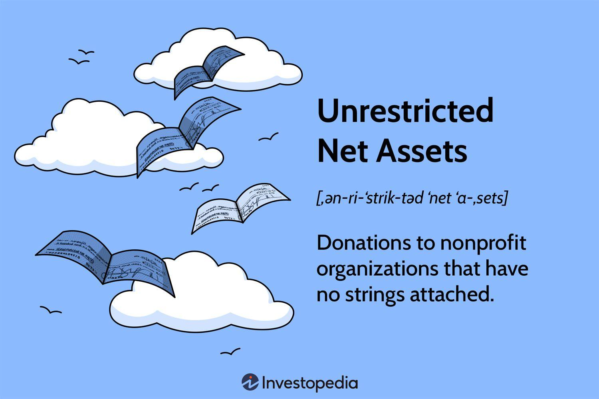

In recent years, the financial landscape has dramatically transformed with advancements in algorithmic trading and the implementation of more sophisticated financial accounting measures. Algorithmic trading, which utilizes computers programmed to follow a defined set of instructions for placing trades to generate profits at a speed and frequency that a human trader cannot achieve, has revolutionized market dynamics. These algorithms can scan multiple markets and exchanges instantly, enabling rapid execution of trading strategies. The increasing complexity and speed of market transactions require organizations to possess a high degree of financial flexibility, which often hinges on their net assets.

Net assets—calculated as the difference between an organization’s total assets and its total liabilities—embody an essential component of an organization's financial health. These assets are typically categorized into unrestricted, temporarily restricted, and permanently restricted assets. This article focuses on unrestricted net assets, assets without donor-imposed restrictions, which organizations can utilize freely to support their operations and strategic initiatives.

Understanding the nuances of unrestricted net assets is crucial for investors, finance professionals, and nonprofit organizations as they navigate modern financial environments. Unrestricted net assets provide entities with the financial flexibility necessary to invest in emerging opportunities or cover unforeseen costs without being encumbered by external conditions or restrictions.

Furthermore, unrestricted net assets hold particular importance in the arena of algorithmic trading. The ability to swiftly allocate resources is vital for optimizing trading strategies and responding to volatile market conditions. By maintaining a pool of assets that can be employed without restrictions, organizations enhance their capacity for strategic decision-making and adaptability, both crucial for staying competitive in today's fast-paced markets.

For nonprofits, managing net assets efficiently is integral to ensuring sustainability and achieving organizational goals. The role of unrestricted net assets within these organizations is fundamental for supporting operations and initiatives that align with their missions. By exploring the intricacies of these financial components, this article aims to demonstrate their significance in contemporary accounting strategies and algorithmic trading landscapes.

In essence, unrestricted net assets are indispensable for fostering stability and growth, offering organizations the flexibility needed to thrive amid evolving financial challenges. As the financial landscape continues to evolve, understanding the strategic utilization and implications of these assets remains a vital component of effective financial planning and management.

## Table of Contents

## Understanding Net Assets

Net assets represent an organization's residual interest in its assets after liabilities are accounted for, serving as a key indicator of its financial health. This fundamental concept in financial accounting is crucial for evaluating the stability and efficiency of an organization's financial management. 

In financial terms, net assets are categorized into three main types: unrestricted, temporarily restricted, and permanently restricted. Each category fulfills a unique role in fiscal strategy and resource allocation.

**Unrestricted Net Assets**: These are assets that an organization can use freely for any legitimate purpose. They provide flexibility for organizations to invest in opportunities, address unforeseen expenses, or support operational needs. Unrestricted net assets are not tied by donor-imposed restrictions or specific contractual obligations, which makes them indispensable for maintaining day-to-day operations and enabling strategic investments.

**Temporarily Restricted Net Assets**: These assets are subject to donor-imposed stipulations that are either time-bound or purpose-specific. For instance, funds donated for a particular project or capital acquisition fall under this category until the purpose is fulfilled or the time restriction lapses. Once the restrictions are met, these assets may either be reclassified as unrestricted or remain tied to their specified purpose.

**Permanently Restricted Net Assets**: This category includes assets that must be maintained in perpetuity as dictated by donors. Generally, the principal amount must remain intact, while the income generated can be used for defined purposes. Typical examples are endowments where the endowed funds are meant to generate income for sustaining the organization's activities.

Net assets are reported on the balance sheet, a critical component of financial statements. The calculation of net assets is straightforward: 

$$
\text{Net Assets} = \text{Total Assets} - \text{Total Liabilities}
$$

This formula highlights the organization's equity, providing a snapshot of its financial position at a given time.

Organizations leverage net assets to ensure financial stability in various ways. Unrestricted net assets offer the most flexibility and are often utilized for covering operating expenses or investing in growth initiatives. On the other hand, temporarily and permanently restricted net assets guide the institution's focus toward fulfilling specific projects or long-term sustainability goals, often aligning with the mission and directives of donor contributions.

Maintaining a robust net asset position is vital for financial management. It supports [liquidity](/wiki/liquidity-risk-premium), aids in crisis management, and bolsters an organization's ability to innovate and thrive. For investors and stakeholders, the composition and magnitude of an organization's net assets serve as a barometer of financial strength and strategic flexibility. Understanding these dynamics allows organizations to navigate economic fluctuations and advance their strategic objectives effectively.

## What Are Unrestricted Net Assets?

Unrestricted net assets refer to resources that an organization, whether a company or a nonprofit, has at its disposal for general use without any limitations imposed by donors or contractual obligations. This type of asset is crucial for financial flexibility, empowering organizations to invest in new opportunities or manage unforeseen expenses.

The fundamental distinction between unrestricted and restricted assets lies in the constraints associated with their usage. Restricted assets are designated for specific purposes as dictated by donors or legal agreements, limiting their application within an organization. In contrast, unrestricted assets are free from such conditions, enabling organizations to allocate these resources according to their immediate or strategic needs.

Financial flexibility stems from the nature of these assets, providing organizations with the ability to make quick decisions and allocate funds where they are most needed. For example, a nonprofit might use unrestricted net assets to cover operational expenses during lean fundraising periods, while a corporation might channel these funds into unforeseen lucrative ventures or innovation projects.

To illustrate, consider a hypothetical scenario where an organization receives a donation: 

- **Restricted donation**: A donor specifies the funds must be used to create educational programs. These funds are earmarked and cannot be redirected to other uses.
- **Unrestricted donation**: A donor allows the organization to utilize the contribution at its discretion. This offers the organization the flexibility to respond to various financial requirements, such as upgrading technology infrastructure or launching new initiatives.

The advantages of having unrestricted net assets primarily lie in the capacity for agile financial decision-making and strategy formulation. They enable organizations to address immediate financial needs and strategically plan for growth and innovation without the constraint of predefined allocation.

In summary, while restricted assets serve important strategic functions by fulfilling specific donor or contractual requirements, unrestricted net assets provide a vital buffer for organizations. They ensure operational fluidity and sustain long-term planning capabilities, underscoring their indispensable role in financial decision-making and planning.

## The Role of Unrestricted Assets in Financial Accounting

Unrestricted assets play a vital role in financial accounting by directly influencing an organization's liquidity and financial stability. These assets, free from donor-imposed restrictions, appear on the balance sheet as a subset of net assets. The presence of significant unrestricted assets offers organizations the flexibility to respond to immediate financial demands, mitigate risks during economic downturns, and invest in potential growth opportunities.

In accounting practices, unrestricted assets are treated with methods that emphasize transparency and regulatory compliance. The treatment of unrestricted assets begins with their accurate recording on financial statements. They are typically included in the equity section of the balance sheet and are reported as part of the net asset classification. Organizations often present a detailed statement of financial position, disclosing the composition of their net assets, which includes unrestricted, temporarily restricted, and permanently restricted portions.

For transparency and compliance, organizations adhere to Generally Accepted Accounting Principles (GAAP) or International Financial Reporting Standards (IFRS), ensuring an accurate representation of these assets. This includes proper documentation of transactions that impact unrestricted assets, such as unrestricted donations, revenues from operations, and the allocation of expenses. By maintaining comprehensive records, organizations can provide stakeholders with a clear view of their financial health and ensure that unrestricted assets are used appropriately.

The accounting for unrestricted assets often involves specific strategies for liquidity management. Organizations may employ cash flow forecasting to anticipate potential liquidity needs and ensure that sufficient unrestricted assets are available to address those needs. Additionally, maintaining a suitable reserve of unrestricted assets can serve as a buffer against unexpected financial challenges, enhancing an organization's ability to withstand economic pressures.

Organizations may also establish policies governing the use and allocation of unrestricted assets. By setting thresholds or limits on the use of these assets, they can safeguard against mismanagement and ensure that funds are available to support essential operations. These policies help maintain a balance between using assets for immediate needs and preserving them for future stability and growth.

In summary, unrestricted assets are a cornerstone of financial accounting due to their impact on liquidity and operational agility. Organizations that effectively record and manage these assets, while ensuring compliance with financial regulations, position themselves better to navigate financial challenges and capitalize on new opportunities.

## Implications of Unrestricted Net Assets in Algorithmic Trading

Algorithmic trading has reshaped the landscape of modern financial markets through its reliance on sophisticated algorithms and automated trading strategies. In this high-speed trading environment, financial flexibility is paramount. Unrestricted net assets offer significant advantages by allowing firms to quickly allocate financial resources to optimize these trading strategies and adapt swiftly to changing market conditions.

### Financial Flexibility through Unrestricted Net Assets
Unrestricted net assets, unlike restricted funds, are not bound by donor-imposed or legal restrictions, thus providing organizations with the latitude to use resources as needed. This characteristic is particularly advantageous in [algorithmic trading](/wiki/algorithmic-trading) for several reasons:

1. **Rapid Resource Allocation**: The ability to reallocate funds swiftly is critical in algorithmic trading, which operates on fine margins and rapid market shifts. With unrestricted net assets, organizations can rapidly adjust capital deployments to explore new trading strategies or enhance existing ones without the bottleneck of approval processes tied to restricted funds.

2. **Leveraging Market Opportunities**: In markets characterized by volatility and unpredictability, having liquid and unrestricted financial resources enables firms to capitalize on fleeting opportunities. For instance, if a trading strategy identifies a short-lived arbitrage possibility, unrestricted funds can be mobilized to exploit this opportunity before it dissipates. 

3. **Risk Management and Strategy Adjustment**: Markets can be unpredictable, requiring continuous adjustments to trading algorithms. Unrestricted net assets provide the cushion necessary to recalibrate strategies or invest in new technologies and infrastructure without compromising operational fluidity.

### Case Studies: Strategic Use of Unrestricted Net Assets
Several financial entities have successfully utilized unrestricted net assets to enhance their algorithmic trading capabilities:

- **Hedge Fund Adaptability**: Some hedge funds maintain a reserve of unrestricted net assets to adapt their algorithms in response to emerging data patterns or regulatory changes. This strategic financial buffer allows them to remain agile in a competitive landscape, often outperforming those with tightly constrained financial structures.

- **Technology Investment**: Firms have used unrestricted funds to invest in cutting-edge trading platforms and machine learning technologies that improve the accuracy and speed of trade execution. These investments not only offer immediate improvements in trading efficiency but also future-proof the organization against ongoing technological advancements.

In conclusion, the strategic use of unrestricted net assets provides a competitive edge in the fast-paced world of algorithmic trading. By enabling rapid resource reallocation and investment in new technologies, these assets ensure that trading strategies can be continuously optimized to meet the demands of dynamic market conditions. This underscores the importance of integrated financial management approaches to maximize the potential of unrestricted net assets in achieving superior trading performance.

## Challenges in Managing Unrestricted Assets

Unrestricted net assets are vital for the operational flexibility of organizations, including nonprofits, yet managing them effectively can present various challenges. One primary issue is ensuring transparency and accountability. Nonprofits, in particular, must maintain clear documentation and reporting of their unrestricted net assets to uphold public trust and demonstrate adherence to their missions. A failure to properly manage these assets can lead to financial missteps such as misallocation of funds or the inability to respond to financial emergencies.

A crucial step in managing unrestricted net assets is implementing robust internal controls. These controls should encompass clear procedures for asset allocation, expenditure tracking, and regular financial audits. Such measures help ensure that the organization's unrestricted net assets are directed appropriately towards its strategic objectives and do not inadvertently fund activities misaligned with its mission. Regular audits can also identify discrepancies or inefficiencies in financial management, allowing organizations to rectify issues promptly.

Financial experts recommend engaging with technology solutions to streamline asset management processes. Software that supports financial planning and analysis can enable organizations to monitor their unrestricted net assets more effectively. This could include deploying predictive analytics to forecast cash flow needs and trading algorithms for optimizing the allocation of assets in line with changing market conditions. Integrating these solutions minimizes human error and provides actionable insights that help enhance financial decision-making.

Moreover, organizations should consider developing a risk management framework tailored to their specific financial landscape. This framework should assess potential risks associated with the misuse of unrestricted net assets and outline strategies to mitigate these risks. For example, designated contingency funds from unrestricted assets can provide a financial buffer against unforeseen events, ensuring continuity in operations.

Lastly, transparency can be further supported by adopting a collaborative approach to financial oversight. Boards of directors or finance committees should actively participate in the strategic planning and monitoring of unrestricted net assets. Their involvement can bring diverse perspectives and expertise to financial decisions, aligning asset management with the organizational mission.

With these strategies, organizations can navigate the challenges associated with managing unrestricted net assets while ensuring they strengthen their financial stability and support their long-term goals.

## Conclusion

Unrestricted net assets play a vital role in both financial accounting and algorithmic trading, offering the necessary flexibility and resources for organizations to thrive. For nonprofit organizations, these assets are crucial in ensuring sustainability and operational success. They provide the financial flexibility required to address unexpected costs, invest in new initiatives, and maintain general operations without the constraints imposed by specific donor restrictions or contractual obligations.

Understanding the impacts and management of unrestricted net assets is essential for financial professionals who face the complexities of modern financial environments. These professionals must be adept at utilizing unrestricted net assets to optimize financial strategies, improve liquidity, and enhance the adaptability of their organizations or investment portfolios. Proper management practices ensure these assets align with the organization's mission and long-term objectives while maintaining transparency and accountability.

As the financial landscapes shift, influenced by technological advancements and market dynamics, the role of unrestricted net assets will remain a pivotal component of strategic financial planning. Organizations will continue to rely on these assets to swiftly respond to market opportunities and challenges, particularly in the context of algorithmic trading. By effectively managing unrestricted net assets, financial professionals can support their organizations' growth and resilience in an ever-evolving economic environment.

## References & Further Reading

[1]: Bergstra, J., Bardenet, R., Bengio, Y., & Kégl, B. (2011). ["Algorithms for Hyper-Parameter Optimization."](https://dl.acm.org/doi/10.5555/2986459.2986743) Advances in Neural Information Processing Systems 24.

[2]: ["Advances in Financial Machine Learning"](https://www.amazon.com/Advances-Financial-Machine-Learning-Marcos/dp/1119482089) by Marcos Lopez de Prado

[3]: ["Evidence-Based Technical Analysis: Applying the Scientific Method and Statistical Inference to Trading Signals"](https://www.amazon.com/Evidence-Based-Technical-Analysis-Scientific-Statistical/dp/0470008741) by David Aronson

[4]: ["Machine Learning for Algorithmic Trading"](https://github.com/stefan-jansen/machine-learning-for-trading) by Stefan Jansen

[5]: ["Quantitative Trading: How to Build Your Own Algorithmic Trading Business"](https://www.amazon.com/Quantitative-Trading-Build-Algorithmic-Business/dp/1119800064) by Ernest P. Chan