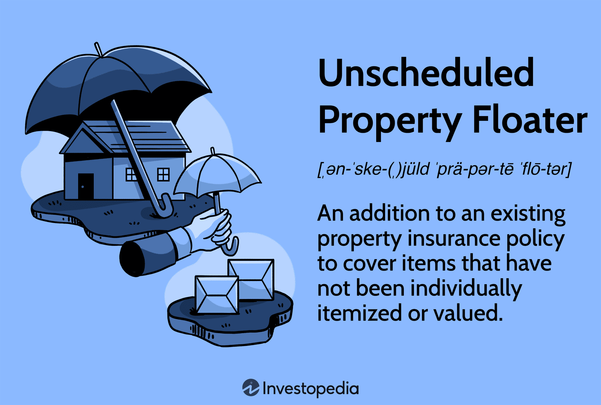

In today’s complex financial landscape, understanding various insurance and trading options is essential for securing assets and optimizing investments. Individuals are increasingly tasked with navigating a myriad of financial products and strategies to safeguard their wealth and improve financial outcomes. This comprehensive guide focuses on two pivotal components—personal property coverage insurance and algorithmic trading—and explores how they can jointly form holistic financial strategies.

Personal property coverage insurance is a fundamental tool for protecting valuable assets against risks such as theft, loss, or damage. Within this domain, unscheduled property floaters provide a flexible approach to ensuring coverage without the need for excessive documentation or individual valuation of personal items. This aspect of insurance is particularly advantageous for homeowners and renters who wish to cover a broad array of belongings efficiently.



Simultaneously, the rapid evolution of financial markets has led to the prominence of algorithmic trading. This technique employs sophisticated algorithms to make trading decisions and execute trades at high speed with minimal human intervention. Such methods offer enhanced trading efficiency and have the potential to yield higher returns through systematic and automated processes.

While these topics may appear unrelated, both unscheduled property floaters and algorithmic trading offer strategies for enhancing financial security and growth. Homeowners can leverage insurance to protect their physical assets, while investors utilize algorithmic trading to optimize their market activities. When these strategies are combined, they provide a comprehensive approach to financial management, balancing risk mitigation with asset growth. This guide aims to provide valuable insights to both protectors of personal assets and investors seeking to maximize market potential.

## Table of Contents

## Understanding Personal Property Coverage Insurance

Personal property coverage insurance safeguards personal items against risks such as theft, loss, or damage. Typically integrated into homeowner or renter’s insurance policies, this coverage extends to various categories of unscheduled personal properties, including clothing, electronics, and household items. 

The core function of this type of insurance is to address the financial impact of unforeseen events that may damage or result in the loss of personal belongings. Homeowners and renters alike benefit from the peace of mind that comes with knowing their personal possessions are protected up to the policy limits.

Unscheduled property floaters play an important role in this insurance framework. These floaters allow for broader coverage without requiring itemization of each individual possession under the policy. This flexibility is significant because standard home insurance policies often impose specific sub-limits on particular categories of items. For instance, jewelry, art, or certain electronics might have limited coverage under the primary policy. By leveraging unscheduled property floaters, policyholders can ensure coverage for these items without the need for detailed lists or appraisals, thereby increasing the aggregate limits available for their possessions.

Moreover, the comprehensive nature of unscheduled property floaters makes them especially valuable for common household goods and frequently purchased electronics, where detailed inventories would be impractical. This broader coverage can often complement scheduled property floaters, which are used for high-value items requiring precise appraisal and documentation.

Overall, understanding the nuances of personal property coverage insurance and the strategic use of unscheduled property floaters allows individuals to secure adequate protection for their personal assets, providing a flexible and effective solution to potential risks associated with personal property.

## The Role of Unscheduled Property Floaters

Unscheduled property floaters provide a comprehensive solution for individuals looking to safeguard their personal belongings without the necessity of itemizing each possession in their insurance policy. This option is particularly advantageous for those with numerous items or frequently changing inventory, such as electronics and general household goods, where individually listing each piece would be impractical and cumbersome.

The primary role of unscheduled property floaters is to address and bridge the gaps inherent in standard insurance policies, which often impose sub-limits on jewelry, electronics, and similar high-value categories. For example, a typical homeowner's policy might limit coverage for theft of jewelry to $1,500, regardless of the aggregate value of the items, which could significantly exceed this limit. Unscheduled floaters circumvent this limitation by offering a blanket level of coverage without needing to specify items individually, thus providing more comprehensive protection.

By eliminating the requirement for detailed itemization, unscheduled floaters increase the aggregate coverage limits, offering higher financial security for a broad range of assets. This flexibility not only simplifies the policyholder's task of managing numerous possessions but also ensures that newly acquired items are automatically covered without the necessity for updates or amendments to the policy. Therefore, unscheduled floaters are particularly beneficial for individuals with dynamic lifestyles, who routinely purchase and dispose of personal items, ensuring continuous and adaptable protection.

## Comparing Scheduled and Unscheduled Property Floaters

Scheduled property floaters require policyholders to provide detailed listings of each item's value and often necessitate individual appraisals. This type of coverage is particularly suited for high-value possessions such as jewelry, fine art, antiques, and collectibles, where the precise valuation ensures comprehensive protection. By itemizing and accurately documenting the value of each item, scheduled floaters offer tailored coverage that addresses the specific risks associated with individual high-value items. 

Conversely, unscheduled property floaters provide a more generalized coverage approach. These floaters are designed to cover a wide range of items under a single policy without the need for individual itemization. This makes them especially suitable for common household goods and frequently purchased electronics, such as smartphones, laptops, and furniture. Unscheduled floaters provide flexibility and ease since they protect against loss, theft, or damage to items that may not warrant individual valuation but collectively hold significant value.

Policyholders can achieve maximal coverage by employing both scheduled and unscheduled property floaters in tandem. This dual strategy allows individuals to protect their high-value assets with specific appraisals while also safeguarding everyday items that comprise the bulk of their personal possessions. By leveraging both floater types, individuals can ensure that their entire range of belongings is adequately insured, thereby optimizing their protection strategy within their personal property coverage insurance.

## Basics of Algorithmic Trading

Algorithmic trading is a method of executing trades using predefined criteria based on advanced mathematical models and algorithms. This approach seeks to optimize efficiency and reduce the impact of human error by allowing computers to analyze a plethora of data swiftly and execute trades at speeds far beyond human capability.

At its core, [algorithmic trading](/wiki/algorithmic-trading) involves the use of complex algorithms that process data to make trading decisions. These decisions can include determining the timing, price, and quantity of trades. Algorithms are designed to identify potential trading opportunities by recognizing trends, patterns, or signals within financial markets. Common strategies employed include [trend following](/wiki/trend-following), [arbitrage](/wiki/arbitrage), and market-making.

One of the main advantages of algorithmic trading is its ability to minimize human error. Human traders are prone to emotional decisions, fatigue, and bias, which can affect the effectiveness of trading decisions. By utilizing algorithms, trading decisions are consistent and based solely on the criteria set within the trading model. This consistency enhances the ability to follow a disciplined trading strategy and adheres to a strict trading plan.

Algorithmic trading also promises greater operational efficiency. Automated systems can analyze multiple data points across various markets with precision, reacting instantaneously to market changes. This capability is vital in high-frequency trading ([HFT](/wiki/high-frequency-trading-strategies)), where the ability to execute a large [volume](/wiki/volume-trading-strategy) of orders in extremely short timeframes can lead to significant profit opportunities. Algorithms can operate round the clock, monitoring markets continuously and placing trades whenever the conditions defined in the algorithm are met.

Moreover, algorithmic trading has the potential to increase returns. By enabling the swift analysis of market data, algorithms can identify emergent trends and capitalize on them faster than humans. Additionally, these systems can execute complex strategies that humans would find difficult to perform due to the rapid execution and computational complexity required.

In implementing algorithmic trading, programming languages such as Python are widely utilized due to their extensive libraries and ease of use. For instance, a simple moving average crossover strategy—a common trading strategy—can be programmed in Python as follows:

```python
import pandas as pd
import numpy as np

# Assuming 'data' is a DataFrame containing historical stock prices
short_window = 40
long_window = 100

# Compute short and long moving averages
data['Short_MA'] = data['Close'].rolling(window=short_window, min_periods=1).mean()
data['Long_MA'] = data['Close'].rolling(window=long_window, min_periods=1).mean()

# Generate signals
data['Signal'] = 0.0
data['Signal'][short_window:] = np.where(data['Short_MA'][short_window:] > data['Long_MA'][short_window:], 1.0, 0.0)

# Generate trading orders
data['Position'] = data['Signal'].diff()

# Outputting the trading signals
data[['Close', 'Short_MA', 'Long_MA', 'Signal', 'Position']].tail()
```

In conclusion, algorithmic trading offers significant advantages including reducing human error, increasing efficiency, and potentially improving returns. Its growing popularity in the financial markets speaks to its effectiveness as a tool for optimizing trading strategies in a fast-paced trading environment.

## Synergies Between Personal Property Coverage and Algo Trading

Both personal property coverage insurance and algorithmic trading play crucial roles in enhancing an individual's financial security and growth prospects. While they operate in different domains, their combined strategic deployment offers a robust approach to safeguarding assets and capitalizing on investment opportunities.

Personal property insurance is a safeguard against unforeseen incidents such as theft or damage, ensuring that valuables are protected and financial losses are minimized. This type of insurance provides a safety net that secures an individual's possessions, contributing to overall financial stability. On the other hand, algorithmic trading automates the investment process, utilizing sophisticated algorithms and models to execute trades efficiently. This trading method leverages extensive market analysis and high-speed execution, aiming to maximize profits while minimizing human error.

The combination of these two financial instruments creates a dual strategy that balances risk management with active investment growth. Insurance acts as a defense mechanism, preserving wealth and providing confidence that personal assets are protected against unpredictable incidents. Meanwhile, algorithmic trading serves as an offensive strategy, enabling disciplined, automated investment that seeks to enhance wealth by seizing profitable market opportunities.

In practical terms, this synergy ensures that while insurance covers potential losses from adverse events, algorithmic trading capitalizes on favorable market conditions, creating a comprehensive approach to financial management. The algorithmic trading process can be exemplified by the following Python pseudocode snippet, which showcases the basic structure of a trading algorithm:

```python
def trading_algorithm(market_data):
    # Predefined trading variables
    entry_threshold = 0.05
    exit_threshold = 0.03
    position = None

    for data in market_data:
        # Analyze market data and make decisions
        if position is None:
            # Entry condition
            if data.signal_strength > entry_threshold:
                position = 'Buy'
                execute_trade(position, data.price)
        else:
            # Exit conditions
            if position == 'Buy' and data.signal_strength < exit_threshold:
                position = None
                execute_trade('Sell', data.price)

def execute_trade(action, price):
    # Placeholder for trading execution process
    print(f"Executing {action} at price {price}")

# Example market data input
market_data = [
    {'signal_strength': 0.06, 'price': 150},
    {'signal_strength': 0.04, 'price': 155},
    {'signal_strength': 0.02, 'price': 160},
]

trading_algorithm(market_data)
```

This code represents a simplified algorithm designed to enter and [exit](/wiki/exit-strategy) trades based on predefined market signals, thereby illustrating the automation and strategic decision-making involved in algorithmic trading. By integrating such automated trading strategies with personal property insurance, individuals can protect their existing assets while strategically pursuing new gains, achieving a balanced and comprehensive financial strategy.

## Conclusion

Incorporating unscheduled property floaters into a comprehensive financial strategy alongside algorithmic trading can significantly enhance financial security and growth potential. Unscheduled property floaters, by offering broad coverage without detailed itemization, provide a safeguard against unforeseen losses. This form of insurance ensures that personal assets are protected from potential risks, such as theft or damage, without the need to list every individual item, thus ensuring greater peace of mind.

Simultaneously, algorithmic trading stands at the forefront of modern investment practices. By employing advanced algorithms to make rapid and informed trading decisions, investors can capitalize on market opportunities with high precision. This method enhances the potential for optimized returns by minimizing human error and making data-driven decisions swiftly.

Together, these two components form a dual strategy that not only protects assets but also allows for strategic growth of wealth. Being well-versed in both unscheduled property floaters and algorithmic trading equips individuals with the knowledge to make informed decisions tailored to their financial goals. This holistic approach underscores the importance of understanding a variety of financial products and leveraging them to achieve a secure and prosperous financial future. This article highlights the critical role of integrating diverse financial tools to build a robust and flexible financial plan.

## Additional Resources

Explore Investopedia’s guides on property insurance and algorithmic trading for in-depth knowledge, as these resources provide comprehensive insights and various perspectives crucial for making informed decisions. For individuals seeking a more personalized approach to financial management, consulting financial advisors is advisable. They can help tailor insurance policies and trading strategies to align with specific needs and risk tolerances.

Keeping abreast of the latest trends and analyses in both insurance and trading sectors is vital. Reputable financial news outlets such as Bloomberg, The Wall Street Journal, and Financial Times regularly publish updates and expert opinions, aiding investors and policyholders in adjusting their plans and strategies accordingly. Access to current data and expert insights ensures one remains responsive to changes, enhancing the potential for optimized financial outcomes.

## References & Further Reading

[1]: Aronson, D. R. (2007). ["Evidence-Based Technical Analysis: Applying the Scientific Method and Statistical Inference to Trading Signals"](https://onlinelibrary.wiley.com/doi/book/10.1002/9781118268315). Wiley.

[2]: Chan, E. P. (2009). ["Quantitative Trading: How to Build Your Own Algorithmic Trading Business"](https://github.com/ftvision/quant_trading_echan_book). Wiley.

[3]: Jansen, S. (2020). ["Machine Learning for Algorithmic Trading"](https://github.com/stefan-jansen/machine-learning-for-trading). Packt Publishing.

[4]: Lopez de Prado, M. (2018). ["Advances in Financial Machine Learning"](https://www.amazon.com/Advances-Financial-Machine-Learning-Marcos/dp/1119482089). Wiley.

[5]: Protect Your Property. ("The Importance of Unscheduled Personal Property Coverage") [Investopedia Article](https://en.wikipedia.org/wiki/Insurance).

[6]: Womack, B. (2022). ["Understanding Algorithmic Trading and Its Market Implications"](https://www.researchgate.net/publication/378548435_Algorithmic_Trading_and_AI_A_Review_of_Strategies_and_Market_Impact). Investopedia.

[7]: Hull, J. C. (2021). ["Options, Futures, and Other Derivatives"](https://elibrary.pearson.de/book/99.150005/9781292410623) (10th ed.). Pearson.