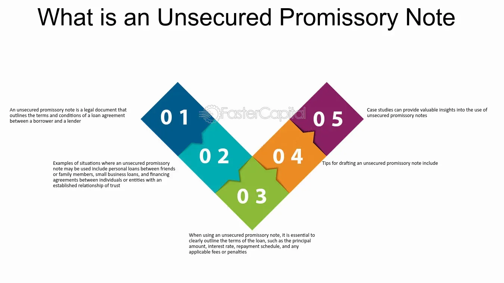

## Table of Contents

## What is an unsecured note?

An unsecured note is a type of loan that a company or person takes out without giving any specific asset as a guarantee. This means if the borrower can't pay back the money, the lender can't take a specific item to cover the loss. Instead, the lender relies on the borrower's promise to pay and their overall financial health.

Because unsecured notes are riskier for lenders, they usually come with higher interest rates compared to secured loans. People and companies might choose unsecured notes when they don't have assets to offer as security or if they want to keep their assets free from liens. Common examples include personal loans, credit cards, and some corporate bonds.

## How does an unsecured note differ from a secured note?

An unsecured note and a secured note are different because of what they use as a guarantee. A secured note has a specific asset, like a house or a car, that the lender can take if the borrower doesn't pay back the money. This makes it safer for the lender, so they often give lower interest rates. On the other hand, an unsecured note doesn't have any specific asset backing it up. The lender has to trust that the borrower will pay back the money, relying only on the borrower's promise and financial health.

Because unsecured notes are riskier for lenders, they usually come with higher interest rates. This is to make up for the extra risk the lender is taking. People or companies might choose unsecured notes if they don't have assets to offer as security or if they want to keep their assets free from any claims. Secured notes are often used for big purchases like homes or cars, while unsecured notes are common for things like credit cards or personal loans.

## What are the main components of an unsecured note?

An unsecured note has a few main parts that are important to understand. The first part is the principal amount, which is the total amount of money being borrowed. This is the amount that needs to be paid back to the lender. Another key part is the [interest rate](/wiki/interest-rate-trading-strategies), which is the cost of borrowing the money. Since unsecured notes are riskier for lenders, they often have higher interest rates than secured notes.

The second paragraph focuses on the terms of repayment. This includes how long the borrower has to pay back the money, which is called the term or maturity of the note. It also includes how often payments need to be made, like monthly or yearly. Lastly, there's usually a section about what happens if the borrower can't pay back the money. This is called the default clause, and it explains the consequences, like the lender being able to take legal action to get their money back.

## Who typically issues unsecured notes?

Unsecured notes are often issued by companies and governments. Companies might use them to raise money for things like expanding their business or paying off other debts. They don't have to give any specific thing as a guarantee, so it's easier for them to get the money they need. Governments also issue unsecured notes, usually in the form of bonds, to help pay for public projects or to manage their budget.

People can also issue unsecured notes, but this is less common. When individuals do this, it's usually through personal loans or credit cards. They don't have to put up any specific item as security, but they still have to pay back the money with interest. Because there's no guarantee, the interest rates are often higher for individuals than for big companies or governments.

## What are the risks associated with investing in unsecured notes?

Investing in unsecured notes can be risky because there's no specific thing the investor can take if the borrower doesn't pay back the money. If the company or person who issued the note runs into money problems, they might not be able to pay back the investors. This means the investor could lose all or part of their money. Because unsecured notes are riskier, they usually offer higher interest rates to make up for the extra risk.

Another risk is that the borrower's overall financial health can change. If a company's business starts to do badly or if a person loses their job, they might not be able to pay back the note. Investors need to look carefully at the borrower's financial situation before deciding to invest. Even then, things can change quickly, and what seemed like a safe investment can become risky.

## How are unsecured notes rated, and why is this important?

Unsecured notes are rated by special companies called credit rating agencies. These agencies look at how likely it is that the borrower will pay back the money. They give the notes a grade, like AAA, AA, A, or lower, to show how safe the investment is. A high grade, like AAA, means it's very likely the borrower will pay back the money. A lower grade, like B or C, means there's more risk that the borrower might not pay back the money.

These ratings are important because they help investors decide if they want to buy the note. If a note has a high rating, more people might want to invest because they think it's safer. But if the note has a low rating, investors might want a higher interest rate to make up for the extra risk. Knowing the rating helps investors understand the risk and make better choices about where to put their money.

## What is the typical interest rate for unsecured notes compared to secured notes?

Unsecured notes usually have higher interest rates than secured notes. This is because they are riskier for the lender. When someone borrows money without offering anything as a guarantee, the lender can't take a specific item if the borrower doesn't pay back the money. So, to make up for this risk, lenders charge higher interest rates on unsecured notes.

Secured notes, on the other hand, have lower interest rates. This is because the lender has something they can take if the borrower can't pay back the money. For example, if you borrow money to buy a car and use the car as a guarantee, the lender can take the car if you don't pay. Because this makes the loan safer for the lender, they don't need to charge as much interest.

## How does the mechanism of repayment work for unsecured notes?

When someone borrows money through an unsecured note, they agree to pay it back over time. The repayment usually follows a schedule set out in the note. This means the borrower might have to make payments every month, every three months, or at some other regular time. Each payment includes part of the money they borrowed, called the principal, and some extra money for the lender, called interest. The interest rate is higher for unsecured notes because there's no specific thing the lender can take if the borrower doesn't pay.

If the borrower can't make the payments, they are in default. This is a big problem because the lender can take legal action to try to get their money back. Since there's no specific thing the lender can take, like a house or a car, they might have to go to court to get the borrower to pay. This can be hard and take a long time. That's why lenders charge more interest on unsecured notes—to make up for the extra risk they're taking.

## Can you explain the legal framework governing unsecured notes?

Unsecured notes are governed by laws and rules that help make sure everyone plays fair. These laws say what the borrower and the lender need to do. When someone borrows money with an unsecured note, they sign a contract that says how much they're borrowing, how much interest they'll pay, and when they need to pay it back. This contract is important because it's a legal promise. If the borrower doesn't pay back the money, the lender can go to court to try to get it back. The laws also say what the lender can do if the borrower doesn't pay, like taking the borrower to court.

Different countries have different rules about unsecured notes. In the United States, for example, the Securities and Exchange Commission (SEC) has rules that companies need to follow if they want to sell unsecured notes to the public. These rules are there to protect people who might want to invest in the notes. They make sure that companies tell the truth about their financial health and the risks of the investment. If a company doesn't follow these rules, they can get in big trouble. So, the legal framework helps keep things honest and fair for everyone involved.

## What role do credit ratings play in the pricing of unsecured notes?

Credit ratings are super important when it comes to deciding how much interest to charge on unsecured notes. These ratings are like grades given by special companies called credit rating agencies. They look at how likely it is that the person or company borrowing the money will pay it back. If a note gets a high rating, like AAA, it means the borrower is really likely to pay back the money. This makes the note safer for investors, so they might be okay with a lower interest rate. But if the note gets a low rating, like B or C, it means there's a bigger chance the borrower might not pay back the money. To make up for this risk, investors will want a higher interest rate.

Because of this, the interest rate on an unsecured note can change a lot depending on its credit rating. A high-rated note will usually have a lower interest rate because it's seen as safer. On the other hand, a low-rated note will have a higher interest rate to make up for the extra risk. This is how credit ratings help set the price for unsecured notes. They give investors a way to understand the risk and decide if the interest rate is worth it for them.

## How do market conditions affect the issuance and performance of unsecured notes?

Market conditions play a big role in how companies and people decide to issue unsecured notes and how well those notes do. When the economy is doing well and people feel confident, it's easier for companies to issue unsecured notes. Investors are more likely to buy them because they think the companies will be able to pay back the money. This means companies can get money at lower interest rates. But if the economy is doing badly, like during a recession, it's harder for companies to issue unsecured notes. Investors are worried and might not want to take the risk, so companies have to offer higher interest rates to get people to buy their notes.

Once the notes are issued, market conditions keep affecting how they perform. If the economy stays strong, the companies that issued the notes are more likely to make money and pay back their debts on time. This makes the notes more valuable, and their prices might go up. But if the economy gets worse, companies might struggle to make money, and it becomes harder for them to pay back their debts. This makes the notes less valuable, and their prices might go down. So, the performance of unsecured notes can go up and down with changes in the economy.

## What advanced strategies can investors use to mitigate risks associated with unsecured notes?

Investors can use a few smart strategies to make unsecured notes less risky. One way is to spread their money around, which is called diversification. Instead of putting all their money into one unsecured note, they can invest in a bunch of different ones. This way, if one company can't pay back their note, it won't hurt the investor too much because they have other notes that might still be doing well. Another strategy is to look at the credit ratings of the notes carefully. By choosing notes with higher ratings, investors can pick ones that are more likely to be paid back on time. It's like [picking](/wiki/asset-class-picking) the safer bets in a game.

Another good strategy is to keep an eye on market conditions and adjust their investments accordingly. If the economy starts to look shaky, investors might want to sell some of their riskier unsecured notes and move their money into safer investments. They can also use something called a bond ladder, where they buy notes that come due at different times. This way, they can get their money back at different points and use it to buy new notes or do something else with it. By being smart and flexible, investors can handle the ups and downs of unsecured notes better and protect their money.

## What are Financial Instruments and How Do We Understand Them?

Financial instruments comprise a broad spectrum of assets that are traded in financial markets. These instruments are categorized into various forms, with debt securities and equity instruments being the primary classifications. Debt securities are essentially financial obligations that require the issuer to pay back a specified sum of money over a designated period. These obligations are used by entities to raise capital for various purposes.

Unsecured notes are a specific type of debt security. Unlike secured notes, which are backed by collateral, unsecured notes lack any asset backing. This absence of collateral escalates the risk associated with these instruments, as there is no asset to claim in case of default by the issuer. Consequently, unsecured notes typically [carry](/wiki/carry-trading) higher interest rates to compensate investors for the increased risk they undertake. The formula that can represent the yield offered by unsecured notes is typically higher than that of secured notes:

$$
\text{Yield}_{\text{unsecured}} > \text{Yield}_{\text{secured}}
$$

Investors interested in unsecured notes must perform diligent evaluations of the issuer’s creditworthiness. The lack of collateral makes these notes contingent upon the issuer's financial health and credit profile, which can fluctuate due to various economic factors. This evaluation process generally involves analyzing the issuer's financial statements, credit ratings, and overall market conditions.

Equity instruments, on the other hand, represent ownership stakes in a company, entitling shareholders to a proportion of the firm's profits, typically in the form of dividends. The risk profile of equity instruments differs from that of debt securities, as equity holders are residual claimants on the firm's assets, meaning they are paid after all debts have been settled in the event of liquidation.

In summary, financial instruments such as unsecured notes play a pivotal role in capital markets by providing entities with flexible options to raise funds. However, the associated risks necessitate thorough credit assessments by investors to ensure informed investment decisions.

## References & Further Reading

[1]: Fabozzi, F. J. (2007). ["Bond Markets, Analysis, and Strategies"](https://books.google.com/books/about/Bond_Markets_Analysis_and_Strategies_ten.html?id=bQpNEAAAQBAJ). Prentice Hall.

[2]: Lopez de Prado, M. (2018). ["Advances in Financial Machine Learning"](https://www.amazon.com/Advances-Financial-Machine-Learning-Marcos/dp/1119482089). Wiley.

[3]: Hull, J. C. (2017). ["Options, Futures, and Other Derivatives"](https://www.semanticscholar.org/paper/Options%2C-Futures%2C-and-Other-Derivatives-Hull/89bdee500c8623864fc9eb7a471546aa713acc44). Pearson.

[4]: Jansen, S. (2020). ["Machine Learning for Algorithmic Trading"](https://github.com/stefan-jansen/machine-learning-for-trading). Packt Publishing.

[5]: Chan, E. P. (2009). ["Quantitative Trading: How to Build Your Own Algorithmic Trading Business"](https://github.com/ftvision/quant_trading_echan_book). Wiley.

[6]: Fabozzi, F. J., & Mann, S. V. (2012). ["The Handbook of Fixed Income Securities"](https://www.mhebooklibrary.com/doi/book/10.1036/9781260473902?contentTab=true). McGraw-Hill Education.

[7]: Black, F., & Scholes, M. (1973). ["The Pricing of Options and Corporate Liabilities."](https://www.cs.princeton.edu/courses/archive/fall09/cos323/papers/black_scholes73.pdf) Journal of Political Economy, 81(3), 637-654.

[8]: MacKenzie, D. (2006). ["An Engine, Not a Camera: How Financial Models Shape Markets."](https://academic.oup.com/mit-press-scholarship-online/book/20588) MIT Press.