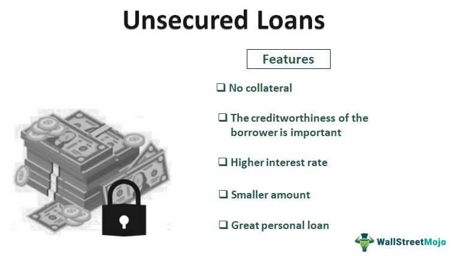

In today's financial landscape, understanding various financial instruments is crucial for effective investment strategies. As investors navigate a complex array of options, debt securities such as unsecured notes stand out for their unique benefits and risks. Unsecured notes are a type of debt security that differs from others due to their lack of collateral backing, making them inherently riskier but often providing higher yields as compensation. The issuer's creditworthiness becomes the key factor in assessing these instruments, emphasizing the need for careful evaluation and risk management.

The trading of financial instruments has significantly evolved with technological advancements, notably through the advent of algorithmic trading. This innovation has transformed markets by introducing automation and precision into trading activities. Algorithmic trading employs complex algorithms to execute trades based on pre-defined criteria, enabling rapid analysis of large data sets and quick decision-making. This approach enhances the efficiency and accuracy of trades, reducing human error and latency. In the context of unsecured notes, algorithmic trading tools allow investors to manage risks more effectively by swiftly responding to market dynamics and volatility.



This article explores the characteristics of unsecured notes, emphasizing their role in investment portfolios and how they differ from other financial instruments. Additionally, it examines how algorithmic trading integrates into the market dynamics of unsecured notes, illustrating the interplay between traditional finance principles and modern technological innovations. The combination of understanding unsecured notes and leveraging algorithmic trading represents a powerful strategy for investors seeking to optimize returns while managing associated risks.

## Table of Contents

## Understanding Financial Instruments

Financial instruments comprise a broad spectrum of assets that are traded in financial markets. These instruments are categorized into various forms, with debt securities and equity instruments being the primary classifications. Debt securities are essentially financial obligations that require the issuer to pay back a specified sum of money over a designated period. These obligations are used by entities to raise capital for various purposes.

Unsecured notes are a specific type of debt security. Unlike secured notes, which are backed by collateral, unsecured notes lack any asset backing. This absence of collateral escalates the risk associated with these instruments, as there is no asset to claim in case of default by the issuer. Consequently, unsecured notes typically carry higher interest rates to compensate investors for the increased risk they undertake. The formula that can represent the yield offered by unsecured notes is typically higher than that of secured notes:

$$
\text{Yield}_{\text{unsecured}} > \text{Yield}_{\text{secured}}
$$

Investors interested in unsecured notes must perform diligent evaluations of the issuer’s creditworthiness. The lack of collateral makes these notes contingent upon the issuer's financial health and credit profile, which can fluctuate due to various economic factors. This evaluation process generally involves analyzing the issuer's financial statements, credit ratings, and overall market conditions.

Equity instruments, on the other hand, represent ownership stakes in a company, entitling shareholders to a proportion of the firm's profits, typically in the form of dividends. The risk profile of equity instruments differs from that of debt securities, as equity holders are residual claimants on the firm's assets, meaning they are paid after all debts have been settled in the event of liquidation.

In summary, financial instruments such as unsecured notes play a pivotal role in capital markets by providing entities with flexible options to raise funds. However, the associated risks necessitate thorough credit assessments by investors to ensure informed investment decisions.

## What is an Unsecured Note?

An unsecured note is a type of debt security that is characterized by the absence of specific collateral backing. Unlike secured debt instruments, which are protected by a pledge of assets to minimize lender risk, unsecured notes rely solely on the issuer's creditworthiness and financial stability to assure investors of repayment. This lack of tangible security makes unsecured notes inherently riskier compared to secured notes. Consequently, issuers often compensate for this increased risk by offering higher interest rates to attract investors.

Interest rates on unsecured notes are typically higher than those on comparable secured notes or bonds. The additional yield presented by unsecured notes serves as an incentive for investors to bear the increased default risk associated with the absence of collateral. The financial health of the issuer is therefore of paramount importance, with credit ratings serving as key indicators of default risk. Investment decisions often incorporate these credit assessment metrics, influencing both the pricing of unsecured notes and the portfolio strategies adopted by investors.

The issuer's credit rating, a dynamic measure of its creditworthiness, plays a crucial role in the issuance and attractiveness of unsecured notes. It is a vital determinant of the risk premium required by investors, with lower credit ratings usually necessitating higher interest rates to offset the perceived risk. Credit ratings are subject to change over time due to various factors, such as shifts in the issuer’s financial performance, operational environment, or macroeconomic conditions, further influencing the relative risk and yield of unsecured notes.

Due to the volatile nature of an issuer’s creditworthiness, the market for unsecured notes can experience significant fluctuations in value. Investors often actively monitor credit rating agencies’ assessments and market conditions to make informed decisions about the acquisition or sale of unsecured notes. The interplay between yield, credit risk, and market dynamics necessitates vigilant analysis and strategic management of these debt securities within investment portfolios.

## Algorithmic Trading in Financial Markets

Algorithmic trading employs sophisticated computer algorithms to automate trading processes, significantly boosting speed and efficiency across financial markets. These algorithms are designed to perform high-frequency trading by assessing large volumes of market data in real-time, enabling traders to quickly identify and capitalize on pricing inefficiencies. As such, [algorithmic trading](/wiki/algorithmic-trading) minimizes human intervention, thereby reducing the lag between decision-making and trade execution.

In the context of unsecured notes, algorithmic trading becomes particularly beneficial due to its capacity to rapidly process extensive data sets that cover various market factors including interest rates, issuer credit ratings, and [liquidity](/wiki/liquidity-risk-premium) conditions. This capability allows for enhanced decision-making by providing traders with timely and precise information that is crucial for managing the increased risks associated with unsecured notes.

The implementation of [machine learning](/wiki/machine-learning) models within algorithmic trading systems further enhances their efficiency. Machine learning algorithms can identify patterns and trends in historical and real-time data, which traditional trading methods may overlook. This capability not only improves the assessment of existing market conditions but also aids in forecasting potential market shifts, thereby optimizing investment strategies.

Consider a simple Python example where an algorithm processes and analyzes real-time data to decide whether to buy or sell unsecured notes:

```python
import numpy as np
import pandas as pd

# Example algorithm setup
def analyze_market_data(data):
    # Simulate simple moving average crossover
    short_window = 40
    long_window = 100
    signals = pd.DataFrame(index=data.index)
    signals['signal'] = 0.0

    # Generate the short and long moving averages
    signals['short_mavg'] = data['close'].rolling(window=short_window, min_periods=1, center=False).mean()
    signals['long_mavg'] = data['close'].rolling(window=long_window, min_periods=1, center=False).mean()

    # Create signals - Buy when short MA crosses above long MA, otherwise sell
    signals['signal'][short_window:] = np.where(
        signals['short_mavg'][short_window:] > signals['long_mavg'][short_window:], 1.0, 0.0)

    return signals

# Sample real-time market data for unsecured notes
data = pd.read_csv('market_data.csv')  # This would include real-time data in practice
trade_signals = analyze_market_data(data)
```

In this example, the algorithm generates buy signals when the short-term moving average of a security's closing prices crosses above its long-term moving average, and sell signals when the opposite occurs. Such strategies benefit from the algorithm's ability to promptly analyze market data and adjust strategies without human emotion or bias, ultimately enhancing trading efficiency and execution.

Thus, algorithmic trading is a transformative force in the financial markets. It provides a competitive edge by enabling the rapid analysis and execution of trades, which is particularly beneficial in managing complex instruments like unsecured notes.

## Benefits and Risks of Unsecured Notes

Unsecured notes are attractive to investors primarily due to the higher yield they offer, serving as compensation for the elevated risk associated with the lack of collateral. This potential for increased returns can be particularly appealing in a low-interest-rate environment, where investors seek opportunities to enhance their income streams. However, unsecured notes also come with significant risks that must be carefully considered.

The foremost risk associated with unsecured notes is credit risk, which entails the possibility of the issuer defaulting on their payment obligations. Since unsecured notes are not backed by any specific assets, the investor's security is heavily dependent on the issuer's creditworthiness and financial stability. To gauge this risk, investors typically scrutinize the issuer's credit rating, financial statements, and overall market conditions. A downgrade in the issuer's credit rating can lead to a decline in the value of the notes, reflecting the increased perceived risk by the market.

Market liquidity is another critical [factor](/wiki/factor-investing) influencing the risk profile of unsecured notes. Liquidity refers to how quickly and easily an asset can be converted into cash without significantly affecting its market price. Unsecured notes, especially those from smaller or less well-known issuers, may suffer from lower liquidity. This can pose a challenge for investors who may need to sell their holdings quickly, as a less liquid market could result in unfavorable pricing or a delay in executing the sale.

Interest rate fluctuations further compound the risks associated with unsecured notes. Generally, when interest rates rise, the value of existing debt securities tends to fall, particularly those with fixed interest payments like unsecured notes. This inverse relationship stems from the fact that new debt issues may offer higher yields in line with the elevated interest rates, rendering existing lower-yield notes less attractive. Consequently, investors in unsecured notes must be vigilant about future [interest rate](/wiki/interest-rate-trading-strategies) movements, as these can significantly impact their investment's value.

In summary, while the potential for higher yields makes unsecured notes an enticing option, they present considerable risks. These include credit risk, the challenge of market liquidity, and the effects of interest rate fluctuations. As such, investors should conduct thorough due diligence and consider employing risk mitigation strategies to safeguard their investment portfolios when engaging with these financial instruments.

## Integrating Algorithmic Trading with Unsecured Notes

Algorithmic trading has emerged as a powerful tool in optimizing the trading of unsecured notes by utilizing advanced computational techniques to analyze historical data and real-time market information. Algorithms can swiftly identify patterns and trends that may not be apparent to human traders, enabling more informed decision-making processes. This capability is particularly advantageous in the unsecured notes market, where the creditworthiness of issuers and interest rate [volatility](/wiki/volatility-trading-strategies) can significantly impact investment outcomes.

One of the key methods employed in algorithmic trading is predictive analytics. By assessing vast amounts of historical credit data and current market trends, algorithms can anticipate potential market changes more accurately. For instance, if interest rates are projected to rise, algorithms can adjust their positions on unsecured notes accordingly to mitigate potential risks or capitalize on anticipated returns. Similarly, if an issuer's credit rating is expected to be downgraded, algorithms can promptly rebalance portfolios to minimize exposure to depreciating assets.

Furthermore, high-frequency trading ([HFT](/wiki/high-frequency-trading-strategies)), a subset of algorithmic trading, plays a crucial role in enhancing market liquidity and efficiency for unsecured notes. HFT algorithms are designed to execute a large number of trades at extremely high speeds. They can facilitate rapid buying and selling of unsecured notes, thereby increasing the market's liquidity and allowing for more stable and fair pricing. The efficiency brought about by HFT can also reduce the bid-ask spreads, further benefiting investors seeking to trade in these financial instruments.

Here's an example of simple Python code using a predictive model that might be part of an algorithmic strategy to adjust holdings based on forecasted interest rates:

```python
import numpy as np
from sklearn.linear_model import LinearRegression

# Sample historical data for interest rates
interest_rates = np.array([[1.5], [1.7], [1.8], [2.0], [2.3]])
# Corresponding positions in unsecured notes
positions = np.array([100, 95, 90, 85, 80])

# Creating and training the model
model = LinearRegression().fit(interest_rates, positions)

# Predicting future position adjustments based on new interest rate
new_rate = np.array([[2.5]])
predicted_position = model.predict(new_rate)

print(f"Predicted position adjustment for interest rate {new_rate[0][0]}: {predicted_position[0]}")
```

This illustrative code snippet demonstrates how an algorithm can predict position adjustments based on changes in interest rates, which directly impact the valuation of unsecured notes. By leveraging such algorithmic strategies, traders can enhance their ability to navigate the complexities of unsecured notes, making them a more viable option in a diversified investment portfolio.

## Conclusion

Unsecured notes represent a crucial segment within debt security markets, characterized by their potential for high yields that often accompany higher risk profiles. These instruments stand out due to their lack of collateral backing, which shifts the focus onto the issuer's creditworthiness and affects the overall risk assessment for investors.

The integration of algorithmic trading into the management and trade of unsecured notes has significantly transformed traditional practices. By employing sophisticated algorithms, market participants can execute trades with enhanced speed and precision, thereby improving efficiency in the market. This technological advancement facilitates the handling of vast amounts of data, enabling the generation of insights and predictions that are beyond human capabilities. As a result, algorithmic trading not only aids in optimizing trading strategies but also contributes to better liquidity and pricing mechanisms for unsecured notes.

Investors seeking to capitalize on the opportunities presented by unsecured notes must adopt an informed approach, weighing the inherent risks against potential returns. Credit risk, interest rate volatility, and market liquidity are among the factors that demand careful scrutiny. Employing advanced trading strategies, inclusive of algorithmic components, allows investors to navigate these complexities more effectively. By leveraging technology, investors can better anticipate market shifts, adjust portfolio allocations, and mitigate risks associated with credit rating changes or economic fluctuations.

In conclusion, unsecured notes offer a compelling yet challenging investment landscape. The advent of algorithmic trading has not only streamlined processes but also made the market more accessible to a broader range of investors. Engaging with these instruments requires a balanced assessment of risks and rewards, supported by the strategic application of advanced trading methodologies to optimize returns.

## References & Further Reading

[1]: Fabozzi, F. J. (2007). ["Bond Markets, Analysis, and Strategies"](https://books.google.com/books/about/Bond_Markets_Analysis_and_Strategies_ten.html?id=bQpNEAAAQBAJ). Prentice Hall.

[2]: Lopez de Prado, M. (2018). ["Advances in Financial Machine Learning"](https://www.amazon.com/Advances-Financial-Machine-Learning-Marcos/dp/1119482089). Wiley.

[3]: Hull, J. C. (2017). ["Options, Futures, and Other Derivatives"](https://www.semanticscholar.org/paper/Options%2C-Futures%2C-and-Other-Derivatives-Hull/89bdee500c8623864fc9eb7a471546aa713acc44). Pearson.

[4]: Jansen, S. (2020). ["Machine Learning for Algorithmic Trading"](https://github.com/stefan-jansen/machine-learning-for-trading). Packt Publishing.

[5]: Chan, E. P. (2009). ["Quantitative Trading: How to Build Your Own Algorithmic Trading Business"](https://github.com/ftvision/quant_trading_echan_book). Wiley.

[6]: Fabozzi, F. J., & Mann, S. V. (2012). ["The Handbook of Fixed Income Securities"](https://www.mhebooklibrary.com/doi/book/10.1036/9781260473902?contentTab=true). McGraw-Hill Education.

[7]: Black, F., & Scholes, M. (1973). ["The Pricing of Options and Corporate Liabilities."](https://www.cs.princeton.edu/courses/archive/fall09/cos323/papers/black_scholes73.pdf) Journal of Political Economy, 81(3), 637-654.

[8]: MacKenzie, D. (2006). ["An Engine, Not a Camera: How Financial Models Shape Markets."](https://academic.oup.com/mit-press-scholarship-online/book/20588) MIT Press.