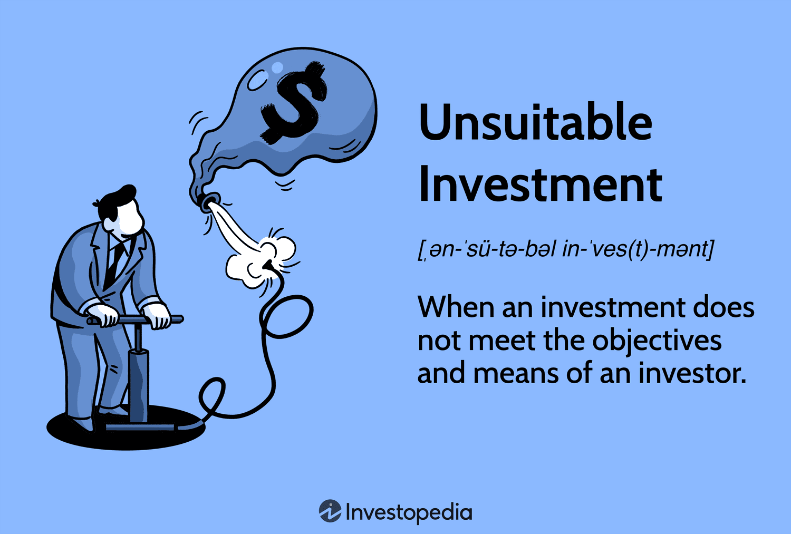

Understanding the landscape of financial investments is crucial, yet the concept of financial suitability is often overlooked. Financial suitability refers to the alignment between an investment product and an individual investor's financial goals, risk tolerance, and personal circumstances. It serves as a foundational principle in investment management, ensuring that the investor's requirements are appropriately matched with investment recommendations.

When investments are unsuitable—whether due to mismatches in risk tolerance, financial objectives or investment horizons—investors can be exposed to significant financial risks. These risks are not merely theoretical but can manifest in substantial financial losses, which may erode the trust and confidence of investors in financial markets and institutions.



Recently, the rise of algorithmic trading has added a layer of complexity to the dynamics of investment suitability. Algorithmic trading uses computer programs to execute trades automatically based on predetermined criteria, offering benefits such as speed and reduced transaction costs. However, its implementation presents challenges in maintaining suitability. Algorithms can lead to unintended trading outcomes if not aligned carefully with an investor's profile, due to their reliance on predefined criteria rather than nuanced, contextual decision-making that may be required in assessing suitability.

This article explores the threats posed by unsuitable investments, particularly within the context of algorithmic trading. As investments become more automated, understanding the implications of these advancements on suitability is essential for both investors and financial professionals. By addressing these concerns, investors can better safeguard their financial interests and ensure their investment portfolios are aligned with their personal financial landscapes.

## Table of Contents

## Understanding Financial Suitability

Financial suitability is a fundamental concept in the investment industry, focusing on the alignment between an investment product and an investor's financial objectives, risk tolerance, and unique circumstances. It ensures that financial products recommended by advisors or firms are appropriate for the individual investor, minimizing the likelihood of financial distress and dissatisfaction.

Central to financial suitability are the regulations established by bodies such as the Financial Industry Regulatory Authority (FINRA) and the Securities and Exchange Commission (SEC) in the United States. These institutions play a critical role in protecting investors by enforcing compliance with suitability standards. The overarching goal of these regulations is to ensure that investment recommendations are made with due consideration of an investor's best interests, and not merely for institutional profit.

Key factors that firms must evaluate to ensure investment suitability include:

1. **Age**: The investor’s age can significantly influence investment strategy. Younger investors might have a higher risk tolerance because they have more time to recover from potential losses. Conversely, older investors might prefer conservative investments that provide more stability.

2. **Financial Situation**: This encompasses the investor's income, expenses, assets, and liabilities. A comprehensive understanding of an investor's financial health is crucial for determining which investment products might be suitable. For instance, an individual with limited financial resources might not be suited for high-risk investments.

3. **Investment Objectives**: These are the goals an investor aims to achieve through their investments—such as capital growth, income generation, or preservation of capital. Understanding these objectives helps in selecting suitable investment products that align with the investor's expectations and plans.

Firms are required to conduct thorough assessments of these factors to tailor investment strategies that meet investors' needs. The lack of such diligence can lead to the purchase of unsuitable investments, resulting in potential financial losses or unmet financial goals for the individual investor. As such, ensuring financial suitability is a foundational practice that safeguards both the investor and the integrity of financial markets.

## Risks of Unsuitable Investments

Unsuitable investments pose substantial risks that can significantly impact an investor's financial standing and emotional well-being. These risks, if not carefully managed, can manifest in various forms, leading to detrimental outcomes for investors. At the core of these risks is the potential for significant financial losses. Investors engaging in unsuitable investments are vulnerable to losing capital, particularly if they are exposed to market segments that do not align with their risk tolerance or financial goals.

For instance, high-risk investments are often inappropriate for conservative investors who prioritize capital preservation over high returns. These can include investments in volatile markets or speculative assets such as options, futures, or certain stocks that exhibit substantial price fluctuations. Such investments can erode the investor's trust in financialmarkets and advisory services, particularly if these choices result in unanticipated financial setbacks. The suitability of an investment depends heavily on the investor's risk tolerance—a subjective measure that assesses how much risk an investor is willing to accept in their portfolio.

Conversely, younger investors with longer time horizons might inadvertently find themselves in overly conservative products, such as fixed-income securities or money market funds. While these are generally considered safe, their lower yield potentials may not meet the future financial aspirations or growth expectations of these investors, leading to opportunity costs where potential growth is sacrificed for perceived safety. This misalignment occurs when investment strategies are inadequately assessed and fail to consider the investor's unique financial picture and future objectives.

Inadequate assessment and poorly aligned strategies exacerbate financial vulnerabilities by failing to address the investor's specific needs. Financial advisors and firms may overlook critical personal factors, or clients may not articulate their financial objectives clearly, leading to investment selections that increase exposure to risks incompatible with the individual's overall financial plan. This lack of alignment between investment products and personal financial circumstances often results in financial distress, as well as emotional strain, impacting the investor's psychological well-being.

In summary, unsuitable investments not only threaten the financial health of investors but also undermine the trust integral to the advisor-client relationship and can result in excessive stress and dissatisfaction. Therefore, a thorough assessment that aligns investment strategies with individual financial situations and objectives is crucial in mitigating these risks.

## Algorithmic Trading and Suitability

Algorithmic trading uses complex computer algorithms to automate the execution of large trading orders with minimal human intervention. This technology offers undeniable advantages, such as increased trading speed, enhanced market [liquidity](/wiki/liquidity-risk-premium), and reduced costs. By employing [algorithmic trading](/wiki/algorithmic-trading), financial institutions can execute orders with precision and efficiency that manual trading cannot match. However, these advantages come with the challenge of maintaining investment suitability, a critical [factor](/wiki/factor-investing) for responsible trading practices.

The primary concern with algorithmic trading is its potential to compromise investment suitability. Investment suitability is the alignment of a financial product with an investor's particular circumstances, objectives, and risk tolerance. In a human-driven trading environment, investment advisors manually match clients' profiles with appropriate investment opportunities. However, algorithmic systems might not always incorporate the nuanced understanding required to evaluate each investor's suitability profile comprehensively.

Algorithmic trading systems function on pre-set criteria, often focused on market data, pricing models, or technical indicators. These criteria might not adequately factor in the individual characteristics and risk appetites of investors, making it possible for trades that deviate from an investor's suitability profile to occur. For instance, a conservative investor might be inadvertently exposed to high-risk derivatives unsuitable given their financial goals and risk tolerance.

To mitigate these risks, it is imperative that algorithms are designed with robust suitability checks. This requires the integration of sophisticated algorithms that assess investor profiles and align trading strategies with these profiles. Such systems must dynamically evaluate investments based on variables such as age, financial status, risk tolerance, and investment objectives.

Python's data analytics and [machine learning](/wiki/machine-learning) libraries present a promising solution for developers working to enhance algorithmic trading systems. By utilizing libraries such as pandas for data analysis and scikit-learn for predicting suitability through classification models, developers can incorporate investor-specific parameters into the algorithmic decision-making process. For example:

```python
import pandas as pd
from sklearn.model_selection import train_test_split
from sklearn.ensemble import RandomForestClassifier

# Load investor data
# Assume data contains columns ['age', 'financial_status', 'risk_tolerance', 'investment_objectives']
data = pd.read_csv('investor_profiles.csv')

# Features and target variable
X = data[['age', 'financial_status', 'risk_tolerance', 'investment_objectives']]
y = data['suitability_score']

# Split the data into training and testing sets
X_train, X_test, y_train, y_test = train_test_split(X, y, test_size=0.2, random_state=42)

# Train a model to predict suitability
model = RandomForestClassifier()
model.fit(X_train, y_train)

# Predict suitability score
predictions = model.predict(X_test)
```

In conclusion, while algorithmic trading provides significant benefits for modern markets, it is essential to ensure that trading systems incorporate comprehensive mechanisms to evaluate and maintain investment suitability. The integration of advanced data analytics and machine learning can significantly enhance these capabilities, ensuring that algorithmic trading systems not only perform efficiently but also align with individual investor needs and regulatory requirements.

## Regulatory Frameworks and Their Role

Regulatory frameworks play a critical role in ensuring the suitability of investment practices, forming a protective barrier against the potential risks posed by unsuitable investments. These frameworks guide the financial industry by setting standards that align investment products with investors' specific financial goals, risk tolerance, and circumstances.

In the United States, the regulation of investment practices is primarily managed by two bodies: the Financial Industry Regulatory Authority (FINRA) and the Securities and Exchange Commission (SEC). FINRA is a self-regulatory organization that oversees broker-dealers, ensuring they comply with rules designed to protect investors. One of the key rules from FINRA is the Suitability Rule, which mandates that brokers must have a reasonable basis to believe that a recommendation of a security or investment strategy is suitable for a customer. This assessment is based on the customer's investment profile, including factors such as age, financial situation and needs, tax status, investment objectives, experience, time horizon, liquidity needs, and risk tolerance.

The SEC, on the other hand, enforces federal securities laws and regulates securities markets. It complements FINRA's efforts by ensuring that the transparency and integrity of the securities markets are maintained, thus protecting investors. The SEC's Regulation Best Interest (Reg BI) further enhances investor protection by requiring broker-dealers to act in the best interest of a retail customer when making a recommendation, without placing the financial or other interests of the broker-dealer ahead of the customer.

In the European Union, the Markets in Financial Instruments Directive II (MiFID II) serves a similar function. MiFID II aims to increase transparency across the EU's financial markets and standardize the regulatory disclosures required for firms. It enforces stringent suitability requirements, compelling firms to assess and ensure that the financial instruments and investment services provided are aligned with the clients' profiles. This directive seeks to ensure a higher level of protection for investors, especially retail clients, through better transparency, better reporting, and more stringent rules on product governance.

Firms operating within these jurisdictions must adapt their operations to comply with these regulatory frameworks to mitigate the risks of unsuitable investments. This often involves implementing rigorous internal policies and training programs to ensure that staff are well-equipped to assess investment suitability correctly. The adaptation extends to integrating technology, such as AI and machine learning, to better analyze and align financial products with investor profiles, ensuring compliance with regulatory requirements while serving the clients' best interests.

Overall, regulatory frameworks are indispensable in upholding the standards of financial suitability. They not only provide a structured guideline for firms to operate within but also serve as a safeguard ensuring that investors are offered products and services that genuinely align with their financial needs and circumstances.

## The Role of Technology in Ensuring Suitability

Technology, particularly [artificial intelligence](/wiki/ai-artificial-intelligence) (AI) and machine learning, plays an integral role in ensuring investment suitability by analyzing complex datasets to tailor financial strategies to individual needs. AI algorithms assess a broad range of variables, including market trends and historical data, to predict future performance and match investments with the appropriate risk profile. Machine learning techniques learn from this data to continuously improve the customization of investment strategies, ensuring that they align with the investor's goals and risk tolerance.

Robo-advisors have become increasingly popular in personal finance, revolutionizing how investment advice is delivered. These digital platforms use AI to automate the process of financial advice, offering personalized portfolio management with minimal human intervention. By evaluating an investor’s financial situation and preferences, robo-advisors recommend diversified portfolios designed to meet individual risk profiles. This approach not only provides efficiency and reduced costs but also limits human biases in the decision-making process. For example, a robo-advisor may reallocate assets if an investor’s risk tolerance changes or if significant market shifts occur.

Blockchain technology further enhances transparency and accountability, critical components of financial suitability. By maintaining an immutable record of all transactions, blockchain ensures that investments adhere to predefined suitability criteria, allowing for easier audits and compliance checks. Each step of an investment transaction can be tracked, offering confidence that recommendations are aligned with suitability requirements. Smart contracts, built on blockchain, can automate compliance processes by executing actions only when certain conditions, reflecting suitability metrics, are met. This level of automation and transparency helps reduce the chances of misaligned investments and potential disputes.

The integration of advanced technologies marks a significant evolution in the investment landscape. These tools not only provide enhanced methods for ensuring the suitability of investments but also empower investors with data-driven insights, enhancing their decision-making capabilities. By leveraging AI, machine learning, and blockchain, both investors and firms can achieve a more accurate alignment of investment products with financial goals and risk appetites.

## Addressing Unsuitable Investment Risks

Investors play a critical role in ensuring their investment choices align with their financial goals and risk tolerance. A proactive approach begins with a thorough self-assessment of financial status, which encompasses understanding net worth, liquidity requirements, and income stability. This assessment helps in identifying a suitable investment strategy, reducing the likelihood of engaging in unsuitable investments that could result in financial distress.

Collaborating with informed financial advisors can provide invaluable insights. These professionals are adept at analyzing intricate financial landscapes and can offer recommendations that adhere to regulatory guidelines while fulfilling investor needs. They can develop tailored investment plans that align precisely with an investor's risk profile and future objectives.

Staying informed is another essential aspect of mitigating unsuitable investment risks. Investors benefit greatly from staying updated on market trends, regulatory changes, and new financial products. This knowledge aids in making informed decisions and adapting investment strategies as necessary.

Technology serves as a powerful tool in managing investment suitability. Emerging technologies, such as AI and machine learning, provide sophisticated algorithms capable of analyzing vast datasets to recommend investments that match an individual's financial framework. For example, robo-advisors use complex algorithms to suggest portfolio adjustments based on real-time analysis of the market and personal financial data. These platforms often use modern portfolio theory to optimize asset allocation according to defined risk tolerances.

Additionally, blockchain technology enhances transparency in investment processes, offering an immutable record of transactions that helps verify compliance with suitability criteria. As investments are logged on a decentralized ledger, it ensures that the investment journey is transparent and traceable, preventing discrepancies that might lead to unsuitable investments.

Empowering investors with these tools and knowledge creates an environment where informed decision-making can thrive, aligning investments with personal financial goals and minimizing exposure to unsuitable risks. Adapting to these strategies ultimately supports the development of a robust investment portfolio capable of weathering market uncertainties.

## Conclusion

The importance of financial suitability cannot be understated, especially when considering the complexities introduced by algorithmic trading. Algorithmic trading, characterized by its reliance on computer programs to automatically execute trades based on predefined criteria, disrupts traditional investment practices by adding layers of complexity and speed that challenge traditional suitability assessments.

Ensuring the proper alignment of investments with financial goals is crucial in minimizing associated risks. When investments are not suitable, investors may face significant financial losses, reduced trust in financial systems, and emotional distress. To mitigate these risks, investments must be effectively aligned with an individual’s financial objectives, risk tolerance, and circumstances. This alignment can be mathematically represented by the equation:

$$
\text{Suitability Score} = f(\text{Goals}, \text{Risk Tolerance}, \text{Financial Circumstances})
$$

where each variable represents a quantitative measure that contributes to the overall assessment of investment suitability.

Technology plays a substantial role in enhancing this alignment by offering tools such as AI, machine learning, and robo-advisors. These technologies analyze extensive investor data, personalizing investment strategies to match each investor's unique profile. Moreover, blockchain technology contributes to transparency in financial transactions, ensuring that investment products meet the established suitability criteria. This transparency is critical in maintaining trust and accountability in financial markets.

Moreover, adherence to regulatory practices such as those enforced by FINRA, the SEC, and MiFID II is essential to safeguard investors. By ensuring that investment firms comply with these guidelines, regulatory bodies protect investors from potential unsuitable investments, fostering a safer and more reliable investment environment.

In conclusion, the synergy between leveraging technology and adhering to regulatory standards is imperative to protect investors from unsuitable investment risks. This approach not only ensures that investments align with financial goals but also promotes a pathway to successful and secure investment opportunities. As algorithmic trading continues to evolve, these measures will become increasingly vital in maintaining financial suitability and market stability.

## References & Further Reading

[1]: Bergstra, J., Bardenet, R., Bengio, Y., & Kégl, B. (2011). ["Algorithms for Hyper-Parameter Optimization."](https://dl.acm.org/doi/10.5555/2986459.2986743) Advances in Neural Information Processing Systems 24.

[2]: ["Advances in Financial Machine Learning"](https://www.amazon.com/Advances-Financial-Machine-Learning-Marcos/dp/1119482089) by Marcos Lopez de Prado

[3]: ["Evidence-Based Technical Analysis: Applying the Scientific Method and Statistical Inference to Trading Signals"](https://www.amazon.com/Evidence-Based-Technical-Analysis-Scientific-Statistical/dp/0470008741) by David Aronson

[4]: ["Machine Learning for Algorithmic Trading"](https://github.com/stefan-jansen/machine-learning-for-trading) by Stefan Jansen

[5]: ["Quantitative Trading: How to Build Your Own Algorithmic Trading Business"](https://www.amazon.com/Quantitative-Trading-Build-Algorithmic-Business/dp/1119800064) by Ernest P. Chan

[6]: Dabrowski, N., & Moffett, M. (2010). ["The SEC and the Financial Industry Supervisory Authority: Who Watches the Watchmen?"](https://www.positivedisintegration.com/Bailey2010.pdf) The Yale Law Journal Company, Inc.

[7]: Fabozzi, F. J., & Focardi, S. M. (2017). ["The Basics of FINRA and SEC Regulations."](https://books.google.com/books/about/Equity_Valuation_Science_Art_or_Craft.html?id=AwZGDwAAQBAJ) CFA Institute.

[8]: Shapiro, D. (2007). ["Understanding the Basics of MiFID II Regulations."](https://www.investopedia.com/terms/m/mifid-ii.asp) The International Lawyer.