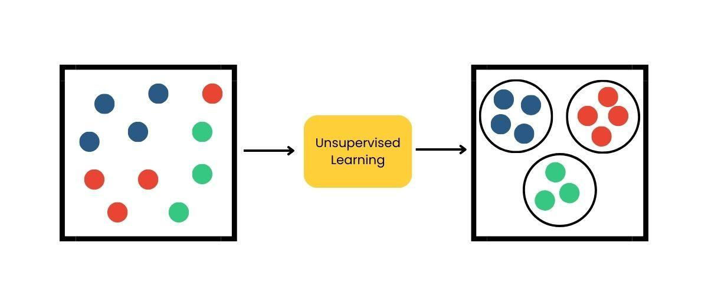

## Table of Contents

## What is unsupervised learning?

Unsupervised learning is a type of machine learning where the computer learns from data without being told what the correct answers are. Imagine you have a big box of different toys, but no one tells you how to sort them. You might start grouping them by color, size, or type on your own. That's similar to what unsupervised learning does with data. It finds patterns and relationships in the data all by itself.

One common method in unsupervised learning is called clustering. This is where the computer groups similar data points together. For example, if you have data about different fruits, the computer might group apples and pears together because they are similar in some ways, and separate them from bananas. Another method is called dimensionality reduction, which helps simplify complex data by focusing on the most important parts. This is like taking a detailed picture and zooming out to see the big picture more clearly.

Unsupervised learning is useful because it can help discover hidden structures in data that we might not know about. It's like exploring a new place without a map and finding interesting things on your own. This type of learning is used in many areas, such as organizing large amounts of information, finding customer groups for businesses, and even in understanding how genes work in biology.

## How does unsupervised learning differ from supervised learning?

Unsupervised learning and supervised learning are two different ways computers can learn from data. In supervised learning, the computer is given examples with the correct answers, kind of like a teacher showing you how to do a math problem and then giving you more problems to solve. The computer uses these examples to learn how to make predictions or decisions. For example, if you want to teach a computer to recognize pictures of cats and dogs, you would show it many pictures labeled as "cat" or "dog," and the computer would learn to tell them apart.

On the other hand, unsupervised learning is like learning without a teacher. The computer is given data without any labels or correct answers. It has to figure out patterns and relationships on its own. For instance, if you give the computer a bunch of pictures without telling it what they are, it might group similar pictures together, like all the pictures of animals in one group and all the pictures of cars in another. This type of learning is useful for discovering hidden structures in data that we might not know about beforehand.

The main difference between the two is the presence of labeled data. Supervised learning needs labeled data to learn from, while unsupervised learning works with unlabeled data. Both methods have their own uses and can be very helpful depending on what you're trying to achieve with your data.

## What are the main types of unsupervised learning?

Unsupervised learning mainly includes two types: clustering and dimensionality reduction. Clustering is like sorting toys into groups without being told how to do it. The computer looks at the data and puts similar items together. For example, if you have data about different animals, the computer might group all the birds together because they are similar in some ways, and separate them from the fish. This helps to find patterns or groups in the data that we might not know about.

Dimensionality reduction is another type of unsupervised learning. It's like simplifying a complex picture by focusing on the most important parts. Imagine you have a lot of information about people, like their age, height, weight, and favorite color. Dimensionality reduction would help to focus on the most important information, maybe just age and height, to make the data easier to understand. This is useful when you have a lot of data and want to see the big picture more clearly.

## Can you explain clustering and its applications?

Clustering is a type of unsupervised learning where the computer groups similar data points together without being told how to do it. Imagine you have a bunch of different fruits like apples, bananas, and oranges. The computer might look at their colors, shapes, and sizes, and then group the apples and oranges together because they are similar, and keep the bananas separate. This helps to find patterns or groups in the data that we might not know about beforehand. There are different ways to do clustering, like K-means clustering, where you tell the computer how many groups you want, and it figures out the best way to sort the data into those groups.

Clustering is used in many different areas. For example, in business, companies might use clustering to group their customers based on what they buy or how much they spend. This helps the company understand different types of customers and how to serve them better. In biology, clustering can be used to group genes that behave similarly, which can help scientists understand how different genes work together. Another use is in organizing large amounts of information, like grouping similar news articles or social media posts together, so it's easier to find what you're looking for. Clustering helps us see the big picture and find hidden patterns in data.

## What is dimensionality reduction and why is it important?

Dimensionality reduction is a type of unsupervised learning where the computer simplifies complex data by focusing on the most important parts. Imagine you have a lot of information about people, like their age, height, weight, and favorite color. Dimensionality reduction would help to focus on the most important information, maybe just age and height, to make the data easier to understand. It's like taking a detailed picture and zooming out to see the big picture more clearly. This process helps to reduce the number of variables in the data, making it easier to work with and analyze.

Dimensionality reduction is important because it helps to manage and understand large amounts of data. When you have a lot of data, it can be hard to see the important patterns or relationships. By reducing the number of variables, you can focus on what really matters and make better decisions. For example, in medicine, doctors might use dimensionality reduction to focus on the most important test results to diagnose a disease more accurately. It's like cleaning up a messy room so you can find what you need more easily.

## How does the k-means algorithm work?

The k-means algorithm is a way to group data into clusters. Imagine you have a bunch of different colored marbles and you want to sort them into groups. You decide you want three groups, so you pick three marbles to be the starting points, or "centroids," for each group. Then, you look at all the other marbles and put each one into the group where its centroid is closest. After you've sorted all the marbles, you move the centroids to the middle of their new groups. You keep doing this, sorting the marbles and moving the centroids, until the groups stop changing much. That's how k-means works.

This method is useful because it helps find patterns in data without anyone telling the computer what the groups should be. For example, if you have data about different customers, k-means can help group them into different types based on what they buy or how much they spend. The tricky part is deciding how many groups, or "k," you want. If you pick too few, the groups might be too big and not very useful. If you pick too many, the groups might be too small and not show the big picture. But once you figure out the right number of groups, k-means can help you see the hidden patterns in your data.

## What are some common challenges faced in unsupervised learning?

Unsupervised learning can be tricky because it's like trying to solve a puzzle without knowing what the final picture should look like. One big challenge is figuring out how many groups or clusters to make. If you pick too few, the groups might be too big and not very useful. If you pick too many, the groups might be too small and not show the big picture. It's hard to know the right number without any hints or labels to guide you.

Another challenge is that unsupervised learning can sometimes find patterns that don't really mean anything. Imagine you're looking at clouds and seeing shapes like animals or faces. Those shapes are there, but they don't tell you anything important about the clouds. In the same way, the computer might find patterns in the data that seem interesting but aren't actually useful for understanding the data better. This can make it hard to know which patterns to pay attention to and which ones to ignore.

Lastly, unsupervised learning can be sensitive to how the data is set up. If the data has a lot of missing pieces or if it's not organized well, the computer might have a hard time finding the right patterns. It's like trying to build a sandcastle with sand that keeps falling apart. You need good, solid data to make the most of unsupervised learning, and that's not always easy to get.

## How can one evaluate the performance of unsupervised learning models?

Evaluating unsupervised learning models can be tricky because there's no right answer to compare against, like in supervised learning. Instead, we use different ways to see how well the model is doing. One common way is to look at how tight the groups or clusters are. If the data points in each group are close together and the groups are far apart from each other, that's a good sign. We can measure this with something called the silhouette score, which tells us how well each point fits into its group and how different it is from other groups.

Another way to check the performance is by using something called the elbow method, especially when we're using the k-means algorithm. This method helps us figure out the best number of groups to use. We run the algorithm with different numbers of groups and see how the total distance within the groups changes. When this distance starts to level off, it looks like an elbow on a graph, and that's usually a good number of groups to use. Both of these methods help us understand how well our unsupervised learning model is working, even without knowing the right answers ahead of time.

## What is hierarchical clustering and how does it differ from k-means?

Hierarchical clustering is another way to group data into clusters, but it works differently from k-means. Imagine you have a bunch of different toys and you want to sort them. With hierarchical clustering, you start by treating each toy as its own group. Then, you keep joining the most similar groups together until you have one big group with all the toys. This process creates a tree-like structure called a dendrogram, which shows how the groups are related. You can then decide how many groups you want by cutting the tree at different levels. This method is useful because it doesn't need you to decide the number of groups beforehand, and it shows you how the data is organized at different levels.

K-means and hierarchical clustering are different in how they group the data. K-means starts by picking a certain number of groups and then keeps moving them around until the groups stop changing much. You have to decide how many groups you want before you start. On the other hand, hierarchical clustering builds the groups step by step, starting with each data point as its own group and then joining them together. This means you don't need to know the number of groups ahead of time, and you can see how the data is related at different levels. Both methods can be useful, but they work in different ways and might be better for different kinds of data or problems.

## Can you describe the process and benefits of using Principal Component Analysis (PCA)?

Principal Component Analysis, or PCA, is a way to simplify complex data by focusing on the most important parts. Imagine you have a lot of information about different fruits, like their size, weight, color, and sweetness. PCA helps you find the most important features, like size and sweetness, and ignore the less important ones, like color. It does this by creating new variables called principal components, which are combinations of the original features. The first principal component shows the direction in the data where there's the most variation, and each following component shows the next most important direction. By using these components, you can reduce the number of variables you need to look at, making the data easier to understand and work with.

Using PCA has many benefits. One big benefit is that it helps you see the big picture in your data more clearly. When you have a lot of information, it can be hard to find the important patterns or relationships. PCA helps you focus on what really matters, making it easier to make decisions or find trends. For example, in medicine, doctors might use PCA to focus on the most important test results to diagnose a disease more accurately. Another benefit is that it can help with data visualization. By reducing the number of variables, you can plot the data in a way that's easier to understand, like showing it in two or three dimensions instead of many more. This makes it easier to see how different parts of the data relate to each other.

## What are some advanced techniques in unsupervised learning?

Advanced techniques in unsupervised learning include methods like t-SNE (t-Distributed Stochastic Neighbor Embedding) and autoencoders. t-SNE is a way to take high-dimensional data, like a lot of information about different people, and show it in a simpler way, like a picture with just two or three dimensions. It's really good at keeping similar data points close together and different ones far apart, which helps you see patterns that might be hard to notice otherwise. Autoencoders are another advanced technique. They're like a special kind of computer program that learns how to copy the data it sees, but in a way that makes it simpler. It does this by finding the most important parts of the data and ignoring the rest, kind of like how PCA works but in a more flexible way.

These advanced techniques have a lot of uses. t-SNE is often used in things like understanding how genes work or figuring out how people use websites. It helps scientists and businesses see the big picture in their data more clearly. Autoencoders are useful in areas like making computers understand pictures or sounds better. They can help with things like cleaning up noisy pictures or even creating new ones that look similar to the ones they've seen before. Both t-SNE and autoencoders show how powerful unsupervised learning can be, helping us find hidden patterns and simplify complex data in ways that simpler methods can't.

## How can unsupervised learning be applied in real-world scenarios like anomaly detection or market segmentation?

Unsupervised learning is really helpful for finding unusual things, like spotting fraud in credit card transactions. Imagine you have a lot of data about how people use their credit cards. Most of the time, people's spending habits follow a pattern. But if someone's card is used in a strange way, like buying a lot of things in a short time or from a different country, that could be a sign of fraud. Unsupervised learning can look at all this data and find these unusual patterns without anyone telling it what to look for. It groups the normal transactions together and then spots the ones that don't fit in, helping banks catch fraud more quickly and keep people's money safe.

Unsupervised learning is also great for dividing customers into different groups, which is called market segmentation. Imagine a store that sells all kinds of things, from clothes to electronics. The store wants to understand its customers better so it can sell them things they'll like. Unsupervised learning can look at what people buy, how much they spend, and even where they live, and then group similar customers together. For example, it might find a group of customers who buy a lot of sports gear and another group that likes fashion. The store can then target these groups with special deals or ads that match their interests, making customers happier and helping the store sell more.

## References & Further Reading

[1]: Bergstra, J., Bardenet, R., Bengio, Y., & Kégl, B. (2011). ["Algorithms for Hyper-Parameter Optimization."](https://papers.nips.cc/paper_files/paper/2011/hash/86e8f7ab32cfd12577bc2619bc635690-Abstract.html) Advances in Neural Information Processing Systems 24.

[2]: ["Advances in Financial Machine Learning"](https://www.amazon.com/Advances-Financial-Machine-Learning-Marcos/dp/1119482089) by Marcos Lopez de Prado

[3]: ["Evidence-Based Technical Analysis: Applying the Scientific Method and Statistical Inference to Trading Signals"](https://www.wiley.com/en-gb/Evidence+Based+Technical+Analysis:+Applying+the+Scientific+Method+and+Statistical+Inference+to+Trading+Signals-p-9780470008744) by David Aronson

[4]: ["Machine Learning for Algorithmic Trading"](https://www.amazon.com/Machine-Learning-Algorithmic-Trading-intelligence/dp/9918608013) by Stefan Jansen

[5]: ["Quantitative Trading: How to Build Your Own Algorithmic Trading Business"](https://www.amazon.com/Quantitative-Trading-Build-Algorithmic-Business/dp/0470284889) by Ernest P. Chan