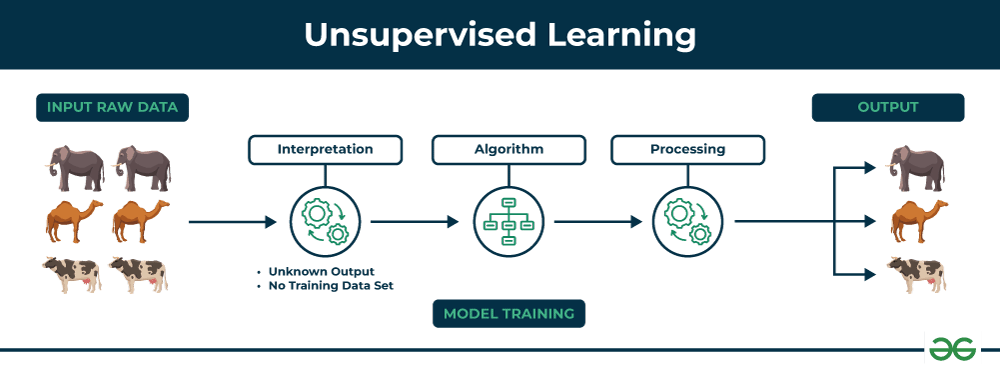

## Table of Contents

## What is unsupervised machine learning?

Unsupervised machine learning is a type of artificial intelligence where the computer learns from data without being given specific instructions on what to look for. Imagine you have a big box of mixed-up toys, and you need to sort them into groups without anyone telling you how to do it. That's what unsupervised learning does with data. It finds patterns and relationships in the data all by itself. This type of learning is useful when you don't know what you're looking for in the data, but you want to discover something new or interesting.

One common method in unsupervised learning is called clustering. Clustering is like sorting those toys into different groups based on how similar they are. For example, all the cars go in one group, and all the dolls go in another. In data, this might mean grouping customers based on their shopping habits or grouping news articles by topic. Another method is called dimensionality reduction, which is like trying to simplify a complex puzzle. If you have a lot of information, dimensionality reduction helps to focus on the most important parts, making it easier to understand and work with the data. Both clustering and dimensionality reduction help us see the big picture in the data without needing to know the details beforehand.

## How does unsupervised machine learning differ from supervised machine learning?

Unsupervised machine learning and supervised machine learning are two different ways computers can learn from data. Supervised learning is like a teacher showing a student examples and then asking them to do the same. The computer is given data that is already labeled, and it learns to predict the right label for new data. For example, if you want to teach a computer to recognize pictures of cats and dogs, you would show it many pictures labeled as either "cat" or "dog." The computer learns from these examples and can then guess the label for new pictures.

Unsupervised learning, on the other hand, is like giving the student a bunch of toys and asking them to sort them without any instructions. The computer is given data without labels, and it has to find patterns or groups within the data all by itself. Using the same example, if you want to understand the different types of animals in a set of pictures without any labels, the computer might group similar pictures together, like all the pictures of cats in one group and all the pictures of dogs in another. This way, unsupervised learning helps discover hidden structures in the data, which can be useful when you don't know what you're looking for.

## What are the main types of unsupervised learning algorithms?

The main types of unsupervised learning algorithms are clustering and dimensionality reduction. Clustering algorithms group similar data points together. Imagine you have a bunch of different fruits, and you want to sort them without knowing the names of the fruits. Clustering would help you put all the apples in one group, all the bananas in another, and so on. Popular clustering algorithms include K-means, which divides the data into a set number of groups, and hierarchical clustering, which builds a tree of groups by merging or splitting them.

Dimensionality reduction algorithms, on the other hand, help simplify complex data by focusing on the most important parts. Think of it like trying to understand a big puzzle by looking at the most important pieces first. One common method is Principal Component Analysis (PCA), which transforms the data into a new set of variables, called principal components, that capture the most variance in the data. Another method is t-SNE (t-Distributed Stochastic Neighbor Embedding), which is good for visualizing high-dimensional data in two or three dimensions. Both clustering and dimensionality reduction help us find patterns and make sense of data without needing any labels.

## Can you explain what clustering is and provide an example of its use?

Clustering is a type of unsupervised machine learning where the computer groups similar data points together without being told how to do it. Imagine you have a big box of different colored marbles, and you want to sort them into groups based on their colors. Clustering would help you put all the red marbles in one group, all the blue marbles in another, and so on. The computer looks at the features of each data point and decides which group it should belong to based on how similar it is to other points.

A common example of clustering is market segmentation in business. Imagine a company wants to understand its customers better so it can target them with the right products. The company collects data on what customers buy, how often they shop, and other details. Then, using a clustering algorithm like K-means, the company can group customers into different segments. For instance, one group might be "frequent buyers" who shop often and spend a lot, while another group might be "occasional shoppers" who buy less often. This helps the company tailor its marketing strategies to each group, making their efforts more effective.

## What is dimensionality reduction and why is it important in unsupervised learning?

Dimensionality reduction is a technique in unsupervised learning that helps simplify complex data by focusing on the most important parts. Imagine you have a big puzzle with many pieces, but you want to understand it by looking at just a few key pieces. That's what dimensionality reduction does with data. It takes data with many features, or dimensions, and reduces it to a smaller set of features while keeping the most important information. This makes the data easier to work with and understand. One common method for dimensionality reduction is Principal Component Analysis (PCA), which transforms the data into a new set of variables called principal components that capture the most variance in the data.

Dimensionality reduction is important in unsupervised learning because it helps us see patterns and relationships in the data that might be hidden when looking at all the original features. For example, if you have a dataset with hundreds of variables, it can be hard to see what's going on. By reducing the number of variables, you can focus on what's really important and make better decisions. It's also useful for visualizing data. High-dimensional data is hard to plot, but after dimensionality reduction, you can often see the data in two or three dimensions, which makes it easier to understand and explore. Techniques like t-SNE are especially good for this, as they help create clear and meaningful visualizations of complex data.

## How does the k-means clustering algorithm work?

K-means clustering is like sorting a bunch of toys into different boxes based on how similar they are. Imagine you have a bunch of colored marbles and you want to put them into groups. You start by picking a few marbles and calling them the centers of your groups. Then, you look at each marble and decide which center it's closest to. You put each marble into the group of its closest center. After that, you move the centers to the middle of all the marbles in their group. You keep doing this—putting marbles into groups and moving the centers—until the centers don't move much anymore. This is how k-means finds groups in your data.

Let's say you have data points in a two-dimensional space and you want to group them into three clusters. You start by choosing three random points as the initial centers, or centroids. Then, for each data point, you calculate the distance to each centroid using a formula like the Euclidean distance, $$d = \sqrt{(x_2 - x_1)^2 + (y_2 - y_1)^2}$$. You assign each data point to the cluster whose centroid is closest. After all points are assigned, you recalculate the centroid of each cluster by finding the mean of the points in that cluster. You repeat this process until the centroids stop moving significantly, meaning the clusters have stabilized. This is how k-means clustering works to find patterns in your data.

## What are the advantages and limitations of using hierarchical clustering?

Hierarchical clustering is like building a family tree for your data. It starts by treating each data point as its own group, and then it starts merging the closest groups together, step by step, until all the data points are in one big group. This method is great because it doesn't make you decide ahead of time how many groups you want, like you have to with K-means. You can see how the data fits together at different levels, which can help you understand the relationships between the data points better. Also, you can easily see the results in a diagram called a dendrogram, which looks like a tree and shows how the groups are connected.

But hierarchical clustering also has some limitations. It can be slow, especially if you have a lot of data points, because it has to calculate the distance between all pairs of points many times. Also, once it makes a decision to merge two groups, it can't undo it, which can lead to mistakes if the early merges are not right. This method can be sensitive to noise and outliers, too, because a single unusual data point can mess up the whole clustering process. So, while hierarchical clustering is good for understanding the structure of your data, it might not be the best choice if you need a quick and simple way to group your data.

## Can you describe the process and purpose of Principal Component Analysis (PCA)?

Principal Component Analysis (PCA) is like trying to understand a big puzzle by focusing on the most important pieces. Imagine you have a lot of data with many features, and it's hard to see what's going on. PCA helps by finding new ways to look at your data that make it simpler and easier to understand. It does this by creating new variables, called principal components, which are combinations of your original features. The first principal component captures the most variation in the data, the second captures the next most, and so on. By using just a few of these new variables, you can often understand your data better than by looking at all the original features.

The process of PCA starts by taking your data and calculating something called the covariance matrix, which shows how the features in your data relate to each other. Then, it finds the eigenvectors and eigenvalues of this matrix. The eigenvectors are the directions of the new principal components, and the eigenvalues tell you how important each component is. You sort the eigenvectors by their eigenvalues in descending order and choose the top ones to keep. For example, if you have a dataset with many features, you might decide to keep only the first two or three principal components. This reduces the number of dimensions in your data, making it easier to visualize and analyze. The formula for calculating the principal components can be represented as $$ \mathbf{y} = \mathbf{X} \mathbf{W} $$, where $$\mathbf{X}$$ is the original data matrix, $$\mathbf{W}$$ is the matrix of eigenvectors, and $$\mathbf{y}$$ is the transformed data in the new principal component space.

## What is anomaly detection in unsupervised learning and how is it applied?

Anomaly detection in unsupervised learning is like finding the odd one out in a group of things. Imagine you have a bunch of apples, but one of them is a banana. Anomaly detection helps you spot that banana by looking at all the apples and figuring out what's different. In data, this means finding data points that don't fit with the rest. The computer looks at patterns in the data and flags anything that seems unusual. This is useful in many areas, like spotting fraud in credit card transactions or finding errors in manufacturing.

One common way to do anomaly detection is by using clustering algorithms like K-means. The computer groups similar data points together, and any point that doesn't fit well into any group might be an anomaly. For example, if you're looking at customer spending habits, most customers might spend a similar amount each month, but one customer spends much more. That customer could be flagged as an anomaly. Another method is to use statistical models to find data points that are far away from the average, using formulas like the z-score, $$ z = \frac{(X - \mu)}{\sigma} $$, where $$ X $$ is the data point, $$ \mu $$ is the mean, and $$ \sigma $$ is the standard deviation. If a data point has a high z-score, it might be an anomaly.

## How can one evaluate the performance of an unsupervised learning model?

Evaluating the performance of an unsupervised learning model can be tricky because there's no right answer to compare against, unlike in supervised learning where you have labels. Instead, you look at how well the model groups or simplifies the data. One common way to do this is by using a metric called the silhouette score. The silhouette score measures how similar a data point is to its own cluster compared to other clusters. A high silhouette score means the data points are well matched to their own clusters and poorly matched to neighboring clusters, which suggests good clustering. You can calculate the silhouette score with the formula $$ s_i = \frac{b_i - a_i}{\max(a_i, b_i)} $$, where $$ a_i $$ is the average distance from the $$ i $$-th data point to the other points in the same cluster, and $$ b_i $$ is the average distance from the $$ i $$-th data point to the points in the nearest other cluster.

Another way to evaluate unsupervised learning models is by looking at how much the model reduces the dimensionality of the data while keeping important information. For example, in Principal Component Analysis (PCA), you can look at how much variance is explained by the principal components you keep. If the first few principal components explain a large percentage of the total variance, like 90% or more, then the model is doing a good job of simplifying the data without losing much information. You can also use visual methods, like plotting the data in a lower-dimensional space after applying a technique like t-SNE, to see if the model separates the data points in a meaningful way. By combining these different methods, you can get a better idea of how well your unsupervised learning model is performing.

## What are some advanced techniques in unsupervised learning, such as autoencoders and generative models?

Autoencoders are like special machines that learn to copy their input data, but in a smart way. Imagine you have a picture, and you want to make a simpler version of it. An autoencoder takes the picture, squeezes it into a smaller form, and then tries to rebuild the original picture from that smaller form. This smaller form is called the "latent space" and it captures the most important parts of the data. By learning to do this, autoencoders can help find patterns in data and even help with tasks like denoising images or detecting anomalies. They work by using neural networks, with one part of the network encoding the data and another part decoding it. The goal is to make the output as close to the input as possible, which is measured by a loss function like the mean squared error, $$ \text{MSE} = \frac{1}{n} \sum_{i=1}^{n} (y_i - \hat{y}_i)^2 $$, where $$ y_i $$ is the original data and $$ \hat{y}_i $$ is the reconstructed data.

Generative models are like artists that can create new things based on what they've seen before. They learn from a set of data and then can generate new data that looks similar to the original set. One popular type of generative model is the Generative Adversarial Network (GAN). A GAN has two parts: a generator that makes new data and a discriminator that tries to tell if the data is real or fake. They play a game where the generator tries to fool the discriminator, and through this game, both get better at their jobs. The generator learns to make more realistic data, and the discriminator gets better at spotting fakes. This back-and-forth training helps GANs create very realistic images, sounds, or even text. The training process involves optimizing a loss function that balances the performance of both the generator and the discriminator.

## How can unsupervised learning be applied in real-world scenarios, such as market segmentation or gene expression analysis?

Unsupervised learning can be a powerful tool for market segmentation, which helps businesses understand their customers better. Imagine a company that sells different products and wants to know which types of customers are buying what. They can collect data on customer purchases, demographics, and other behaviors. Using clustering algorithms like K-means, the company can group customers into different segments based on their similarities. For example, one group might be "frequent buyers" who shop often and spend a lot, while another group could be "occasional shoppers" who buy less often. This helps the company tailor its marketing strategies to each group, making their efforts more effective. The company can use the silhouette score, $$ s_i = \frac{b_i - a_i}{\max(a_i, b_i)} $$, to evaluate how well the clustering has separated the customers into meaningful groups.

In the field of biology, unsupervised learning is used for gene expression analysis, which helps scientists understand how genes work. Imagine you have a lot of data about which genes are active in different cells or under different conditions. Using techniques like clustering or dimensionality reduction, scientists can group genes based on how they behave. For example, genes that are active in similar conditions might be grouped together, helping scientists understand which genes are related to certain diseases or traits. Principal Component Analysis (PCA) can be used to reduce the complexity of the data and focus on the most important patterns. This can be visualized in lower dimensions, making it easier to see how genes are related. By applying unsupervised learning, scientists can uncover new insights about gene functions and their roles in biological processes.