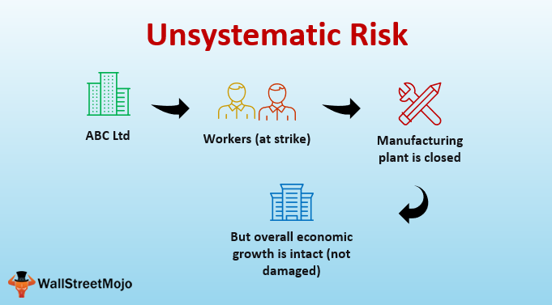

## Table of Contents

## What is unsystematic risk?

Unsystematic risk is the risk that comes from a specific company or industry. It's also called "specific risk" or "diversifiable risk." This type of risk can be reduced by spreading your investments across different companies and industries. For example, if you only invest in one tech company and it does poorly, your investment could lose a lot of value. But if you invest in many different companies across different sectors, the poor performance of one company won't hurt your overall portfolio as much.

On the other hand, unsystematic risk is different from systematic risk, which affects the whole market or economy. Things like interest rates, inflation, and political changes are examples of systematic risk. You can't get rid of systematic risk by diversifying your investments, but you can manage unsystematic risk by not putting all your eggs in one basket. By understanding and managing unsystematic risk, investors can make smarter choices and build a more stable investment portfolio.

## How does unsystematic risk differ from systematic risk?

Unsystematic risk is the risk that comes from a specific company or industry. It's like when one company does badly, but other companies and the overall market might still do well. You can lower this risk by spreading your money across different companies and industries. For example, if you only invest in one car company and it has problems, your investment could lose a lot of value. But if you invest in many different companies in different sectors, the poor performance of one company won't hurt your overall investment as much.

Systematic risk, on the other hand, affects the whole market or economy. It's like when something big happens that impacts everyone, such as changes in interest rates, inflation, or big political events. You can't get rid of this type of risk by just spreading your investments around because it affects everything. For example, if the economy goes into a recession, most companies and investments will likely suffer. Understanding the difference between these two types of risks helps investors make better choices and build a more stable investment portfolio.

## Can you provide examples of unsystematic risk?

Unsystematic risk is all about the problems that can happen to a single company or industry. For example, imagine a big car company like Ford. If Ford has a major recall because of faulty brakes, this can hurt Ford's stock price and its profits. But this problem is just with Ford and doesn't affect other car companies like Toyota or Honda in the same way. So, if you only invested in Ford, your money could be in trouble, but if you also invested in other car companies, the impact wouldn't be as bad.

Another example could be in the tech industry. Let's say a tech company like Snapchat faces a huge data breach where millions of users' private information is stolen. This could make people lose trust in Snapchat and cause its stock to drop. But this issue is specific to Snapchat and wouldn't necessarily affect other tech companies like Apple or Microsoft. By spreading your investments across different tech companies, you can lower the risk that comes from problems at just one company.

These examples show how unsystematic risk can be managed by not putting all your money into one company or industry. By diversifying your investments, you can protect yourself from the ups and downs that affect just one part of the market.

## What are the main sources of unsystematic risk?

Unsystematic risk comes from problems that can happen to a specific company or industry. These problems can be things like bad management decisions, where the leaders of a company make choices that hurt the business. For example, if a company decides to launch a product that fails, it can lose money and its stock price can go down. Another source can be legal troubles, like when a company gets sued for breaking laws or harming people. This can lead to big fines and damage the company's reputation, which can also hurt its stock price.

Financial troubles are another big source of unsystematic risk. If a company has too much debt and can't pay it back, it might go bankrupt, which is really bad for its stock price. Also, if a company depends a lot on one customer or supplier, and that relationship goes bad, it can cause big problems. For example, if a big customer stops buying from the company, its sales can drop a lot. These kinds of risks are specific to the company and don't affect the whole market, so they can be managed by spreading investments across different companies and industries.

## How can an investor identify unsystematic risk in a portfolio?

To identify unsystematic risk in a portfolio, an investor needs to look at each company or industry they have invested in. They should pay attention to things like the company's financial health, any legal troubles it might have, and how well it's being managed. For example, if a company has a lot of debt or is in the middle of a big lawsuit, these are signs of unsystematic risk. Also, if the company's leaders are making bad decisions, like launching a product that doesn't sell well, that can be a red flag.

Another way to spot unsystematic risk is by checking how much of the portfolio is invested in just one company or industry. If a big part of the portfolio is in one place, it's more at risk from problems that affect that company or industry. For example, if most of the money is in one tech company, and that company has a data breach, the portfolio could lose a lot of value. By spreading investments across different companies and industries, an investor can lower the unsystematic risk in their portfolio.

## What strategies can be used to mitigate unsystematic risk?

The main way to lower unsystematic risk is by spreading your investments across many different companies and industries. This is called diversification. If you put your money in lots of different places, a problem in one company or industry won't hurt your whole portfolio as much. For example, if you only invest in one car company and it has a big recall, your investment could lose a lot of value. But if you also invest in other car companies and different industries like tech or healthcare, the impact of the recall won't be as bad.

Another strategy is to keep an eye on the companies you invest in. Look at their financial health, any legal issues they might have, and how well they're being managed. If a company has a lot of debt or is in a lawsuit, those are signs of unsystematic risk. Also, if the company's leaders are making bad decisions, like launching a product that doesn't sell well, that's another red flag. By staying informed and making smart choices about where to invest, you can reduce the unsystematic risk in your portfolio.

## How does diversification help in reducing unsystematic risk?

Diversification helps in reducing unsystematic risk by spreading your investments across many different companies and industries. When you put your money in lots of different places, a problem in one company or industry won't hurt your whole portfolio as much. For example, if you only invest in one car company and it has a big recall, your investment could lose a lot of value. But if you also invest in other car companies and different industries like tech or healthcare, the impact of the recall won't be as bad.

By diversifying, you're not putting all your eggs in one basket. This means that if one company does badly, the other companies in your portfolio might still do well, balancing out the losses. It's like having a safety net for your investments. So, even if one part of your portfolio goes down, the other parts can help keep your overall investment stable.

## What role does company-specific news play in unsystematic risk?

Company-specific news can have a big impact on unsystematic risk. This kind of news can be about things like a company doing really well or really badly, getting into legal trouble, or making big changes. For example, if a company announces a new product that everyone loves, its stock price might go up a lot. But if the news is bad, like a big recall or a lawsuit, the stock price can go down a lot. This is unsystematic risk because it's just about that one company and doesn't affect the whole market.

Investors need to keep an eye on company-specific news to manage unsystematic risk. If they see that a company they've invested in is having problems, they might want to sell their shares or invest in other companies to spread out their risk. By staying informed, investors can make smart choices and protect their money from the ups and downs that can happen to just one company.

## How do financial analysts measure unsystematic risk?

Financial analysts measure unsystematic risk by looking at how much a company's stock price moves around compared to the overall market. They use something called beta to see how sensitive a stock is to market changes. But to find unsystematic risk, they focus on the part of the stock's movement that isn't explained by the market. This is done by looking at the difference between a stock's total risk and its systematic risk. The total risk is measured by the standard deviation of the stock's returns, and the systematic risk is what the beta tells us. So, unsystematic risk is what's left over after you take away the systematic risk from the total risk.

Another way analysts measure unsystematic risk is by using models like the Capital Asset Pricing Model (CAPM). This model helps them figure out what part of a stock's returns can be explained by the market and what part can't. The part that can't be explained by the market is the unsystematic risk. By understanding this, analysts can see how much risk comes from the company itself and not from the overall market. This helps them make better investment decisions and advise their clients on how to spread out their investments to lower this type of risk.

## What is the relationship between unsystematic risk and beta?

Beta is a measure that shows how much a stock's price moves compared to the overall market. If a stock has a high beta, it means it moves a lot when the market moves. If it has a low beta, it doesn't move as much. But beta only tells us about the part of the risk that comes from the market, which is called systematic risk. Unsystematic risk, on the other hand, is the risk that comes from the company itself, like bad management or legal troubles.

To find out the unsystematic risk, financial analysts look at the total risk of a stock and then take away the systematic risk that beta tells us about. The part that's left over is the unsystematic risk. So, while beta helps us understand how a stock moves with the market, it doesn't tell us about the risks that are specific to the company. By knowing both beta and unsystematic risk, investors can see the full picture of what might make their investment go up or down.

## Can unsystematic risk be completely eliminated? Why or why not?

Unsystematic risk can't be completely eliminated. This type of risk comes from problems that can happen to a single company or industry, like bad management decisions or legal troubles. Even if you spread your investments across many different companies and industries, there's always a chance that something unexpected could happen to one of them.

Diversification helps a lot in reducing unsystematic risk, but it can't get rid of it completely. By investing in lots of different places, you lower the chance that a problem in one company will hurt your whole portfolio. But since there's always some level of risk that's unique to each company, you can never make unsystematic risk go away entirely.

## How do advanced statistical models assess and predict unsystematic risk?

Advanced statistical models help assess and predict unsystematic risk by looking at a lot of data about a company. These models can look at things like how the company's stock has moved in the past, its financial health, and even news about the company. They use this information to figure out how much risk comes from the company itself, which is unsystematic risk. By using complicated math, these models can find patterns and make guesses about what might happen to the company's stock price in the future. This helps investors understand the risks they're taking and make smarter choices about where to put their money.

These models also use something called regression analysis to separate unsystematic risk from systematic risk. Regression analysis helps figure out how much of a stock's movement can be explained by the overall market and how much can't. The part that can't be explained by the market is the unsystematic risk. By doing this, the models can give investors a clear picture of the risks that are specific to a company. While these models are really helpful, they're not perfect. They can't predict everything, but they give investors a better idea of the risks they face and help them manage their portfolios more effectively.

## What is Understanding Unsystematic Risk?

Unsystematic risk, also referred to as specific, diversifiable, or idiosyncratic risk, is a type of risk inherent to individual businesses or industries. This form of risk arises from variables that can affect a particular company or sector independently of the broader market. Factors contributing to unsystematic risk include management inefficiency, which can lead to suboptimal decision-making and poor company performance. Effectiveness in leadership plays a crucial role in the direction and success of a business, and deficiencies here can significantly heighten specific risks.

Business model flaws are another contributor. A business model defines how an entity creates, delivers, and captures value, and defects in this model can lead to vulnerabilities specific to that business. For example, if a company relies heavily on a single revenue stream, any disturbance to that stream can introduce significant risk.

Liquidity issues further amplify unsystematic risks. Liquidity pertains to the ability of a company to meet its short-term obligations, and a lack of [liquidity](/wiki/liquidity-risk-premium) can force a company into distress or even bankruptcy. This jeopardy is particularly relevant in sectors that are highly cyclical or sensitive to economic changes, where access to capital can suddenly become restricted.

Operational problems also play a significant role. These relate to errors, delays, or malfunctions in day-to-day company operations, encompassing anything from supply chain disruptions to technology failures. Such issues can prevent a company from functioning smoothly and efficiently, thereby impacting its performance and increasing its specific risk.

Diversification is frequently cited as a key strategy to mitigate unsystematic risk. By spreading investments across a broad array of assets or sectors, investors can reduce the impact of any single business's or industry's failure on the overall portfolio. This risk reduction method is based on the principle that unsystematic risks are largely avoidable through appropriate diversification. In quantitative terms, the goal is to decrease the variance of a portfolio's returns, given by:

$$

\sigma^2_p = \sum_{i=1}^{n} \left( w_i^2 \cdot \sigma_i^2 \right) + \sum_{i=1}^{n-1} \sum_{j=i+1}^{n} \left( 2 \cdot w_i \cdot w_j \cdot \sigma_{ij} \right)
$$

where $\sigma^2_p$ is the variance of the portfolio, $w_i$ and $w_j$ are the weights of the assets in the portfolio, $\sigma_i^2$ is the variance of the individual asset, and $\sigma_{ij}$ is the covariance between asset $i$ and $j$. The structure of this equation highlights that by carefully choosing assets with low or negative covariance, investors can reduce the overall risk of their portfolio.

## What is the financial risk in algo trading?

Financial risk in algorithmic trading is primarily associated with potential losses resulting from excessive leverage or mismanagement of capital. Leverage is a financial strategy that involves borrowing funds to increase potential returns on investment. While it can magnify profits, it also significantly amplifies losses, posing a substantial risk to traders using algorithmic systems. High leverage means that a small adverse price move can lead to substantial losses, potentially making it difficult for traders to meet margin requirements, thus increasing the risk of insolvency.

To mitigate financial risk, traders should closely monitor their debt/equity ratios. The debt/equity ratio is a critical financial metric that compares a company's total liabilities to its shareholder equity. It provides insights into the financial leverage a firm is utilizing:

$$
\text{Debt/Equity Ratio} = \frac{\text{Total Liabilities}}{\text{Shareholder Equity}}
$$

A high debt/equity ratio might indicate that a company is aggressively funding its growth with debt, which can lead to increased financial risk if not managed carefully. Maintaining a balanced approach to financing, integrating both debt and equity, is essential in managing financial risk and sustaining long-term profitability.

Furthermore, regular evaluation of leverage policies and maintaining a prudent risk management strategy are essential. Periodic stress testing of trading algorithms can help assess the impact of market volatility under various scenarios. This proactive assessment allows traders to adjust their strategies before encountering adverse market conditions, thereby minimizing financial risk.

In addition, employing algorithms that dynamically adjust leverage based on prevailing market conditions can be beneficial. For instance, using Python, traders can programmatically monitor and adjust leverage levels:

```python
def adjust_leverage(current_leverage, market_volatility):
    target_leverage = max(1, current_leverage - market_volatility / 100)
    return target_leverage

current_leverage = 5
market_volatility = 2  # example volatility
new_leverage = adjust_leverage(current_leverage, market_volatility)
print(f"Adjusted Leverage: {new_leverage}")
```

By continuously evaluating the financial metrics and adjusting strategies accordingly, traders can mitigate the inherent financial risks associated with algorithmic trading.

## References & Further Reading

[1]: Bergstra, J., Bardenet, R., Bengio, Y., & Kégl, B. (2011). ["Algorithms for Hyper-Parameter Optimization."](https://papers.nips.cc/paper/4443-algorithms-for-hyper-parameter-optimization) Advances in Neural Information Processing Systems 24.

[2]: ["Advances in Financial Machine Learning"](https://www.amazon.com/Advances-Financial-Machine-Learning-Marcos/dp/1119482089) by Marcos Lopez de Prado

[3]: ["Evidence-Based Technical Analysis: Applying the Scientific Method and Statistical Inference to Trading Signals"](https://www.amazon.com/Evidence-Based-Technical-Analysis-Scientific-Statistical/dp/0470008741) by David Aronson

[4]: ["Machine Learning for Algorithmic Trading"](https://github.com/stefan-jansen/machine-learning-for-trading) by Stefan Jansen

[5]: ["Quantitative Trading: How to Build Your Own Algorithmic Trading Business"](https://books.google.com/books/about/Quantitative_Trading.html?id=j70yEAAAQBAJ) by Ernest P. Chan