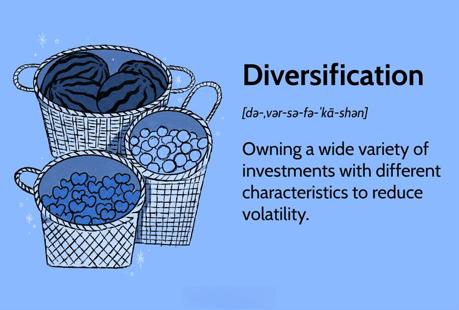

Investopedia stands as a vital hub for individuals seeking to understand business and investing terminology, especially those terms significant to algorithmic trading. The digital platform hosts a vast repository of definitions and explanations that serve as foundational knowledge for investors and traders. Familiarity with these terms is essential for making informed decisions in today's fast-paced financial markets. Algorithmic trading, characterized by its reliance on predefined rules and algorithms, demands a solid grasp of business terminology to leverage its full capabilities effectively.

Mastering these terms provides a competitive edge; not only does it enhance one's ability to interpret market signals accurately, but it also enables the assessment of risks and opportunities that might otherwise be overlooked. Understanding terms related to algorithmic trading ensures that investors and traders can engage with complex strategies and models, optimize their trading systems, and ultimately improve their financial outcomes. The terminology serves as the language of the market, and proficiency in this language is crucial for navigating the intricacies of modern finance. By equipping oneself with this knowledge, one is better prepared to tackle the challenges presented by algorithmic trading and the broader financial landscape.



## Table of Contents

## Overview of Business and Investing Terms

Understanding investing terms is crucial for individuals and professionals seeking to navigate the multifaceted world of financial markets effectively. Financial markets encompass a wide array of instruments, participants, and dynamics, and a solid grasp of pertinent terminology is essential for making informed decisions. Investing terms serve as the language of financial markets, providing clarity and understanding to the complex operations and transactions conducted daily. They include concepts spanning from basic principles like stocks and bonds to more advanced topics such as derivatives and hedge funds. Mastering these terms enables investors and traders to interpret market signals accurately, assess potential risks, and identify profitable opportunities.

Investopedia stands out as an invaluable resource in this context, offering a comprehensive repository of business and financial definitions. Founded in 1999, Investopedia provides a vast array of articles, tutorials, and videos designed to educate and inform its users on numerous financial topics. For individuals at any level—beginner investors to seasoned professionals—Investopedia serves as an essential tool for enhancing financial literacy. 

By elucidating complex financial concepts and terminology with clear and concise definitions, Investopedia bridges the knowledge gap for many market participants. It offers detailed explanations on topics such as quantitative easing, credit default swaps, and capital markets, all critical subjects for understanding market mechanics and strategies. Furthermore, Investopedia regularly updates its content to reflect the latest financial regulations and innovations, ensuring users have access to the most current information available.

The efficacy of Investopedia as a learning platform is further amplified by its interactive features, such as simulators and quizzes, which provide users with a practical understanding of financial markets. This hands-on approach fosters a deeper comprehension and retention of investing terms, equipping users with the knowledge necessary to thrive in dynamic and often volatile financial environments.

In conclusion, a profound understanding of business and investing terminology is indispensable for anyone involved in financial markets. With resources like Investopedia, individuals and professionals can enhance their financial literacy, enabling them to make informed decisions and maintain a competitive edge in an ever-evolving market landscape.

## Key Business Terminology for Investors

Investors and traders navigating the complexities of financial markets benefit significantly from a solid grasp of key business terminology. Terms like "bull market," "bear market," and "blue chip" companies are foundational for interpreting market trends and understanding corporate strength.

A "bull market" is characterized by rising asset prices and investor optimism. This economic environment encourages investment, as the anticipation of continuous price increases leads to a growth-oriented investment strategy. A "bear market," in contrast, denotes a period where prices are declining, often by 20% from recent highs, and is typically associated with pessimism and aversion among investors. Understanding these terms helps investors position their strategies to profit from or protect against market cycles.

"Blue chip" companies refer to established firms with a track record of reliability and strong financial performance. Typically, these companies are leaders in their respective industries, known for stability and resilience, making them attractive for long-term investment strategies.

In addition to these general terms, specialized concepts such as "alpha," "beta," and "capital gains" are crucial for forming robust investment strategies. "Alpha" represents a portfolio’s performance compared to a market index or benchmark, essentially quantifying a manager’s value-added through active investment decisions. It is expressed as a percentage that reflects returns exceeding or falling short of the benchmark.

"Beta" measures the volatility or risk of a security or portfolio relative to the entire market. A beta greater than one indicates higher volatility than the market, while a beta less than one suggests lower volatility. This measurement aids investors in understanding the potential risk and return of their investments in relation to market movements.

"Capital gains" refer to the profit realized from the sale of assets like stocks or real estate. They are a vital component of investment returns and are typically categorized into short-term and long-term, with tax implications varying based on the holding period.

A firm understanding of these terms lays the groundwork for strategic investment decisions, allowing investors to tailor their approaches according to market conditions and risk preferences. Such knowledge is integral to navigating the landscapes of investment with confidence and precision.

## Understanding Algorithmic Trading

Algorithmic trading is a method of executing orders in financial markets using automated and pre-programmed trading instructions, which consider variables such as time, price, and [volume](/wiki/volume-trading-strategy). This type of trading is grounded in complex algorithms—mathematical models that precisely evaluate market data and execute trades based on predefined rules. The automation provided by algorithms allows for transactions that are too fast and complex for human traders to execute without assistance.

A primary benefit of [algorithmic trading](/wiki/algorithmic-trading) is its speed. Modern financial markets operate at lightning speeds, with high-frequency trading firms executing millions of trades in fractions of a second. Algorithms can respond to market changes far quicker than human traders, efficiently capturing trading opportunities that might otherwise be missed. This efficiency also extends to cost savings, as algorithms can reduce the transaction costs associated with human trading by optimizing trading strategies and minimizing human error.

Another significant advantage is the reduction of emotional bias. Emotional responses to market changes can lead to irrational trading decisions, such as panic selling or overconfident buying. Algorithms operate strictly according to their programming, thereby maintaining consistency and rationality in trading decisions. This absence of emotional interference allows for a disciplined approach to trading, adhering to strategies that have been meticulously backtested and refined through historical market data analysis.

Moreover, algorithmic trading can handle complex decision-making environments by integrating multiple market factors and continuously adapting to new information. This flexibility is enhanced by computational algorithms' ability to process vast data quantities in real-time, enabling sophisticated trading strategies that exploit small market inefficiencies or engage in [arbitrage](/wiki/arbitrage) opportunities.

Overall, the reliance on predefined rules and robust computational algorithms makes algorithmic trading a highly effective tool for navigating modern financial markets' complexities. By combining speed, efficiency, and emotional neutrality, algorithmic trading offers significant advantages over traditional trading methods, empowering traders to execute precise trading strategies in an increasingly competitive environment.

## Important Algorithmic Trading Terms

Algorithmic trading has become a cornerstone of modern financial markets, equipping traders and institutions with the ability to execute trades at scale and speed, often beyond human capability. Understanding the terminology associated with algorithmic trading is crucial for navigating this complex landscape.

### Backtesting

Backtesting is a fundamental process in algorithmic trading where a trading strategy is tested against historical data to determine its viability. It allows traders to evaluate how a particular strategy would have performed in the past, thereby assessing its potential future performance. The fundamental aim of [backtesting](/wiki/backtesting) is to ensure that a strategy is capable of generating positive returns under historical conditions.

A simple Python example for backtesting a moving average crossover strategy could look like this:

```python
import pandas as pd

def moving_average_backtest(data, short_window=40, long_window=100):
    signals = pd.DataFrame(index=data.index)
    signals['Price'] = data['Close']
    signals['Short_MA'] = data['Close'].rolling(window=short_window, min_periods=1).mean()
    signals['Long_MA'] = data['Close'].rolling(window=long_window, min_periods=1).mean()
    signals['Signal'] = 0.0
    signals['Signal'] = np.where(signals['Short_MA'] > signals['Long_MA'], 1.0, 0.0)
    signals['Position'] = signals['Signal'].diff()

    return signals
```

This function calculates two moving averages of varying lengths and generates buy/sell signals based on their crossover points.

### Execution Algorithms

Execution algorithms are designed to facilitate the implementation of trades once a buy or sell decision has been made. They optimize the execution of large orders by breaking them down into manageable sizes, minimizing the market impact and achieving better pricing. Some common types of execution algorithms include Volume Weighted Average Price (VWAP), Time Weighted Average Price (TWAP), and Implementation Shortfall.

### High-Frequency Trading (HFT)

High-frequency trading ([HFT](/wiki/high-frequency-trading-strategies)) is a subset of algorithmic trading characterized by extremely high-speed trade execution. Trading algorithms running on powerful computers are capable of executing thousands or even millions of orders per second. HFT capitalizes on minute price differences and is highly reliant on sophisticated technology infrastructure and network connectivity.

### Challenges and Limitations

Despite the efficiency and speed offered by algorithmic trading, it presents several challenges and limitations. The sheer volume of orders generated by algorithms can lead to increased [volatility](/wiki/volatility-trading-strategies) and rapid market movements. Moreover, there is an over-reliance on technology, making systems susceptible to technical glitches or crashes, famously exemplified by the "Flash Crash" of 2010. Furthermore, backtesting, while useful, does not guarantee future performance and can lead to overfitting strategies to past data if not handled correctly.

In summary, understanding and effectively leveraging algorithmic trading terms such as backtesting, execution algorithms, and HFT, while being cognizant of the associated challenges, is essential for anyone involved in modern trading environments.

## Strategies and Models in Algorithmic Trading

In algorithmic trading, a key to success lies in understanding and implementing various strategies and models. These approaches leverage computational power and historical data analysis to execute trades with precision.

One common strategy is trend-following, where algorithms analyze price movements to identify persistent trends. The core belief underpinning this strategy is the principle of [momentum](/wiki/momentum), which posits that an asset’s price is likely to continue moving in its current direction. Traders using trend-following strategies aim to capitalize on these movements by buying securities when trends ascend and selling them when trends reverse. Implementing this strategy requires a careful balance of entry and [exit](/wiki/exit-strategy) signals, often based on technical indicators like moving averages or the Relative Strength Index (RSI).

Arbitrage is another widely used algo-trading strategy, focusing on exploiting price discrepancies across different markets or instruments. This approach depends on the principle of market efficiency, where traders look for opportunities where an asset is priced differently in two markets. Algorithms can rapidly execute trades to profit from these discrepancies before the market corrects them. Arbitrage strategies typically require low-latency execution systems given that price differences are often minimal and quickly rectified.

Model-based strategies rely on quantitative models that use mathematical and statistical methods to forecast future price movements and make trading decisions. These models can range from simple regression analysis to complex [machine learning](/wiki/machine-learning) algorithms. A fundamental aspect of these strategies is the use of historical data, which helps in training models to recognize patterns and predict future market behaviors. Accurate historical data is indispensable in backtesting these models to verify their effectiveness and adjust parameters accordingly.

Understanding historical data not only aids in creating model-based strategies but also ensures robustness in algorithmic systems. Effective use of historical data can reveal patterns that are invisible to the naked eye, helping traders to refine model parameters and improve prediction accuracy. With the evolution of machine learning and data analytics, incorporating these techniques into model-based strategies has become increasingly prevalent. Advanced models can consider a multitude of factors, including market sentiment and macroeconomic indicators, offering a more holistic view of market dynamics.

In summary, employing a strategic approach in algorithmic trading necessitates a strong grasp of various techniques, each serving unique market insights and executions. Whether through trend-following, arbitrage, or model-based strategies, the primary focus remains on leveraging computational analysis and historical data to optimize trading performance.

## Technical Requirements for Algorithmic Trading

Implementing and maintaining algorithmic trading systems necessitates a robust technical infrastructure that ensures efficiency, reliability, and minimal latency. Key components of this infrastructure include network connectivity, data feeds, and strong programming capabilities, each of which plays a critical role in the successful operation of trading algorithms.

Network connectivity is a cornerstone of algorithmic trading systems, directly impacting the speed and reliability of trade execution. Fast and stable internet connections are essential to reduce latency, which is the delay between making a decision and executing a trade. Low latency is crucial in high-frequency trading (HFT), where milliseconds can determine the profitability of a trade. Traders often colocate their servers near exchange servers to minimize latency and take advantage of high-speed direct market access.

Data feeds provide the necessary market data that algorithms use to make trading decisions. These feeds deliver real-time data such as prices, volumes, and [order book](/wiki/order-book-trading-strategies) information, as well as historical data used for backtesting trading strategies. The quality and speed of data feeds affect the accuracy and timeliness of trading decisions. Vendors like Bloomberg, Reuters, and specialized financial data providers offer such services, ensuring that the data is as up-to-date and accurate as possible.

Robust programming skills are essential for developing, testing, and maintaining algorithmic trading systems. Programming languages such as Python, C++, and Java are commonly used due to their respective strengths in handling quantitative models, computational speed, and enterprise-grade server applications. Python, in particular, is popular for its extensive libraries for data analysis (e.g., pandas, NumPy) and machine learning (e.g., scikit-learn, TensorFlow), which are useful in developing complex trading strategies.

For example, a simple moving average crossover strategy in Python can be implemented as follows:

```python
import pandas as pd

# Fetch historical data
data = pd.read_csv('historical_data.csv')
data['SMA_50'] = data['Close'].rolling(window=50).mean()
data['SMA_200'] = data['Close'].rolling(window=200).mean()

# Generate buy/sell signals
data['Signal'] = 0
data['Signal'][50:] = np.where(data['SMA_50'][50:] > data['SMA_200'][50:], 1, 0)

# Buy and sell positions
data['Position'] = data['Signal'].diff()

print(data[['Date', 'Close', 'SMA_50', 'SMA_200', 'Signal', 'Position']].tail())
```

This simple code snippet calculates the 50-day and 200-day simple moving averages (SMAs) and generates buy (+1) and sell (-1) signals based on their crossover, a fundamental concept in [quantitative trading](/wiki/quantitative-trading) strategies.

In conclusion, establishing an effective algorithmic trading system requires attention to the foundational aspects of network connectivity and data feeds, complemented by thorough programming knowledge. These elements collectively contribute to making informed, fast, and automated trading decisions in competitive financial markets. Continued advancements in technology further enhance these systems, increasing the need for ongoing learning and adaptation by trading professionals.

## Conclusion

Grasping investing and algorithmic trading terminology is crucial for modern finance professionals who seek to navigate the complexities of today's financial markets. As the landscape of finance evolves with increasing speed and sophistication, having a solid understanding of specialized language and concepts enables practitioners to make informed decisions. This understanding allows for the effective application of investment strategies and the optimization of resources within the technological frameworks that underpin algorithmic trading.

Algorithmic trading, in particular, epitomizes the intersection of technology and finance, requiring a deep comprehension of both to leverage its full potential. By adopting algorithmic methods, traders benefit from enhanced speed, precision, and reduced emotional bias. However, these advantages are only achievable by mastering the associated terminology and methodologies. Terms like "backtesting," "high-frequency trading," and "execution algorithms" are fundamental to developing competent strategies and avoiding pitfalls, such as over-reliance on technology or unintended market impacts.

Continuous learning is imperative for finance professionals who wish to remain competitive and informed. Resources like Investopedia provide comprehensive explanations that are essential for building a robust foundational knowledge. By regularly engaging with updated material, professionals can stay abreast of the latest trends, strategies, and technological advancements in financial markets.

In an era where financial success is closely tied to technological adeptness, embracing a culture of ongoing education will equip finance professionals with the tools necessary to thrive. Exploring reputable sources ensures that individuals not only understand existing market conditions but are also prepared to anticipate and adapt to future changes. This commitment to learning fosters a level of expertise that provides a competitive edge in the dynamic world of finance.

## References & Further Reading

[1]: ["Advances in Financial Machine Learning"](https://www.amazon.com/Advances-Financial-Machine-Learning-Marcos/dp/1119482089) by Marcos Lopez de Prado

[2]: ["Quantitative Trading: How to Build Your Own Algorithmic Trading Business"](https://www.amazon.com/Quantitative-Trading-Build-Algorithmic-Business/dp/1119800064) by Ernest P. Chan

[3]: ["Evidence-Based Technical Analysis: Applying the Scientific Method and Statistical Inference to Trading Signals"](https://www.amazon.com/Evidence-Based-Technical-Analysis-Scientific-Statistical/dp/0470008741) by David Aronson

[4]: ["Machine Learning for Algorithmic Trading"](https://github.com/stefan-jansen/machine-learning-for-trading) by Stefan Jansen

[5]: Bergstra, J., Bardenet, R., Bengio, Y., & Kégl, B. (2011). ["Algorithms for Hyper-Parameter Optimization."](https://dl.acm.org/doi/10.5555/2986459.2986743) Advances in Neural Information Processing Systems 24.